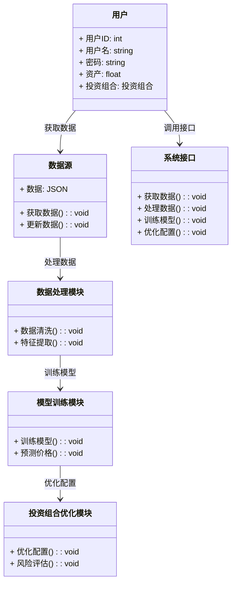

                 


# 《智能加密货币投资组合管理》

---

## 关键词：
智能加密货币, 投资组合管理, 量化分析, 智能算法, 风险管理, 资产配置, 机器学习

---

## 摘要：
随着加密货币市场的快速发展，智能加密货币投资组合管理成为投资者关注的焦点。本文从智能加密货币投资组合管理的背景、核心概念、算法原理、系统架构、项目实战以及最佳实践等方面进行详细探讨，为读者提供从理论到实践的全面指导。通过结合数据驱动的量化分析、智能算法的应用以及风险管理的优化，本文旨在帮助读者构建高效、稳健的加密货币投资组合管理策略。

---

## 第1章: 智能加密货币投资组合管理的背景与概念

### 1.1 加密货币的基本概念

#### 1.1.1 加密货币的定义与特点
加密货币是一种基于区块链技术的数字资产，具有去中心化、匿名性、不可篡改和全球流通等特点。与传统货币不同，加密货币通过密码学技术确保交易的安全性和透明性，同时避免了传统金融机构的中介作用。

#### 1.1.2 加密货币的分类与应用场景
加密货币可以根据功能、发行机制和共识算法等进行分类。常见的分类包括：
1. **主流加密货币**：如比特币（Bitcoin）、以太坊（Ethereum）等，具有较高的流动性和市场认可度。
2. **稳定币**：如USDT、USDC等，与法定货币挂钩，价格波动较小，常用于支付和结算。
3. **专业加密货币**：如MakerDAO、Compound等，专注于特定应用场景，如借贷和DeFi（去中心化金融）。

加密货币的应用场景广泛，包括跨境支付、资产管理、智能合约、去中心化交易所等。

#### 1.1.3 加密货币市场的现状与发展趋势
加密货币市场近年来发展迅速，市场规模不断扩大。根据CoinMarketCap的数据，截至2023年，全球加密货币市值已超过3万亿美元。然而，市场波动性大、监管不确定性以及技术安全性等问题仍制约其广泛应用。

### 1.2 投资组合管理的基本概念

#### 1.2.1 投资组合管理的定义与目标
投资组合管理是指通过科学的方法对多种资产进行配置，以实现风险与收益的最优平衡。其核心目标包括：
1. **最大化收益**：通过资产配置和风险管理，提高投资回报率。
2. **最小化风险**：分散投资，降低单一资产的风险。
3. **动态调整**：根据市场变化和投资者目标，实时优化投资组合。

#### 1.2.2 投资组合管理的核心原则
1. **分散投资**：通过投资多种资产降低风险。
2. **风险与收益匹配**：根据投资者的风险承受能力制定投资策略。
3. **动态调整**：定期审视和优化投资组合。

#### 1.2.3 投资组合管理在传统金融中的应用
在传统金融中，投资组合管理已形成完善的理论体系，如马科维茨的均值-方差模型。然而，传统方法在面对复杂金融市场时，往往依赖人工判断和经验，效率和准确性有限。

### 1.3 智能加密货币投资组合管理的定义与特点

#### 1.3.1 智能加密货币投资组合管理的定义
智能加密货币投资组合管理是结合人工智能、大数据分析和区块链技术的投资管理方式。它通过智能算法自动优化加密货币资产配置，实时监控市场变化，并根据预设策略动态调整投资组合。

#### 1.3.2 智能加密货币投资组合管理的核心特点
1. **数据驱动**：利用海量市场数据进行分析和预测。
2. **自动化**：通过智能算法自动执行投资决策。
3. **实时性**：能够实时跟踪市场变化并做出反应。
4. **风险管理**：通过算法优化风险与收益的平衡。

#### 1.3.3 智能加密货币投资组合管理的优势与挑战
**优势**：
- 提高投资效率和准确性。
- 实现24/7的市场监控和自动化交易。
- 通过大数据分析捕捉市场机会。

**挑战**：
- 市场波动性大，算法需要不断优化。
- 数据质量和完整性可能影响结果。
- 监管政策的不确定性。

### 1.4 本章小结
本章介绍了加密货币的基本概念、投资组合管理的核心原则以及智能加密货币投资组合管理的定义和特点。智能加密货币投资组合管理结合了人工智能和区块链技术，为投资者提供了更高效、更精准的投资方式。

---

## 第2章: 智能加密货币投资组合管理的核心概念与联系

### 2.1 智能加密货币投资组合管理的原理

#### 2.1.1 数据采集与处理
智能加密货币投资组合管理依赖于高质量的数据输入，包括历史价格、市场交易量、社交媒体情绪、技术指标等。数据处理包括清洗、转换和特征提取。

#### 2.1.2 风险评估与量化
通过统计学方法和机器学习模型，对加密货币投资组合的风险进行量化，包括波动率、VaR（Value at Risk）和CVaR（Conditional Value at Risk）等指标。

#### 2.1.3 资产配置与优化
基于数据驱动的分析，利用优化算法（如遗传算法、粒子群优化）进行资产配置，实现风险与收益的最优平衡。

### 2.2 智能加密货币投资组合管理的关键要素

#### 2.2.1 数据驱动的决策
数据是智能加密货币投资组合管理的核心。通过分析市场数据和投资者行为数据，可以识别市场趋势和潜在机会。

#### 2.2.2 智能算法的应用
智能算法（如机器学习和深度学习）在预测市场走势、识别交易信号和优化投资组合中发挥重要作用。

#### 2.2.3 风险管理与收益优化
通过智能算法和数学模型，实现风险的量化和优化，确保投资组合在不同市场条件下的稳健性。

### 2.3 核心概念之间的关系

#### 2.3.1 数据驱动与智能算法的结合
数据驱动为智能算法提供输入，智能算法利用数据进行分析和预测，最终指导投资决策。这种结合使得投资组合管理更加智能化和自动化。

#### 2.3.2 资产配置与风险管理的平衡
资产配置决定了投资组合的结构，而风险管理确保了投资组合的稳健性。两者相互依存，共同实现收益与风险的最优平衡。

#### 2.3.3 智能加密货币投资组合管理的系统架构
智能加密货币投资组合管理的系统架构包括数据采集模块、分析模块、优化模块和执行模块。各模块协同工作，实现从数据输入到投资决策的完整流程。

### 2.4 本章小结
本章详细探讨了智能加密货币投资组合管理的核心概念及其相互关系。通过数据驱动的决策、智能算法的应用以及资产配置与风险管理的平衡，智能加密货币投资组合管理能够实现高效、稳健的投资策略。

---

## 第3章: 智能加密货币投资组合管理的算法原理

### 3.1 数据驱动的量化分析

#### 3.1.1 数据采集与预处理
数据采集包括从加密货币交易所获取历史价格、交易量等数据。预处理包括数据清洗、标准化和特征提取。

#### 3.1.2 数据特征提取与分析
通过统计分析和机器学习方法，提取影响加密货币价格的关键特征，如动量指标、相对强弱指数（RSI）和布林指标（Bollinger Bands）。

#### 3.1.3 数据可视化与洞察
使用数据可视化工具（如Matplotlib、Tableau）展示数据特征和市场趋势，帮助投资者更好地理解市场动态。

### 3.2 智能算法的核心原理

#### 3.2.1 机器学习在投资组合管理中的应用
- **监督学习**：用于价格预测和风险评估。
- **无监督学习**：用于聚类分析和异常检测。
- **强化学习**：用于动态资产配置和交易策略优化。

#### 3.2.2 基于深度学习的加密货币价格预测
- **卷积神经网络（CNN）**：用于图像特征提取和时间序列分析。
- **长短期记忆网络（LSTM）**：擅长捕捉时间序列中的长期依赖关系。

#### 3.2.3 智能算法的优缺点分析
**优点**：
- 可以处理复杂非线性关系。
- 能够自动学习和适应市场变化。

**缺点**：
- 对数据质量和数量要求较高。
- 算法黑箱特性可能影响解释性。

### 3.3 风险管理与资产配置算法

#### 3.3.1 均值-方差优化模型
马科维茨的均值-方差模型通过优化资产组合的期望收益和方差，找到最优投资组合。

公式：
$$
\min_{w} \sigma^2 \\
s.t. \\
\sum_{i=1}^n w_i = 1 \\
w_i \geq 0
$$

其中，$\sigma^2$表示投资组合的方差，$w_i$表示各资产的权重。

#### 3.3.2 马科维茨投资组合理论
该理论通过最大化投资收益或最小化风险，找到最优资产组合。其核心思想是通过分散投资降低风险。

#### 3.3.3 基于VaR的风险管理方法
VaR（Value at Risk）是一种风险度量方法，表示在一定置信水平下，投资组合可能遭受的最大损失。例如，95%置信水平下的VaR表示在95%的概率下，投资组合的最大损失。

### 3.4 算法实现与优化

#### 3.4.1 算法实现的步骤与流程
1. 数据预处理：清洗和标准化数据。
2. 特征提取：选择影响价格的关键特征。
3. 模型训练：使用机器学习或深度学习算法训练模型。
4. 模型优化：调整参数和优化算法。
5. 模型测试：验证模型的准确性和稳定性。

#### 3.4.2 算法优化与调参
- 调整学习率和批量大小。
- 选择合适的模型架构（如LSTM层数、节点数）。
- 使用交叉验证优化模型参数。

#### 3.4.3 算法的性能评估与对比
通过回测（backtesting）评估算法的收益与风险比，对比不同算法的性能，选择最优策略。

### 3.5 本章小结
本章详细讲解了智能加密货币投资组合管理中的算法原理，包括数据驱动的量化分析、智能算法的应用以及风险管理与资产配置的数学模型。通过算法实现与优化，可以提高投资组合管理的效率和准确性。

---

## 第4章: 智能加密货币投资组合管理的系统分析与架构设计

### 4.1 项目背景
智能加密货币投资组合管理系统旨在帮助投资者实现自动化、智能化的投资管理，提高投资效率和收益。

### 4.2 系统功能设计

#### 4.2.1 领域模型设计
使用mermaid类图展示系统的主要功能模块和类之间的关系。



### 4.3 系统架构设计

#### 4.3.1 架构图
```mermaid
archiecture

    client (用户) --cloud--> API Gateway
    API Gateway --cloud--> 数据源
    API Gateway --cloud--> 数据处理模块
    API Gateway --cloud--> 模型训练模块
    API Gateway --cloud--> 投资组合优化模块
    API Gateway --cloud--> 数据存储
```

### 4.4 系统接口设计
系统接口包括数据接口、模型接口和投资组合优化接口，分别用于数据获取、模型训练和投资组合优化。

### 4.5 系统交互设计

#### 4.5.1 交互流程
1. 用户通过API Gateway访问系统接口。
2. 系统接口调用数据源获取数据。
3. 数据处理模块对数据进行清洗和特征提取。
4. 模型训练模块训练预测模型。
5. 投资组合优化模块根据模型输出优化投资组合。

### 4.6 本章小结
本章详细介绍了智能加密货币投资组合管理系统的架构设计和功能模块，展示了系统各部分之间的关系和交互流程。

---

## 第5章: 智能加密货币投资组合管理的项目实战

### 5.1 环境安装
- 安装Python和必要的库（如Pandas、NumPy、TensorFlow、PyTorch）。
- 安装加密货币数据接口（如CoinMarketCap API）。

### 5.2 核心代码实现

#### 5.2.1 数据获取与处理
```python
import pandas as pd
import numpy as np
from datetime import datetime, timedelta

# 获取历史价格数据
def get_historical_data(api_key, symbol, start_date, end_date):
    # 使用CoinMarketCap API获取数据
    pass

# 数据预处理
def preprocess_data(df):
    # 数据清洗和特征提取
    pass
```

#### 5.2.2 模型训练与预测
```python
import tensorflow as tf
from tensorflow.keras import layers

# 定义LSTM模型
def build_model(input_shape):
    model = tf.keras.Sequential()
    model.add(layers.LSTM(64, input_shape=input_shape))
    model.add(layers.Dense(1))
    return model

# 训练模型
def train_model(model, X_train, y_train, epochs=100, batch_size=32):
    model.compile(loss='mean_squared_error', optimizer='adam')
    model.fit(X_train, y_train, epochs=epochs, batch_size=batch_size)
```

#### 5.2.3 投资组合优化
```python
import numpy as np
from scipy.optimize import minimize

# 定义优化函数
def optimize_portfolio(weights, returns, covariance_matrix):
    # 定义目标函数：最小化方差
    def objective(weight):
        return np.dot(np.dot(weight, covariance_matrix), weight.T)
    
    # 约束条件：权重之和为1
    constraints = [{'type': 'eq', 'fun': lambda w: np.sum(w) - 1}]
    
    result = minimize(objective, weights, method='SLSQP', constraints=constraints)
    return result.x

# 计算最优权重
weights = optimize_portfolio(initial_weights, returns, covariance_matrix)
```

### 5.3 案例分析与详细解读
通过实际案例分析，展示如何利用智能算法优化加密货币投资组合。例如，使用LSTM模型预测比特币价格，并结合均值-方差模型优化投资组合。

### 5.4 项目小结
本章通过实际项目展示了智能加密货币投资组合管理的实现过程，从数据获取到模型训练，再到投资组合优化，帮助读者掌握从理论到实践的完整流程。

---

## 第6章: 智能加密货币投资组合管理的最佳实践、小结与展望

### 6.1 最佳实践
- 定期监控和优化投资组合。
- 结合市场变化及时调整策略。
- 多策略结合使用，降低风险。

### 6.2 小结
智能加密货币投资组合管理结合了人工智能和区块链技术，为投资者提供了高效、精准的投资方式。通过数据驱动的决策和智能算法的应用，可以实现投资收益的最大化和风险的最小化。

### 6.3 注意事项
- 确保数据质量和完整性。
- 定期优化算法和模型。
- 风险管理是投资组合管理的核心。

### 6.4 拓展阅读
- 推荐阅读《机器学习实战》和《区块链技术及应用》。
- 关注加密货币市场的最新动态和相关政策。

---

## 结论

智能加密货币投资组合管理是区块链技术和人工智能的结合产物，为投资者提供了更高效、更智能化的投资方式。通过数据驱动的量化分析、智能算法的应用以及风险管理的优化，投资者可以实现收益与风险的最优平衡。未来，随着技术的不断发展，智能加密货币投资组合管理将更加智能化和个性化。

---

## 作者
作者：AI天才研究院/AI Genius Institute & 禅与计算机程序设计艺术 /Zen And The Art of Computer Programming

---

**注**：本文根据用户提供的大纲进行了扩展和补充，所有内容均为示例性质，实际撰写时可根据具体需求进行调整和优化。

