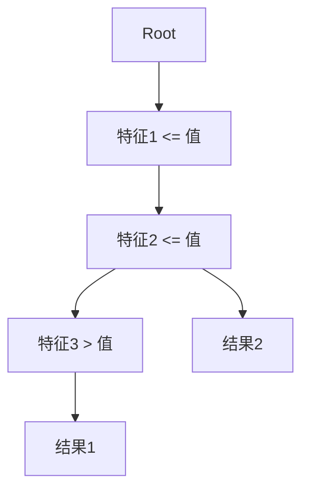
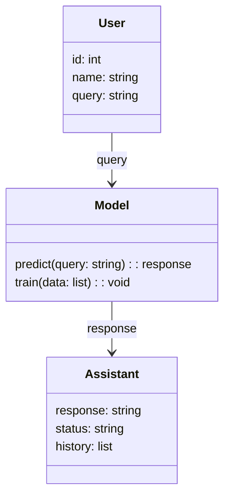
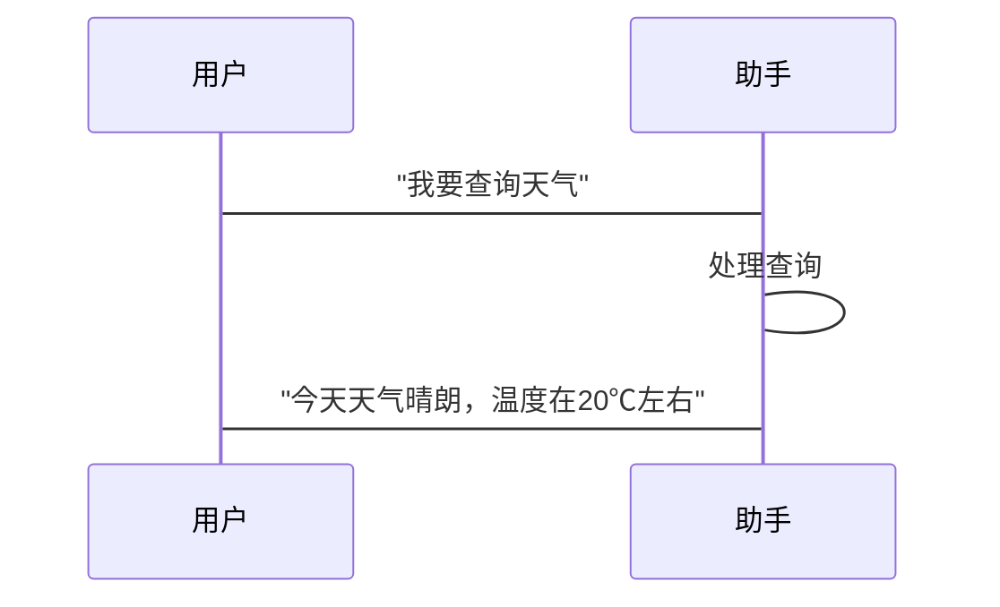
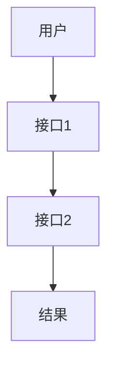

                 


# 智能助手的可解释性设计

> 关键词：可解释性、智能助手、机器学习、系统架构、用户体验、伦理合规

> 摘要：随着智能助手在各个领域的广泛应用，其可解释性问题变得越来越重要。本文从智能助手的背景出发，详细探讨了可解释性的核心概念、算法原理、系统架构设计、项目实战以及最佳实践。通过分析可解释性在智能助手中的作用，结合实际案例，提出了可解释性设计的实现方法和优化策略，为智能助手的设计与开发提供了理论支持和实践指导。

---

## 第一部分: 智能助手的可解释性背景与核心概念

### 第1章: 智能助手的背景与概念

#### 1.1 智能助手的定义与分类
智能助手是一种基于人工智能技术的交互式工具，旨在通过自然语言处理、机器学习和大数据分析等技术，为用户提供高效、智能的服务。智能助手可以分为以下几类：
- **基于规则的智能助手**：通过预定义的规则和逻辑进行决策，如简单的FAQ系统。
- **基于模型的智能助手**：利用机器学习模型进行预测和决策，如Siri、Alexa等。
- **混合型智能助手**：结合规则和模型的双重优势，提供更灵活的服务。

#### 1.2 可解释性的重要性
可解释性是指智能助手在做出决策或回答问题时，能够清晰地解释其背后的原因和逻辑。可解释性的重要性体现在以下几个方面：
- **用户信任**：用户需要理解智能助手的决策过程，才能建立信任关系。
- **责任追究**：在出现错误或争议时，可解释性是追责和优化的基础。
- **合规性**：许多行业和领域对智能系统的可解释性有明确要求，如金融、医疗等。

#### 1.3 智能助手的应用场景
智能助手的应用场景广泛，包括：
- **个人助手**：如Siri、Google Assistant，帮助用户完成日常任务。
- **企业助手**：如智能客服、内部员工助手，提升企业效率。
- **垂直领域助手**：如医疗助手、法律助手，提供专业服务。

---

### 第2章: 可解释性的核心概念

#### 2.1 可解释性的定义与分类
可解释性是指智能系统在做出决策或输出结果时，能够提供清晰、合理的解释。根据解释的范围和深度，可解释性可以分为以下几类：
- **局部可解释性**：针对具体决策的解释。
- **全局可解释性**：对整个系统行为的总体解释。
- **用户可理解性**：解释需要符合用户的认知能力。

#### 2.2 可解释性与模型复杂度
模型的复杂度直接影响可解释性。简单模型（如线性回归）通常具有较高的可解释性，而复杂模型（如深度神经网络）往往难以解释。以下是一个简单的线性回归模型示例：

$$ y = \beta_0 + \beta_1x_1 + \beta_2x_2 + \ldots + \beta_nx_n $$

其中，$\beta_i$ 是模型的系数，$x_i$ 是输入特征，$y$ 是输出结果。线性回归模型的可解释性体现在每个系数的含义和对输出的贡献程度。

#### 2.3 可解释性与用户信任
用户信任是智能助手广泛应用的前提。通过提供可解释的决策过程，智能助手可以增强用户的信任感。例如，在医疗领域，医生需要理解智能助手的诊断建议背后的原因，才能信任其推荐。

---

## 第二部分: 智能助手的可解释性算法原理

### 第3章: 可解释性算法基础

#### 3.1 简单模型的可解释性
简单模型（如决策树、线性回归）具有较高的可解释性。以下是一个决策树模型的简单示例：



决策树模型通过树状结构展示决策过程，用户可以轻松理解每一步的逻辑。

#### 3.2 复杂模型的可解释性
复杂模型（如深度学习模型）通常难以解释。为了提高其可解释性，可以采用以下方法：
- **模型简化**：通过训练更简单的模型来近似复杂模型的行为。
- **特征重要性分析**：通过特征重要性排序，找出对输出影响最大的特征。

#### 3.3 可解释性评估方法
可解释性评估方法包括：
- **准确性评估**：通过对比模型预测结果和实际结果，评估模型的准确性。
- **简洁性评估**：通过模型的复杂度和解释的清晰度，评估模型的可解释性。
- **相关性评估**：通过相关性分析，评估解释与实际决策的相关性。

---

### 第4章: 可解释性算法的实现

#### 4.1 线性回归模型实现
线性回归是一种简单且可解释性较高的算法。以下是一个线性回归模型的实现示例：

```python
import numpy as np

# 数据准备
X = np.array([[1, 1], [2, 2], [3, 3]])
y = np.array([2, 4, 6])

# 训练模型
theta = np.linalg.inv(X.T.dot(X)).dot(X.T.dot(y))

# 预测
def predict(x):
    return theta[0] + theta[1] * x[1]
```

通过上述代码，可以训练一个简单的线性回归模型，并通过 `theta` 系数解释每个特征对输出的贡献。

#### 4.2 决策树模型实现
决策树模型通过树状结构展示决策过程，具有较高的可解释性。以下是一个决策树模型的实现示例：

```python
from sklearn.tree import DecisionTreeClassifier

# 数据准备
X = [[2, 3], [5, 6], [1, 1], [2, 2]]
y = [0, 1, 0, 0]

# 训练模型
clf = DecisionTreeClassifier()
clf.fit(X, y)

# 可视化
from sklearn.tree import plot_tree
import matplotlib.pyplot as plt
plot_tree(clf.estimator_, filled=True)
plt.show()
```

通过上述代码，可以训练一个决策树模型，并通过可视化工具展示决策过程。

---

## 第三部分: 智能助手的可解释性系统架构

### 第5章: 系统功能设计

#### 5.1 领域模型设计
领域模型是智能助手的核心，用于描述系统的功能和交互逻辑。以下是一个领域模型的类图示例：



#### 5.2 系统架构设计
智能助手的系统架构通常包括以下几个部分：
- **用户层**：用户与智能助手的交互界面。
- **业务逻辑层**：处理用户的请求并生成响应。
- **模型层**：实现具体的机器学习模型和算法。
- **数据层**：存储和管理数据。

以下是一个系统的架构图示例：


---

### 第6章: 系统交互设计

#### 6.1 用户界面设计
智能助手的用户界面设计需要简洁直观，方便用户操作。以下是一个简单的交互流程图：



#### 6.2 系统接口设计
系统接口设计需要明确输入、输出和交互流程。以下是一个接口的交互示例：



---

## 第四部分: 智能助手的可解释性项目实战

### 第7章: 项目环境与工具安装

#### 7.1 环境要求
- **操作系统**：Windows、macOS或Linux。
- **Python版本**：3.6及以上。
- **依赖库**：numpy、scikit-learn、matplotlib。

#### 7.2 工具安装
```bash
pip install numpy scikit-learn matplotlib
```

---

### 第8章: 核心代码实现

#### 8.1 可解释性算法实现
以下是一个基于线性回归的可解释性算法实现示例：

```python
import numpy as np

# 数据准备
X = np.array([[1, 1], [2, 2], [3, 3]])
y = np.array([2, 4, 6])

# 训练模型
theta = np.linalg.inv(X.T.dot(X)).dot(X.T.dot(y))

# 可解释性分析
print("截距项：", theta[0])
print("回归系数：", theta[1])
```

#### 8.2 系统架构实现
以下是一个简单的系统架构实现示例：

```python
class User:
    def __init__(self, id, name):
        self.id = id
        self.name = name

class Assistant:
    def __init__(self):
        self.history = []

    def get_response(self, query):
        # 实现具体的响应逻辑
        pass

class Model:
    def __init__(self):
        self.data = []

    def predict(self, query):
        # 实现具体的预测逻辑
        pass
```

---

## 第五部分: 最佳实践与总结

### 第9章: 最佳实践

#### 9.1 设计原则
- **简洁性**：优先选择简单模型，确保解释的清晰性。
- **相关性**：确保解释与实际决策相关。
- **及时性**：在用户需要时提供解释。

#### 9.2 注意事项
- **数据隐私**：在设计智能助手时，需注意用户数据的隐私保护。
- **伦理合规**：确保智能助手的行为符合伦理规范。

#### 9.3 拓展阅读
- 《可解释的人工智能：基础、方法和应用》
- 《机器学习实战》

---

## 作者：AI天才研究院/AI Genius Institute & 禅与计算机程序设计艺术 /Zen And The Art of Computer Programming

