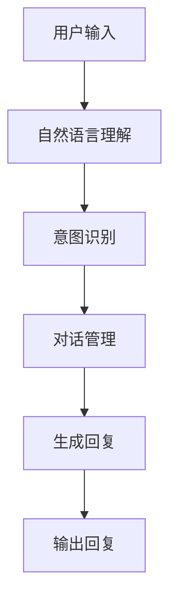
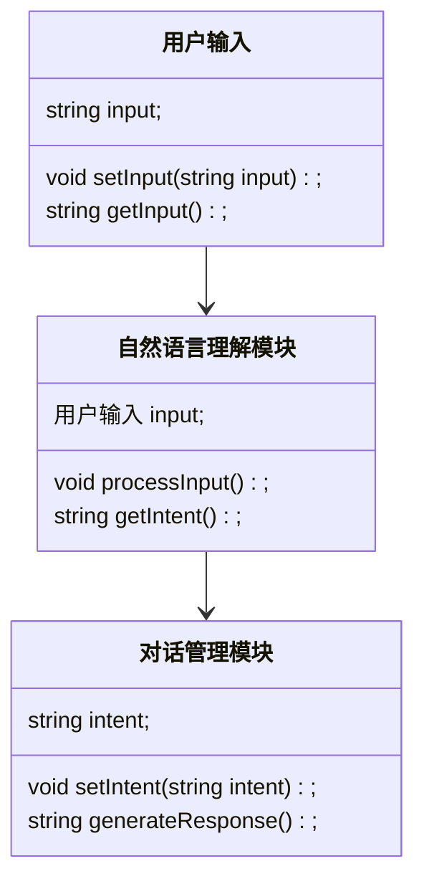
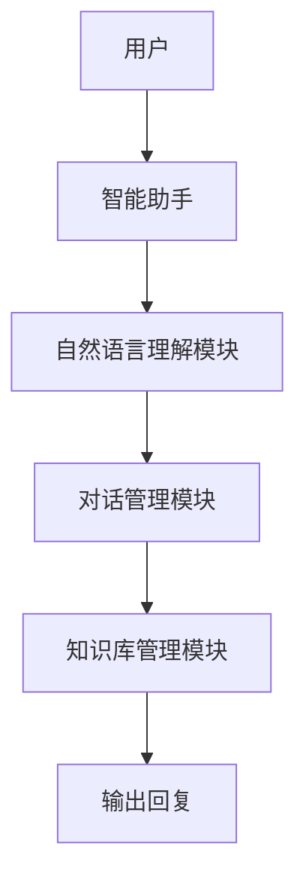
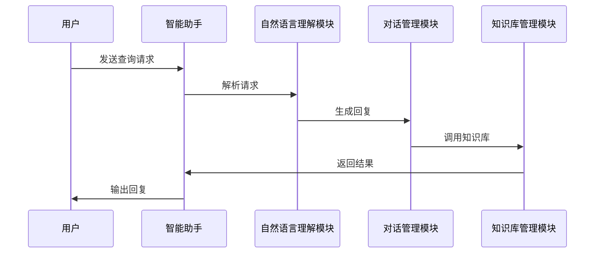

                 


# 智能助手的架构设计

> 关键词：智能助手、架构设计、自然语言处理、对话管理、系统架构、项目实战

> 摘要：智能助手作为人工智能领域的核心应用之一，其架构设计直接决定了其功能实现、性能表现和用户体验。本文从智能助手的基本概念出发，深入探讨其架构设计的核心原则、模块划分、算法实现、系统优化等方面，结合实际案例进行详细解读，旨在为智能助手的开发和优化提供理论支持和实践指导。

---

## 第1章: 智能助手的基本概念与背景

### 1.1 智能助手的定义与核心功能

智能助手是一种基于人工智能技术的交互工具，能够通过自然语言处理（NLP）技术理解和响应用户的指令或查询。其核心功能包括：

- **自然语言理解**：解析用户的输入，识别意图和实体。
- **对话管理**：根据上下文生成合适的回复，引导对话流程。
- **知识库管理**：整合和调用外部知识库或API，提供准确的信息。
- **多轮交互**：支持连续对话，保持上下文的一致性。

#### 1.1.1 智能助手的基本定义

智能助手是一种人机交互系统，通过自然语言处理技术实现与用户的双向交流。它能够理解用户的输入，并通过内部逻辑处理生成相应的输出。

#### 1.1.2 智能助手的核心功能

智能助手的核心功能包括：
1. 自然语言理解（NLU）：解析用户的输入，识别意图和实体。
2. 对话管理（DM）：根据上下文生成回复，管理对话流程。
3. 知识库管理：整合外部知识库，提供准确的信息。
4. 多轮交互：支持连续对话，保持上下文一致。

#### 1.1.3 智能助手的边界与外延

智能助手的边界在于其功能的实现范围，外延则涉及与外部系统的集成，例如第三方API调用。

---

### 1.2 智能助手的发展背景

智能助手的发展离不开人工智能和自然语言处理技术的进步。随着深度学习算法的优化和计算能力的提升，智能助手的功能不断增强，应用场景也逐渐扩展。

#### 1.2.1 人工智能技术的发展

人工智能技术的进步为智能助手提供了强大的技术支持，特别是深度学习算法的应用，使得智能助手的自然语言处理能力显著提升。

#### 1.2.2 自然语言处理的进步

自然语言处理技术的进步使得智能助手能够更准确地理解用户的意图，并生成更自然的回复。

#### 1.2.3 用户需求的变化

用户对智能助手的需求从简单的信息查询扩展到复杂任务的处理，例如任务调度、日程管理等。

---

### 1.3 智能助手与传统助手的区别

智能助手与传统助手的主要区别在于技术实现和功能扩展性。传统助手通常基于规则实现，而智能助手则依赖于人工智能技术。

#### 1.3.1 功能上的区别

传统助手通常功能单一，而智能助手支持多轮交互和复杂任务处理。

#### 1.3.2 技术实现上的差异

传统助手基于规则实现，而智能助手基于深度学习模型。

#### 1.3.3 使用体验的对比

智能助手的用户体验更自然，能够更好地理解用户需求。

---

### 1.4 智能助手的技术特点

智能助手的技术特点包括基于AI的智能理解、多轮对话能力以及自适应学习能力。

#### 1.4.1 基于AI的智能理解

智能助手能够理解用户的意图，通过自然语言处理技术实现。

#### 1.4.2 多轮对话能力

智能助手能够保持连续对话，维护上下文一致性。

#### 1.4.3 自适应学习能力

智能助手能够通过反馈不断优化自身的模型参数。

---

## 第2章: 智能助手架构设计的核心概念

### 2.1 架构设计的基本原则

智能助手的架构设计需要遵循可扩展性、可维护性和高可用性原则。

#### 2.1.1 可扩展性原则

系统设计需要预留扩展接口，方便未来功能的增加。

#### 2.1.2 可维护性原则

系统架构需要清晰，便于后续的维护和升级。

#### 2.1.3 高可用性原则

系统需要具备容错和冗余能力，确保服务的持续可用。

---

### 2.2 智能助手的核心模块

智能助手的核心模块包括自然语言理解模块、对话管理模块和知识库管理模块。

#### 2.2.1 自然语言理解模块

自然语言理解模块负责解析用户的输入，识别意图和实体。

#### 2.2.2 对话管理模块

对话管理模块负责根据上下文生成回复，管理对话流程。

#### 2.2.3 知识库管理模块

知识库管理模块负责整合和调用外部知识库或API。

---

### 2.3 模块之间的关系与协作

模块之间的关系决定了系统的整体功能。

#### 2.3.1 模块间的数据流

数据流从用户输入开始，经过自然语言理解模块，传递到对话管理模块，最终生成回复。

#### 2.3.2 模块间的依赖关系

自然语言理解模块依赖于NLP算法，对话管理模块依赖于知识库管理模块。

#### 2.3.3 模块协作的机制

模块协作基于事件驱动机制，各模块通过消息传递进行协作。

---

### 2.4 核心概念的属性对比

核心概念的属性对比表如下：

| 模块名称         | 功能描述                     | 输入      | 输出      | 依赖模块       |
|------------------|------------------------------|-----------|-----------|----------------|
| 自然语言理解模块 | 解析用户意图                 | 用户输入  | 意图信息  | NLP算法         |
| 对话管理模块     | 管理对话流程                 | 意图信息  | 回复信息  | 知识库管理模块 |
| 知识库管理模块   | 调用外部知识库               | 回复请求  | 知识库响应| -               |

---

## 第3章: 智能助手的算法原理与实现

### 3.1 自然语言理解的算法原理

自然语言理解是智能助手的核心算法之一。

#### 3.1.1 分词算法

分词算法用于将用户的输入文本分割成词语或短语。

#### 3.1.2 词性标注

词性标注是对分词后的词语进行词性分类。

#### 3.1.3 句法分析

句法分析用于理解句子的结构和语法关系。

---

### 3.2 对话管理的算法实现

对话管理算法负责生成回复。

#### 3.2.1 基于规则的对话管理

基于规则的对话管理通过预定义的规则进行回复生成。

#### 3.2.2 基于深度学习的对话管理

基于深度学习的对话管理通过训练模型生成回复。

---

### 3.3 算法流程图

以下是一个简单的算法流程图：



---

### 3.4 数学模型与公式

以下是一个简单的自然语言理解模型的数学公式：

$$ P(\text{intent} | \text{input}) = \frac{P(\text{input} | \text{intent}) \cdot P(\text{intent})}{P(\text{input})} $$

---

## 第4章: 智能助手的系统分析与架构设计

### 4.1 问题场景介绍

智能助手需要处理复杂的用户请求，例如查询天气、设置提醒等。

### 4.2 系统功能设计

系统功能设计需要涵盖核心功能模块。

#### 4.2.1 领域模型

以下是一个领域模型的类图：



---

### 4.3 系统架构设计

系统架构设计需要考虑模块之间的交互和通信。

#### 4.3.1 系统架构图

以下是一个系统架构图：



---

### 4.4 系统接口设计

系统接口设计需要明确模块之间的接口和交互方式。

#### 4.4.1 系统接口

系统接口包括用户输入接口、自然语言理解接口、对话管理接口和知识库管理接口。

---

### 4.5 系统交互

系统交互通过消息传递实现。

#### 4.5.1 系统交互图

以下是一个系统交互图：



---

## 第5章: 智能助手的项目实战

### 5.1 环境安装

项目实战需要安装必要的开发环境。

#### 5.1.1 安装Python

安装Python 3.8及以上版本。

#### 5.1.2 安装必要的库

安装以下库：

```bash
pip install numpy
pip install transformers
pip install requests
```

---

### 5.2 系统核心实现

系统核心实现包括自然语言理解模块、对话管理模块和知识库管理模块。

#### 5.2.1 自然语言理解模块实现

以下是一个简单的自然语言理解模块实现：

```python
class NaturalLanguageUnderstanding:
    def __init__(self):
        self.model = ...  # 初始化NLP模型

    def process_input(self, input_str):
        # 调用NLP模型进行处理
        return self.model(input_str)
```

#### 5.2.2 对话管理模块实现

以下是一个简单的对话管理模块实现：

```python
class DialogueManager:
    def __init__(self):
        self.intent = None
        self.context = {}

    def set_intent(self, intent):
        self.intent = intent

    def generate_response(self):
        # 根据intent生成回复
        return self.context.get(self.intent, "抱歉，我还没学会这个功能。")
```

---

### 5.3 代码应用解读与分析

代码实现需要结合实际应用场景进行解读。

#### 5.3.1 代码实现

以下是一个完整的代码实现示例：

```python
class SmartAssistant:
    def __init__(self):
        self.nlu = NaturalLanguageUnderstanding()
        self.dmg = DialogueManager()

    def process_request(self, input_str):
        intent = self.nlu.process_input(input_str)
        self.dmg.set_intent(intent)
        return self.dmg.generate_response()

# 使用示例
assistant = SmartAssistant()
response = assistant.process_request("今天天气怎么样？")
print(response)
```

---

### 5.4 实际案例分析

实际案例分析需要结合具体场景进行。

#### 5.4.1 案例分析

例如，处理用户的天气查询请求。

---

### 5.5 项目小结

项目小结需要总结项目的实现过程和成果。

#### 5.5.1 项目总结

通过本项目，我们实现了智能助手的核心功能模块，包括自然语言理解、对话管理和知识库管理。

---

## 第6章: 智能助手的优化与维护

### 6.1 性能优化

性能优化需要从算法和系统架构两个方面进行。

#### 6.1.1 算法优化

算法优化包括模型压缩、剪枝等技术。

#### 6.1.2 系统优化

系统优化包括负载均衡、缓存优化等。

---

### 6.2 系统维护

系统维护需要定期更新模型和优化系统架构。

#### 6.2.1 模型更新

模型更新包括重新训练模型和更新知识库。

#### 6.2.2 系统维护

系统维护包括监控系统运行状态和处理异常情况。

---

## 第7章: 智能助手的未来发展与趋势

### 7.1 未来发展趋势

智能助手的未来发展将朝着更智能、更个性化的方向发展。

#### 7.1.1 技术趋势

技术趋势包括更强大的自然语言处理算法和更高效的计算能力。

#### 7.1.2 应用场景扩展

应用场景将扩展到更多领域，例如教育、医疗等。

---

## 作者信息

作者：AI天才研究院/AI Genius Institute & 禅与计算机程序设计艺术 /Zen And The Art of Computer Programming

---

以上是《智能助手的架构设计》的技术博客文章的完整内容，涵盖了从基础概念到项目实战的各个方面，结合实际案例进行详细解读，旨在为智能助手的开发和优化提供理论支持和实践指导。

