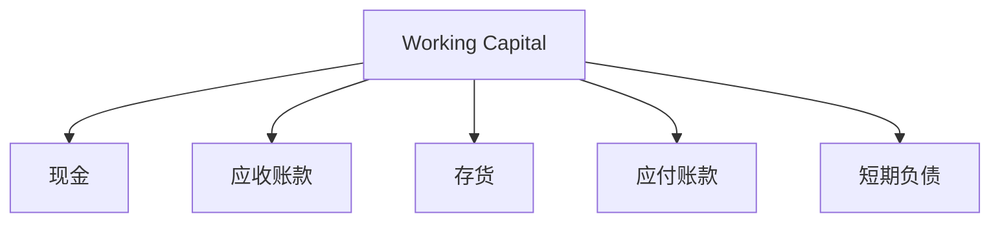
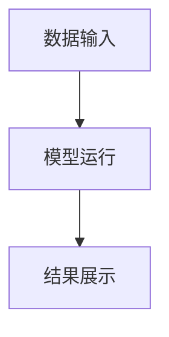

                 

# 《智能化企业Working Capital优化模型设计》

## 关键词：Working Capital、企业优化、人工智能、数学建模、系统架构

## 摘要：本文探讨了如何利用智能化方法优化企业Working Capital，通过理论分析、算法设计、系统架构和实际案例，展示了如何利用数据驱动和人工智能技术提升企业营运资本管理效率，实现财务健康和竞争力提升。

---

## 目录大纲

### 第一部分: 背景介绍与核心概念

#### 第1章: Working Capital优化的背景与意义

##### 1.1 什么是Working Capital
- 定义与组成部分
- 重要性与优化目标

##### 1.2 企业优化Working Capital的必要性
- 提高流动性与降低风险
- 数据驱动决策的优势

##### 1.3 当前企业Working Capital管理中的问题
- 资金链断裂风险
- 库存积压与应收账款问题

#### 第2章: 核心概念与理论基础

##### 2.1 核心概念对比
- Working Capital与固定资产的对比
- 流动资产与非流动资产的区别

##### 2.2 实体关系图（ER图）

### 第二部分: 算法原理与数学模型

#### 第3章: 基于线性规划的优化算法

##### 3.1 线性规划的基本原理
- 目标函数与约束条件
- 解的几何意义

##### 3.2 线性规划在Working Capital优化中的应用
- 现金流管理模型
- 库存优化模型

##### 3.3 算法实现
- 使用Python和scipy.optimize.linprog
- 示例代码与结果分析

### 第三部分: 系统分析与架构设计

#### 第4章: 问题场景与系统功能设计

##### 4.1 问题场景描述
- 现金流波动预测
- 库存与应收账款管理

##### 4.2 系统功能设计
- 数据输入模块
- 模型运行模块
- 结果展示模块

##### 4.3 系统架构图

### 第四部分: 项目实战

#### 第5章: 完整案例分析与代码实现

##### 5.1 环境安装与数据准备
- 安装Python和相关库
- 数据收集与预处理

##### 5.2 代码实现与结果分析
- 线性规划模型代码
- 结果解读与优化建议

### 第五部分: 总结与展望

#### 第6章: 总结与未来发展方向

##### 6.1 总结
- 优化过程回顾
- 成功经验与教训

##### 6.2 未来展望
- 更高级算法的应用
- 结合物联网和区块链技术的优化

## 作者：AI天才研究院/AI Genius Institute & 禅与计算机程序设计艺术 /Zen And The Art of Computer Programming

