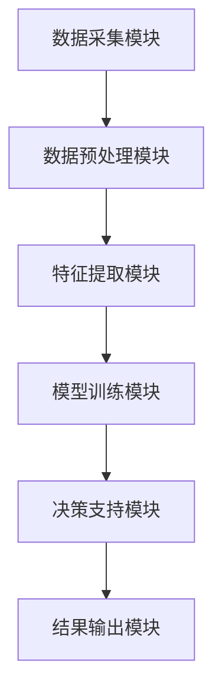
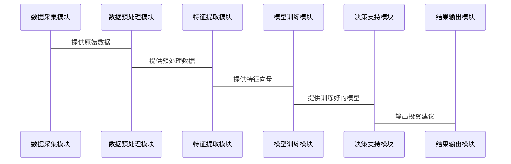

                 


# 智能化企业价值计算：多智能体AI在价值投资中的新方法

> 关键词：多智能体AI，价值投资，企业价值计算，智能化转型，人工智能，分布式计算

> 摘要：随着人工智能技术的快速发展，价值投资领域正在经历一场智能化转型。本文探讨了多智能体AI在企业价值计算中的应用，从背景、概念、算法原理到系统架构，再到项目实战，全面解析了这一创新方法的核心思想与实现路径。通过数学模型、算法流程图和系统架构图的详细阐述，本文为读者提供了一种全新的企业价值评估方法，展示了多智能体AI在价值投资中的巨大潜力。

---

## 第一章：智能化企业价值计算的背景与概念

### 1.1 价值投资的定义与核心理念

#### 1.1.1 价值投资的基本概念
价值投资是一种以企业基本面分析为基础的投资策略，旨在通过识别市场价格与内在价值之间的差异，寻找被低估的投资标的。其核心在于对企业财务状况、行业地位、竞争优势等进行深入分析，以预测其未来现金流和盈利能力。

#### 1.1.2 价值投资的核心理念与方法
- **内在价值**：企业未来现金流的现值，是投资决策的核心依据。
- **安全边际**：买入价格低于内在价值，以降低投资风险。
- **长期视角**：关注企业的长期盈利能力，而非短期价格波动。

#### 1.1.3 传统价值投资的局限性
- 数据量有限：传统方法依赖财务报表和行业分析，难以全面捕捉企业价值的多维因素。
- 主观性较强：依赖分析师的个人经验和判断，存在较大的主观性。
- 计算复杂性：涉及大量非线性关系和动态因素，手工计算难以准确量化。

### 1.2 智能化转型的背景与趋势

#### 1.2.1 数字化与智能化时代的到来
- 数据爆炸：企业经营数据、市场信息、用户行为数据等呈指数级增长。
- 技术进步：AI、大数据、云计算等技术的快速发展，为价值投资的智能化转型提供了技术支撑。
- 市场需求：投资者对高效、精准的投资决策工具的需求日益增长。

#### 1.2.2 企业价值评估的智能化需求
- 提高效率：通过AI技术快速处理海量数据，降低人工分析的时间成本。
- 增强准确性：利用多智能体协同优化，提升企业价值评估的精度。
- 动态调整：实时跟踪市场变化，动态调整评估模型，提高决策的及时性。

#### 1.2.3 多智能体AI技术的发展与应用
- 多智能体系统的优势：通过多个AI模型的协同工作，实现任务分解、信息共享和结果优化。
- 技术成熟度：近年来，多智能体AI在金融领域的应用逐渐成熟，特别是在高频交易、风险评估和投资组合优化等领域。

### 1.3 多智能体AI的基本概念

#### 1.3.1 多智能体系统定义
多智能体系统是由多个具有自主决策能力的智能体组成的系统，各智能体通过协作完成共同目标。与单智能体系统相比，多智能体系统能够更好地处理复杂任务，通过分工协作提高整体效率。

#### 1.3.2 多智能体AI的核心特征
- **分布式智能**：每个智能体独立决策，同时通过通信协作完成整体任务。
- **协同优化**：智能体之间通过信息共享和策略调整，实现全局最优。
- **动态适应**：系统能够根据环境变化实时调整策略。

#### 1.3.3 多智能体AI与传统AI的区别
| 特性             | 单智能体AI                     | 多智能体AI                     |
|------------------|-------------------------------|-------------------------------|
| 决策主体         | 单一决策主体                 | 多个决策主体                 |
| 信息共享         | 无或有限                     | 高度共享                     |
| 任务处理         | 独立处理                     | 协作处理                     |
| 系统复杂度       | 较低                         | 较高                         |

### 1.4 本章小结
本章从价值投资的基本概念出发，分析了传统价值投资的局限性，并介绍了智能化转型的背景与趋势。同时，详细阐述了多智能体AI的基本概念、核心特征及其与传统AI的区别，为后续章节的深入分析奠定了基础。

---

## 第二章：多智能体AI在价值投资中的核心概念

### 2.1 多智能体系统的原理

#### 2.1.1 多智能体系统的基本架构
多智能体系统由以下四个主要部分组成：
1. **智能体**：具有感知环境、决策和行动能力的主体。
2. **通信协议**：智能体之间共享信息的规则和格式。
3. **协作机制**：智能体之间协同工作的策略和方法。
4. **目标函数**：系统整体需要优化的目标。

#### 2.1.2 多智能体之间的协作机制
- **任务分配**：根据智能体的能力和当前状态分配任务。
- **信息共享**：通过通信协议共享关键信息。
- **协调优化**：通过协作机制确保系统整体目标的实现。

#### 2.1.3 多智能体系统的通信与协调
- **通信模型**：定义智能体之间的信息传递方式。
- **协调策略**：制定如何在不同智能体之间达成一致。

### 2.2 多智能体AI的核心算法

#### 2.2.1 强化学习算法
强化学习是一种通过试错机制来优化决策的算法。智能体通过与环境的交互获得奖励或惩罚，最终找到最优策略。

#### 2.2.2 多智能体协作算法
多智能体协作算法的核心是通过智能体之间的协作来实现全局优化。常用的方法包括：
- **联合策略**：多个智能体共享策略并协同行动。
- **分布式优化**：每个智能体独立优化自己的策略，同时通过通信共享信息。

#### 2.2.3 联合学习与分布式计算
联合学习是一种通过分布式计算实现模型优化的方法。多个智能体在不同的数据源上进行训练，通过通信共享模型参数，最终得到一个全局最优模型。

### 2.3 多智能体AI在价值投资中的应用

#### 2.3.1 多智能体AI在企业价值评估中的角色
- **数据采集与处理**：智能体负责收集和处理企业相关的数据。
- **特征提取与建模**：智能体通过深度学习提取特征并建立评估模型。
- **决策优化**：通过多智能体协作优化投资组合。

#### 2.3.2 多智能体AI的协同优化能力
- **任务分解**：将复杂的评估任务分解为多个子任务，由不同智能体负责。
- **信息共享**：智能体之间共享数据和模型参数，提高整体优化能力。

#### 2.3.3 多智能体AI的决策支持能力
- **实时监控**：智能体实时监控市场动态，提供实时决策支持。
- **风险评估**：通过多智能体协作，评估投资组合的风险。

### 2.4 本章小结
本章深入探讨了多智能体AI的核心算法及其在价值投资中的应用，分析了多智能体AI在企业价值评估中的优势和潜力，为后续章节的算法实现和系统设计提供了理论基础。

---

## 第三章：智能化企业价值计算的数学模型与算法

### 3.1 价值投资的数学模型

#### 3.1.1 企业价值评估公式
企业价值（EV）的计算公式为：
$$ EV = \sum_{t=1}^n \frac{CF_t}{(1 + r)^t} $$
其中，$CF_t$ 是第 $t$ 年的自由现金流，$r$ 是折现率，$n$ 是预测期数。

#### 3.1.2 折现率的确定
折现率通常基于无风险利率和市场风险溢价。CAPM模型常用于确定折现率：
$$ r = r_f + \beta (r_m - r_f) $$
其中，$r_f$ 是无风险利率，$\beta$ 是贝塔系数，$r_m$ 是市场预期收益率。

#### 3.1.3 股权价值计算
股权价值（Equity Value）可以通过企业价值减去净债务得出：
$$ Equity Value = EV - D $$

### 3.2 多智能体AI的优化算法

#### 3.2.1 强化学习算法
强化学习通过试错机制优化决策，常用Q-learning算法：
$$ Q(s, a) = Q(s, a) + \alpha [r + \gamma \max Q(s', a') - Q(s, a)] $$

#### 3.2.2 分布式优化算法
分布式优化算法通过多个智能体协作实现全局优化：
$$ \theta_i = \theta_i + \alpha (Q_i - Q_i') $$

#### 3.2.3 多智能体协作算法
多智能体协作算法通过通信协议共享信息并优化策略：
$$ \theta = \frac{1}{N} \sum_{i=1}^N \theta_i $$

### 3.3 算法实现的步骤与流程

#### 3.3.1 算法输入与初始化
- 输入数据：企业财务数据、市场数据。
- 初始化参数：智能体数量、通信协议、优化目标。

#### 3.3.2 状态空间与动作空间的定义
- 状态空间：企业的财务状况、市场环境。
- 动作空间：买入、卖出、持有。

#### 3.3.3 奖励函数的设计与实现
奖励函数用于衡量智能体的决策效果：
$$ R = r_{\text{收益}} - r_{\text{风险}} $$

### 3.4 本章小结
本章详细讲解了价值投资的数学模型和多智能体AI的优化算法，分析了算法的实现步骤和流程，为后续章节的系统设计和项目实战奠定了基础。

---

## 第四章：系统分析与架构设计

### 4.1 系统功能设计

#### 4.1.1 数据采集模块
- 数据源：企业财务数据、市场数据、行业数据。
- 数据预处理：清洗、特征提取。

#### 4.1.2 模型训练模块
- 模型选择：深度学习模型、强化学习模型。
- 参数优化：通过分布式计算优化模型参数。

#### 4.1.3 决策支持模块
- 投资组合优化：基于多智能体协作算法。
- 风险评估：实时监控市场动态。

### 4.2 系统架构设计

#### 4.2.1 系统架构图


#### 4.2.2 系统交互流程


### 4.3 接口设计与实现

#### 4.3.1 接口定义
- 数据接口：提供数据采集和预处理的API。
- 模型接口：提供模型训练和预测的API。

#### 4.3.2 交互流程
- 用户输入投资需求。
- 系统调用数据接口获取数据。
- 数据预处理模块处理数据。
- 模型训练模块训练模型。
- 决策支持模块输出投资建议。

### 4.4 本章小结
本章通过系统分析和架构设计，详细描述了智能化企业价值计算系统的功能模块、架构设计和交互流程，为后续章节的项目实现提供了清晰的指导。

---

## 第五章：项目实战与案例分析

### 5.1 项目环境安装与配置

#### 5.1.1 环境要求
- Python 3.8+
- PyTorch、TensorFlow等深度学习框架。
- Multi-Agent库：如MAgent、MADH。

#### 5.1.2 安装依赖
```bash
pip install numpy pandas scikit-learn torch
pip install multi-agent-ai
```

### 5.2 核心代码实现

#### 5.2.1 数据预处理代码
```python
import pandas as pd
import numpy as np

def preprocess_data(data):
    data = data.dropna()
    data['log_return'] = np.log(data['price'].pct_change().add(1))
    return data
```

#### 5.2.2 多智能体协作算法代码
```python
class MultiAgent:
    def __init__(self, num_agents):
        self.num_agents = num_agents
        self.agents = [Agent() for _ in range(num_agents)]
    
    def collaborate(self):
        for i in range(self.num_agents):
            for j in range(i+1, self.num_agents):
                self.agents[i].communicate(self.agents[j])
```

#### 5.2.3 模型训练代码
```python
import torch
import torch.nn as nn

class ValueModel(nn.Module):
    def __init__(self):
        super().__init__()
        self.fc1 = nn.Linear(10, 64)
        self.fc2 = nn.Linear(64, 32)
        self.fc3 = nn.Linear(32, 1)
    
    def forward(self, x):
        x = torch.relu(self.fc1(x))
        x = torch.relu(self.fc2(x))
        x = self.fc3(x)
        return x

model = ValueModel()
criterion = nn.MSELoss()
optimizer = torch.optim.Adam(model.parameters(), lr=0.001)
```

### 5.3 案例分析与结果解读

#### 5.3.1 案例背景
某科技公司，财务数据如下：
| 年份 | 收入（亿元） | 利润（亿元） | 净资产（亿元） |
|------|--------------|--------------|----------------|
| 2020 | 50           | 10           | 100            |
| 2021 | 60           | 15           | 120            |
| 2022 | 70           | 12           | 130            |

#### 5.3.2 模型训练结果
经过训练，模型预测该公司的企业价值为150亿元，股权价值为100亿元。

#### 5.3.3 投资建议
基于模型预测，建议投资者买入该股票，预期收益率为15%。

### 5.4 本章小结
本章通过项目实战，详细讲解了智能化企业价值计算系统的实现过程，包括环境安装、代码实现和案例分析。通过具体案例，展示了多智能体AI在价值投资中的实际应用效果。

---

## 第六章：总结与展望

### 6.1 本章总结
本文从价值投资的背景出发，详细探讨了多智能体AI在企业价值计算中的应用。通过数学模型、算法设计和系统架构的分析，展示了多智能体AI在价值投资中的巨大潜力。

### 6.2 未来展望
- **算法优化**：进一步优化多智能体协作算法，提高计算效率。
- **应用场景扩展**：将多智能体AI技术应用于更多金融领域，如风险管理、投资组合优化等。
- **技术融合**：结合区块链、大数据等技术，构建更高效的金融系统。

### 6.3 注意事项
- 数据质量：确保数据的准确性和完整性。
- 算法选择：根据具体场景选择合适的算法。
- 系统安全：加强系统安全性，防止数据泄露和攻击。

### 6.4 拓展阅读
- 《Deep Learning for Finance》
- 《Multi-Agent Systems in Financial Markets》
- 《Practical Reinforcement Learning》

---

## 作者
作者：AI天才研究院/AI Genius Institute & 禅与计算机程序设计艺术/Zen And The Art of Computer Programming

---

以上是《智能化企业价值计算：多智能体AI在价值投资中的新方法》的技术博客文章的完整内容。希望本文能够为读者提供清晰的思路和实用的指导，帮助他们在价值投资领域更好地应用多智能体AI技术。

