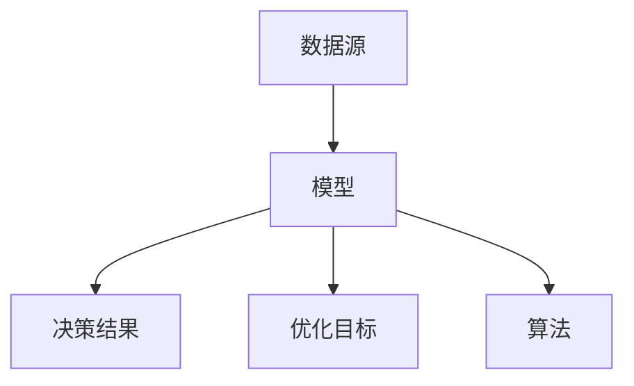
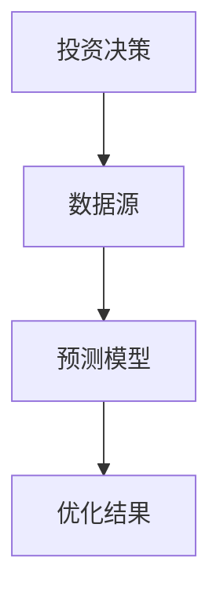
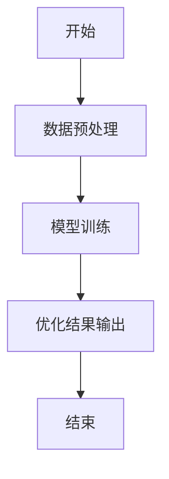
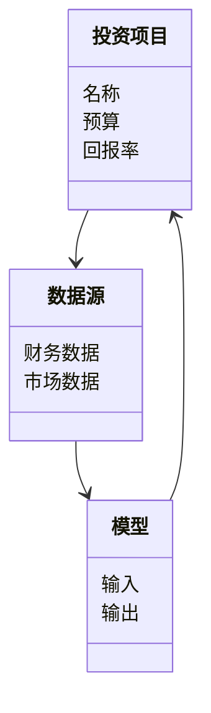
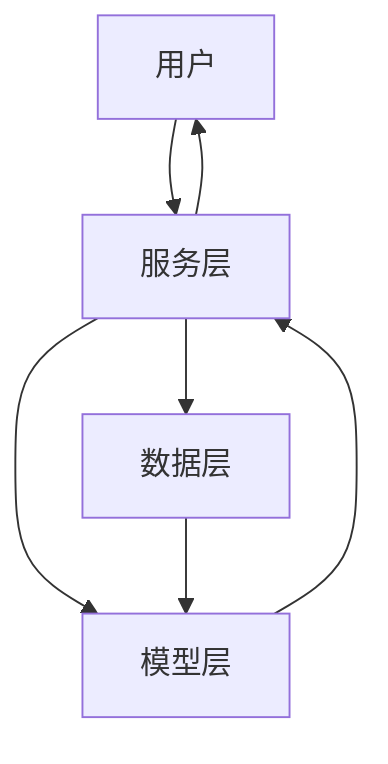
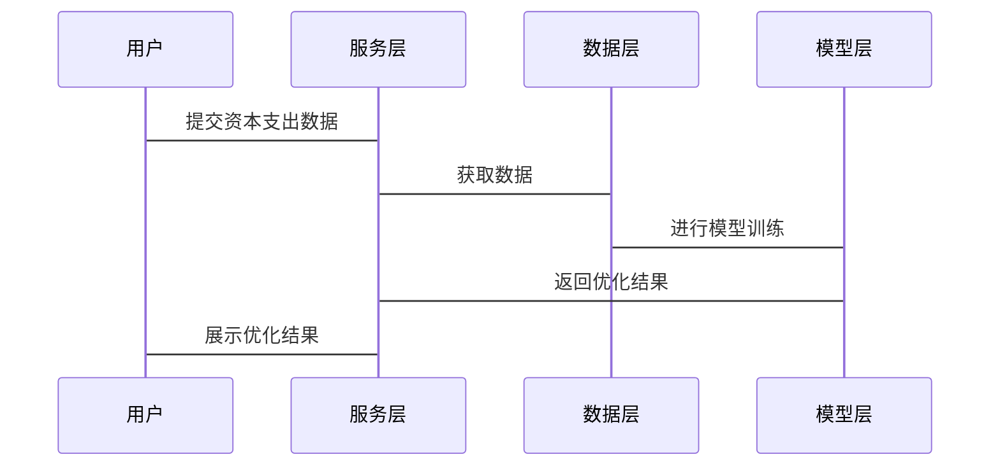

                 


# 智能化企业资本支出优化决策模型设计

> 关键词：资本支出优化、决策模型、人工智能、系统架构、项目实战

> 摘要：本文将详细探讨智能化企业资本支出优化决策模型的设计与实现。通过背景介绍、核心概念、算法原理、系统架构、项目实战等多维度的分析，深入剖析模型的构建逻辑与实际应用，为企业资本支出优化提供有效的理论支持与实践指导。

---

# 第一部分: 资本支出优化决策模型背景与概念

## 第1章: 资本支出优化决策模型概述

### 1.1 问题背景与描述

#### 1.1.1 企业资本支出的定义与重要性
资本支出（Capital Expenditure，简称CapEx）是指企业在基础设施、设备、技术等长期资产上的投资，是企业未来发展的重要支撑。资本支出的优化决策直接关系到企业的经济效益和竞争力。传统的资本支出决策往往依赖于经验判断和简单财务指标，存在决策周期长、风险高、不够精准等问题。

#### 1.1.2 当前资本支出决策中的问题与挑战
- 数据碎片化：企业内部数据分散在不同部门，难以整合。
- 决策延迟：传统决策流程复杂，信息传递不畅，导致决策延迟。
- 风险评估不足：缺乏对市场波动、技术变革等外部因素的动态评估。
- 资源分配不合理：难以在多个项目之间找到最优资源配置。

#### 1.1.3 智能化决策的必要性与目标
智能化资本支出决策通过大数据、人工智能等技术，将企业的历史数据、市场信息、财务指标等多维度数据进行整合，构建数学模型，帮助企业实现资本支出的科学化、精准化决策。其目标是通过模型优化，降低资本支出成本，提高投资回报率，增强企业的竞争力。

### 1.2 智能化决策的核心概念

#### 1.2.1 数据驱动的决策方式
数据驱动决策是指通过收集、分析和利用数据来支持决策的过程。与传统的经验决策不同，数据驱动决策更加客观、科学，能够基于大量历史数据和实时信息，提供更准确的决策支持。

#### 1.2.2 人工智能在资本支出优化中的作用
人工智能（AI）通过机器学习、深度学习等技术，能够从海量数据中提取有价值的信息，构建预测模型，辅助资本支出决策。AI技术可以帮助企业识别潜在风险，预测投资回报，优化资源配置。

#### 1.2.3 模型化决策的优势与局限性
- 优势：
  - 提高决策的科学性和准确性。
  - 降低决策成本，节省时间和资源。
  - 实现动态优化，适应市场变化。
- 局限性：
  - 模型的准确性依赖于数据质量和完整性。
  - 模型需要定期更新和维护，以适应新的业务环境。

### 1.3 模型的边界与外延

#### 1.3.1 模型适用的业务场景
- 新项目投资决策
- 资产更新与升级
- 资本预算分配
- 投资组合优化

#### 1.3.2 模型的输入与输出范围
- 输入：历史财务数据、市场数据、项目可行性分析报告、外部环境数据。
- 输出：资本支出建议、投资回报预测、风险评估、资源配置优化方案。

#### 1.3.3 模型与其他系统的关系
资本支出优化决策模型需要与企业的财务系统、业务系统、数据管理系统等进行集成，确保数据的实时性和准确性。

### 1.4 概念结构与核心要素

#### 1.4.1 模型的核心组成要素
- 数据源：包括企业内部数据（财务数据、业务数据）和外部数据（市场数据、行业趋势）。
- 优化目标：如最小化资本支出成本、最大化投资回报率。
- 模型算法：包括机器学习算法、优化算法等。
- 决策结果：包括资本支出建议、风险评估报告。

#### 1.4.2 各要素之间的关系与作用
通过数据源输入模型，经过算法处理后，输出优化的资本支出方案。模型的输入和输出通过数据接口与企业其他系统进行交互。

#### 1.4.3 模型的整体架构图


### 1.5 本章小结
本章通过背景介绍、核心概念和模型结构的分析，为后续的算法设计和系统实现奠定了基础。通过智能化决策，企业能够更高效地优化资本支出，提升竞争力。

---

## 第2章: 资本支出优化决策模型的核心概念与联系

### 2.1 核心概念原理

#### 2.1.1 数据预处理与特征提取
数据预处理是构建模型的重要步骤，包括数据清洗、数据转换等。特征提取是从数据中提取对决策有影响的关键特征，如收入增长率、利润率等。

#### 2.1.2 优化目标的数学表达
资本支出优化的目标通常可以表示为：
$$ \text{最小化资本支出成本} \quad \text{或} \quad \text{最大化投资回报率} $$

#### 2.1.3 模型训练与调优
通过机器学习算法对模型进行训练，并通过交叉验证等方法进行调优，以提高模型的准确性和稳定性。

### 2.2 概念属性特征对比表

| 概念       | 属性       | 特征                                       |
|------------|------------|--------------------------------------------|
| 数据源     | 类型       | 结构化数据/非结构化数据                   |
| 优化目标   | 定义       | 最小化成本/最大化收益                     |
| 模型类型   | 分类       | 线性回归/随机森林/神经网络               |

### 2.3 ER实体关系图



### 2.4 本章小结
本章通过对比分析，明确了模型各核心概念之间的关系和作用，为后续的算法设计提供了理论支持。

---

## 第3章: 资本支出优化决策模型的算法原理

### 3.1 算法原理概述

#### 3.1.1 线性规划与动态规划的基本原理
线性规划是一种优化方法，用于在满足约束条件下求解目标函数的极值。动态规划是一种解决多阶段决策问题的方法，通过分解问题来寻找最优解。

#### 3.1.2 机器学习在优化中的应用
机器学习算法（如支持向量机、随机森林）可以用于预测资本支出的回报率和风险。

#### 3.1.3 深度学习的优势与局限性
深度学习通过多层神经网络能够捕捉数据的非线性关系，但需要大量数据和计算资源。

### 3.2 算法流程图



### 3.3 算法实现代码

```python
import numpy as np
from sklearn.linear_model import LinearRegression

# 示例数据
X = np.array([[1], [2], [3], [4], [5]])
y = np.array([2, 4, 5, 4, 5])

# 模型训练
model = LinearRegression()
model.fit(X, y)

# 预测结果
print(model.predict([[6]]))
```

### 3.4 本章小结
本章通过算法原理和代码实现，详细讲解了资本支出优化模型的构建过程，为后续的系统设计提供了技术基础。

---

## 第4章: 系统分析与架构设计

### 4.1 问题场景介绍

#### 4.1.1 企业资本支出决策的痛点
- 数据分散，难以整合。
- 决策过程复杂，耗时长。
- 风险评估不足。

### 4.2 系统功能设计

#### 4.2.1 领域模型设计



#### 4.2.2 系统架构设计



### 4.3 系统接口设计

#### 4.3.1 API接口
- 输入接口：接收资本支出项目的数据。
- 输出接口：返回优化的资本支出建议。

#### 4.3.2 交互流程图



### 4.4 本章小结
本章通过系统分析与架构设计，明确了系统的功能模块和交互流程，为后续的系统实现奠定了基础。

---

## 第5章: 项目实战

### 5.1 环境安装与配置

#### 5.1.1 安装Python环境
- 安装Python 3.8或更高版本。
- 安装必要的库：numpy、pandas、scikit-learn。

#### 5.1.2 数据准备
- 收集企业的历史财务数据和市场数据。
- 数据清洗与预处理。

### 5.2 系统核心实现

#### 5.2.1 数据预处理代码

```python
import pandas as pd
import numpy as np

# 读取数据
df = pd.read_csv('capital_expenditure.csv')

# 数据清洗
df.dropna(inplace=True)
df = df[~df.duplicated()]
```

#### 5.2.2 模型训练与优化

```python
from sklearn.model

