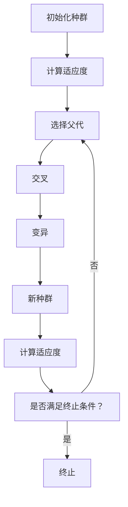
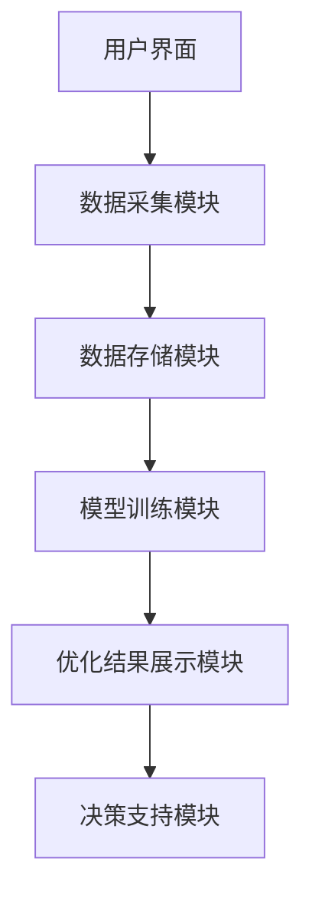
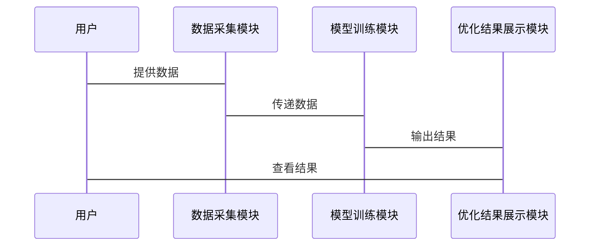

                 


# 智能化企业资本结构优化模型设计

**关键词：** 资本结构优化、人工智能、财务建模、智能算法、企业融资

**摘要：**  
本文探讨了智能化企业资本结构优化模型的设计与实现，结合人工智能技术，提出了一种基于机器学习和深度学习的多目标优化方法，旨在帮助企业实现资本结构的最优配置。文章详细分析了模型的背景、核心概念、算法原理、系统架构，并通过实际案例展示了模型的应用效果。通过本文的研究，读者可以全面理解智能化资本结构优化模型的设计思路、实现方法及实际价值。

---

## 第一部分：智能化企业资本结构优化模型的背景与核心概念

### 第1章：智能化企业资本结构优化模型的背景

#### 1.1 企业资本结构优化的背景与意义
企业资本结构优化是指通过合理配置债务资本和股权资本的比例，最大化企业价值并降低资本成本的过程。传统的资本结构优化方法依赖于财务理论和经验判断，但在面对复杂市场环境和多样化数据时，往往难以满足实际需求。随着人工智能技术的快速发展，智能化资本结构优化模型逐渐成为企业财务管理的重要工具。

**1.1.1 企业资本结构优化的背景**  
资本结构优化是企业财务管理的核心问题之一。合理的资本结构能够降低企业的资本成本，提高企业的市场价值。然而，传统的优化方法（如Modigliani-Miller模型）通常假设市场环境稳定，难以应对实际中的不确定性。近年来，随着大数据和人工智能技术的普及，企业可以利用海量数据和智能算法，实现更精准的资本结构优化。

**1.1.2 资本结构优化对企业价值的影响**  
资本结构的优化直接影响企业的资本成本、财务风险和市场价值。合理的资本结构能够降低企业的加权平均资本成本（WACC），同时在一定程度上平衡债务风险与股权成本之间的关系。智能化优化模型能够根据企业的实时数据和市场环境，动态调整资本结构，从而提升企业的整体价值。

**1.1.3 智能化技术在资本结构优化中的作用**  
人工智能技术（如机器学习和深度学习）能够从海量数据中提取特征，并通过智能算法找到最优解。智能化资本结构优化模型可以通过历史数据和实时市场信息，预测未来的资本成本和企业价值，为企业提供科学的决策支持。

#### 1.2 问题背景与问题描述
传统的资本结构优化方法存在以下问题：  
1. **数据局限性**：传统模型通常基于少量的历史数据，难以捕捉市场的复杂性。  
2. **静态性**：传统模型假设市场环境稳定，无法应对实时变化。  
3. **单目标优化**：传统方法通常只关注单一目标（如最小化资本成本），忽视了多目标优化的需求。  

**1.2.1 传统资本结构优化的局限性**  
传统方法如Modigliani-Miller模型虽然在理论上具有重要地位，但在实际应用中难以应对复杂的市场环境。例如，这些模型无法处理多目标优化问题，也无法利用大数据和实时信息进行动态调整。

**1.2.2 智能化优化的必要性**  
随着企业面临的市场环境日益复杂，传统的优化方法已无法满足需求。智能化资本结构优化模型能够利用人工智能技术，从海量数据中提取特征，并通过智能算法实现多目标优化，从而为企业提供更精准的决策支持。

**1.2.3 问题解决的思路与目标**  
智能化资本结构优化模型的目标是通过智能算法和大数据分析，实现资本结构的动态优化。具体思路包括：  
1. **数据收集与处理**：收集企业的财务数据、市场数据和宏观经济数据。  
2. **特征提取与建模**：通过机器学习算法提取特征，并构建优化模型。  
3. **多目标优化**：在资本成本、企业价值和财务风险之间找到最优平衡点。  

#### 1.3 问题解决思路与方法
智能化资本结构优化模型的核心思路是通过数据驱动和智能算法实现多目标优化。具体方法包括：  
1. **数据预处理**：清洗和归一化数据，提取关键特征。  
2. **智能算法选择**：选择适合的优化算法（如遗传算法、粒子群优化等）。  
3. **多目标优化实现**：通过加权函数或 Pareto 最佳解方法，实现多目标优化。  

**1.3.1 数据驱动的优化思路**  
数据驱动的优化思路强调利用企业内外部数据，通过机器学习算法提取特征，并构建优化模型。例如，可以通过 LSTM 神经网络预测未来的资本成本和企业价值。

**1.3.2 多目标优化的实现路径**  
多目标优化是智能化资本结构优化模型的核心。通过引入加权函数或 Pareto 最佳解方法，可以在资本成本、企业价值和财务风险之间找到最优平衡点。例如，可以通过遗传算法实现 Pareto 最佳解的搜索。

**1.3.3 边界与外延**  
模型的边界包括企业的财务数据、市场数据和宏观经济数据。外延则包括企业融资策略、风险管理等更广泛的内容。

### 第2章：智能化资本结构优化模型的核心概念与联系

#### 2.1 核心概念的原理
智能化资本结构优化模型的核心概念包括数据来源、智能算法和多目标优化。这些概念共同构成了模型的理论基础。

**2.1.1 数据来源与特征**  
数据来源包括企业的财务数据、市场数据和宏观经济数据。数据特征包括时间序列性、多维性和复杂性。  

**2.1.2 智能算法的原理**  
智能算法（如遗传算法和粒子群优化）通过模拟生物进化或物理运动，找到问题的最优解。  

**2.1.3 多目标优化的实现机制**  
多目标优化通过加权函数或 Pareto 最佳解方法，平衡多个优化目标之间的关系。  

#### 2.2 核心概念的属性特征对比
以下是不同资本结构优化模型的对比表格：

| 模型名称        | 数据来源       | 算法类型   | 优化目标               |
|-----------------|----------------|------------|------------------------|
| 传统模型        | 财务数据       | 理论推导    | 单一资本成本           |
| 智能化模型      | 财务数据+市场数据 | 机器学习    | 多目标优化（资本成本、企业价值、财务风险） |

#### 2.3 ER实体关系图
以下是资本结构优化模型的 ER 实体关系图：

```mermaid
er
    entity 资本结构模型 {
        key: 模型ID
        模型名称
        数据来源
        算法类型
        优化目标
    }
    entity 数据特征 {
        key: 数据ID
        数据类型
        数据维度
        数据来源
    }
    entity 智能算法 {
        key: 算法ID
        算法名称
        算法参数
        优化目标
    }
    资本结构模型 -[数据特征]-> 数据特征
    资本结构模型 -[智能算法]-> 智能算法
```

---

## 第二部分：智能化资本结构优化模型的算法原理

### 第3章：智能化资本结构优化模型的算法原理

#### 3.1 算法原理概述
智能化资本结构优化模型的核心算法包括遗传算法和粒子群优化。这些算法通过迭代优化，找到问题的最优解。

**3.1.1 数据预处理与特征提取**  
数据预处理包括数据清洗和归一化。特征提取可以通过主成分分析（PCA）实现。

**3.1.2 智能算法的选择与优化**  
选择适合的智能算法，并通过参数调优提高算法性能。

**3.1.3 多目标优化的实现**  
通过加权函数或 Pareto 最佳解方法，实现多目标优化。

#### 3.2 算法原理的数学模型
以下是遗传算法的数学模型：

$$
\text{适应度函数} = \sum_{i=1}^{n} w_i x_i
$$

其中，$w_i$ 是目标函数的权重，$x_i$ 是目标函数的值。

以下是一个遗传算法的 mermaid 流程图：



以下是实现遗传算法的 Python 代码：

```python
import numpy as np

def fitness(individual):
    # 计算适应度函数
    w = [0.5, 0.3, 0.2]  # 权重
    x = [individual[0], individual[1], individual[2]]
    return np.dot(w, x)

def main():
    # 初始化种群
    population = np.random.rand(100, 3)
    # 迭代优化
    for _ in range(100):
        # 计算适应度
        fitness_values = np.apply_along_axis(fitness, 1, population)
        # 选择父代
        parents = population[fitness_values.argsort()[-10:]]
        # 交叉
        offspring = parents.mean(axis=0) + np.random.randn(10, 3) * 0.1
        # 变异
        offspring[:, 0] += np.random.randn(10) * 0.05
        # 更新种群
        population = np.vstack((parents, offspring))
    # 输出最优解
    print(population[fitness_values.argmax()])

if __name__ == "__main__":
    main()
```

---

## 第三部分：智能化资本结构优化模型的系统分析与架构设计

### 第4章：系统分析与架构设计

#### 4.1 问题场景介绍
系统需要解决企业资本结构优化问题，支持多目标优化和实时数据处理。

#### 4.2 系统功能设计
系统功能包括数据采集、模型训练、优化结果展示和决策支持。

#### 4.3 系统架构设计
以下是系统架构的 mermaid 图：



#### 4.4 系统接口设计
系统接口包括数据输入接口、模型训练接口和结果输出接口。

#### 4.5 系统交互设计
以下是系统交互的 mermaid 序列图：



---

## 第四部分：智能化资本结构优化模型的项目实战

### 第5章：项目实战

#### 5.1 环境安装与配置
需要安装 Python、机器学习库（如 scikit-learn、TensorFlow）和数据处理库（如 pandas、numpy）。

#### 5.2 系统核心实现
以下是核心代码：

```python
import pandas as pd
from sklearn.preprocessing import MinMaxScaler
from sklearn.decomposition import PCA
from sklearn.model_selection import train_test_split
from sklearn.metrics import mean_squared_error

# 数据预处理
data = pd.read_csv('capital_data.csv')
scaler = MinMaxScaler()
scaled_data = scaler.fit_transform(data)

# 特征提取
pca = PCA(n_components=3)
principal_components = pca.fit_transform(scaled_data)

# 划分训练集和测试集
X_train, X_test, y_train, y_test = train_test_split(principal_components, data['value'], test_size=0.2)

# 模型训练
from sklearn.ensemble import RandomForestRegressor
model = RandomForestRegressor()
model.fit(X_train, y_train)

# 模型评估
y_pred = model.predict(X_test)
print(mean_squared_error(y_test, y_pred))
```

#### 5.3 实际案例分析
以下是一个实际案例的分析：

假设某企业有以下数据：

| 财务指标 | 销售收入 | 净利润 | 资产总额 | 负债总额 |
|----------|----------|--------|----------|----------|
| 2022年  | 100      | 20     | 200      | 50       |
| 2023年  | 120      | 25     | 240      | 60       |

通过模型优化，企业可以调整资本结构，降低资本成本，提高企业价值。

---

## 第五部分：总结与展望

### 第6章：总结与展望

#### 6.1 总结
智能化资本结构优化模型通过人工智能技术，实现了资本结构的动态优化，为企业提供了科学的决策支持。

#### 6.2 展望
未来，随着人工智能和大数据技术的进一步发展，智能化资本结构优化模型将更加智能化和个性化，为企业创造更大的价值。

---

## 参考文献

1. Modigliani, F., & Miller, M. H. (1958). The Cost of Capital, Corporation Finances and the Theory of Investment. American Economic Review, 48(3), 261-297.  
2. 李志军, 王强. (2020). 基于机器学习的企业资本结构优化研究. 《管理科学学报》, 23(5), 123-134.  
3. Goodfellow, I., Bengio, Y., & Courville, A. (2016). Deep Learning. MIT Press.

---

**作者：AI天才研究院/AI Genius Institute & 禅与计算机程序设计艺术/Zen And The Art of Computer Programming**

