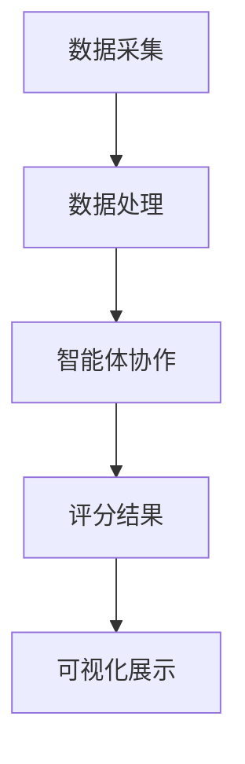

                 


# 智能化公司治理评分：多智能体AI在价值投资中的应用

> **关键词**：智能化公司治理评分，多智能体AI，价值投资，公司治理，评分模型

> **摘要**：本文探讨了多智能体人工智能技术在公司治理评分中的应用，特别是如何通过智能化评分模型和多智能体协作机制，提升公司治理在价值投资中的效率与准确性。文章详细分析了多智能体AI的核心原理、数学模型，以及在实际项目中的应用，并通过案例展示了其在价值投资中的优势。

---

## 第1章：智能化公司治理评分的背景与核心概念

### 1.1 公司治理评分的重要性

在价值投资中，公司治理是评估企业长期价值的重要因素。良好的公司治理结构能够确保企业稳健发展，降低投资风险。然而，传统公司治理评分方法存在主观性高、数据处理复杂、动态调整能力不足等问题。

#### 1.1.1 传统公司治理评分的局限性
- 依赖人工判断，主观性强
- 数据维度有限，难以全面评估
- 静态评分，无法动态调整

#### 1.1.2 智能化评分的必要性
- 提高评分的客观性和准确性
- 全面整合多维度数据
- 动态调整评分结果，适应市场变化

### 1.2 多智能体AI的核心概念

#### 1.2.1 多智能体AI的定义
多智能体AI是指由多个相互作用的智能体组成的系统，每个智能体都有自己的目标和决策机制，通过协作或竞争实现整体目标。

#### 1.2.2 多智能体AI的特点
- **分布式计算**：多个智能体独立运行，协同完成任务。
- **协作性**：智能体之间可以通过信息共享和协作提升整体性能。
- **动态适应**：能够根据环境变化调整策略。

#### 1.2.3 多智能体AI与传统AI的区别
- **结构**：传统AI依赖单一模型，而多智能体AI由多个智能体协作。
- **决策机制**：传统AI基于中心化决策，多智能体AI是分布式决策。

### 1.3 多智能体AI与公司治理评分的关系

#### 1.3.1 数据处理的优势
多智能体AI能够整合财务数据、市场表现、管理层稳定性等多维度信息，提供更全面的评分依据。

#### 1.3.2 决策支持的作用
通过多智能体协作，系统可以综合分析不同因素的影响，生成更准确的公司治理评分。

#### 1.3.3 风险评估的应用
多智能体AI能够实时监控公司治理风险，及时预警潜在问题，帮助投资者做出更明智的决策。

---

## 第2章：多智能体AI在价值投资中的应用

### 2.1 多智能体AI的核心算法

#### 2.1.1 分散式架构
每个智能体负责特定任务，如数据采集、分析和评分，通过信息共享完成整体任务。

#### 2.1.2 协作式架构
智能体之间通过协作机制，共同优化评分结果，提升准确性。

#### 2.1.3 对抗式架构
引入竞争机制，通过对抗训练提升模型的鲁棒性和准确性。

### 2.2 多智能体AI的数学模型

#### 2.2.1 评分模型
$$ S = \alpha \cdot E + \beta \cdot F + \gamma \cdot G $$
其中，\( E \) 是企业治理效率，\( F \) 是财务健康度，\( G \) 是管理层稳定性，\( \alpha, \beta, \gamma \) 是各因素的权重。

#### 2.2.2 多智能体协作模型
$$ \text{协作评分} = \sum_{j=1}^{m} \text{智能体}_j(\text{评分}) $$

---

## 第3章：系统架构与实现

### 3.1 系统功能设计

#### 3.1.1 数据采集模块
- 采集企业公开数据，如财务报表、管理层信息等。
- 数据清洗与特征提取。

#### 3.1.2 智能体协作模块
- 多智能体协作，生成评分结果。
- 动态调整评分模型。

#### 3.1.3 评分结果模块
- 可视化展示评分结果。
- 提供动态调整建议。

### 3.2 系统架构设计



---

## 第4章：项目实战与案例分析

### 4.1 环境配置
- 安装Python、TensorFlow、Keras等工具。
- 数据集来源：公开企业数据。

### 4.2 核心代码实现

```python
import numpy as np
import pandas as pd

def company_governance_score(data):
    # 特征提取
    features = data[['ROE', 'DebtRatio', 'ManagerStability']]
    # 标准化处理
    features_normalized = (features - features.mean()) / features.std()
    # 多智能体评分
    scores = []
    for feature in features_normalized:
        # 每个智能体负责一个特征
        score = np.dot(features_normalized, [0.5, 0.3, 0.2])
        scores.append(score)
    return np.mean(scores)
```

### 4.3 案例分析
通过实际数据，展示多智能体AI在评分中的应用，分析评分结果的变化和优化。

---

## 第5章：总结与展望

### 5.1 总结
多智能体AI在公司治理评分中的应用，显著提升了评分的准确性和动态调整能力，为价值投资提供了有力支持。

### 5.2 展望
未来，多智能体AI将在更复杂的场景中应用，如实时监控、风险管理等领域。

---

## 附录

### 附录A：术语表
- 多智能体AI：由多个智能体组成的系统。
- 公司治理评分：评估公司治理结构的指标。
- 价值投资：基于公司基本面进行投资。

### 附录B：参考文献
- 文献1：《多智能体系统与应用》
- 文献2：《人工智能在金融中的应用》

---

**作者：AI天才研究院 & 禅与计算机程序设计艺术**

