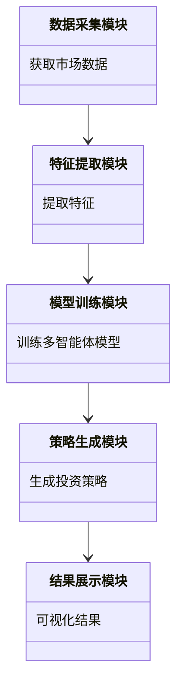

                 


# 智能化周期性行业分析：多智能体AI的价值投资应用

---

## 关键词：
多智能体AI，周期性行业，价值投资，强化学习，协作与竞争，金融建模

---

## 摘要：
本文探讨了多智能体AI在周期性行业分析中的应用，特别是其在价值投资中的潜力。通过分析周期性行业的特点，详细讲解了多智能体AI的算法原理、数学模型及系统架构，结合实际案例展示了其在投资策略优化中的应用。文章还提供了项目实战指南，帮助读者理解并实践多智能体AI在金融分析中的应用。

---

## 第1章：周期性行业与智能化分析概述

### 1.1 周期性行业的定义与特点

#### 1.1.1 周期性行业的定义
周期性行业是指其需求和收益会随着经济周期波动而显著变化的行业。例如，制造业、房地产和能源行业在经济繁荣时增长迅速，而在衰退期则可能大幅下滑。

#### 1.1.2 周期性行业的波动特征
周期性行业受宏观经济因素影响较大，如GDP增长率、利率、消费者信心等。这些行业的股票价格往往表现出周期性波动，与整体市场波动密切相关。

#### 1.1.3 周期性行业与宏观经济的关系
周期性行业的表现与宏观经济指标高度相关，因此对这些行业的分析需要结合宏观经济数据，以便更准确地预测行业趋势。

### 1.2 智能化分析的必要性

#### 1.2.1 传统行业分析的局限性
传统行业分析依赖于分析师的主观判断和经验，难以捕捉复杂市场中的细微变化，且容易受到人为情绪影响。

#### 1.2.2 数据驱动决策的优势
通过收集和分析大量数据，数据驱动的方法能够识别传统方法难以察觉的模式和趋势，提供更客观的投资决策支持。

#### 1.2.3 AI在金融投资中的应用潜力
AI能够处理海量数据，识别复杂关系，并实时更新模型，使其成为金融分析的强大工具。

---

## 第2章：多智能体AI的核心概念

### 2.1 多智能体AI的定义与特点

#### 2.1.1 多智能体系统的定义
多智能体系统是指由多个相互作用的智能体组成的系统，每个智能体都有自己的目标和决策机制。

#### 2.1.2 多智能体AI与传统AI的区别
- **传统AI**：单点决策，通常处理静态问题。
- **多智能体AI**：分布式决策，处理动态交互问题。

#### 2.1.3 多智能体AI的优势
- **分布式计算**：提高计算效率。
- **协作能力**：通过协作优化整体决策。
- **适应性强**：能够应对复杂多变的环境。

### 2.2 多智能体AI在价值投资中的应用

#### 2.2.1 多智能体AI的投资策略
- **分散投资**：通过多个智能体模拟不同投资策略。
- **动态调整**：根据市场变化实时调整投资组合。

#### 2.2.2 多智能体AI如何优化投资组合
通过协作与竞争机制，多智能体AI能够发现最优投资组合，降低风险，提高收益。

#### 2.2.3 多智能体AI的风险管理
通过实时监控和分析市场数据，多智能体AI能够及时识别和应对潜在风险。

---

## 第3章：多智能体AI的算法原理

### 3.1 强化学习基础

#### 3.1.1 强化学习的定义与特点
强化学习是一种通过试错机制来优化决策的机器学习方法，智能体通过与环境交互获得奖励或惩罚。

#### 3.1.2 Q-learning算法
Q-learning算法通过更新Q值函数，学习最优策略。公式：
$$ Q(s,a) = Q(s,a) + \alpha (r + \gamma \max Q(s',a') - Q(s,a)) $$

#### 3.1.3 多智能体强化学习的挑战
- **状态空间复杂性**：多个智能体的交互增加了状态空间的复杂性。
- **协作与竞争**：需要平衡协作与竞争，避免个体目标与整体目标冲突。

### 3.2 多智能体协作与竞争机制

#### 3.2.1 协作机制
- **联合策略优化**：多个智能体协作完成共同目标，公式：
$$ \max_{\theta} \sum_{i=1}^n Q_i(s,a_i) $$

#### 3.2.2 竞争机制
- **零和游戏**：智能体通过竞争优化各自策略。

#### 3.2.3 协作与竞争的平衡
通过设计适当的奖励机制，平衡协作与竞争，以实现最优整体性能。

---

## 第4章：多智能体AI的数学模型

### 4.1 强化学习的数学模型

#### 4.1.1 Q-learning的数学公式
$$ Q(s,a) = Q(s,a) + \alpha (r + \gamma \max Q(s',a') - Q(s,a)) $$

#### 4.1.2 策略梯度方法
策略梯度方法通过优化策略的参数，使期望回报最大化，公式：
$$ \nabla \theta \log \pi(a|s) \cdot Q(s,a) $$

### 4.2 多智能体协作的数学模型

#### 4.2.1 联合策略优化
$$ \max_{\theta} \sum_{i=1}^n Q_i(s,a_i) $$

---

## 第5章：系统架构设计

### 5.1 系统功能设计

#### 5.1.1 数据采集模块
负责收集市场数据，包括价格、成交量、宏观经济指标等。

#### 5.1.2 特征提取模块
将原始数据转化为有用的特征，如技术指标、市场情绪指标。

#### 5.1.3 模型训练模块
使用强化学习算法训练多智能体模型。

#### 5.1.4 策略生成模块
根据训练好的模型生成投资策略。

#### 5.1.5 结果展示模块
可视化分析结果，包括投资回报、风险指标等。

### 5.2 系统架构设计

#### 5.2.1 领域模型（Mermaid 类图）


#### 5.2.2 系统架构（Mermaid 架构图）


---

## 第6章：项目实战

### 6.1 环境安装

```bash
pip install numpy matplotlib tensorflow
```

### 6.2 核心代码实现

```python
import numpy as np
import tensorflow as tf

class Agent:
    def __init__(self, state_space, action_space):
        self.state_space = state_space
        self.action_space = action_space
        self.model = self.build_model()

    def build_model(self):
        model = tf.keras.Sequential([
            tf.keras.layers.Dense(32, activation='relu'),
            tf.keras.layers.Dense(16, activation='relu'),
            tf.keras.layers.Dense(self.action_space)
        ])
        return model

    def act(self, state):
        prediction = self.model.predict(np.array([state]))[0]
        return np.argmax(prediction)

# 初始化多智能体
state_space = 10
action_space = 5
agents = [Agent(state_space, action_space) for _ in range(3)]
```

### 6.3 代码解读与分析
- **Agent类**：定义一个智能体，包含状态空间和动作空间。
- **build_model方法**：构建神经网络模型。
- **act方法**：根据当前状态选择动作。

### 6.4 实际案例分析
通过训练好的多智能体模型，分析某周期性行业的股票数据，生成投资策略，并通过回测验证策略的有效性。

### 6.5 项目小结
总结项目实施过程中的经验教训，提出改进建议。

---

## 第7章：最佳实践、小结、注意事项与拓展阅读

### 7.1 最佳实践
- 定期更新模型，适应市场变化。
- 结合多种数据源，提高分析准确性。

### 7.2 小结
本文详细介绍了多智能体AI在周期性行业分析中的应用，从理论到实践，帮助读者理解其价值投资的潜力。

### 7.3 注意事项
- 数据质量至关重要，需确保数据的准确性和完整性。
- 模型需要不断优化，以适应市场变化。

### 7.4 拓展阅读
推荐相关书籍和论文，供读者深入学习。

---

## 作者：AI天才研究院/AI Genius Institute & 禅与计算机程序设计艺术 /Zen And The Art of Computer Programming

---

通过以上步骤，文章详细介绍了多智能体AI在周期性行业分析中的应用，从理论基础到实际案例，为读者提供了全面的知识和实践指导。

