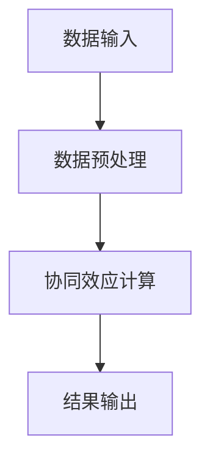

                 

# 智能化并购协同效应分析：多智能体AI在价值投资中的角色

> 关键词：智能化并购、协同效应、多智能体AI、价值投资、并购分析、协同学习、数学模型

> 摘要：智能化并购协同效应分析是多智能体AI在价值投资中的重要角色。本文通过介绍智能化并购的背景与意义，详细探讨多智能体AI的核心概念与原理，分析其在并购协同效应中的应用，并通过数学模型和实际案例展示其在价值投资中的潜力。

---

# 第1章: 智能化并购与协同效应概述

## 1.1 智能化并购的背景与意义

### 1.1.1 传统并购分析的局限性

传统并购分析主要依赖于财务数据和简单的指标分析，难以捕捉企业并购中的动态协同效应。这种方法往往忽视了企业内部协同的复杂性和不确定性，导致并购决策的低效和失败。

### 1.1.2 智能化并购的定义与特点

智能化并购是通过人工智能技术，特别是多智能体系统，对并购过程中的协同效应进行智能化分析和预测。其特点包括数据驱动、实时性、动态性和高精度。

### 1.1.3 多智能体AI在并购中的作用

多智能体AI能够通过协同学习和分布式计算，帮助企业识别潜在的协同效应，优化并购决策，并降低风险。

## 1.2 协同效应的概念与分类

### 1.2.1 协同效应的定义

协同效应是指企业在并购后通过资源整合、协同生产和市场扩展等手段所获得的额外收益。

### 1.2.2 协同效应的主要类型

1. **经营协同效应**：通过优化生产流程、共享资源降低成本。
2. **战略协同效应**：通过战略整合提升市场地位。
3. **财务协同效应**：通过优化资本结构提升财务表现。

### 1.2.3 协同效应的衡量指标

1. **协同比率**：协同收益与并购成本的比率。
2. **协同增量**：协同收益超过预期收益的部分。

## 1.3 多智能体AI在价值投资中的角色

### 1.3.1 多智能体AI的基本概念

多智能体AI是由多个具有独立决策能力的智能体组成的系统，通过协同工作实现复杂任务的目标。

### 1.3.2 多智能体AI的优势与劣势

- **优势**：分布式计算能力强，能够处理复杂问题。
- **劣势**：系统设计复杂，协调难度大。

### 1.3.3 多智能体AI在价值投资中的应用潜力

通过多智能体AI，投资者可以更准确地预测并购后的协同效应，优化投资决策。

## 1.4 本章小结

本章介绍了智能化并购的背景与意义，阐述了协同效应的概念与分类，并探讨了多智能体AI在价值投资中的潜力。

---

# 第2章: 多智能体AI的核心概念与原理

## 2.1 多智能体系统的基本原理

### 2.1.1 多智能体系统的定义

多智能体系统是由多个智能体组成的系统，每个智能体都有自己的目标和决策机制。

### 2.1.2 多智能体系统的特点

1. **分布性**：智能体独立决策。
2. **协作性**：智能体通过协同完成任务。
3. **动态性**：系统状态不断变化。

### 2.1.3 多智能体系统与传统AI的区别

传统AI依赖中央控制，而多智能体系统强调分布式计算和自主决策。

## 2.2 多智能体系统的协同机制

### 2.2.1 协同目标的设定

智能体需要明确的协同目标，例如最大化协同收益。

### 2.2.2 协同过程中的信息传递

智能体之间通过通信协议传递信息，确保协同过程顺利进行。

### 2.2.3 协同结果的评估

通过评估指标对协同结果进行量化评估，例如协同收益是否达到预期。

## 2.3 多智能体系统在并购分析中的应用

### 2.3.1 并购协同效应的多智能体建模

通过多智能体系统模拟并购过程中的协同效应。

### 2.3.2 多智能体系统在并购决策中的作用

帮助投资者预测并购后的协同效应，优化决策。

### 2.3.3 多智能体系统的优缺点分析

- **优势**：能够处理复杂问题。
- **劣势**：系统设计复杂，协调难度大。

## 2.4 本章小结

本章详细讲解了多智能体AI的核心概念与原理，并探讨了其在并购分析中的应用。

---

# 第3章: 多智能体AI的算法原理与数学模型

## 3.1 多智能体系统的算法概述

### 3.1.1 分布式计算与协作机制

多智能体系统通过分布式计算实现协作，每个智能体负责一部分任务。

### 3.1.2 多智能体系统中的通信协议

智能体之间通过通信协议传递信息，确保协同过程顺利进行。

### 3.1.3 多智能体系统的任务分配算法

任务分配算法确保每个智能体承担适当的任务，提高系统效率。

## 3.2 协同效应的数学模型

### 3.2.1 协同效应的定义与公式

$$ \text{协同效应} = \text{整体效益} - \text{个体效益之和} $$

### 3.2.2 协同效应的度量方法

通过数学模型量化协同效应，帮助投资者评估并购决策。

### 3.2.3 协同效应的优化算法

通过优化算法提高协同效应，例如遗传算法和模拟退火算法。

## 3.3 多智能体系统中的协同学习

### 3.3.1 协同学习的基本原理

智能体通过协同学习不断优化决策策略。

### 3.3.2 协同学习的数学模型

$$ \text{协同学习收益} = \sum_{i=1}^{n} \text{智能体收益} $$

### 3.3.3 协同学习的实现步骤

1. 初始化智能体。
2. 智能体通过通信协议传递信息。
3. 智能体根据信息更新决策策略。
4. 重复步骤2-3直到达到目标。

## 3.4 本章小结

本章详细讲解了多智能体AI的算法原理与数学模型，为后续章节的分析奠定了基础。

---

# 第4章: 智能化并购协同效应的系统分析

## 4.1 系统架构设计

### 4.1.1 系统功能模块划分

1. 数据输入模块：接收并购数据。
2. 数据预处理模块：清洗和转换数据。
3. 协同效应计算模块：通过多智能体系统计算协同效应。
4. 结果输出模块：输出分析结果。

### 4.1.2 系统架构的Mermaid图

## 4.2 系统功能设计

### 4.2.1 并购数据的输入与预处理

数据输入模块接收并购数据，数据预处理模块清洗数据，确保数据质量。

### 4.2.2 协同效应的计算模块

通过多智能体系统计算并购后的协同效应，优化并购决策。

### 4.2.3 结果的可视化与分析

将协同效应计算结果可视化，帮助投资者分析并购决策。

## 4.3 系统接口设计

### 4.3.1 系统输入接口

接收并购数据，例如公司财务数据和市场数据。

### 4.3.2 系统输出接口

输出协同效应分析结果，例如协同收益和协同比率。

### 4.3.3 系统内部接口

智能体之间的通信接口，确保协同过程顺利进行。

## 4.4 系统交互流程

### 4.4.1 用户输入并购数据

用户输入并购数据，系统接收并进行预处理。

### 4.4.2

---

作者：AI天才研究院/AI Genius Institute & 禅与计算机程序设计艺术 /Zen And The Art of Computer Programming

