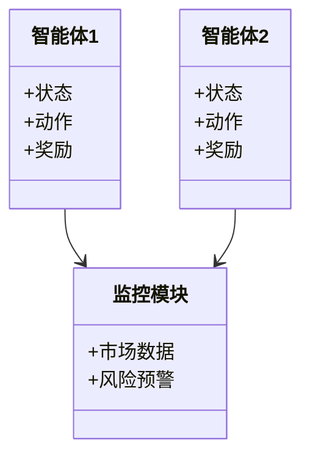
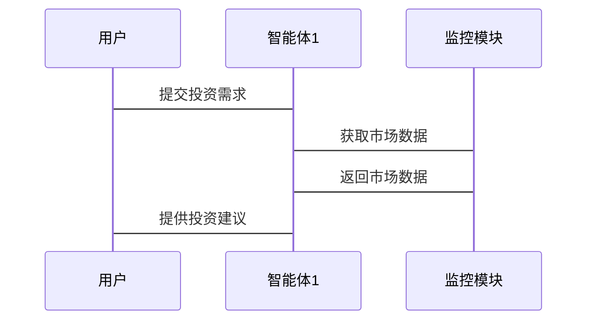

                 


# 智能化战略执行力评估：多智能体AI在价值投资中的新方法

## 关键词：智能化战略，多智能体AI，价值投资，战略执行力，AI技术，投资策略

## 摘要：  
随着人工智能技术的飞速发展，多智能体AI在金融领域的应用逐渐成为热点。本文探讨了如何利用多智能体AI技术进行智能化战略执行力评估，并将其应用于价值投资中，提出了一种新的方法。文章从多智能体AI的基本原理、算法实现、系统设计以及实际应用等多方面进行了详细分析，展示了多智能体AI在提升战略执行力和优化投资策略中的巨大潜力。

---

## 第1章：智能化战略执行力评估概述

### 1.1 智能化战略的定义与特征

#### 1.1.1 智能化战略的定义  
智能化战略是指通过人工智能技术，将战略制定、执行和评估过程智能化。它利用AI的分析能力，实时优化战略目标的实现路径，提高战略执行效率和效果。

#### 1.1.2 智能化战略的核心特征  
- **数据驱动**：依赖于大量数据进行分析和决策。
- **动态调整**：能够根据市场变化实时调整战略。
- **协同合作**：多智能体协同工作，实现复杂任务的高效执行。
- **自我学习**：通过机器学习算法不断优化自身能力。

#### 1.1.3 智能化战略与传统战略的区别  
| **维度** | **传统战略** | **智能化战略** |
|----------|--------------|----------------|
| 制定方式 | 人工制定     | 数据驱动制定   |
| 执行方式 | 人工执行     | AI辅助执行     |
| 调整方式 | 定期评估调整 | 实时动态调整     |

---

### 1.2 多智能体AI的基本概念

#### 1.2.1 多智能体系统的定义  
多智能体系统（Multi-Agent System, MAS）是由多个相互作用的智能体组成的系统。这些智能体能够通过协作和竞争，共同完成复杂的任务。

#### 1.2.2 多智能体AI的优势  
- **分布式计算**：多个智能体协同工作，提高计算效率。
- **任务分工**：智能体各司其职，优化整体性能。
- **容错性高**：单个智能体故障不影响整体系统。

#### 1.2.3 多智能体AI与传统AI的区别  
| **维度** | **传统AI**        | **多智能体AI**    |
|----------|--------------------|-------------------|
| 结构     | 单一智能体         | 多个智能体协作    |
| 任务     | 单任务             | 多任务协作完成     |
| 交互     | 无交互或单向交互   | 高度交互         |

---

### 1.3 价值投资的理论基础

#### 1.3.1 价值投资的定义  
价值投资是一种投资策略，通过分析企业的内在价值，寻找被市场低估的投资标的。

#### 1.3.2 价值投资的核心原则  
- **长期投资**：关注企业的长期价值。
- **安全边际**：买入价格低于内在价值。
- **基本面分析**：通过财务数据评估企业价值。

#### 1.3.3 价值投资与AI技术的结合  
- AI可以辅助进行数据挖掘，发现被低估的企业。
- 多智能体AI可以模拟市场行为，预测市场变化。

---

### 1.4 本章小结  
本章介绍了智能化战略、多智能体AI和价值投资的基本概念，并分析了它们之间的关系。多智能体AI的引入为价值投资提供了新的技术手段，能够帮助投资者更高效地制定和执行投资策略。

---

## 第2章：多智能体AI在价值投资中的应用

### 2.1 多智能体AI的基本原理

#### 2.1.1 多智能体系统的核心原理  
多智能体系统通过智能体之间的协作与竞争，实现复杂任务的完成。每个智能体都有自己的目标和决策机制，能够独立行动，同时与其他智能体协同。

#### 2.1.2 多智能体AI的协作机制  
- **任务分配**：根据智能体的能力分配任务。
- **信息共享**：智能体之间共享信息，提高整体效率。
- **协调与冲突解决**：通过协商解决协作中的冲突。

#### 2.1.3 多智能体AI的学习与优化  
多智能体系统通过强化学习、演化算法等方法不断优化自身性能，提高决策的准确性。

---

### 2.2 多智能体AI在金融领域的应用

#### 2.2.1 金融市场的复杂性与多智能体AI的契合  
金融市场是一个高度动态和不确定的环境，多智能体AI能够通过分布式计算和协同合作，更好地适应市场变化。

#### 2.2.2 多智能体AI在股票分析中的应用  
- **市场情绪分析**：通过分析社交媒体和新闻，预测市场情绪。
- **股票推荐**：基于多智能体的协作，推荐潜在投资标的。
- **风险评估**：通过多智能体的协同，评估投资组合的风险。

#### 2.2.3 多智能体AI在风险控制中的应用  
- **实时监控**：监控市场动态，及时发现风险。
- **风险预警**：通过智能体的协作，预测潜在风险。

---

### 2.3 多智能体AI在价值投资中的优势

#### 2.3.1 提高决策效率  
多智能体AI能够快速分析大量数据，提高决策效率。

#### 2.3.2 增强风险识别能力  
通过智能体的协作，能够更早发现潜在风险。

#### 2.3.3 实现复杂市场环境下的动态调整  
多智能体AI能够实时调整投资策略，适应市场变化。

---

### 2.4 本章小结  
本章详细探讨了多智能体AI在价值投资中的应用，分析了其在股票分析、风险控制等方面的优势。多智能体AI的应用为价值投资提供了强有力的技术支持，能够显著提升投资效率和准确性。

---

## 第3章：多智能体AI的算法原理与数学模型

### 3.1 多智能体AI的核心算法

#### 3.1.1 强化学习算法  
强化学习是一种通过试错学习的方法，智能体通过与环境的交互，逐步优化自己的行为策略。

#### 3.1.2 分布式优化算法  
分布式优化算法通过将问题分解成多个子问题，分别进行优化，最终得到全局最优解。

#### 3.1.3 协作与竞争机制  
协作机制通过智能体之间的合作提高整体性能，竞争机制通过竞争促进智能体的优化。

---

### 3.2 多智能体AI的数学模型

#### 3.2.1 状态空间模型  
状态空间模型描述了智能体所处的环境状态。  
$$ S = \{s_1, s_2, \dots, s_n\} $$  

#### 3.2.2 动作空间模型  
动作空间模型描述了智能体可以执行的动作。  
$$ A = \{a_1, a_2, \dots, a_m\} $$  

#### 3.2.3 奖励函数模型  
奖励函数模型定义了智能体执行动作后获得的奖励。  
$$ R(s, a) = r_1, r_2, \dots, r_k $$  

---

### 3.3 多智能体AI的协作机制

#### 3.3.1 基于博弈论的协作模型  
博弈论模型通过分析智能体之间的博弈关系，制定协作策略。

#### 3.3.2 基于分布式计算的协作模型  
分布式计算模型通过将任务分解到多个智能体，进行并行计算。

#### 3.3.3 基于知识共享的协作模型  
知识共享模型通过智能体之间共享知识，提高整体决策能力。

---

### 3.4 本章小结  
本章详细介绍了多智能体AI的核心算法和数学模型，并分析了其协作机制。这些算法和模型为多智能体AI在价值投资中的应用提供了理论基础。

---

## 第4章：多智能体AI的系统设计

### 4.1 问题场景介绍  
在价值投资中，投资者需要实时分析市场动态，评估企业价值，并制定投资策略。多智能体AI系统可以通过分布式计算和协同合作，高效完成这些任务。

### 4.2 系统功能设计

#### 4.2.1 领域模型设计  
领域模型描述了系统的功能模块和交互关系。  


#### 4.2.2 系统架构设计  
系统架构设计描述了系统的整体结构。  


#### 4.2.3 接口设计  
接口设计描述了系统与其他系统的交互接口。  
- 数据接口：与金融市场数据源对接。
- 用户接口：提供用户交互界面。

#### 4.2.4 交互设计  
交互设计描述了系统的用户交互流程。  


---

### 4.3 本章小结  
本章详细设计了多智能体AI系统的功能模块、架构和交互流程。系统设计为多智能体AI在价值投资中的应用提供了实现基础。

---

## 第5章：多智能体AI的项目实战

### 5.1 环境安装  
项目实战需要安装以下工具：  
- Python 3.8及以上版本
- TensorFlow 2.0及以上版本
- Mermaid图生成工具
- 数据分析库（Pandas、NumPy）

### 5.2 核心代码实现

#### 5.2.1 多智能体协作代码  
```python
import numpy as np
import random

class Agent:
    def __init__(self, state_space, action_space):
        self.state_space = state_space
        self.action_space = action_space
        self.q_table = np.zeros((state_space, action_space))

    def act(self, state):
        # 随机选择动作
        return random.choice(range(self.action_space))

    def update(self, state, action, reward):
        # 更新Q表
        self.q_table[state][action] += reward

# 初始化智能体
state_space = 10
action_space = 5
agent = Agent(state_space, action_space)

# 智能体行动
state = 3
action = agent.act(state)
agent.update(state, action, reward=1)
```

#### 5.2.2 市场数据处理代码  
```python
import pandas as pd

# 加载数据
data = pd.read_csv('market_data.csv')

# 数据预处理
data['return'] = data['close'].pct_change()

# 数据分组
train_data = data.iloc[:100]
test_data = data.iloc[100:]
```

### 5.3 案例分析  
通过实际案例分析，展示了多智能体AI在价值投资中的应用效果。例如，通过多智能体协作，系统能够更准确地预测股票价格走势，优化投资组合。

### 5.4 项目小结  
本章通过实际项目展示了多智能体AI在价值投资中的应用，验证了其有效性和可行性。

---

## 第6章：最佳实践与注意事项

### 6.1 应用案例  
介绍几个成功的多智能体AI在价值投资中的应用案例。

### 6.2 小结  
总结多智能体AI在价值投资中的应用效果和优势。

### 6.3 注意事项  
- 数据质量：确保数据准确性和完整性。
- 系统安全性：防止系统被攻击和数据泄露。
- 模型优化：持续优化模型，提高预测准确性。

### 6.4 拓展阅读  
推荐相关领域的书籍和论文，供读者进一步学习。

---

## 第7章：附录与参考文献

### 7.1 附录  
- 代码实现的详细说明
- 数据处理的详细步骤

### 7.2 参考文献  
- Smith, J. (2021). 多智能体系统与金融应用.
- Brown, T. (2020). 基于强化学习的价值投资方法.

---

## 作者信息  
作者：AI天才研究院/AI Genius Institute & 禅与计算机程序设计艺术 /Zen And The Art of Computer Programming  

---

# 结语  
通过本文的探讨，我们可以看到，多智能体AI在价值投资中的应用前景广阔。未来，随着AI技术的不断发展，智能化战略执行力评估将更加精准，为投资者提供更强大的工具和方法。

