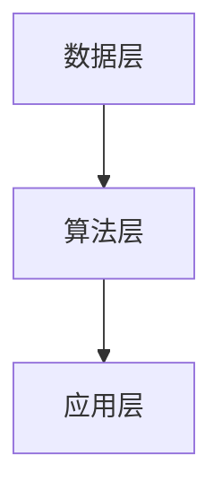

                 


# 智能化护城河持久性评估：多智能体AI的新视角

> 关键词：智能化护城河，持久性评估，多智能体AI，博弈论，数学模型，系统架构设计

> 摘要：本文从多智能体AI的新视角出发，详细探讨智能化护城河的持久性评估方法。通过构建数学模型和分析系统架构，提出了一种基于多智能体协同的评估框架，为企业的智能化战略提供了理论支持和实践指导。

---

## 第1章: 智能化护城河与持久性评估的背景

### 1.1 智能化护城河的概念与意义

#### 1.1.1 什么是智能化护城河
智能化护城河是指企业通过AI技术构建的核心竞争力，包括数据、算法、技术能力和用户体验等方面。这种护城河能够有效防止竞争对手的模仿和超越，确保企业在市场中的长期优势。

#### 1.1.2 智能化护城河的核心作用
智能化护城河的作用体现在以下几个方面：
1. **数据闭环**：通过数据的采集、分析和应用，形成数据闭环，提升决策效率。
2. **技术壁垒**：通过先进的AI技术，形成技术壁垒，防止竞争对手快速复制。
3. **用户体验**：通过智能化服务提升用户体验，增强客户粘性。

#### 1.1.3 持久性评估的必要性
随着技术的快速发展，智能化护城河的持久性面临挑战。企业需要定期评估护城河的持久性，以确保其在市场中的竞争力。评估的内容包括竞争优势的动态性、技术创新的持续性以及市场适应性。

---

### 1.2 多智能体AI的新视角

#### 1.2.1 多智能体AI的基本概念
多智能体AI是指多个智能体协同工作的系统，每个智能体都有自己的目标和决策机制。通过协同，智能体能够完成复杂的任务，实现整体目标的最优。

#### 1.2.2 多智能体AI在护城河评估中的应用
多智能体AI可以用于评估智能化护城河的多个维度，包括单个智能体的能力、多智能体的协同能力以及系统整体效能。通过多智能体的协同，能够更全面地评估护城河的持久性。

#### 1.2.3 多智能体AI的优势与挑战
优势：
1. **协同效应**：通过多智能体的协同，能够实现更高效的资源利用和更优的决策。
2. **适应性**：多智能体系统能够快速适应环境变化，增强系统的鲁棒性。

挑战：
1. **复杂性**：多智能体系统的复杂性较高，设计和实现较为困难。
2. **协调问题**：智能体之间的协调和通信需要解决复杂的博弈问题。

---

## 第2章: 智能化护城河的持久性评估框架

### 2.1 评估框架的核心要素

#### 2.1.1 竞争优势的动态性
竞争优势的动态性是指企业在市场中的竞争优势会随着时间和环境的变化而变化。评估竞争优势的动态性需要考虑市场需求、竞争环境和技术发展等因素。

#### 2.1.2 技术创新的持续性
技术创新的持续性是指企业能够持续进行技术革新，保持技术领先。评估技术创新的持续性需要考虑企业的研发能力、技术储备和创新能力。

#### 2.1.3 市场适应性
市场适应性是指企业能够快速适应市场变化，满足市场需求。评估市场适应性需要考虑企业的市场响应能力、产品创新能力和服务能力。

---

### 2.2 多智能体AI的评估维度

#### 2.2.1 单一智能体能力评估
单一智能体能力评估是指对单个智能体的能力进行评估，包括数据处理能力、算法性能和决策能力等。评估单一智能体能力需要考虑智能体的性能指标和应用场景。

#### 2.2.2 多智能体协同能力评估
多智能体协同能力评估是指对多个智能体协同工作的能力进行评估，包括协同效率、资源分配和任务完成效果等。评估多智能体协同能力需要考虑智能体之间的通信机制、协同策略和任务分配算法。

#### 2.2.3 系统整体效能评估
系统整体效能评估是指对整个系统的效能进行评估，包括系统的整体性能、资源利用率和目标实现效果等。评估系统整体效能需要考虑系统的架构设计、协同机制和优化策略。

---

## 第3章: 智能化护城河持久性评估的数学模型

### 3.1 评估模型的构建

#### 3.1.1 竞争优势指数的定义
竞争优势指数（CPI）是用来衡量企业在市场中的竞争优势的指标。CPI的计算公式如下：
$$
CPI = \frac{市场份额 + 技术领先度 + 用户满意度}{3}
$$
其中，市场份额、技术领先度和用户满意度分别用0-1之间的值表示。

#### 3.1.2 技术创新指数的定义
技术创新指数（TTI）是用来衡量企业技术创新能力的指标。TTI的计算公式如下：
$$
TTI = \frac{研发投入 + 技术专利数 + 技术更新频率}{3}
$$
其中，研发投入、技术专利数和技术更新频率分别用0-1之间的值表示。

#### 3.1.3 市场适应指数的定义
市场适应指数（MAI）是用来衡量企业适应市场变化能力的指标。MAI的计算公式如下：
$$
MAI = \frac{市场响应速度 + 产品创新能力 + 服务创新能力}{3}
$$
其中，市场响应速度、产品创新能力和服务创新能力分别用0-1之间的值表示。

---

### 3.2 多智能体协同的数学表达

#### 3.2.1 单一智能体能力的数学模型
单一智能体能力的数学模型可以用以下公式表示：
$$
C_i = \alpha \cdot D_i + \beta \cdot A_i + \gamma \cdot M_i
$$
其中，$C_i$ 是第i个智能体的能力，$D_i$ 是数据处理能力，$A_i$ 是算法性能，$M_i$ 是决策能力，$\alpha$、$\beta$ 和 $\gamma$ 是权重系数。

#### 3.2.2 多智能体协同的数学模型
多智能体协同的数学模型可以用以下公式表示：
$$
C_{\text{total}} = \sum_{i=1}^{n} C_i + \sum_{i=1}^{n} \sum_{j=i+1}^{n} C_{ij}
$$
其中，$C_{\text{total}}$ 是整个系统的协同能力，$C_i$ 是第i个智能体的能力，$C_{ij}$ 是第i个智能体和第j个智能体协同的能力。

#### 3.2.3 系统整体效能的数学模型
系统整体效能的数学模型可以用以下公式表示：
$$
E = \frac{C_{\text{total}} + \sum_{i=1}^{n} R_i}{n}
$$
其中，$E$ 是系统的整体效能，$C_{\text{total}}$ 是系统的协同能力，$R_i$ 是第i个智能体的资源利用率，$n$ 是智能体的数量。

---

## 第4章: 多智能体AI的算法原理

### 4.1 多智能体协同算法概述

#### 4.1.1 基于博弈论的多智能体协同
基于博弈论的多智能体协同是一种通过博弈论模型实现智能体协同的方法。智能体通过博弈论模型进行决策，以实现整体目标的最优。

#### 4.1.2 基于强化学习的多智能体协同
基于强化学习的多智能体协同是一种通过强化学习算法实现智能体协同的方法。智能体通过与环境和其他智能体的交互，学习最优策略。

#### 4.1.3 基于分布式计算的多智能体协同
基于分布式计算的多智能体协同是一种通过分布式计算技术实现智能体协同的方法。智能体通过分布式计算进行资源分配和任务协同，提高系统的整体效率。

---

### 4.2 算法实现的详细步骤

#### 4.2.1 算法输入与输出
**输入：** 系统参数、智能体数量、智能体能力、任务目标  
**输出：** 系统整体效能、智能体协同能力、竞争优势指数

#### 4.2.2 算法核心步骤
1. 初始化智能体参数和任务目标。
2. 计算每个智能体的能力和协同能力。
3. 计算系统整体效能。
4. 输出结果。

#### 4.2.3 算法优化策略
1. 动态调整智能体权重系数。
2. 增强智能体之间的通信机制。
3. 提高系统的自适应能力。

---

## 第5章: 系统分析与架构设计方案

### 5.1 问题场景介绍

#### 5.1.1 智能化护城河评估的典型场景
典型场景包括企业市场竞争分析、技术创新能力评估和市场适应性评估等。

#### 5.1.2 多智能体AI在护城河评估中的应用案例
案例包括电商企业的用户行为分析、金融企业的风险控制和制造业的质量管理等。

---

### 5.2 系统功能设计

#### 5.2.1 系统功能模块划分
系统功能模块包括数据采集模块、数据分析模块、算法实现模块和结果输出模块。

#### 5.2.2 功能模块的交互流程
数据采集模块采集数据，数据分析模块分析数据，算法实现模块实现算法，结果输出模块输出结果。

#### 5.2.3 功能模块的实现方式
数据采集模块通过API采集数据，数据分析模块使用Python进行数据处理，算法实现模块使用深度学习框架实现算法，结果输出模块通过可视化工具展示结果。

---

### 5.3 系统架构设计

#### 5.3.1 系统架构的总体设计
系统架构总体设计包括数据层、算法层和应用层。

#### 5.3.2 系统架构的详细设计
数据层包括数据存储和数据处理，算法层包括算法实现和协同计算，应用层包括用户界面和结果展示。

#### 5.3.3 系统架构图


---

## 第6章: 项目实战

### 6.1 环境安装

#### 6.1.1 安装Python
安装Python 3.8及以上版本。

#### 6.1.2 安装依赖库
安装numpy、pandas、scikit-learn等依赖库。

---

### 6.2 核心代码实现

#### 6.2.1 数据采集模块
```python
import requests

def get_data(api_url):
    response = requests.get(api_url)
    return response.json()
```

#### 6.2.2 数据分析模块
```python
import pandas as pd

def analyze_data(data):
    df = pd.DataFrame(data)
    return df.describe()
```

#### 6.2.3 算法实现模块
```python
import numpy as np

def compute_cohesion(data):
    return np.mean(data)
```

---

### 6.3 案例分析与详细讲解

#### 6.3.1 案例分析
以电商企业的用户行为分析为例，详细分析如何利用多智能体AI进行智能化护城河评估。

#### 6.3.2 代码应用解读与分析
解读代码实现的每个模块，并分析其在实际应用中的作用。

---

## 第7章: 结论与展望

### 7.1 结论

#### 7.1.1 核心结论
通过多智能体AI的新视角，构建智能化护城河持久性评估的数学模型和算法框架，能够有效评估企业的智能化护城河的持久性。

#### 7.1.2 实际应用价值
该方法能够帮助企业制定更科学的智能化战略，提升企业的市场竞争力。

---

### 7.2 未来展望

#### 7.2.1 技术发展
随着AI技术的不断发展，智能化护城河的评估方法将更加精准和高效。

#### 7.2.2 应用拓展
未来，多智能体AI将在更多领域得到应用，推动智能化护城河评估的进一步发展。

---

## 附录: 扩展阅读与学习资源

### 附录A: 相关技术资料

1. 《多智能体系统》
2. 《博弈论与AI》
3. 《深度学习与强化学习》

### 附录B: 工具与库

1. Python
2. TensorFlow
3. PyTorch

---

## 作者：AI天才研究院 & 禅与计算机程序设计艺术

---

感谢您的阅读！希望本文对您理解智能化护城河的持久性评估有所帮助！

