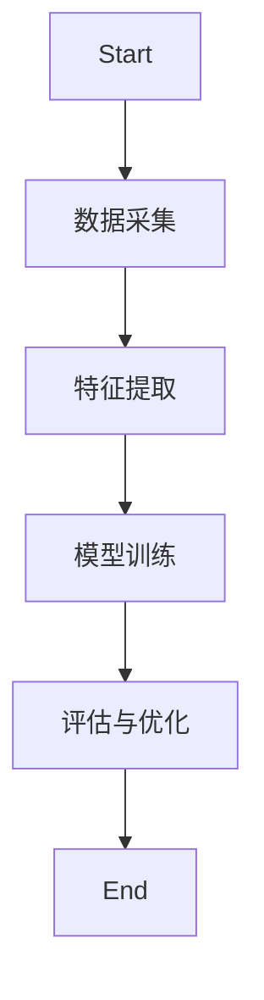
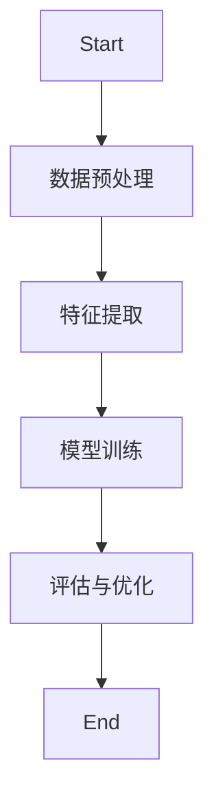
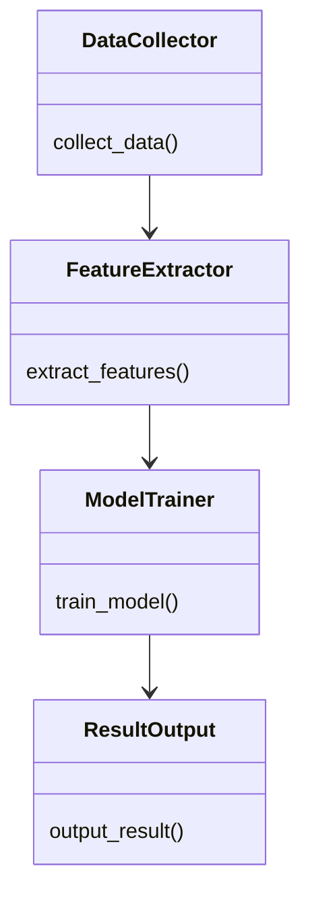
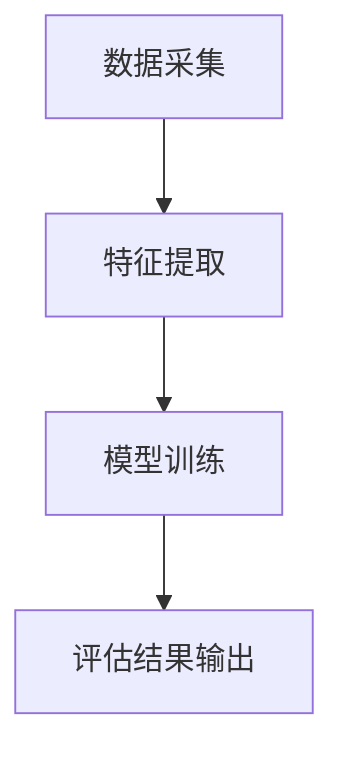
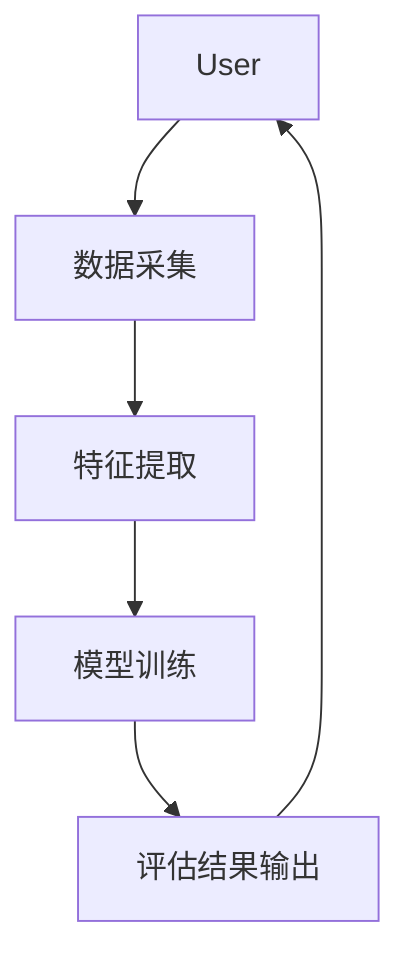

                 


# 智能化无形资产价值评估：多智能体AI的新方法

**关键词**：智能体系统、价值评估、无形资产、多智能体协作、AI算法

**摘要**：随着人工智能技术的快速发展，无形资产的价值评估变得越来越重要。传统的评估方法依赖于人工判断，存在效率低、误差大的问题。本文提出了一种基于多智能体AI的新方法，通过多个智能体的协同工作，实现对无形资产的智能化、精准化评估。本文详细介绍了多智能体AI的基本概念、核心算法、系统架构以及实际应用案例，为相关领域的研究和实践提供了新的思路和参考。

---

## 第1章：背景介绍与核心概念

### 1.1 问题背景与描述

无形资产是企业的重要组成部分，包括专利、商标、品牌价值、客户关系等。传统上，无形资产的评估主要依赖于人工分析和经验判断，这种方法不仅效率低下，而且容易受到主观因素的影响，导致评估结果的准确性不足。

随着人工智能技术的快速发展，利用AI技术进行无形资产评估的需求日益增长。多智能体AI（Multi-Agent AI）作为一种新兴的技术，通过多个智能体的协同工作，能够更高效、更准确地完成复杂的评估任务。

### 1.2 多智能体AI的基本概念

#### 1.2.1 多智能体系统的定义与特点

多智能体系统是由多个独立或协作的智能体组成的系统，这些智能体能够通过信息共享和协同决策完成特定任务。多智能体系统的优点包括：

- **分布式计算**：任务分解到多个智能体，提高计算效率。
- **协作性**：智能体之间通过协作完成复杂的任务。
- **鲁棒性**：单个智能体的故障不会导致整个系统崩溃。

#### 1.2.2 多智能体AI在无形资产评估中的优势

多智能体AI在无形资产评估中的优势主要体现在以下几个方面：

- **高效性**：通过分布式的计算和协作，大幅提高评估效率。
- **准确性**：多个智能体从不同角度进行分析，减少评估误差。
- **适应性**：能够根据实际情况动态调整评估策略。

#### 1.2.3 系统边界与外延

在无形资产评估中，多智能体AI系统需要考虑以下几个边界：

- **数据范围**：包括财务数据、市场数据、法律文件等。
- **智能体功能**：包括数据采集、特征提取、模型训练等。
- **协作范围**：智能体之间的协作范围和深度。

### 1.3 核心概念与联系

#### 1.3.1 实体关系图（ER图）分析

以下是多智能体AI系统的核心要素的ER图：

```mermaid
erDiagram
    customer[CUSTOMER] {
        id : int
        name : string
        }
    asset[ASSET] {
        id : int
        name : string
        value : float
        }
    agent[AGENT] {
        id : int
        name : string
        function : string
        }
    customer -> asset : owns
    agent -> asset : assesses
    agent -> customer : serves
```

#### 1.3.2 多智能体协作流程图（Mermaid）

以下是多智能体协作的流程图：



---

## 第2章：多智能体AI的核心原理

### 2.1 多智能体系统原理

#### 2.1.1 分布式智能与协同机制

多智能体系统的核心是分布式智能，即每个智能体都有一定的自主性，能够独立完成特定任务。通过协同机制，智能体之间可以共享信息、协调行动，完成复杂的任务。

#### 2.1.2 智能体之间的通信与协调

智能体之间的通信是通过消息传递完成的。消息的内容可以是数据、指令或状态更新。通过协调机制，智能体可以共同制定决策，确保任务的顺利进行。

#### 2.1.3 多智能体系统的稳定性与一致性

多智能体系统的稳定性是指系统在运行过程中不会发生崩溃或重大故障。一致性是指系统中的各个智能体在决策和行动上保持一致。

### 2.2 多智能体AI的算法基础

#### 2.2.1 分布式计算算法

分布式计算算法是多智能体系统的核心算法之一。以下是分布式计算的简单实现：

```python
def distributed_computation(tasks):
    agents = [Agent(i) for i in range(num_agents)]
    results = []
    for task in tasks:
        agent = agents[hash(task) % len(agents)]
        result = agent.compute(task)
        results.append(result)
    return results
```

#### 2.2.2 协作学习算法

协作学习算法通过智能体之间的协作，提高学习效果。以下是协作学习的简单实现：

```python
def collaborative_learning(agents, data):
    for agent in agents:
        agent.train(data)
    results = [agent.predict(data) for agent in agents]
    return results
```

#### 2.2.3 联合推理算法

联合推理算法通过多个智能体的推理结果，得出最终结论。以下是联合推理的简单实现：

```python
def joint_reasoning(agents, query):
    results = [agent.reason(query) for agent in agents]
    return results
```

### 2.3 算法原理与流程图

#### 2.3.1 算法流程图（Mermaid）

以下是多智能体AI算法的流程图：



#### 2.3.2 数学模型与公式

以下是多智能体AI中常用的数学模型：

- 分布式计算公式：
  $$ \sum_{i=1}^{n} w_i x_i $$
  
- 协作学习模型：
  $$ P(y|x) = \prod_{i=1}^{k} P(y|x_i) $$

- 联合推理公式：
  $$ Q(z|x) = \prod_{i=1}^{m} Q(z|x_i) $$

---

## 第3章：系统分析与架构设计

### 3.1 问题场景分析

#### 3.1.1 无形资产评估的典型场景

无形资产评估的典型场景包括：

- **专利评估**：评估专利的市场价值。
- **品牌价值评估**：评估品牌在市场上的价值。
- **客户关系评估**：评估客户关系的经济价值。

#### 3.1.2 多智能体AI的应用场景

多智能体AI在无形资产评估中的应用场景包括：

- **数据采集**：从多个来源采集数据。
- **特征提取**：提取数据的特征。
- **模型训练**：训练评估模型。
- **结果优化**：优化评估结果。

#### 3.1.3 系统需求分析

系统需求分析包括：

- **功能需求**：数据采集、特征提取、模型训练、评估结果输出。
- **性能需求**：高效性、准确性、可扩展性。
- **接口需求**：与外部系统的接口。

### 3.2 系统功能设计

#### 3.2.1 功能模块划分

功能模块包括：

- **数据采集模块**：从数据库、API等来源采集数据。
- **特征提取模块**：提取数据的特征。
- **模型训练模块**：训练评估模型。
- **评估结果输出模块**：输出评估结果。

#### 3.2.2 功能模块类图（Mermaid）

以下是功能模块的类图：



### 3.3 系统架构设计

#### 3.3.1 系统架构图（Mermaid）

以下是系统的架构图：



#### 3.3.2 接口设计与交互流程图（Mermaid）

以下是接口设计与交互流程图：



---

## 第4章：项目实战

### 4.1 环境安装与配置

#### 4.1.1 环境需求

- Python 3.8+
- NumPy、Pandas、Scikit-learn等库。

#### 4.1.2 安装依赖

```bash
pip install numpy pandas scikit-learn
```

### 4.2 核心代码实现

#### 4.2.1 数据采集模块

```python
import requests

def collect_data(url):
    response = requests.get(url)
    return response.json()
```

#### 4.2.2 特征提取模块

```python
import numpy as np

def extract_features(data):
    features = []
    for item in data:
        features.append([item['value'], item['category']])
    return np.array(features)
```

#### 4.2.3 模型训练模块

```python
from sklearn.model

