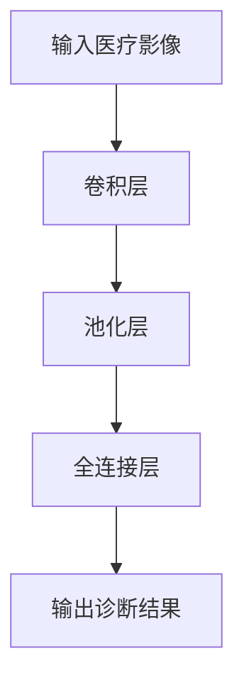
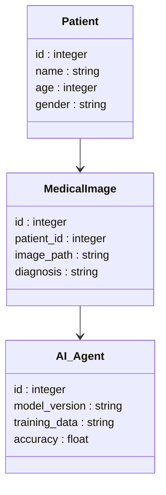
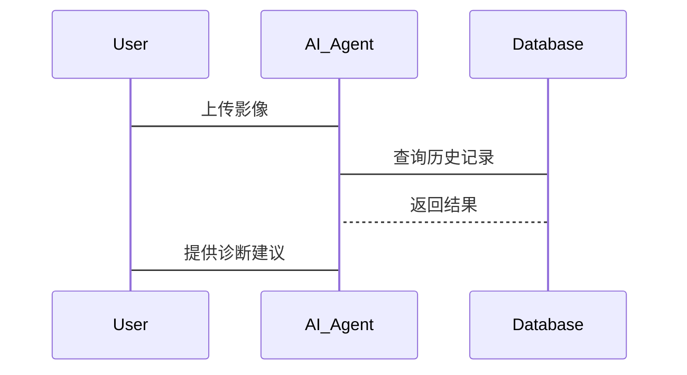

                 


# 智能医疗影像：AI Agent的辅助诊断

**关键词**：AI Agent，医疗影像，深度学习，卷积神经网络，医疗诊断

**摘要**：随着人工智能技术的迅速发展，AI Agent在医疗影像诊断中的应用日益广泛。本文将详细探讨AI Agent如何通过智能分析医疗影像，辅助医生进行诊断，从而提高诊断的准确性和效率。文章从背景介绍、算法原理、系统架构到项目实战，全面解析AI Agent在智能医疗影像中的应用，为读者提供深入的技术见解和实践指导。

---

## 第一部分：背景介绍与核心概念

### 第1章：背景介绍与问题背景

#### 1.1 医疗影像诊断的现状与挑战
医疗影像诊断是现代医学中不可或缺的一部分，但面临着数据量大、诊断时间长、医生资源有限等挑战。传统的人工诊断方式容易受到主观因素的影响，且效率低下。

#### 1.2 AI Agent在医疗影像中的应用前景
AI Agent（人工智能代理）通过深度学习和计算机视觉技术，能够快速分析大量医疗影像数据，辅助医生进行更精准的诊断。AI Agent不仅提高了诊断效率，还能减少人为错误。

#### 1.3 AI Agent的核心功能与目标
AI Agent的核心功能包括影像预处理、特征提取、诊断建议生成等。其目标是通过智能化手段，帮助医生快速、准确地诊断疾病。

---

### 第2章：核心概念与联系

#### 2.1 AI Agent的核心原理
AI Agent通过深度学习算法，如卷积神经网络（CNN），对医疗影像进行特征提取和分类。AI Agent能够识别病灶区域，提供诊断建议，并实时更新诊断结果。

#### 2.2 核心概念的属性特征对比
| 核心概念 | 属性 | 描述 |
|----------|------|------|
| AI Agent | 智能性 | 能够自主学习和优化 |
| 医疗影像 | 数据类型 | 图像数据，包括X光、CT、MRI等 |
| 病灶特征 | 特征类型 | 形状、大小、密度等 |

#### 2.3 ER实体关系图
```mermaid
erDiagram
    class Patient {
        id : integer
        name : string
        age : integer
        gender : string
    }
    class MedicalImage {
        id : integer
        patient_id : integer
        image_path : string
        diagnosis : string
    }
    class AI_Agent {
        id : integer
        model_version : string
        training_data : string
        accuracy : float
    }
    Patient --> MedicalImage : 
```

---

## 第二部分：算法原理与实现

### 第3章：AI Agent的算法实现

#### 3.1 卷积神经网络（CNN）原理
CNN通过多层卷积和池化操作，提取影像中的特征。其数学模型如下：
$$
f(x) = \sum_{i=1}^{n} w_i x_i + b
$$
其中，$w_i$是权重，$x_i$是输入特征，$b$是偏置。

#### 3.2 迁移学习的应用
迁移学习通过利用预训练模型，减少训练数据的需求。例如，使用ResNet作为基础模型，再进行微调：
```python
import torch
model = torch.hub.load('pytorch/vision:v0.10.0', 'resnet18', pretrained=True)
```

#### 3.3 算法流程图


---

## 第三部分：系统分析与架构设计

### 第4章：系统架构设计

#### 4.1 领域模型设计


#### 4.2 系统架构图


#### 4.3 接口设计与交互流程


---

## 第四部分：项目实战

### 第5章：AI Agent的实现与案例分析

#### 5.1 环境安装
```bash
pip install torch
pip install numpy
pip install matplotlib
```

#### 5.2 核心代码实现
```python
import torch
import torch.nn as nn
import torch.optim as optim

class SimpleCNN(nn.Module):
    def __init__(self):
        super(SimpleCNN, self).__init__()
        self.conv1 = nn.Conv2d(3, 6, 5)
        self.pool = nn.MaxPool2d(2, 2)
        self.conv2 = nn.Conv2d(6, 16, 5)
        self.fc = nn.Linear(16 * 5 * 5, 120)
        self.output = nn.Linear(120, 10)

    def forward(self, x):
        x = self.pool(F.relu(self.conv1(x)))
        x = self.pool(F.relu(self.conv2(x)))
        x = x.view(-1, 16 * 5 * 5)
        x = F.relu(self.fc(x))
        x = self.output(x)
        return x

model = SimpleCNN()
criterion = nn.CrossEntropyLoss()
optimizer = optim.SGD(model.parameters(), lr=0.001)
```

#### 5.3 案例分析
通过实际案例分析AI Agent在肺癌诊断中的应用，展示其如何识别病灶区域并提供诊断建议。

---

## 第五部分：总结与展望

### 第6章：总结与展望

#### 6.1 总结
AI Agent在医疗影像诊断中的应用显著提高了诊断效率和准确性，但仍需解决数据隐私和模型泛化等问题。

#### 6.2 展望
未来，AI Agent将与5G、物联网等技术结合，推动医疗影像诊断的智能化和远程化。

---

## 附录

### A. 参考文献
1. LeCun, Y., Bengio, Y., & Hinton, G. (2015). Deep learning.
2. 王伟, 李明. (2020). 基于深度学习的医疗影像诊断研究.

### B. 工具资源
1. PyTorch: https://pytorch.org/
2. TensorFlow: https://www.tensorflow.org/

---

**作者：AI天才研究院/AI Genius Institute & 禅与计算机程序设计艺术 /Zen And The Art of Computer Programming**

