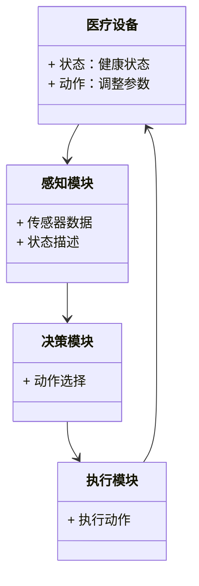
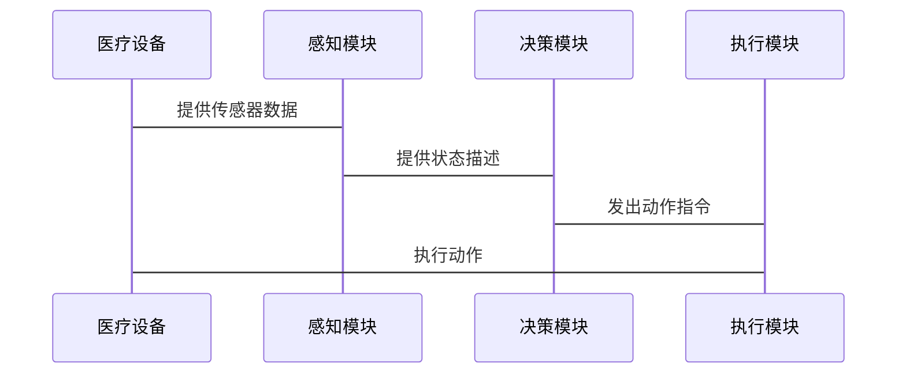

                 


# 智能医疗设备中的AI Agent控制系统

> 关键词：AI Agent, 智能医疗设备, 系统架构, 算法原理, 项目实战

> 摘要：本文深入探讨了AI Agent在智能医疗设备中的应用，详细分析了AI Agent的核心概念、算法原理、系统架构，并通过实际案例展示了AI Agent在医疗设备中的具体应用，最后总结了最佳实践和未来发展方向。

---

## 第一章: AI Agent与智能医疗设备概述

### 1.1 AI Agent的基本概念

#### 1.1.1 什么是AI Agent
AI Agent（人工智能代理）是一种能够感知环境、做出决策并采取行动以实现目标的智能体。它可以看作是一个软件实体，通过与环境交互来完成特定任务。

#### 1.1.2 AI Agent的核心特征
- **自主性**：能够在没有外部干预的情况下独立运作。
- **反应性**：能够根据环境的变化实时调整行为。
- **目标导向**：具有明确的目标，并采取行动以实现这些目标。
- **学习能力**：能够通过经验改进自己的性能。

#### 1.1.3 医疗设备智能化的必要性
随着医疗技术的飞速发展，传统的医疗设备逐渐向智能化方向转型。AI Agent的引入能够显著提升医疗设备的智能化水平，从而提高诊断和治疗的准确性。

---

### 1.2 智能医疗设备的发展趋势

#### 1.2.1 医疗设备智能化的驱动力
- **技术进步**：AI、大数据和物联网等技术的快速发展为医疗设备的智能化提供了技术支撑。
- **患者需求**：患者对个性化、精准化医疗服务的需求日益增长。
- **成本效益**：智能化医疗设备能够提高效率，降低医疗成本。

#### 1.2.2 AI技术在医疗设备中的应用现状
目前，AI Agent已经广泛应用于医疗影像分析、药物递送系统、智能手术机器人等领域。

#### 1.2.3 智能医疗设备的未来发展方向
未来，AI Agent在医疗设备中的应用将更加广泛，涵盖预防、诊断、治疗和康复等全生命周期。

---

### 1.3 AI Agent在医疗设备中的应用价值

#### 1.3.1 提高医疗设备的智能化水平
通过AI Agent，医疗设备能够实现更复杂的任务，例如实时监测患者状态并自动调整设备参数。

#### 1.3.2 优化医疗流程
AI Agent可以协助医生进行诊断，减少人为错误，提高医疗流程的效率。

#### 1.3.3 提升患者体验
智能化的医疗设备能够提供更个性化的医疗服务，提升患者的舒适度和满意度。

---

### 1.4 本章小结
本章介绍了AI Agent的基本概念及其在智能医疗设备中的应用价值，为后续章节的深入分析奠定了基础。

---

## 第二章: AI Agent的核心原理

### 2.1 AI Agent的感知与决策机制

#### 2.1.1 感知模块的功能与实现
感知模块负责收集环境中的信息，通常包括传感器数据和患者数据。这些数据通过AI算法进行处理，提取有用的特征。

#### 2.1.2 决策模块的算法选择
决策模块基于感知到的信息，利用强化学习、监督学习等算法生成决策。例如，可以使用Q-learning算法来优化决策策略。

#### 2.1.3 执行模块的实现方式
执行模块根据决策结果采取行动，例如调整设备参数或执行特定的操作。

---

### 2.2 AI Agent与医疗设备的结合

#### 2.2.1 医疗设备的智能化需求
医疗设备需要实时感知患者状态，并根据这些状态做出相应的调整。

#### 2.2.2 AI Agent在医疗设备中的具体应用
例如，在智能胰岛素泵中，AI Agent可以根据患者的血糖数据自动调整胰岛素的释放量。

#### 2.2.3 医疗设备与AI Agent的交互流程
1. 感知模块收集患者数据。
2. 决策模块基于数据生成决策。
3. 执行模块执行决策。

---

### 2.3 AI Agent系统的整体架构

#### 2.3.1 系统架构的分层设计
AI Agent系统通常分为感知层、决策层和执行层。

#### 2.3.2 各模块之间的关系
各模块通过通信协议进行交互，确保系统的高效运作。

#### 2.3.3 系统的可扩展性与灵活性
系统设计应考虑未来的扩展需求，例如增加新的传感器或算法。

---

### 2.4 本章小结
本章详细介绍了AI Agent的核心原理及其在医疗设备中的具体应用，为后续章节的系统设计奠定了理论基础。

---

## 第三章: AI Agent控制系统的算法原理

### 3.1 状态空间与动作空间

#### 3.1.1 状态空间的定义与表示
状态空间描述了系统可能的状态，通常用向量表示。

#### 3.1.2 动作空间的定义与表示
动作空间描述了系统可能采取的动作，通常用离散或连续的值表示。

#### 3.1.3 状态转移方程
$$P(s_{t+1}|a_t, s_t)$$
状态转移方程描述了当前状态、动作和下一个状态之间的关系。

---

### 3.2 感知模型的设计

#### 3.2.1 感知模型的输入与输出
感知模型的输入通常包括传感器数据，输出为环境的状态描述。

#### 3.2.2 感知模型的训练方法
通常使用深度学习模型，例如卷积神经网络（CNN）进行训练。

#### 3.2.3 感知模型的优化目标
$$\min_{\theta} \mathbb{E}_{(s,a)} [\text{损失函数}]$$
优化目标是通过最小化损失函数来提高模型的感知准确性。

---

### 3.3 决策

#### 3.3.1 决策模型的算法选择
常用算法包括Q-learning、深度强化学习（Deep RL）等。

#### 3.3.2 决策模型的训练流程
1. 初始化Q表或神经网络。
2. 与环境交互，收集经验。
3. 更新Q值或训练神经网络。
4. 重复步骤2和3直到收敛。

---

### 3.4 本章小结
本章详细讲解了AI Agent控制系统中的算法原理，包括状态空间、感知模型和决策模型的设计与实现。

---

## 第四章: 系统分析与架构设计方案

### 4.1 问题场景介绍

#### 4.1.1 系统需求
设计一个AI Agent控制系统，用于智能医疗设备的实时监控和参数调整。

#### 4.1.2 系统目标
实现设备的智能化控制，提高医疗效果和患者安全性。

---

### 4.2 项目介绍

#### 4.2.1 项目背景
本项目旨在开发一个基于AI Agent的智能医疗设备控制系统。

#### 4.2.2 项目目标
实现设备的智能化控制，提高医疗效果和患者安全性。

---

### 4.3 系统功能设计

#### 4.3.1 领域模型设计


---

### 4.4 系统架构设计

#### 4.4.1 系统架构图


---

### 4.5 系统接口设计

#### 4.5.1 接口定义
- 感知模块与医疗设备之间的接口。
- 决策模块与执行模块之间的接口。

---

### 4.6 系统交互流程图



---

### 4.7 本章小结
本章详细分析了AI Agent控制系统在智能医疗设备中的系统架构设计，包括功能设计、架构图和交互流程图。

---

## 第五章: 项目实战

### 5.1 环境安装

#### 5.1.1 系统要求
- 操作系统：Linux/Windows/MacOS
- 硬件要求：支持AI计算的硬件（如GPU）
- 软件要求：Python 3.6+, PyTorch, OpenCV

---

### 5.2 核心代码实现

#### 5.2.1 感知模块实现
```python
import torch
class PerceptionModel(torch.nn.Module):
    def __init__(self):
        super(PerceptionModel, self).__init__()
        self.conv = torch.nn.Conv2d(in_channels=3, out_channels=64, kernel_size=3, stride=1, padding=1)
        self.fc = torch.nn.Linear(64*3*3, 128)
    def forward(self, x):
        x = self.conv(x)
        x = x.view(-1, 64*3*3)
        x = self.fc(x)
        return x
```

---

#### 5.2.2 决策模块实现
```python
import torch
import torch.nn as nn
import torch.optim as optim
class DecisionModel(torch.nn.Module):
    def __init__(self):
        super(DecisionModel, self).__init__()
        self.fc1 = nn.Linear(128, 64)
        self.fc2 = nn.Linear(64, 1)
    def forward(self, x):
        x = torch.relu(self.fc1(x))
        x = torch.sigmoid(self.fc2(x))
        return x
# 训练过程
model = DecisionModel()
optimizer = optim.Adam(model.parameters(), lr=0.001)
criterion = nn.BCELoss()
for epoch in range(100):
    for inputs, labels in dataloaders:
        outputs = model(inputs)
        loss = criterion(outputs, labels)
        loss.backward()
        optimizer.step()
```

---

### 5.3 案例分析与实现解读
通过具体案例，如智能胰岛素泵，展示AI Agent控制系统在实际医疗设备中的应用。

---

### 5.4 项目总结
总结项目的实现过程，分析可能的优化方向，例如引入强化学习算法进一步优化决策模块。

---

## 第六章: 最佳实践与未来展望

### 6.1 小结
本文详细探讨了AI Agent在智能医疗设备中的应用，从理论到实践，全面分析了系统的各个方面。

### 6.2 注意事项
在实际应用中，需注意系统的安全性、可靠性和合规性。

### 6.3 拓展阅读
推荐相关领域的书籍和论文，供读者深入学习。

---

## 第七章: 作者简介

作者：AI天才研究院/AI Genius Institute & 禅与计算机程序设计艺术/Zen And The Art of Computer Programming

---

**摘要**  
本文深入探讨了AI Agent在智能医疗设备中的应用，详细分析了AI Agent的核心概念、算法原理、系统架构，并通过实际案例展示了AI Agent在医疗设备中的具体应用，最后总结了最佳实践和未来发展方向。

