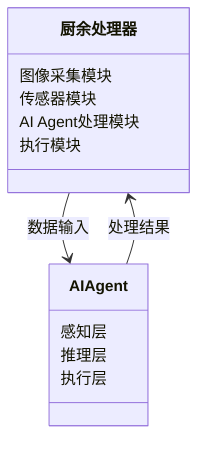
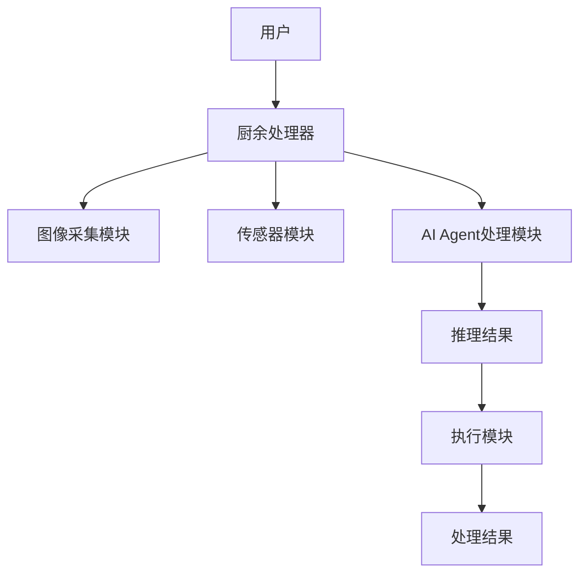
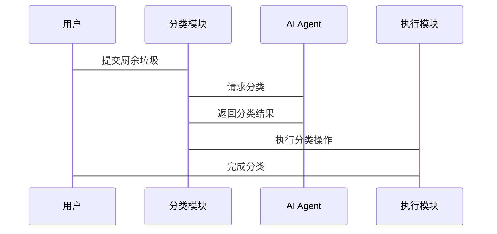
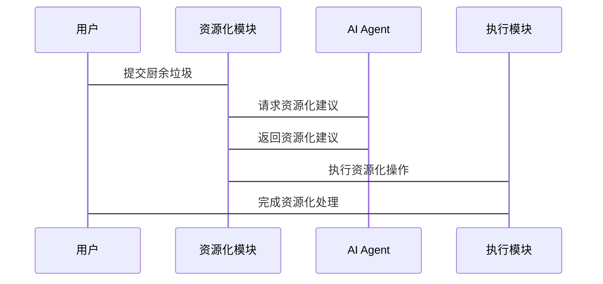

                 


# 智能厨余处理器：AI Agent的厨余再利用建议

> 关键词：智能厨余处理器，AI Agent，厨余再利用，资源化利用，垃圾分类，人工智能

> 摘要：本文探讨了智能厨余处理器如何利用AI Agent技术实现厨余垃圾的高效分类与资源化利用。通过分析AI Agent的核心概念、算法原理、系统架构设计及项目实战，本文旨在为读者提供一个全面的技术视角，展示如何通过人工智能技术解决厨余处理难题，实现资源的高效利用与环境保护。

---

## 第一部分: 智能厨余处理器的背景与概念

### 第1章: 智能厨余处理器的背景介绍

#### 1.1 问题背景
##### 1.1.1 厨余垃圾处理的现状与挑战
厨余垃圾是城市生活垃圾的重要组成部分，其处理问题日益严峻。传统厨余处理方式存在分类不准确、资源化利用率低、处理效率低下等问题。随着人工智能技术的快速发展，AI Agent（智能代理）作为一种新兴的技术手段，为厨余垃圾的高效分类与资源化利用提供了新的解决方案。

##### 1.1.2 当前厨余处理技术的局限性
传统的厨余处理技术主要依赖人工分类和简单的物理处理方法，存在以下问题：
- **分类效率低**：人工分类耗时耗力，容易出错。
- **资源化利用率低**：厨余垃圾中的有机物难以高效转化为可利用资源。
- **处理成本高**：传统处理方式需要大量人工参与，增加了处理成本。

##### 1.1.3 AI Agent在厨余处理中的应用潜力
AI Agent通过智能化的感知、推理和执行能力，可以实现厨余垃圾的精准分类、高效处理和资源化利用，从而提高处理效率，降低成本，并减少对环境的污染。

#### 1.2 问题描述
##### 1.2.1 厨余垃圾的分类与处理需求
厨余垃圾的分类是其资源化利用的前提。不同种类的厨余垃圾（如蔬菜、果皮、骨头等）需要通过精准的分类实现不同的处理方式。AI Agent可以通过图像识别、传感器数据采集等技术，实现厨余垃圾的智能分类。

##### 1.2.2 厨余资源化利用的目标与意义
厨余资源化利用的目标是将厨余垃圾转化为有价值的资源，如有机肥料、生物燃料等。这不仅可以减少厨余垃圾对环境的影响，还可以实现资源的循环利用，符合可持续发展的理念。

##### 1.2.3 AI Agent在厨余处理中的具体应用场景
AI Agent在厨余处理中的应用场景包括：
- 智能分类：通过图像识别技术，自动识别厨余垃圾的种类。
- 资源化建议：根据厨余垃圾的成分，提供最优的资源化利用方案。
- 过程监控：实时监控厨余处理过程，确保处理效率和安全性。

#### 1.3 问题解决
##### 1.3.1 AI Agent在厨余分类中的解决方案
AI Agent通过图像识别、机器学习等技术，实现厨余垃圾的精准分类。例如，利用卷积神经网络（CNN）对厨余垃圾进行图像分类，识别其种类并进行自动分拣。

##### 1.3.2 AI Agent在厨余资源化中的实现路径
AI Agent可以通过传感器数据采集、数据分析等技术，优化厨余资源化利用的过程。例如，通过实时监测厨余垃圾的湿度、温度等参数，优化堆肥过程，提高有机肥料的产量和质量。

##### 1.3.3 AI Agent在厨余处理中的技术优势
AI Agent在厨余处理中的技术优势包括：
- **高效性**：AI Agent可以快速识别和分类厨余垃圾，提高处理效率。
- **准确性**：通过机器学习算法，AI Agent可以实现精准的分类和资源化建议。
- **智能化**：AI Agent能够自主学习和优化，不断提升处理效率和资源化利用率。

#### 1.4 边界与外延
##### 1.4.1 AI Agent在厨余处理中的应用边界
AI Agent在厨余处理中的应用边界包括：
- **数据来源**：AI Agent依赖于传感器数据和图像数据，其性能受限于数据质量和数量。
- **处理场景**：AI Agent主要适用于厨余垃圾的分类和资源化利用，目前还无法处理复杂场景下的厨余处理问题。

##### 1.4.2 厨余处理与其他垃圾处理的关系
厨余处理是垃圾处理的重要组成部分，但与其他垃圾（如可回收物、有害垃圾）的处理存在协同关系。AI Agent可以通过多模态数据处理技术，实现多种垃圾的协同处理。

##### 1.4.3 AI Agent在厨余处理中的技术外延
AI Agent在厨余处理中的技术外延包括：
- **物联网技术**：通过物联网设备，实现厨余处理过程的实时监控和优化。
- **区块链技术**：通过区块链技术，实现厨余资源化利用的溯源和追踪。

#### 1.5 核心概念与组成
##### 1.5.1 智能厨余处理器的核心组成要素
智能厨余处理器的核心组成要素包括：
- **图像采集模块**：用于采集厨余垃圾的图像数据。
- **传感器模块**：用于采集厨余垃圾的物理参数（如湿度、温度）。
- **AI Agent处理模块**：用于对数据进行分析和处理，实现厨余垃圾的分类和资源化建议。
- **执行模块**：用于根据AI Agent的处理结果，执行相应的操作（如分类分拣、资源化处理）。

##### 1.5.2 AI Agent在厨余处理中的角色与功能
AI Agent在厨余处理中的角色与功能包括：
- **感知**：通过图像识别和传感器数据采集，感知厨余垃圾的状态。
- **推理**：通过机器学习算法，推理出厨余垃圾的种类和最佳处理方式。
- **执行**：根据推理结果，执行相应的操作（如分类分拣、资源化处理）。

##### 1.5.3 厨余处理器与AI Agent的协同关系
厨余处理器与AI Agent的协同关系体现在以下几个方面：
- **数据协同**：厨余处理器提供数据支持，AI Agent利用数据进行分析和处理。
- **功能协同**：AI Agent通过推理结果指导厨余处理器的执行操作。
- **优化协同**：AI Agent通过自主学习，不断优化厨余处理器的处理效率和资源化利用率。

---

## 第二部分: AI Agent的核心概念与原理

### 第2章: AI Agent的核心概念与原理

#### 2.1 AI Agent的定义与特点
##### 2.1.1 AI Agent的定义
AI Agent是一种能够感知环境、自主决策并执行任务的智能体。它通过与环境的交互，实现对目标的优化。

##### 2.1.2 AI Agent的核心特点
- **自主性**：AI Agent能够自主决策和执行任务，无需人工干预。
- **反应性**：AI Agent能够实时感知环境并做出反应。
- **学习能力**：AI Agent能够通过学习不断优化自身的处理能力。

##### 2.1.3 AI Agent与传统AI的区别
AI Agent与传统AI的区别在于其具备自主性和反应性，能够与环境进行实时交互并执行任务。

#### 2.2 AI Agent的原理
##### 2.2.1 感知与数据采集
AI Agent通过传感器、摄像头等设备采集环境中的数据，如图像、声音、温度等。

##### 2.2.2 数据分析与推理
AI Agent通过对采集到的数据进行分析和推理，得出相应的处理结果。例如，利用机器学习算法对图像数据进行分类，识别出厨余垃圾的种类。

##### 2.2.3 执行与反馈
AI Agent根据推理结果执行相应的操作，并通过反馈机制不断优化自身的处理能力。

#### 2.3 AI Agent的核心算法
##### 2.3.1 机器学习算法
- **支持向量机（SVM）**：用于分类任务，如厨余垃圾的种类识别。
- **随机森林**：用于回归和分类任务，适用于数据量较大的场景。

##### 2.3.2 深度学习算法
- **卷积神经网络（CNN）**：用于图像分类，如厨余垃圾的图像识别。
- **长短期记忆网络（LSTM）**：用于时间序列数据的处理，如厨余垃圾处理过程的动态优化。

##### 2.3.3 数学模型与公式
###### 2.3.3.1 分类模型
$$ \text{分类概率} = \sigma(w \cdot x + b) $$
其中，$w$ 是权重向量，$x$ 是输入特征向量，$b$ 是偏置项，$\sigma$ 是sigmoid函数。

###### 2.3.3.2 回归模型
$$ y = \beta_0 + \beta_1 x_1 + \beta_2 x_2 + \ldots + \beta_n x_n $$
其中，$y$ 是预测目标，$x_i$ 是输入特征，$\beta_i$ 是回归系数。

#### 2.4 AI Agent的应用场景
##### 2.4.1 厨余垃圾分类
AI Agent通过图像识别技术，实现厨余垃圾的精准分类。例如，利用CNN对厨余垃圾的图像进行分类，识别其种类并进行自动分拣。

##### 2.4.2 资源化利用优化
AI Agent通过传感器数据采集和数据分析，优化厨余垃圾的资源化利用过程。例如，通过实时监测堆肥过程中的湿度和温度，优化堆肥参数，提高有机肥料的产量和质量。

##### 2.4.3 过程监控与优化
AI Agent通过实时监控厨余处理过程中的各项指标，优化处理流程，提高处理效率和资源化利用率。

---

## 第三部分: 智能厨余处理器的系统架构设计

### 第3章: 智能厨余处理器的系统架构设计

#### 3.1 系统功能设计
##### 3.1.1 领域模型


##### 3.1.2 系统架构


#### 3.2 系统接口设计
##### 3.2.1 数据接口
- **图像接口**：用于传输厨余垃圾的图像数据。
- **传感器接口**：用于传输厨余垃圾的物理参数（如湿度、温度）。

##### 3.2.2 控制接口
- **分类控制接口**：用于控制分类模块的执行。
- **资源化控制接口**：用于控制资源化处理模块的执行。

#### 3.3 系统交互设计
##### 3.3.1 分类交互流程


##### 3.3.2 资源化交互流程


---

## 第四部分: 项目实战

### 第4章: 智能厨余处理器的项目实战

#### 4.1 环境安装
##### 4.1.1 安装Python环境
- 安装Python 3.8或更高版本。
- 安装Jupyter Notebook或其他开发工具。

##### 4.1.2 安装AI Agent开发框架
- 安装TensorFlow或PyTorch框架。
- 安装OpenCV等图像处理库。

#### 4.2 核心代码实现
##### 4.2.1 图像分类代码
```python
import tensorflow as tf
from tensorflow.keras import layers

# 定义卷积神经网络模型
model = tf.keras.Sequential([
    layers.Conv2D(32, (3, 3), activation='relu', input_shape=(224, 224, 3)),
    layers.MaxPooling2D((2, 2)),
    layers.Conv2D(64, (3, 3), activation='relu'),
    layers.MaxPooling2D((2, 2)),
    layers.Flatten(),
    layers.Dense(128, activation='relu'),
    layers.Dense(10, activation='softmax')
])

# 编译模型
model.compile(optimizer='adam', loss='sparse_categorical_crossentropy', metrics=['accuracy'])

# 训练模型
model.fit(x_train, y_train, epochs=10, batch_size=32)
```

##### 4.2.2 资源化建议代码
```python
import numpy as np

# 定义资源化建议函数
def resource_recommendation(waste_type):
    if waste_type == '蔬菜':
        return '堆肥'
    elif waste_type == '果皮':
        return '生物降解'
    else:
        return '其他处理'
```

#### 4.3 案例分析
##### 4.3.1 案例一：蔬菜分类
- **输入**：一张蔬菜图像。
- **处理**：AI Agent通过图像分类算法识别出蔬菜的种类。
- **输出**：分类结果为“蔬菜”，并将其分拣到蔬菜收集箱中。

##### 4.3.2 案例二：果皮资源化
- **输入**：一堆果皮垃圾。
- **处理**：AI Agent通过传感器数据采集和数据分析，优化果皮的堆肥过程。
- **输出**：生成高质量的有机肥料。

#### 4.4 项目小结
通过项目实战，我们可以看到AI Agent在厨余处理器中的应用潜力。通过图像分类、资源化建议等功能，AI Agent能够显著提高厨余垃圾的处理效率和资源化利用率。

---

## 第五部分: 总结与展望

### 第5章: 总结与展望

#### 5.1 最佳实践
- **数据质量**：确保数据的准确性和完整性，提高AI Agent的分类和推理能力。
- **模型优化**：通过不断优化模型参数和算法，提高AI Agent的处理效率和准确性。

#### 5.2 小结
本文详细介绍了智能厨余处理器的背景、核心概念、算法原理、系统架构设计及项目实战。通过AI Agent技术的应用，智能厨余处理器能够实现厨余垃圾的精准分类和高效资源化利用，为环境保护和资源循环利用提供了新的解决方案。

#### 5.3 注意事项
- **数据隐私**：在实际应用中，需要注意数据隐私问题，确保用户数据的安全性。
- **系统维护**：定期维护和更新系统，确保AI Agent的处理能力不断提升。

#### 5.4 拓展阅读
- **推荐书籍**：《深度学习》（Deep Learning）—— Ian Goodfellow等著。
- **推荐论文**：《ImageNet Large Scale Visual Recognition Challenge》—— Alex Krizhevsky等著。

---

## 作者信息

作者：AI天才研究院/AI Genius Institute & 禅与计算机程序设计艺术/Zen And The Art of Computer Programming

---

以上是《智能厨余处理器：AI Agent的厨余再利用建议》的技术博客文章大纲及内容。希望对您有所帮助！

