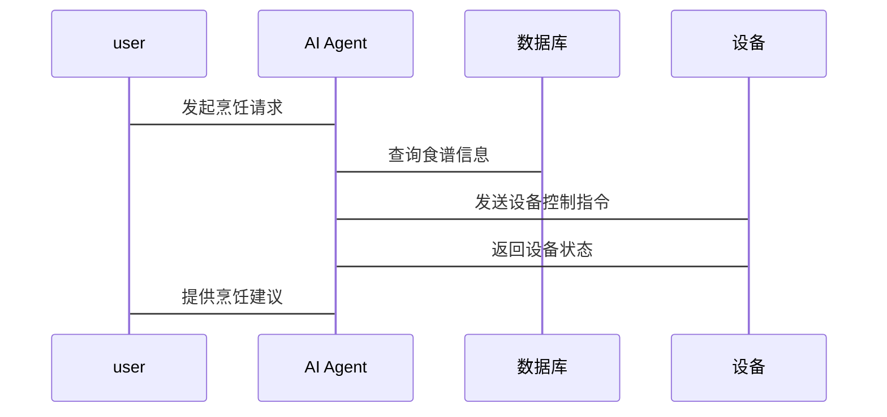

                 


# 智能厨具：AI Agent的烹饪指导系统

## 关键词：
智能厨具，AI Agent，烹饪指导，人工智能，自然语言处理，计算机视觉，知识图谱

## 摘要：
随着人工智能技术的飞速发展，智能厨具逐渐成为现代厨房的重要组成部分。AI Agent作为智能厨具的核心技术，能够通过自然语言处理、计算机视觉和知识图谱等技术，为用户提供智能化的烹饪指导。本文将详细介绍AI Agent在烹饪指导中的应用，探讨其背后的数学模型和算法原理，并通过实际案例展示其在智能厨具中的具体实现。文章最后将总结AI Agent在智能厨具中的最佳实践和未来发展方向。

---

# 第1章: 智能厨具与AI Agent的背景与概念

## 1.1 智能厨具的定义与现状
### 1.1.1 智能厨具的定义
智能厨具是指集成人工智能技术，能够通过传感器、摄像头和语音交互等手段，实现自动化烹饪、食材识别和烹饪指导的厨房设备。其核心在于将传统厨具与智能技术相结合，提升用户的烹饪体验。

### 1.1.2 智能厨具的发展历程
从最初的单一功能智能厨具（如智能电饭煲）到如今的多功能集成设备（如智能厨房助手），智能厨具经历了从单一功能到多功能集成的发展过程。

### 1.1.3 当前智能厨具的市场现状
当前，智能厨具市场增长迅速，主要厂商包括Google Nest、iRobot、美的、海尔等。市场主要集中在智能家电领域，未来将向智能化、个性化和健康化方向发展。

## 1.2 AI Agent的核心概念
### 1.2.1 AI Agent的基本定义
AI Agent是一种能够感知环境、执行任务的智能体，能够在复杂环境中自主决策并完成目标。在智能厨具中，AI Agent主要用于烹饪指导、食材推荐和设备控制。

### 1.2.2 AI Agent的分类与特点
AI Agent可以分为基于规则的Agent和基于学习的Agent。基于规则的Agent依赖预定义的规则，适用于简单任务；基于学习的Agent通过机器学习算法不断优化决策，适用于复杂场景。

### 1.2.3 AI Agent在智能厨具中的应用前景
AI Agent在智能厨具中的应用前景广阔，能够实现个性化的烹饪推荐、智能设备控制和健康饮食管理。未来，AI Agent将更加智能化，能够根据用户的口味和健康需求，自动调整烹饪方案。

## 1.3 智能厨具与AI Agent的结合
### 1.3.1 智能厨具与AI Agent的协同工作原理
AI Agent通过传感器和摄像头获取烹饪环境的数据，结合用户输入的需求，生成个性化的烹饪建议和操作步骤。用户可以通过语音或触控界面与AI Agent交互，完成烹饪过程。

### 1.3.2 AI Agent在烹饪指导中的具体应用
AI Agent可以实现食谱推荐、步骤指导、食材识别和健康建议。例如，AI Agent可以根据用户的食材库存推荐适合的食谱，并通过语音指导用户完成每一步操作。

### 1.3.3 智能厨具与AI Agent的未来发展
未来，智能厨具与AI Agent的结合将更加紧密，烹饪过程将更加智能化和个性化。AI Agent将通过不断学习用户的行为和偏好，提供更加精准的烹饪指导。

---

# 第2章: AI Agent的核心原理与技术

## 2.1 自然语言处理在AI Agent中的应用
### 2.1.1 NLP技术的基本原理
自然语言处理（NLP）是AI Agent实现语音交互和文本理解的核心技术。通过NLP，AI Agent能够理解用户的意图并生成自然语言回复。

### 2.1.2 NLP在烹饪指导中的具体应用
在烹饪指导中，NLP技术用于实现用户的语音输入处理和烹饪步骤的文本生成。例如，用户可以通过语音输入“我想要做一道意大利面”，AI Agent通过NLP技术理解用户的需求，并生成相应的烹饪步骤。

### 2.1.3 常见的NLP模型与工具
常用的NLP模型包括BERT、GPT和Transformer等。这些模型可以通过预训练和微调，实现高效的文本理解和生成。

## 2.2 计算机视觉在AI Agent中的应用
### 2.2.1 计算机视觉的基本原理
计算机视觉（CV）通过图像处理和模式识别，实现对视觉场景的理解和分析。在烹饪指导中，CV技术用于食材识别和烹饪过程的监控。

### 2.2.2 CV在烹饪中的具体应用
AI Agent可以通过摄像头捕捉用户的烹饪过程，识别食材的状态和烹饪进度。例如，AI Agent可以通过图像识别判断烤鱼是否熟透，并提醒用户翻面。

### 2.2.3 常见的CV模型与工具
常用的CV模型包括YOLO、Faster R-CNN和OpenCV等。这些模型和工具可以帮助AI Agent实现高效的图像处理和分析。

## 2.3 知识图谱与推理
### 2.3.1 知识图谱的基本概念
知识图谱是一种结构化的知识表示方式，能够描述实体之间的关系和属性。在烹饪指导中，知识图谱用于存储食谱信息和烹饪步骤。

### 2.3.2 知识图谱在烹饪指导中的应用
AI Agent可以通过知识图谱推理用户的需求，例如，当用户提到“我想做一道清淡的菜品”，AI Agent可以根据知识图谱推荐低盐低脂的食谱。

### 2.3.3 基于知识图谱的推理算法
基于知识图谱的推理算法包括规则推理和基于向量的推理。这些算法可以帮助AI Agent实现复杂场景下的决策和推荐。

---

# 第3章: AI Agent的数学模型与算法原理

## 3.1 概率模型与推荐算法
### 3.1.1 概率模型的基本原理
概率模型通过概率分布描述数据的不确定性，常用于推荐系统的个性化建模。

### 3.1.2 基于概率的推荐算法
基于概率的推荐算法包括协同过滤和矩阵分解。例如，协同过滤通过用户行为数据构建相似性矩阵，推荐相似的食谱。

### 3.1.3 烹饪推荐系统的数学模型
$$推荐概率 = \sum_{i=1}^{n} \theta_i \cdot x_i$$
其中，$\theta_i$是用户偏好向量，$x_i$是食谱特征向量。

## 3.2 基于深度学习的自然语言处理模型
### 3.2.1 Transformer模型的基本原理
Transformer模型通过自注意力机制实现高效的文本理解和生成。

### 3.2.2 BERT模型在烹饪指导中的应用
BERT模型可以通过微调实现烹饪相关的文本分类和生成任务。

### 3.2.3 模型训练与优化的数学公式
$$\text{损失函数} = \text{交叉熵损失} = -\sum_{i=1}^{n} y_i \log(p_i)$$
其中，$y_i$是真实标签，$p_i$是模型预测概率。

## 3.3 基于强化学习的烹饪决策系统
### 3.3.1 强化学习的基本原理
强化学习通过智能体与环境的交互，学习最优决策策略。

### 3.3.2 强化学习在烹饪决策中的应用
AI Agent可以通过强化学习优化烹饪步骤和火候控制，例如，在炒菜过程中，AI Agent学习何时翻炒和调味以达到最佳口感。

### 3.3.3 强化学习算法的数学模型
$$Q(s, a) = r + \gamma \max_{a'} Q(s', a')$$
其中，$s$是当前状态，$a$是动作，$r$是奖励，$\gamma$是折扣因子。

---

# 第4章: 智能厨具与AI Agent的系统架构设计

## 4.1 系统功能设计
### 4.1.1 用户需求分析
用户需求包括个性化食谱推荐、实时烹饪指导和智能设备控制。

### 4.1.2 系统功能模块划分
系统功能模块包括用户输入模块、烹饪推荐模块、设备控制模块和反馈优化模块。

### 4.1.3 功能模块的交互流程
用户输入需求 → 烹饪推荐模块生成食谱 → 设备控制模块执行操作 → 反馈优化模块收集反馈并优化推荐算法。

## 4.2 系统架构设计
### 4.2.1 分层架构设计
系统架构分为感知层、决策层和执行层。感知层负责数据采集，决策层负责推荐和决策，执行层负责设备控制。

### 4.2.2 微服务架构设计
系统采用微服务架构，包括用户服务、推荐服务、设备控制服务和数据服务。

### 4.2.3 系统架构的优缺点分析
分层架构便于模块化开发，微服务架构具有良好的扩展性和灵活性。

## 4.3 系统接口设计
### 4.3.1 系统内部接口设计
系统内部接口包括用户输入接口、数据存储接口和设备控制接口。

### 4.3.2 系统外部接口设计
系统外部接口包括用户界面接口和第三方服务接口（如食材数据库）。

### 4.3.3 系统交互的Mermaid序列图


---

# 第5章: 项目实战

## 5.1 环境搭建
### 5.1.1 开发工具安装
安装Python、TensorFlow、Keras和相关库。

### 5.1.2 数据集准备
收集和整理烹饪相关的数据集，包括食材信息、食谱数据和用户反馈。

## 5.2 系统核心实现源代码
### 5.2.1 AI Agent的实现
```python
class AIAgent:
    def __init__(self):
        self.nlp_model = NLPModel()
        self.cv_model = CVModel()
        self.knowledge_base = KnowledgeBase()
```

### 5.2.2 推荐算法实现
```python
def推荐食谱(user_input):
    食谱列表 = 数据库查询(user_input)
    推荐结果 = 排序(食谱列表, 用户偏好)
    return 推荐结果
```

### 5.2.3 设备控制实现
```python
def 控制设备(指令):
    设备.send指令(指令)
    返回设备状态
```

## 5.3 代码应用解读与分析
### 5.3.1 代码结构分析
代码分为模型训练、数据处理和系统实现三部分。

### 5.3.2 代码实现细节
详细分析每部分代码的功能和实现方式，例如NLP模型的训练、CV模型的应用等。

## 5.4 实际案例分析和详细讲解剖析
### 5.4.1 案例背景介绍
以制作一道意大利面为例，展示AI Agent如何指导用户完成烹饪过程。

### 5.4.2 烹饪过程中的AI Agent交互
用户输入需求 → AI Agent生成步骤 → 用户执行操作 → AI Agent提供反馈。

## 5.5 项目小结
总结项目实现的关键点和难点，提出改进建议。

---

# 第6章: 最佳实践 tips、小结、注意事项、拓展阅读

## 6.1 最佳实践 tips
### 6.1.1 系统设计建议
建议采用模块化设计，便于后续维护和扩展。

### 6.1.2 代码实现建议
建议使用开源库和框架，减少重复造轮子。

## 6.2 小结
本文详细介绍了智能厨具与AI Agent的结合，探讨了其背后的原理和技术，并通过实际案例展示了系统的实现。

## 6.3 注意事项
在实际应用中，需要注意数据隐私和设备安全问题，确保用户数据的安全性。

## 6.4 拓展阅读
推荐阅读相关领域的书籍和论文，例如《深度学习》、《自然语言处理实战》等。

---

# 作者：AI天才研究院/AI Genius Institute & 禅与计算机程序设计艺术 /Zen And The Art of Computer Programming

---

以上是《智能厨具：AI Agent的烹饪指导系统》的完整目录和各章节内容，涵盖了从背景介绍到系统实现的全过程。希望这篇文章能为读者提供清晰的思路和实用的知识。

