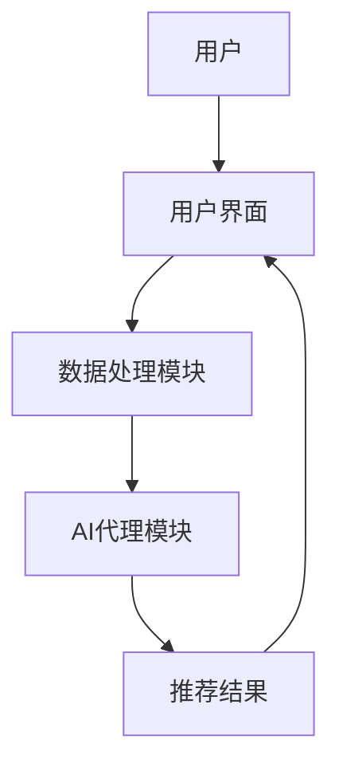

                 


# 智能厨房助手：AI Agent的营养均衡膳食规划

---

## 关键词：
智能厨房助手、AI Agent、营养均衡、膳食规划、人工智能、健康饮食

---

## 摘要：
在现代生活中，营养均衡的膳食规划对于维护健康至关重要。然而，许多人因时间不足、知识缺乏或选择过多而难以实现这一目标。智能厨房助手作为一种结合AI技术的创新解决方案，能够根据用户的饮食需求、健康状况和食材库存，自动推荐营养均衡的菜谱。本文将从背景、原理到实践，全面解析智能厨房助手的营养均衡膳食规划技术，探讨其在现代生活中的应用价值。

---

## 正文

---

## 第一部分：智能厨房助手的背景与概念

---

### 第1章：问题背景与现状

#### 1.1 营养均衡膳食规划的重要性

现代人的生活方式日益快节奏，许多人面临饮食不规律、营养失衡的问题。营养失衡可能导致多种健康问题，如肥胖、糖尿病、心血管疾病等。因此，科学规划膳食，确保每日摄入的营养均衡，已成为现代人健康生活的关键。

#### 1.2 智能厨房助手的提出

传统厨房工具仅限于辅助烹饪，而智能厨房助手通过结合AI技术，能够提供智能化的膳食规划服务。AI Agent（人工智能代理）能够根据用户的需求、食材库存和健康状况，实时推荐营养均衡的菜谱，从而帮助用户实现健康饮食。

#### 1.3 本章小结

本章介绍了营养均衡膳食规划的重要性，并提出了智能厨房助手的概念，强调了AI技术在厨房场景中的应用潜力。

---

## 第二部分：AI Agent与营养均衡膳食规划的核心概念

---

### 第2章：AI Agent的基本原理

#### 2.1 AI Agent的定义与特点

AI Agent是一种能够感知环境、自主决策并执行任务的智能实体。其核心特点包括：

- **自主性**：能够在无外部干预的情况下运行。
- **反应性**：能够实时感知环境并做出响应。
- **学习能力**：通过数据和反馈不断优化自身行为。

#### 2.2 营养均衡膳食规划的数学模型

营养均衡膳食规划可以通过数学模型来描述。假设用户每日需要摄入的营养素包括蛋白质、碳水化合物、脂肪、维生素和矿物质等，模型可以通过线性组合的方式进行优化：

$$
\text{目标函数} = \sum_{i=1}^{n} a_i x_i
$$

其中，$a_i$是营养素的权重，$x_i$是食材中的营养素含量。

#### 2.3 AI Agent与膳食规划的结合

AI Agent通过以下步骤实现膳食规划：

1. **数据采集**：收集用户的饮食需求（如口味偏好、过敏情况）和食材库存。
2. **需求分析**：分析用户的营养需求，生成初步的膳食计划。
3. **菜谱生成**：根据需求匹配食材，推荐营养均衡的菜谱。
4. **优化调整**：根据用户反馈不断优化推荐结果。

#### 2.4 核心概念对比表

| 概念         | 属性       | 描述                                   |
|--------------|------------|--------------------------------------|
| AI Agent     | 输入       | 用户需求、食材库存                   |
| 营养均衡模型 | 目标函数   | 最小化营养失衡，最大化健康指数         |

---

## 第三部分：智能厨房助手的系统分析与设计

---

### 第3章：系统分析与架构设计

#### 3.1 问题场景介绍

智能厨房助手需要解决以下问题：

- 如何获取用户的饮食需求？
- 如何分析食材库存并生成菜谱？
- 如何优化推荐结果以满足用户需求？

#### 3.2 系统功能设计

系统功能模块包括：

1. **用户界面**：供用户输入需求和查看推荐菜谱。
2. **数据处理模块**：处理食材库存和用户需求。
3. **AI代理模块**：负责膳食规划和菜谱推荐。

#### 3.3 系统架构图



---

## 第四部分：智能厨房助手的项目实战

---

### 第4章：环境安装与核心实现

#### 4.1 环境安装

需要安装以下工具和库：

- Python 3.8+
- NumPy
- Pandas
- Scikit-learn

#### 4.2 核心实现代码

```python
def generate_meal_plan(userPreferences, inventory):
    # 数据预处理
    nutrients = calculate_nutrients(inventory)
    # 生成推荐菜谱
    recommendations = optimize_recipe(userPreferences, nutrients)
    return recommendations
```

#### 4.3 实际案例分析

假设用户偏好是“低脂高蛋白”，食材库存包括鸡胸肉、西兰花、糙米。系统会推荐鸡胸肉炒西兰花和糙米作为主食。

---

## 第五部分：智能厨房助手的最佳实践

---

### 第5章：总结与建议

#### 5.1 本章小结

智能厨房助手通过AI Agent实现了营养均衡的膳食规划，为现代人提供了便捷的健康饮食解决方案。

#### 5.2 注意事项

- 数据隐私保护是系统设计的重要考虑因素。
- 系统需要定期更新食材数据库和营养模型。

#### 5.3 拓展阅读

建议读者深入学习AI代理的算法优化和营养学的数学建模。

---

## 作者：AI天才研究院 & 禅与计算机程序设计艺术

---

通过本文的详细分析，读者可以全面了解智能厨房助手的营养均衡膳食规划技术，并将其应用于实际生活中。

