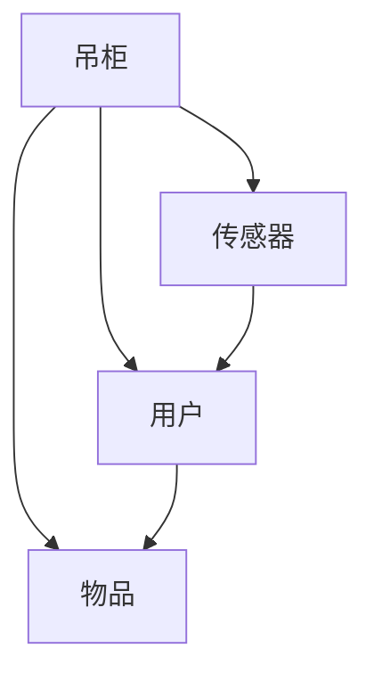
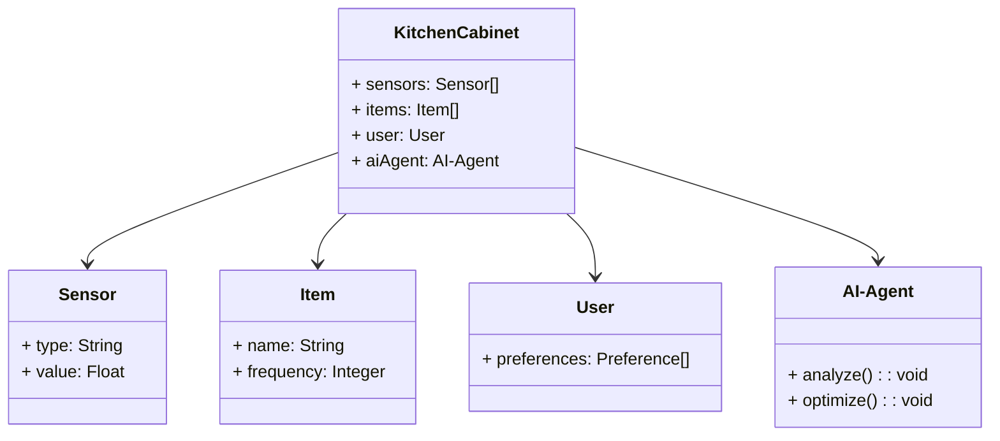
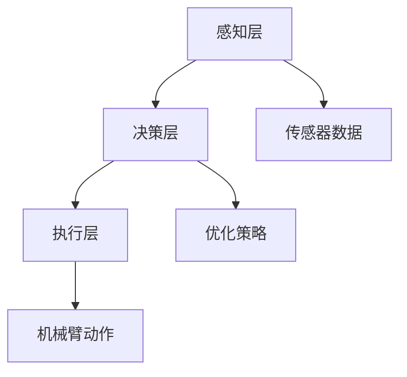
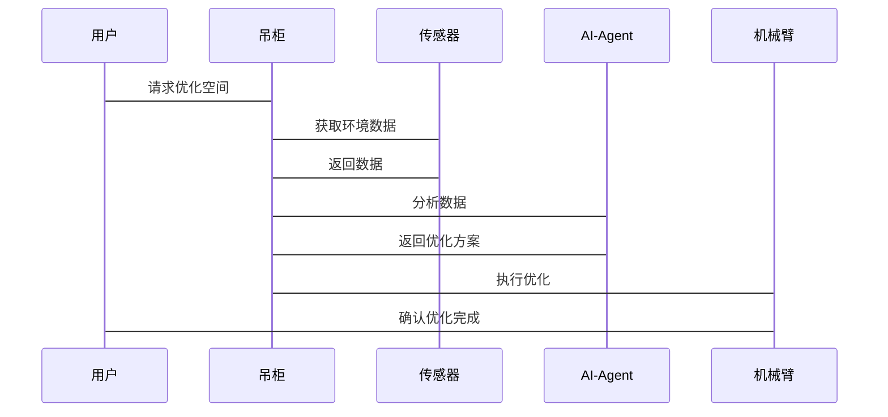

                 


# 智能厨房吊柜：AI Agent的厨房空间利用建议

> 关键词：智能厨房吊柜、AI Agent、空间优化、路径规划、智能家居、物联网

> 摘要：本文详细探讨了AI Agent在智能厨房吊柜中的应用，分析了厨房空间利用的优化策略，从背景介绍到系统架构设计，再到项目实战，全面解析了如何通过AI技术提升厨房空间的使用效率。

---

## 第一部分：背景介绍

### 第1章：智能厨房吊柜的背景与问题描述

#### 1.1 智能厨房吊柜的发展背景

随着智能家居的普及，厨房作为家庭生活的重要空间，其功能性和效率的提升备受关注。传统的厨房吊柜在设计上较为单一，主要功能是储物，而随着家庭成员增多和厨房设备的增加，如何高效利用有限的厨房空间成为亟待解决的问题。

AI Agent（智能代理）作为一种能够感知环境、自主决策的技术，逐渐被应用于智能家居领域。通过AI Agent，厨房吊柜能够根据用户行为和厨房物品的使用频率，动态调整储物空间，优化空间利用效率。

#### 1.2 问题背景与描述

厨房空间有限性问题是现代家庭面临的主要挑战之一。传统吊柜的空间利用往往固定，无法根据实际需求进行调整。例如，经常使用的物品可能被放置在难以够到的位置，而不太常用的物品占据了宝贵的空间。

此外，用户行为的多样性也增加了空间优化的复杂性。不同家庭成员的使用习惯不同，如何在有限的空间内满足多样化的储物需求，是厨房设计中的难点。

#### 1.3 问题解决与边界定义

AI Agent通过感知环境、分析数据和自主决策，能够实时优化厨房空间的利用。例如，AI Agent可以根据用户的使用频率调整储物顺序，将常用物品放置在易于取放的位置，同时将不常用的物品归类到其他区域。

为了明确AI Agent的应用范围和边界，我们需要定义以下几点：

- **功能边界**：AI Agent仅负责优化厨房吊柜内部的空间利用，不涉及其他厨房设备。
- **数据边界**：仅处理吊柜内部的传感器数据和用户行为数据。
- **决策边界**：AI Agent的决策仅限于储物空间的调整，不涉及厨房设备的操作。

#### 1.4 概念结构与核心要素

智能厨房吊柜的优化模型由以下核心要素组成：

1. **感知模块**：通过传感器获取厨房环境数据，包括温度、湿度、光线等。
2. **决策模块**：基于感知数据和用户行为，制定储物优化策略。
3. **执行模块**：通过机械臂或智能硬件执行决策模块的指令。

---

## 第二部分：核心概念与联系

### 第2章：AI Agent在厨房空间优化中的原理与机制

#### 2.1 AI Agent的基本原理

AI Agent是一种能够感知环境、自主决策并执行任务的智能系统。在厨房吊柜中，AI Agent通过以下步骤实现空间优化：

1. **感知环境**：通过内置传感器收集厨房环境数据，包括物品的位置、数量和使用频率。
2. **分析数据**：利用机器学习算法分析数据，识别用户行为模式。
3. **制定策略**：根据分析结果生成储物优化方案。
4. **执行决策**：通过机械臂调整物品位置，优化空间利用。

#### 2.2 AI Agent与厨房空间优化的关系

为了更好地理解AI Agent与厨房空间优化的关系，我们可以从以下三个维度进行对比分析：

| **维度**       | **传统吊柜**                     | **AI吊柜**                        |
|----------------|----------------------------------|-----------------------------------|
| **感知能力**   | 无感知                           | 具备环境感知能力                   |
| **决策能力**   | 固定存储模式                     | 动态优化存储策略                   |
| **用户交互**   | 手动调整                       | 自动化调整，支持语音/手机控制      |

此外，我们可以通过Mermaid图展示吊柜、传感器、用户和物品之间的关系：



---

## 第三部分：算法原理

### 第3章：路径规划算法的实现与优化

#### 3.1 A*算法原理

在厨房吊柜的空间优化中，路径规划是一个关键问题。为了高效移动机械臂，我们采用A*算法进行路径规划。

**A*算法步骤**：

1. **初始化**：设置起点和目标点。
2. **生成邻居节点**：遍历当前节点的所有邻居。
3. **评估优先级**：使用启发函数评估每个节点的优先级。
4. **选择优先级最高的节点**：从优先队列中取出优先级最高的节点。
5. **检查是否到达目标**：如果到达目标，返回路径；否则，继续探索邻居节点。

**A*算法的优先级评估公式**：

$$f(n) = g(n) + h(n)$$

其中，$g(n)$表示从起点到节点$n$的已知成本，$h(n)$表示从节点$n$到目标的估计成本。

#### 3.2 A*算法实现

以下是A*算法的Python实现示例：

```python
import heapq

def a_star_search(grid, start, goal):
    open PriorityQueue = []
    heapq.heappush(open PriorityQueue, (0, start))
    came_from = {}
    cost_so_far = {}

    came_from[start] = None
    cost_so_far[start] = 0

    while open PriorityQueue:
        current = heapq.heappop(open PriorityQueue)
        current_cost = cost_so_far[current[1]]

        if current[1] == goal:
            break

        for neighbor in grid.get_neighbors(current[1]):
            new_cost = current_cost + grid.movement_cost(current[1], neighbor)

            if neighbor not in cost_so_far or new_cost < cost_so_far[neighbor]:
                cost_so_far[neighbor] = new_cost
                heapq.heappush(open PriorityQueue, (new_cost, neighbor))
                came_from[neighbor] = current[1]

    return came_from, cost_so_far
```

#### 3.3 启发函数与优化策略

在A*算法中，启发函数的选择直接影响算法的效率。常用的启发函数包括曼哈顿距离和欧氏距离。以下是一个曼哈顿距离的示例：

$$h(n) = |x_n - x_{\text{goal}}| + |y_n - y_{\text{goal}}|$$

通过优化启发函数，我们可以显著提高路径规划的效率。

---

## 第四部分：系统分析与架构设计

### 第4章：系统架构与功能设计

#### 4.1 项目背景与目标

智能厨房吊柜的开发目标是通过AI技术优化厨房空间利用，提高用户体验。项目的核心目标包括：

1. 实现物品的自动识别与分类。
2. 提供个性化的储物建议。
3. 支持用户与吊柜的交互。

#### 4.2 系统功能设计

以下是系统功能的Mermaid类图：



#### 4.3 系统架构设计

系统架构设计采用分层架构，包括感知层、决策层和执行层。以下是系统架构图：



#### 4.4 系统接口与交互设计

系统接口设计包括传感器数据采集、AI决策和机械臂控制。以下是交互流程图：



---

## 第五部分：项目实战

### 第5章：系统实现与应用案例

#### 5.1 环境安装与配置

要运行智能厨房吊柜系统，需要安装以下环境和库：

- **Python 3.8+**
- **TensorFlow 2.0+**
- **OpenCV 4.5+**
- **NumPy 1.20+**

安装命令如下：

```bash
pip install numpy opencv-python tensorflow
```

#### 5.2 系统核心实现

以下是AI Agent的核心代码实现：

```python
import numpy as np
import cv2

class KitchenCabinet:
    def __init__(self, sensors, items):
        self.sensors = sensors
        self.items = items
        self.aiAgent = AI-Agent()

    def optimize_space(self):
        self.aiAgent.analyze()
        self.aiAgent.optimize()
        return self.aiAgent.get_plan()

class AI-Agent:
    def analyze(self):
        # 数据分析逻辑
        pass

    def optimize(self):
        # 优化逻辑
        pass

    def get_plan(self):
        # 返回优化方案
        pass
```

#### 5.3 实际案例分析

以一个三口之家为例，假设家庭成员有不同的储物需求。AI Agent会根据每个人的使用频率和偏好，动态调整储物空间。例如，常用物品如咖啡杯和刀具会被放置在易于取放的位置，而较少使用的物品则会被归类到顶部或底部的储物格。

---

## 第六部分：最佳实践

### 第6章：总结与展望

#### 6.1 小结

本文详细探讨了AI Agent在智能厨房吊柜中的应用，从背景介绍到系统设计，再到项目实战，全面解析了如何通过AI技术优化厨房空间利用。

#### 6.2 注意事项

在实际应用中，需要注意以下几点：

1. **数据隐私**：确保用户的使用数据不会被泄露。
2. **传感器精度**：传感器的精度直接影响优化效果。
3. **系统稳定性**：确保系统的稳定运行，避免机械臂故障。

#### 6.3 拓展阅读

- 《基于AI的智能家居设计》
- 《物联网与智能家居的融合》
- 《路径规划算法研究》

---

## 作者：AI天才研究院 & 禅与计算机程序设计艺术

---

以上是《智能厨房吊柜：AI Agent的厨房空间利用建议》的完整目录和内容大纲。通过系统化的分析和详细的技术讲解，本文为读者提供了全面的视角，帮助他们在实际应用中优化厨房空间利用，提升用户体验。

