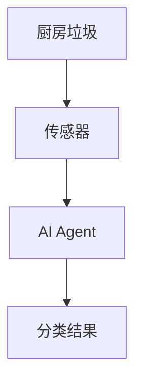
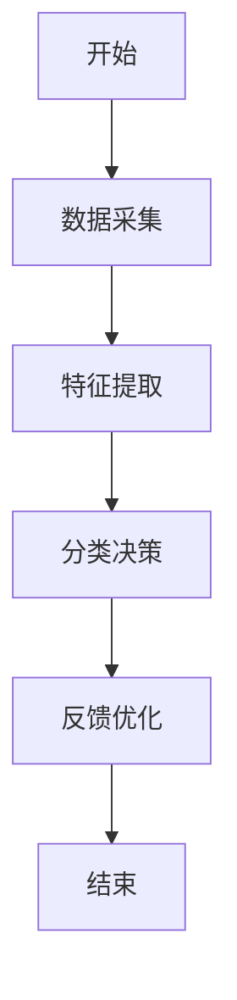
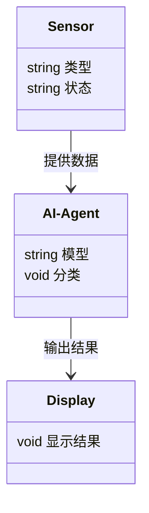
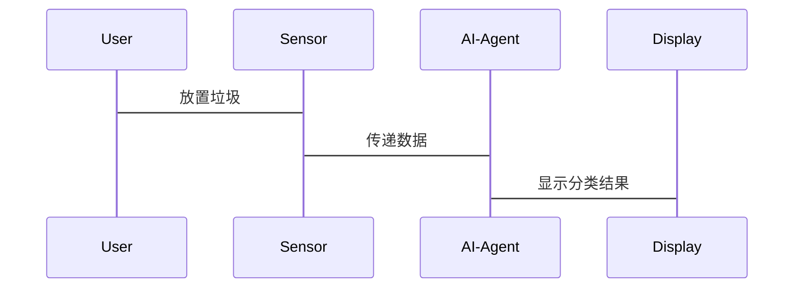

                 


```markdown
# 智能厨房垃圾处理器：AI Agent的废物分类

> 关键词：AI Agent，智能厨房，垃圾分类，物联网，传感器，数据处理

> 摘要：本文探讨了AI Agent在厨房垃圾处理器中的应用，详细分析了智能垃圾分类的背景、技术原理、系统架构，并通过实际案例展示了AI Agent如何实现高效、智能的废物分类。

---

## 第1章: 背景介绍

### 1.1 问题背景
#### 1.1.1 厨房垃圾处理的现状与挑战
- 随着城市化进程的加快，厨房垃圾的产生量急剧增加。
- 传统垃圾桶无法智能分类，导致资源浪费和环境污染。
- 分类效率低下，增加了垃圾处理成本。

#### 1.1.2 垃圾分类的重要性与意义
- 垃圾分类是实现可持续发展的重要环节。
- 减少环境污染，提高资源利用率。
- 通过智能化手段，提升垃圾分类的效率和准确性。

#### 1.1.3 智能化垃圾处理的需求与趋势
- 智能化技术的应用成为趋势。
- 用户对便捷性和高效性的需求日益增加。
- AI Agent技术在垃圾分类中的应用前景广阔。

### 1.2 问题描述
#### 1.2.1 厨房垃圾分类的复杂性
- 不同垃圾的物理特性差异大。
- 用户习惯的多样性导致分类标准不统一。
- 环境干扰因素多，如光线、湿度等。

#### 1.2.2 智能垃圾处理器的功能需求
- 实时感知垃圾类型。
- 自动分类并引导用户。
- 数据采集与反馈优化。

#### 1.2.3 用户使用场景与痛点分析
- 用户需求：便捷、准确、高效。
- 使用场景：家庭厨房、公共场所。
- 痛点：分类错误率高，操作复杂。

### 1.3 问题解决
#### 1.3.1 AI Agent在垃圾分类中的应用
- AI Agent的自主性和学习能力。
- 实现垃圾类型识别和分类优化。
- 提供实时反馈和用户指导。

#### 1.3.2 智能厨房垃圾处理器的设计目标
- 实现高效的垃圾分类。
- 提供友好的用户交互界面。
- 数据驱动的持续优化。

#### 1.3.3 技术实现的可行性分析
- 现有技术的成熟度。
- 数据采集与处理能力。
- 系统架构的可扩展性。

### 1.4 边界与外延
#### 1.4.1 系统功能的边界定义
- 限定功能：垃圾类型识别、分类引导。
- 不在范围内的功能：垃圾处理后的运输和储存。

#### 1.4.2 与相关系统的接口关系
- 上层系统：数据管理平台。
- 下层系统：传感器和执行机构。

#### 1.4.3 产品的市场定位与目标用户
- 市场定位：智能家居设备。
- 目标用户：家庭用户、环保机构。

### 1.5 概念结构与核心要素
#### 1.5.1 核心概念的层次结构
- 根本目标：高效垃圾分类。
- 中介手段：AI Agent技术。
- 实施方法：传感器、算法模型。

#### 1.5.2 核心要素的定义与关系
- 感知层：传感器。
- 计算层：AI Agent。
- 执行层：分类装置。

#### 1.5.3 概念模型的可视化表示


---

## 第2章: 核心概念与联系

### 2.1 AI Agent的基本原理
#### 2.1.1 AI Agent的定义与特征
- 定义：AI Agent是一种能够感知环境并采取行动以实现目标的智能实体。
- 特征：自主性、反应性、学习能力、适应性。

#### 2.1.2 AI Agent的核心工作原理
- 感知环境：通过传感器获取数据。
- 分析决策：基于算法模型做出分类判断。
- 执行操作：根据决策结果执行分类动作。

#### 2.1.3 AI Agent与传统自动化的区别
- 自主性：AI Agent具备自主决策能力。
- 智能性：AI Agent能够学习和优化。

### 2.2 核心概念的属性特征对比
#### 2.2.1 对比表格展示
```markdown
| 概念    | 自主性 | 反应性 | 学习能力 |
|---------|--------|--------|----------|
| AI Agent | 高     | 高     | 高        |
| 传统分类器 | 低     | 中     | 低        |
```

### 2.3 ER实体关系图
```mermaid
erDiagram
    actor User {
        string 用户ID
        string 用户偏好
    }
    class Sensor {
        string 传感器ID
        string 感知数据
    }
    class AI-Agent {
        string 模型ID
        string 分类结果
    }
    User --> Sensor: 使用
    Sensor --> AI-Agent: 提供数据
    AI-Agent --> User: 返回结果
```

---

## 第3章: 算法原理讲解

### 3.1 算法概述
#### 3.1.1 算法工作流程
1. 数据采集：传感器获取垃圾特征。
2. 特征提取：提取颜色、形状等特征。
3. 分类决策：基于机器学习模型进行分类。
4. 反馈优化：根据结果调整模型参数。

#### 3.1.2 算法选择与优化
- 选择支持向量机（SVM）进行分类。
- 优化算法：使用网格搜索调整参数。

#### 3.1.3 算法流程图


### 3.2 算法实现
#### 3.2.1 数据采集与特征提取
```python
import numpy as np

def extract_features(data):
    # 提取颜色、形状等特征
    features = []
    for item in data:
        color = item['color']
        shape = item['shape']
        features.append([color, shape])
    return np.array(features)
```

#### 3.2.2 分类算法实现
```python
from sklearn import svm

def train_model(X_train, y_train):
    # 训练SVM模型
    model = svm.SVC()
    model.fit(X_train, y_train)
    return model

def predict(model, X_test):
    # 预测分类结果
    return model.predict(X_test)
```

#### 3.2.3 分类结果分析
```latex
$$ \text{分类准确率} = \frac{\text{正确分类数}}{\text{总分类数}} $$
```

---

## 第4章: 数学模型和公式

### 4.1 数学模型
#### 4.1.1 分类模型
$$ y = f(x) $$
其中，$x$ 是输入特征，$y$ 是输出类别。

#### 4.1.2 损失函数
$$ L = \sum_{i=1}^{n} (y_i - \hat{y_i})^2 $$

#### 4.1.3 优化方法
$$ \theta = \theta - \eta \frac{\partial L}{\partial \theta} $$

---

## 第5章: 系统分析与架构设计

### 5.1 系统功能设计
#### 5.1.1 领域模型图


### 5.2 系统架构设计
#### 5.2.1 系统架构图
```mermaid
graph TD
    UI --> Sensor: 发起请求
    Sensor --> AI-Agent: 返回数据
    AI-Agent --> Display: 显示结果
```

### 5.3 系统接口设计
- 输入接口：传感器数据接收。
- 输出接口：分类结果输出。

### 5.4 系统交互流程


---

## 第6章: 项目实战

### 6.1 环境安装
- 安装Python和相关库：`pip install numpy sklearn`

### 6.2 核心功能实现
```python
def main():
    # 传感器数据模拟
    data = [{'color': 'green', 'shape': 'cube'}, {'color': 'brown', 'shape': 'sphere'}]
    X = extract_features(data)
    y = ['organic', 'recycle']
    model = train_model(X, y)
    result = predict(model, X)
    print(result)
```

### 6.3 实际案例分析
- 案例1：有机垃圾分类。
- 案例2：可回收物分类。

### 6.4 项目小结
- 项目实现的关键点：传感器数据采集、AI Agent分类算法。
- 可优化方向：模型训练数据的扩展。

---

## 第7章: 最佳实践

### 7.1 小结
- AI Agent在厨房垃圾处理器中的应用前景广阔。
- 技术实现的关键在于传感器和算法的优化。

### 7.2 注意事项
- 数据采集的准确性。
- 用户交互的便捷性。

### 7.3 拓展阅读
- 推荐书籍：《机器学习实战》。
- 推荐文章：《AI在智能家居中的应用》。

---

## 作者

作者：AI天才研究院/AI Genius Institute & 禅与计算机程序设计艺术 /Zen And The Art of Computer Programming
```

