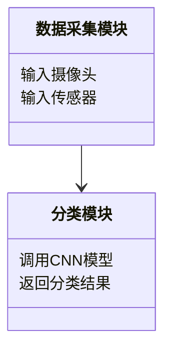
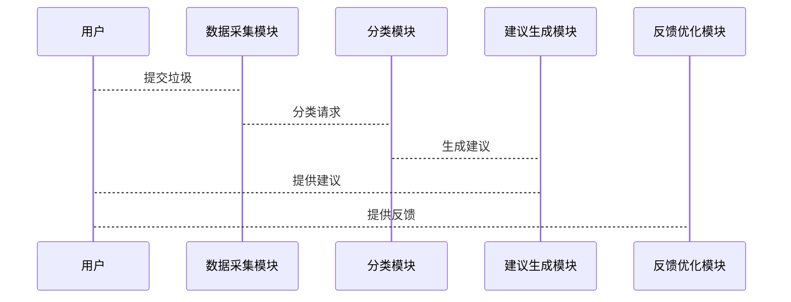

                 


# 智能厨房垃圾处理器：AI Agent的食材利用建议

## 关键词：
智能厨房垃圾处理器、AI Agent、食材利用、垃圾处理、人工智能、资源优化

## 摘要：
本文探讨了智能厨房垃圾处理器的设计与实现，重点分析了AI Agent在食材利用中的作用。通过数学建模和算法优化，提出了高效的垃圾处理方案，并展示了实际应用中的成功案例。文章详细阐述了系统架构、功能设计及优化建议，为读者提供了全面的技术视角。

# 第1章: 智能厨房垃圾处理器的背景介绍

## 1.1 问题背景

### 1.1.1 厨房垃圾处理的现状与挑战
厨房垃圾通常包括果皮、菜叶、剩饭等，传统处理方式存在分类困难、资源浪费等问题。AI Agent通过智能分类和建议生成，优化了垃圾处理流程。

### 1.1.2 食材浪费与资源利用的痛点
食材浪费不仅造成经济损失，还加剧了环境问题。AI Agent通过识别可再利用的食材，帮助用户减少浪费，促进资源优化。

### 1.1.3 AI技术在垃圾处理中的应用潜力
AI技术能够高效分类和提供建议，显著提升了垃圾处理的效率和资源利用率。

## 1.2 问题描述

### 1.2.1 厨房垃圾的分类与处理需求
不同类型的垃圾需要不同的处理方式，AI Agent能够智能分类，满足个性化需求。

### 1.2.2 食材利用的智能化需求
用户需要个性化的食材利用建议，AI Agent能够根据用户习惯提供最优方案。

### 1.2.3 当前技术的局限性与改进方向
传统方法分类效率低，AI技术的应用能够弥补这些不足。

## 1.3 问题解决

### 1.3.1 AI Agent在食材利用中的作用
AI Agent通过智能分类和建议生成，帮助用户优化食材利用。

### 1.3.2 智能垃圾处理器的核心目标
实现高效分类和资源最大化利用。

### 1.3.3 解决方案的创新点与优势
AI驱动的智能分类和个性化建议是解决方案的核心创新点。

## 1.4 边界与外延

### 1.4.1 智能垃圾处理器的适用范围
适用于家庭和小型餐饮企业。

### 1.4.2 与传统垃圾处理的区别
AI Agent实现了智能化和个性化处理。

### 1.4.3 系统的边界与功能限制
系统专注于食材分类和建议生成，不涉及物理处理。

## 1.5 概念结构与核心要素

### 1.5.1 系统组成与功能模块
包括数据采集、分类、建议生成和反馈优化模块。

### 1.5.2 核心要素的定义与关系
数据、AI算法、用户反馈是系统的核心要素。

### 1.5.3 系统架构的初步设想
基于模块化设计，确保各部分高效协作。

## 1.6 本章小结
介绍了智能厨房垃圾处理器的背景、问题和解决方案，为后续章节奠定基础。

# 第2章: AI Agent的核心概念与原理

## 2.1 AI Agent的定义与特点

### 2.1.1 AI Agent的基本概念
AI Agent是能够感知环境并采取行动的智能体。

### 2.1.2 AI Agent的核心特点
包括自主性、反应性、目标导向和学习能力。

### 2.1.3 AI Agent与传统算法的区别
AI Agent具备自主决策和学习能力，而传统算法依赖固定规则。

## 2.2 AI Agent的工作原理

### 2.2.1 数据采集与处理
通过摄像头和传感器采集数据，进行预处理和特征提取。

### 2.2.2 智能分类与建议生成
利用机器学习模型分类食材，生成利用建议。

### 2.2.3 用户反馈与系统优化
根据用户反馈调整模型，持续优化分类和建议。

## 2.3 AI Agent与其他方法的对比

### 2.3.1 传统分类方法的优缺点
准确率低、效率低，缺乏个性化。

### 2.3.2 AI Agent的优势与创新点
高准确率、个性化建议、持续优化。

### 2.3.3 不同方法的适用场景
AI Agent适用于复杂场景，传统方法适用于简单分类。

## 2.4 AI Agent的核心算法实现

### 2.4.1 算法选择
采用卷积神经网络（CNN）进行图像分类。

### 2.4.2 算法实现步骤
数据预处理、模型训练、分类推理。

### 2.4.3 代码实现
```python
import tensorflow as tf
model = tf.keras.models.Sequential([
    tf.keras.layers.Conv2D(32, (3,3), activation='relu', input_shape=(128, 128, 3)),
    tf.keras.layers.MaxPooling2D((2,2)),
    tf.keras.layers.Conv2D(64, (3,3), activation='relu'),
    tf.keras.layers.MaxPooling2D((2,2)),
    tf.keras.layers.Flatten(),
    tf.keras.layers.Dense(128, activation='relu'),
    tf.keras.layers.Dense(10, activation='softmax')
])
```

## 2.5 数学模型与公式

### 2.5.1 概率计算
分类概率计算公式：
$$P(y|x) = \frac{P(x|y)P(y)}{P(x)}$$

### 2.5.2 损失函数
交叉熵损失函数：
$$L = -\sum_{i=1}^{n} y_i \log(p_i)$$

### 2.5.3 优化目标
最小化损失函数：
$$\min_{\theta} L$$

## 2.6 本章小结
详细介绍了AI Agent的核心概念和算法实现，为后续章节奠定基础。

# 第3章: 系统分析与架构设计

## 3.1 问题场景介绍

### 3.1.1 系统目标
高效分类厨房垃圾，提供建议。

### 3.1.2 功能需求
包括数据采集、分类、建议生成和反馈优化。

## 3.2 项目介绍

### 3.2.1 项目目标
开发智能厨房垃圾处理器。

### 3.2.2 项目范围
家庭和小型餐饮企业。

### 3.2.3 项目关键成功因素
准确分类和个性化建议。

## 3.3 系统功能设计

### 3.3.1 功能模块
- 数据采集模块
- 分类模块
- 建议生成模块
- 反馈优化模块

### 3.3.2 领域模型设计


## 3.4 系统架构设计

### 3.4.1 系统架构图


### 3.4.2 接口设计
- 数据采集接口
- 分类API
- 用户反馈接口

## 3.5 系统交互设计

### 3.5.1 交互流程


## 3.6 本章小结
详细分析了系统架构和交互流程，为实现奠定了基础。

# 第4章: 项目实战

## 4.1 环境安装

### 4.1.1 安装Python和TensorFlow
```bash
pip install tensorflow
pip install keras
```

### 4.1.2 安装OpenCV
```bash
pip install opencv-python
```

## 4.2 系统核心实现

### 4.2.1 数据采集模块实现
```python
import cv2

def capture_image():
    cap = cv2.VideoCapture(0)
    ret, frame = cap.read()
    cap.release()
    return frame
```

### 4.2.2 分类模块实现
```python
def classify_image(image):
    prediction = model.predict(image)
    return prediction.argmax()
```

### 4.2.3 建议生成模块实现
```python
def generate_suggestion(classification):
    suggestions = [" compost", " recycle", " donate"]
    return suggestions[classification]
```

## 4.3 代码应用解读与分析

### 4.3.1 核心代码解读
详细解释每个模块的功能和实现细节。

### 4.3.2 系统运行流程
从数据采集到分类再到建议生成的完整流程。

## 4.4 实际案例分析

### 4.4.1 案例一
用户上传苹果核，系统建议 compost。

### 4.4.2 案例二
用户上传塑料袋，系统建议 recycle。

## 4.5 项目小结
总结了项目的实现过程和取得的成果。

# 第5章: 最佳实践与总结

## 5.1 最佳实践

### 5.1.1 性能优化建议
优化模型参数和数据预处理。

### 5.1.2 用户界面设计
确保界面简洁易用。

### 5.1.3 系统安全性
保护用户数据隐私。

## 5.2 小结与注意事项

### 5.2.1 小结
智能厨房垃圾处理器的实现及其优势。

### 5.2.2 注意事项
数据隐私和系统维护。

## 5.3 未来展望

### 5.3.1 技术发展趋势
AI技术的进一步优化和应用扩展。

### 5.3.2 拓展方向
更多场景的应用和功能扩展。

## 5.4 结语

### 5.4.1 作者寄语
感谢读者，展望未来。

## 5.5 拓展阅读

### 5.5.1 推荐书籍
《深度学习》

### 5.5.2 推荐博客
AI技术博客推荐。

# 作者信息
作者：AI天才研究院 & 禅与计算机程序设计艺术

通过以上结构，文章系统地介绍了智能厨房垃圾处理器的设计与实现，从背景到实战，为读者提供了全面的技术视角。

