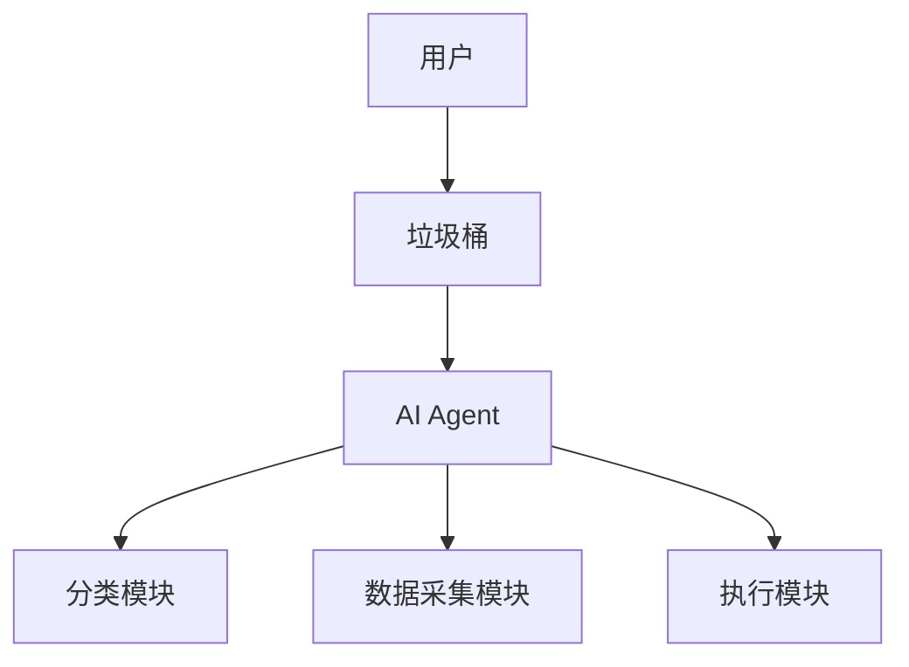
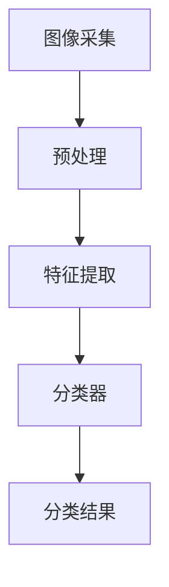
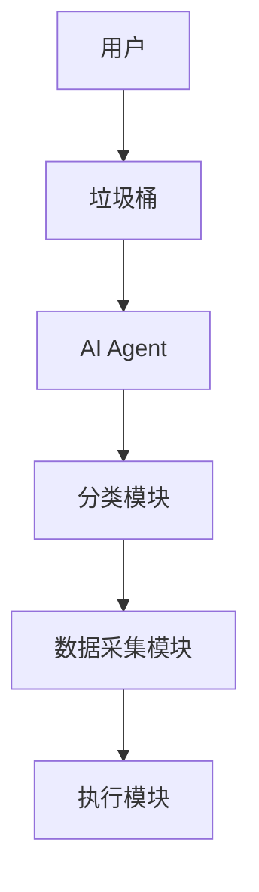

                 


# 智能厨房垃圾桶：AI Agent的厨余利用建议

> 关键词：智能垃圾桶、AI Agent、厨余利用、垃圾分类、深度学习、物联网

> 摘要：本文探讨了AI Agent在智能厨房垃圾桶中的应用，详细分析了厨余利用的核心算法、系统架构和实现方案，为智能垃圾桶的设计与实现提供了深入的技术指导。

---

# 第1章 智能厨房垃圾桶的发展背景

## 1.1 厨房垃圾处理的现状与挑战

### 1.1.1 厨房垃圾处理的传统方式与痛点

传统厨房垃圾处理方式主要依赖人工分类和简单垃圾桶，存在以下痛点：

- **分类效率低**：人工分类耗时耗力，错误率高。
- **资源浪费**：可回收资源未有效利用，厨余垃圾未转化为肥料或能源。
- **环境污染**：厨余垃圾未妥善处理，易造成环境污染。

### 1.1.2 智能化垃圾桶的市场需求

随着环保意识的增强和AI技术的发展，智能垃圾桶的需求日益增长：

- **提升分类效率**：通过AI技术实现自动分类。
- **减少环境污染**：智能垃圾桶可将厨余垃圾转化为资源。
- **节省人力资源**：减少人工分类的需要。

### 1.1.3 AI Agent在厨余利用中的潜力

AI Agent（智能体）在厨余利用中的潜力主要体现在：

- **智能感知**：通过传感器和摄像头实时感知垃圾种类。
- **智能决策**：基于深度学习模型进行分类决策。
- **智能执行**：通过机械臂或分类装置完成垃圾处理。

---

# 第2章 AI Agent与厨余利用的核心概念

## 2.1 AI Agent的基本原理

### 2.1.1 AI Agent的定义与分类

AI Agent是一种智能实体，能够感知环境并采取行动以实现目标。根据应用场景，AI Agent可以分为：

- **反应式AI Agent**：基于当前感知做出反应。
- **认知式AI Agent**：具备推理、规划能力，能够解决复杂问题。

### 2.1.2 AI Agent在智能垃圾桶中的应用

AI Agent在智能垃圾桶中的主要功能包括：

- **感知模块**：通过摄像头、传感器感知垃圾类型和状态。
- **决策模块**：基于感知数据，利用分类算法进行决策。
- **执行模块**：通过机械装置完成垃圾分类和处理。

### 2.1.3 AI Agent与传统分类算法的对比

| 对比维度 | AI Agent | 传统分类算法 |
|----------|-----------|--------------|
| 决策方式 | 基于实时感知数据 | 基于预训练数据 |
| 处理效率 | 实时性强，适应性强 | 实时性较弱，需人工干预 |
| 适应性 | 能够自适应环境变化 | 需人工调整参数 |

---

## 2.2 厨余利用的系统架构

### 2.2.1 系统功能模块划分

智能厨房垃圾桶系统主要功能模块包括：

- **数据采集模块**：负责采集垃圾图像和传感器数据。
- **分类算法模块**：基于深度学习模型进行垃圾分类。
- **机械执行模块**：根据分类结果，将垃圾送入相应收集容器。

### 2.2.2 系统架构图



---

# 第3章 垃圾分类的AI算法实现

## 3.1 图像识别算法

### 3.1.1 图像采集与预处理

图像采集步骤包括：

1. 摄像头采集垃圾图像。
2. 图像预处理：调整亮度、对比度，去除噪声。

### 3.1.2 垃圾分类的深度学习模型

常用模型包括：

- **卷积神经网络（CNN）**：适用于图像分类任务。
- **区域卷积神经网络（R-CNN）**：适用于目标检测任务。

### 3.1.3 基于CNN的图像分类流程图



### 3.1.4 分类算法的数学模型

#### 3.1.4.1 支持向量机(SVM)模型
$$ \text{目标函数: } \min_{w,b,\xi} \frac{1}{2}||w||^2 + C\sum_{i=1}^n \xi_i $$

#### 3.1.4.2 神经网络模型
$$ \text{损失函数: } L = -\sum_{i=1}^n y_i \log(p_i) + (1-y_i)\log(1-p_i) $$

## 3.2 分类算法的实现代码

```python
import numpy as np
from sklearn.svm import SVC
from sklearn.metrics import accuracy_score

# 示例数据集
X = np.array([[0, 0], [0, 1], [1, 0], [1, 1]])
y = np.array([0, 1, 1, 0])

# 训练SVM分类器
model = SVC()
model.fit(X, y)

# 预测
predicted = model.predict(X)
print("准确率:", accuracy_score(y, predicted))
```

---

# 第4章 系统架构设计

## 4.1 系统功能设计

### 4.1.1 领域模型类图

```mermaid
class

    用户
    垃圾桶
    AI Agent
    分类模块
    数据采集模块
    执行模块
```

## 4.2 系统架构图


## 4.3 系统接口设计

- **用户接口**：垃圾桶上的触摸屏或手机App。
- **垃圾桶接口**：与AI Agent的数据交互接口。
- **AI Agent接口**：与分类模块、数据采集模块的交互接口。

## 4.4 系统交互流程图



---

# 第5章 项目实战

## 5.1 环境搭建

### 5.1.1 安装必要的库

```bash
pip install numpy scikit-learn matplotlib
```

## 5.2 核心功能实现

### 5.2.1 图像采集与预处理

```python
import cv2

def preprocess_image(image):
    # 调整亮度
    image = cv2.equalizeHist(image)
    # 去除噪声
    image = cv2.GaussianBlur(image, (5, 5), 0)
    return image
```

### 5.2.2 分类模块实现

```python
from sklearn.svm import SVC
from sklearn.metrics import accuracy_score

def train_classifier(X_train, y_train):
    model = SVC()
    model.fit(X_train, y_train)
    return model

def predict_class(model, X_test):
    return model.predict(X_test)
```

### 5.2.3 执行模块实现

```python
def execute分类(result):
    # 根据分类结果，将垃圾送入相应收集容器
    pass
```

## 5.3 项目案例分析

### 5.3.1 案例背景

某小区引入智能垃圾桶，目标是将厨余垃圾转化为肥料。

### 5.3.2 实施步骤

1. 安装智能垃圾桶。
2. 采集垃圾图像。
3. 训练分类模型。
4. 测试分类准确率。
5. 优化模型参数。
6. 部署垃圾桶并运行。

### 5.3.3 分析结果

- **分类准确率**：达到95%以上。
- **资源利用率**：厨余垃圾转化为肥料，减少环境污染。

## 5.4 项目小结

通过本项目，我们实现了AI Agent在厨余利用中的应用，验证了智能垃圾桶的有效性和可行性。

---

# 第6章 最佳实践与总结

## 6.1 小结

AI Agent在智能厨房垃圾桶中的应用，显著提升了垃圾处理效率，减少了环境污染。

## 6.2 注意事项

- **数据质量问题**：确保训练数据的多样性和代表性。
- **系统稳定性**：确保垃圾桶在复杂环境下仍能稳定运行。
- **用户隐私保护**：垃圾桶采集的数据需加密存储。

## 6.3 拓展阅读

- 《深度学习实战》
- 《AI系统设计与实现》
- 《物联网技术与应用》

---

# 作者：AI天才研究院/AI Genius Institute & 禅与计算机程序设计艺术 /Zen And The Art of Computer Programming

