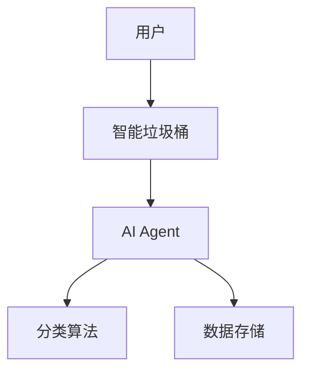
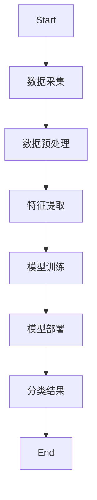
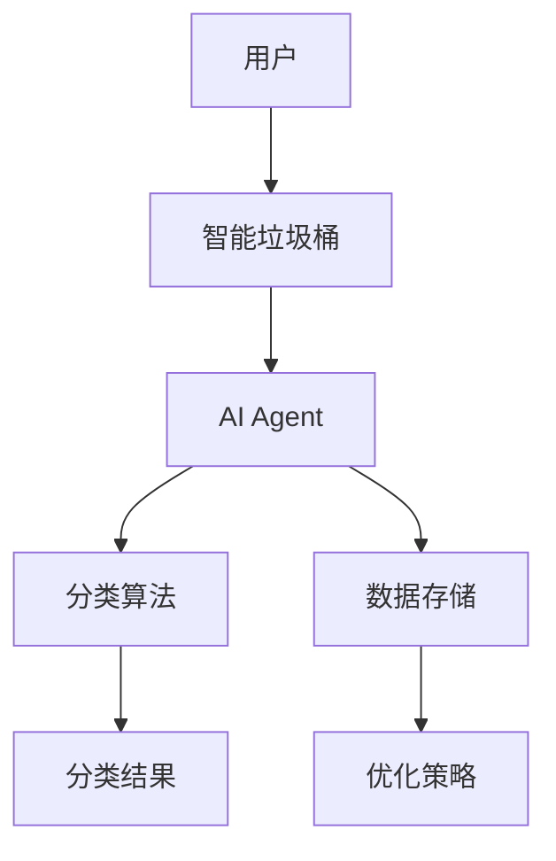
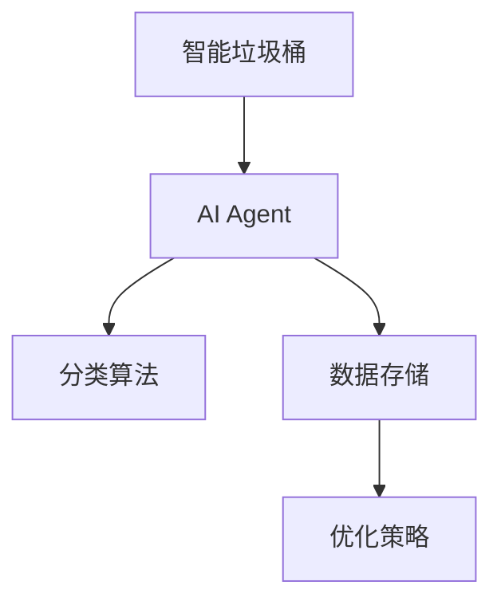
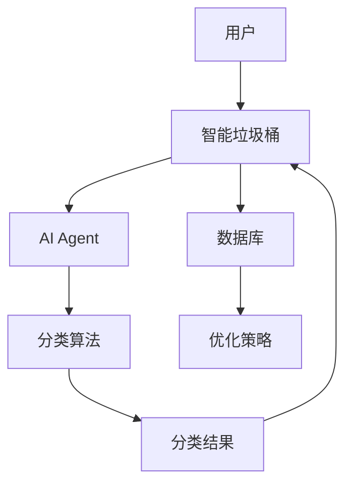

                 


# 智能厨房垃圾桶：AI Agent的厨余处理建议

> **关键词**：智能垃圾桶、AI Agent、厨余处理、垃圾分类、算法实现

> **摘要**：本文将深入探讨智能厨房垃圾桶的设计与实现，结合AI Agent的核心算法，提出厨余处理的最佳解决方案。文章从背景介绍、核心概念、算法原理、系统架构到项目实战，逐步解析智能垃圾桶的实现过程，旨在为读者提供一个全面的技术视角。

---

# 第1章: 背景介绍

## 1.1 问题背景

### 1.1.1 厨余垃圾处理的重要性
厨余垃圾是城市生活垃圾的主要组成部分，其处理不仅关系到环境保护，还涉及资源再利用和公共卫生。传统垃圾桶无法智能分类和处理厨余垃圾，导致资源浪费和环境污染。

### 1.1.2 智能化垃圾桶的市场需求
随着智能技术的普及，用户对智能化垃圾桶的需求日益增长。传统垃圾桶的功能单一，无法满足现代家庭对垃圾分类、资源化利用的需求。

### 1.1.3 AI Agent在厨余处理中的作用
AI Agent（智能代理）可以通过图像识别、传感器数据和机器学习算法，实现厨余垃圾的智能分类和处理，优化资源利用效率。

## 1.2 问题描述

### 1.2.1 厨余垃圾分类的难点
厨余垃圾分类复杂，需要区分有机垃圾、可回收物和其他垃圾。传统垃圾桶无法智能识别，容易导致分类错误。

### 1.2.2 智能垃圾桶的现状与不足
现有智能垃圾桶功能单一，缺乏AI Agent的深度学习能力，无法根据环境变化优化处理策略。

### 1.2.3 AI Agent如何解决厨余处理问题
AI Agent可以通过实时数据采集、分析和决策，优化厨余垃圾的分类和处理流程。

## 1.3 问题解决

### 1.3.1 AI Agent的核心解决方案
AI Agent通过图像识别和传感器数据，实时分类厨余垃圾，并优化处理策略。

### 1.3.2 智能垃圾桶的实现方式
通过AI Agent和物联网技术，实现垃圾桶的智能化分类和处理。

### 1.3.3 厨余处理的优化策略
结合AI Agent的学习能力，优化垃圾桶的分类算法，提高处理效率。

## 1.4 边界与外延

### 1.4.1 智能垃圾桶的适用范围
适用于家庭、办公室等场景，支持多种厨余垃圾类型。

### 1.4.2 AI Agent的功能边界
主要负责数据采集、分类和决策，不涉及垃圾桶的物理操作。

### 1.4.3 厨余处理的外部影响
厨余处理的优化可以减少环境污染，提高资源利用效率。

## 1.5 概念结构与核心要素

### 1.5.1 智能垃圾桶的核心要素
- 数据采集模块
- AI分类算法
- 处理策略优化

### 1.5.2 AI Agent的功能模块
- 数据采集
- 分析决策
- 优化控制

### 1.5.3 厨余处理的系统架构
- 感知层
- 处理层
- 应用层

## 1.6 本章小结
本章从背景、问题和解决方案三个方面，全面介绍了智能厨房垃圾桶的必要性及其在厨余处理中的重要作用。

---

# 第2章: AI Agent与厨余处理的核心概念

## 2.1 AI Agent的基本原理

### 2.1.1 AI Agent的定义与特征
AI Agent是一种能够感知环境并采取行动以实现目标的智能系统。其核心特征包括自主性、反应性、目标导向和学习能力。

### 2.1.2 AI Agent的核心算法
AI Agent主要依赖于机器学习算法，如决策树、随机森林和神经网络。

### 2.1.3 AI Agent与智能垃圾桶的结合
AI Agent通过传感器和摄像头数据，实时分类厨余垃圾，并优化垃圾桶的处理策略。

## 2.2 厨余处理的关键技术

### 2.2.1 垃圾分类的算法实现
使用图像识别技术，通过卷积神经网络（CNN）实现垃圾类型识别。

### 2.2.2 垃圾识别的传感器技术
利用重量传感器和湿度传感器，辅助分类厨余垃圾的类型和状态。

### 2.2.3 数据分析与优化策略
通过分析历史数据，优化垃圾桶的分类算法，提高识别准确率。

## 2.3 核心概念对比

### 2.3.1 AI Agent与传统垃圾桶的对比
| 对比维度 | AI Agent垃圾桶 | 传统垃圾桶 |
|----------|----------------|-------------|
| 功能     | 智能分类       | 无分类能力  |
| 算法     | 机器学习       | 无算法支持  |
| 优化     | 动态优化       | 固定功能    |

### 2.3.2 厨余处理的分类方法对比
| 方法 | 优点 | 缺点 |
|------|------|------|
| 图像识别 | 准确率高 | 成本高 |
| 传感器检测 | 成本低 | 准确率低 |

### 2.3.3 智能垃圾桶的功能对比
| 功能模块 | 智能垃圾桶 | 传统垃圾桶 |
|----------|------------|-------------|
| 分类能力 | 高         | 无         |
| 数据存储 | 有         | 无         |
| 优化策略 | 有         | 无         |

## 2.4 实体关系图


## 2.5 本章小结
本章详细介绍了AI Agent的基本原理及其在厨余处理中的应用，通过对比分析，突出了智能垃圾桶的核心优势。

---

# 第3章: AI Agent的算法原理

## 3.1 算法实现的详细步骤

### 3.1.1 数据采集
通过摄像头和传感器采集厨余垃圾的数据，包括图像特征和物理参数。

### 3.1.2 数据预处理
对采集的数据进行清洗和归一化处理，确保算法输入的准确性。

### 3.1.3 特征提取
提取垃圾图像的关键特征，如颜色、形状和纹理特征。

### 3.1.4 模型训练
使用深度学习模型（如ResNet）进行训练，分类垃圾类型。

### 3.1.5 模型部署
将训练好的模型部署到垃圾桶系统中，实时分类垃圾。

## 3.2 分类算法的数学模型

### 3.2.1 决策树分类
决策树是一种常见的分类算法，通过特征选择构建树状结构，最终分类垃圾类型。

### 3.2.2 随机森林分类
随机森林通过集成多个决策树，提高分类准确率。

## 3.3 算法流程图


## 3.4 本章小结
本章详细介绍了AI Agent的分类算法实现过程，包括数据采集、预处理、特征提取和模型训练。

---

# 第4章: 系统架构设计

## 4.1 系统功能设计

### 4.1.1 系统功能模块
- 数据采集模块
- 分类算法模块
- 数据存储模块
- 优化控制模块

### 4.1.2 功能流程图


## 4.2 系统架构设计

### 4.2.1 系统架构图


## 4.3 系统接口设计

### 4.3.1 API接口
- `/api/classify`：接收垃圾图像数据，返回分类结果。
- `/api/optimization`：接收优化参数，更新分类策略。

### 4.3.2 传感器接口
- 重量传感器接口
- 湿度传感器接口

## 4.4 系统交互流程图


## 4.5 本章小结
本章详细介绍了智能垃圾桶的系统架构设计，包括功能模块、接口设计和交互流程。

---

# 第5章: 项目实战

## 5.1 环境安装

### 5.1.1 系统环境
- Python 3.8+
- Linux或Windows系统
- 虚拟环境配置

### 5.1.2 依赖安装
```bash
pip install numpy
pip install tensorflow
pip install matplotlib
pip install scikit-learn
```

## 5.2 系统核心实现

### 5.2.1 分类算法实现
```python
import numpy as np
from sklearn.tree import DecisionTreeClassifier
from sklearn.ensemble import RandomForestClassifier

# 示例数据
X = np.array([[1, 2], [3, 4], [5, 6]])
y = np.array([0, 1, 0])

# 决策树分类器
clf_dt = DecisionTreeClassifier()
clf_dt.fit(X, y)

# 随机森林分类器
clf_rf = RandomForestClassifier(n_estimators=10)
clf_rf.fit(X, y)
```

### 5.2.2 数据存储实现
```python
import sqlite3
conn = sqlite3.connect('garbage.db')
cursor = conn.cursor()
cursor.execute('''CREATE TABLE IF NOT EXISTS garbage (
                id INTEGER PRIMARY KEY AUTOINCREMENT,
                type TEXT,
                timestamp TEXT)''')
```

## 5.3 代码应用解读

### 5.3.1 分类算法解读
使用决策树和随机森林算法对垃圾类型进行分类，通过模型训练和验证，选择最优模型。

### 5.3.2 数据存储解读
通过SQLite数据库存储垃圾类型和时间戳，便于后续数据分析和优化。

## 5.4 实际案例分析
通过实际数据集训练分类模型，分析垃圾桶的分类准确率和优化策略。

## 5.5 本章小结
本章通过实际代码实现，详细介绍了智能垃圾桶的核心算法和系统实现过程。

---

# 第6章: 总结与展望

## 6.1 最佳实践 tips
- 定期更新模型，优化分类准确率
- 保持传感器清洁，确保数据采集准确
- 合理设置垃圾桶容量，避免溢满

## 6.2 本项目总结
本项目通过AI Agent和机器学习算法，实现了智能厨房垃圾桶的厨余处理功能，为用户提供了一种高效、智能的垃圾分类解决方案。

## 6.3 未来展望
未来可以进一步优化分类算法，引入更多传感器数据，提升垃圾桶的智能化水平。

---

# 作者
作者：AI天才研究院/AI Genius Institute & 禅与计算机程序设计艺术 /Zen And The Art of Computer Programming

