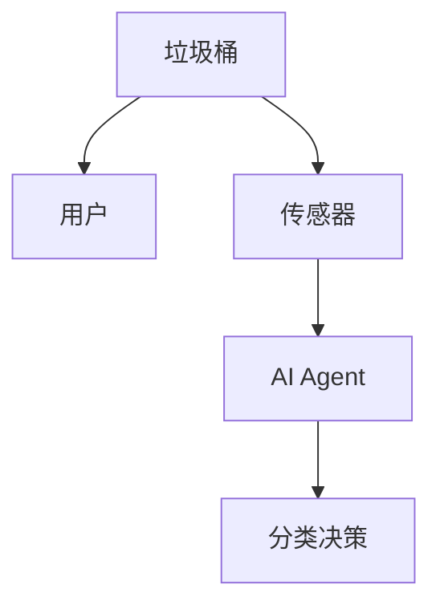
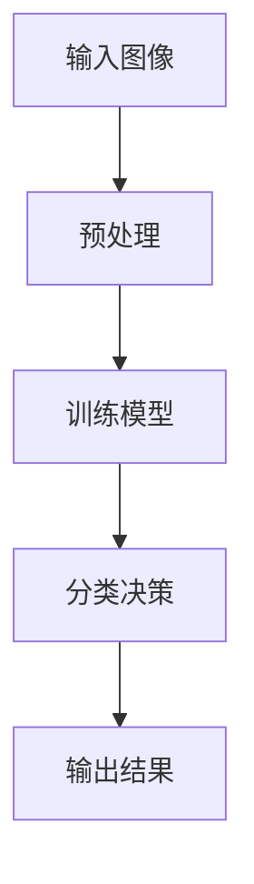
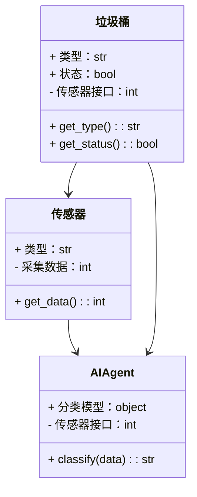
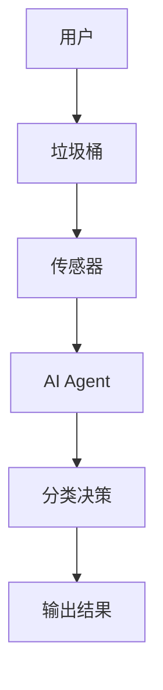
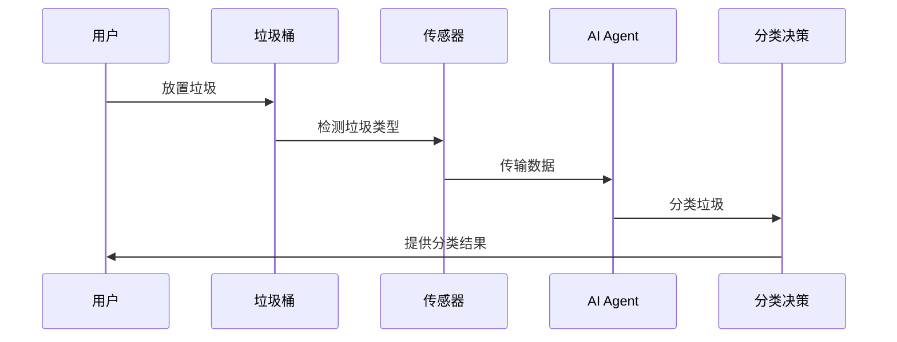

                 


# 智能厨房垃圾桶：AI Agent的废物分类指导

---

## 关键词：
智能垃圾桶、AI Agent、废物分类、图像识别、机器学习

---

## 摘要：
本文将详细介绍如何利用AI Agent技术实现厨房垃圾桶的智能分类。通过分析AI Agent的核心原理、算法实现、系统架构，结合实际项目案例，展示如何利用Python和深度学习技术实现高效的垃圾分类系统。

---

## 第一部分: 背景介绍与核心概念

### 第1章: 背景介绍与问题背景

#### 1.1 问题背景与描述
随着环保意识的增强，垃圾分类已成为全球关注的焦点。传统的垃圾桶无法智能分类，导致分类效率低、错误率高。AI Agent（人工智能代理）通过感知、决策和执行，能够实时分类垃圾，提升分类效率。

#### 1.2 问题解决与边界
AI Agent通过传感器和图像识别技术，实现垃圾桶的智能分类。系统边界包括垃圾桶、传感器、AI Agent和用户。核心概念包括感知层、决策层和执行层。

---

## 第二部分: 核心概念与原理

### 第2章: AI Agent的核心概念与工作原理

#### 2.1 AI Agent的基本原理
AI Agent通过感知层采集数据，决策层进行分类，执行层完成分类动作。

#### 2.2 核心概念对比与特征分析
| 方法 | 优点 | 缺点 |
|------|------|------|
| 传统传感器 | 成本低 | 分类精度低 |
| 图像识别 | 精度高 | 计算资源需求高 |
| AI Agent | 综合能力强 | 需要持续学习 |

#### 2.3 实体关系图


---

## 第三部分: 算法原理与数学模型

### 第3章: 分类算法与数学模型

#### 3.1 分类算法概述
使用卷积神经网络（CNN）进行图像分类，流程包括数据预处理、模型训练和分类。

#### 3.2 算法流程与实现


#### 3.3 Python代码实现
```python
import tensorflow as tf
from tensorflow.keras import layers

# 数据预处理
def preprocess_image(image_path):
    img = tf.keras.preprocessing.image.load_img(image_path, target_size=(128, 128))
    img_array = tf.keras.preprocessing.image.img_to_array(img)
    img_array = tf.expand_dims(img_array, axis=0)
    return img_array

# 模型训练
model = tf.keras.Sequential([
    layers.Conv2D(32, (3, 3), activation='relu', input_shape=(128, 128, 3)),
    layers.MaxPooling2D((2, 2)),
    layers.Conv2D(64, (3, 3), activation='relu'),
    layers.MaxPooling2D((2, 2)),
    layers.Flatten(),
    layers.Dense(64, activation='relu'),
    layers.Dense(4, activation='softmax')
])

model.compile(optimizer='adam', loss='sparse_categorical_crossentropy', metrics=['accuracy'])
model.fit(x_train, y_train, epochs=10, batch_size=32)
```

---

## 第四部分: 系统分析与架构设计

### 第4章: 系统架构与设计

#### 4.1 项目场景介绍
智能垃圾桶用于家庭厨房，通过AI Agent实现垃圾的实时分类和管理。

#### 4.2 系统功能设计
- 实时监测：传感器采集垃圾桶状态
- 分类提醒：AI Agent识别垃圾类型并提示分类
- 数据分析：统计分类数据，优化分类策略

#### 4.3 类图设计


#### 4.4 系统架构设计


#### 4.5 接口设计与交互流程图


---

## 第五部分: 项目实战与案例分析

### 第5章: 项目实战

#### 5.1 环境搭建
安装TensorFlow、OpenCV等库：
```bash
pip install tensorflow opencv-python
```

#### 5.2 核心代码实现
```python
import cv2
import numpy as np

# 图像采集与预处理
cap = cv2.VideoCapture(0)
while True:
    ret, frame = cap.read()
    if not ret:
        break
    cv2.imshow('摄像头', frame)
    if cv2.waitKey(1) == ord('q'):
        break
cap.release()
cv2.destroyAllWindows()
```

#### 5.3 案例分析
实际案例中，AI Agent识别出一个物体为厨余垃圾，并将其分类到对应的垃圾桶中。

---

## 第六部分: 最佳实践与总结

### 第6章: 总结与展望

#### 6.1 项目总结
本文详细介绍了AI Agent在智能垃圾桶中的应用，展示了如何通过深度学习实现高效的垃圾分类系统。

#### 6.2 注意事项
- 数据隐私保护
- 系统维护与更新
- 传感器精度与稳定性

#### 6.3 拓展阅读
推荐学习深度学习和计算机视觉相关的书籍，如《深度学习》、《Python图像处理》等。

---

## 作者：
作者：AI天才研究院 & 禅与计算机程序设计艺术

