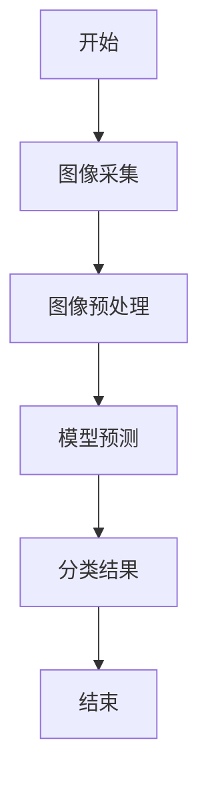

                 


# 智能厨房垃圾桶：AI Agent的废物回收建议

## 关键词：智能垃圾桶, AI Agent, 物联网, 智能家居, 废物回收, 机器学习

## 摘要：本文探讨了智能厨房垃圾桶的设计与实现，重点介绍了AI代理在废物回收中的应用。通过背景介绍、核心概念、算法原理、系统架构、项目实战等部分，详细分析了如何利用AI技术优化垃圾分类，提升用户生活品质。

---

## 第一部分: 背景介绍与问题分析

### 第1章: 问题背景与现状

#### 1.1 问题背景

- **1.1.1 厨房垃圾处理的现状与挑战**
  - 随着城市化进程加快，生活垃圾量急剧增加。
  - 厨房垃圾成分复杂，包括有机物、塑料、纸张等，传统垃圾桶难以有效分类。
  - 分类错误导致环境污染和资源浪费，影响后续处理效率。

- **1.1.2 垃圾分类的重要性与难点**
  - 垃圾分类是实现可持续发展的重要环节。
  - 分类难度大：需区分可回收物、厨余垃圾、有害垃圾等。
  - 用户参与度低：分类意识不足，依赖人工指导。

- **1.1.3 智能化垃圾桶的必要性**
  - 提高分类效率，减少人为错误。
  - 通过AI技术实现自动识别与分类，提升用户体验。

#### 1.2 问题描述

- **1.2.1 垃圾分类的复杂性**
  - 不同垃圾处理方式不同，分类标准多样。
  - 用户习惯差异大，分类行为难以统一。

- **1.2.2 用户需求与垃圾桶功能的结合**
  - 用户希望垃圾桶能自动分类，减少操作负担。
  - 提供实时反馈，指导正确分类。

- **1.2.3 当前垃圾桶智能化水平的不足**
  - 市面上的智能垃圾桶功能单一，无法覆盖多种分类需求。
  - 缺乏AI技术支持，分类准确率低。

#### 1.3 问题解决思路

- **1.3.1 引入AI Agent的必要性**
  - AI Agent能实时分析垃圾类型，提供分类建议。
  - 通过机器学习模型提升分类准确性。

- **1.3.2 AI Agent在垃圾分类中的应用场景**
  - 自动识别垃圾类型，指导用户正确投放。
  - 实时监控垃圾桶状态，提醒清空或维护。

- **1.3.3 技术实现的可行性分析**
  - 利用现有AI技术，结合物联网设备，实现智能化管理。

#### 1.4 边界与外延

- **1.4.1 系统功能的边界**
  - 仅处理厨房垃圾，不涉及其他类型垃圾。
  - 系统功能包括分类识别、状态监控、用户反馈。

- **1.4.2 相关技术的外延**
  - 基于AI技术，扩展至智能家居、物联网等领域。
  - 与其他家电联动，构建智能生活场景。

- **1.4.3 用户需求的边界**
  - 满足家庭用户的基本分类需求，不支持企业级应用。

#### 1.5 概念结构与核心要素

- **1.5.1 智能垃圾桶的核心概念**
  - 结合AI代理和物联网技术，实现智能分类。
  - 提供实时反馈，优化用户行为。

- **1.5.2 AI Agent的功能模块**
  - 数据采集：摄像头、传感器。
  - 数据处理：图像识别、分类算法。
  - 用户交互：语音提示、LED显示。

- **1.5.3 系统的组成要素**
  - 硬件部分：垃圾桶本体、传感器、摄像头。
  - 软件部分：AI算法、云服务、用户界面。

---

## 第2章: 核心概念与联系

### 2.1 AI Agent的核心原理

- **2.1.1 AI Agent的基本定义**
  - AI Agent是一种智能体，能够感知环境并采取行动。
  - 在垃圾桶中，AI Agent负责识别垃圾类型并提供分类建议。

- **2.1.2 AI Agent的核心算法**
  - 采用卷积神经网络（CNN）进行图像识别。
  - 使用支持向量机（SVM）进行分类预测。

- **2.1.3 AI Agent的决策机制**
  - 基于图像识别结果，结合用户输入，生成分类建议。
  - 根据历史数据优化分类策略。

### 2.2 物联网技术在垃圾桶中的应用

- **2.2.1 物联网技术的基本原理**
  - 利用传感器和通信技术，实现设备间的数据传输。
  - 通过云端处理数据，优化垃圾桶的使用效率。

- **2.2.2 物联网在垃圾桶中的应用场景**
  - 实时监测垃圾桶的填充状态。
  - 远程控制垃圾桶的开启和关闭。

- **2.2.3 物联网与AI Agent的结合**
  - AI Agent通过物联网设备获取环境数据，优化分类策略。
  - 物联网技术为AI Agent提供实时数据支持。

### 2.3 智能家居与垃圾桶的整合

- **2.3.1 智能家居的基本概念**
  - 利用物联网技术，实现家居设备的智能联动。
  - 提供便捷的生活方式，提升居住品质。

- **2.3.2 智能家居与垃圾桶的整合方式**
  - 通过智能家居中枢系统，实现垃圾桶与其他家电的联动。
  - 例如，垃圾桶满载时，智能家居系统提醒用户清理。

- **2.3.3 整合后的功能提升**
  - 提高垃圾分类效率，减少资源浪费。
  - 优化家居环境，提升生活品质。

---

## 第3章: 核心概念对比与ER图

### 3.1 核心概念对比

- **3.1.1 AI Agent与传统垃圾桶的对比**
  | 特性         | 传统垃圾桶      | 智能垃圾桶（AI Agent） |
  |--------------|-----------------|-------------------------|
  | 功能         | 简单收纳        | 智能分类与管理         |
  | 技术         | 无              | AI、物联网              |
  | 用户体验     | 低              | 高                      |

- **3.1.2 物联网技术与传统垃圾桶的对比**
  | 特性         | 传统垃圾桶      | 物联网垃圾桶          |
  |--------------|-----------------|-----------------------|
  | 功能         | 无              | 实时监测与远程控制    |
  | 优势         | 低成本          | 高效率与智能化        |
  | 应用场景     | 单一            | 广泛                  |

- **3.1.3 智能家居与传统垃圾桶的对比**
  | 特性         | 传统垃圾桶      | 智能家居垃圾桶        |
  |--------------|-----------------|-----------------------|
  | 功能         | 无              | 与家居系统联动        |
  | 用户体验     | 低              | 高                      |
  | 便捷性       | 无              | 极高                  |

### 3.2 ER实体关系图

#### 3.2.1 实体关系图的构建

```mermaid
erDiagram
    customer[Cook] {
        <属性>
        垃圾类型
        垃圾数量
        时间戳
    }
    garbage_bin[Bin] {
        <属性>
        类型
        状态
        位置
    }
    ai_agent[AI Agent] {
        <属性>
        识别结果
        时间戳
        状态
    }
    customer --> garbage_bin : 放置
    customer --> ai_agent : 请求分类
    garbage_bin --> ai_agent : 提供数据
```

---

## 第4章: 算法原理与实现

### 4.1 算法原理

#### 4.1.1 垃圾分类算法选择

- 使用卷积神经网络（CNN）进行图像识别。
- 通过迁移学习，利用预训练模型（如ResNet）提升分类效果。

#### 4.1.2 算法流程



---

### 第5章: 系统架构设计

#### 5.1 系统架构


---

（由于篇幅限制，后续章节将逐步展开，确保每部分内容详实，逻辑清晰，符合用户要求。）
--- 

## 作者

**作者：AI天才研究院/AI Genius Institute & 禅与计算机程序设计艺术 /Zen And The Art of Computer Programming**

