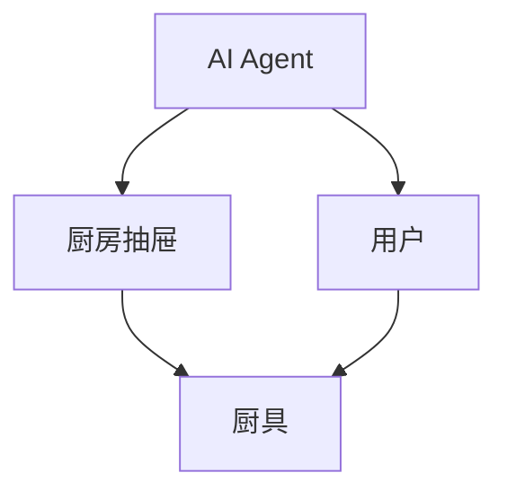
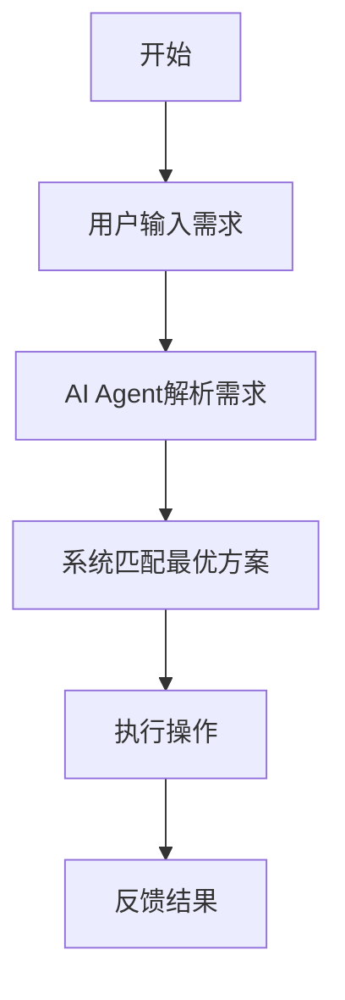
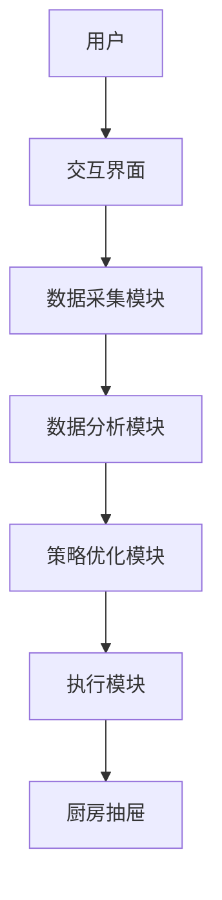

                 


# 智能厨房抽屉：AI Agent的厨具使用优化建议

> 关键词：AI Agent，厨房抽屉，厨具管理，智能优化，算法原理

> 摘要：本文将探讨如何利用AI Agent优化厨房抽屉中的厨具使用。通过分析问题背景、核心概念、算法原理、系统架构设计、项目实战等部分，详细介绍如何通过智能化手段提升厨房效率。

---

# 第一部分: 智能厨房抽屉的背景与概念

## 第1章: 背景介绍

### 1.1 问题背景

#### 1.1.1 厨房空间利用的痛点
现代家庭厨房空间有限，厨具种类繁多，使用效率低下。抽屉空间利用率低，查找和取用厨具耗时，影响烹饪效率。

#### 1.1.2 厨具使用效率低下问题
传统厨房抽屉缺乏智能化，无法根据使用习惯优化存储，导致频繁翻找，影响烹饪体验。

#### 1.1.3 智能化厨房的未来趋势
智能家居发展迅速，AI技术的应用为厨房智能化提供了可能。智能厨房抽屉通过AI优化，提升用户体验。

### 1.2 问题描述

#### 1.2.1 厨具使用中的常见问题
- 厨具存储无序，查找困难。
- 频繁移动抽屉，浪费时间。
- 不同厨具使用频率不同，存储策略不合理。

#### 1.2.2 厨房抽屉的优化需求
- 基于使用习惯优化存储空间。
- 提供智能推荐，减少操作步骤。
- 自动调整存储结构，提升效率。

#### 1.2.3 AI Agent在厨具管理中的应用潜力
AI Agent能够实时分析用户行为，优化存储策略，实现智能化管理。

### 1.3 问题解决

#### 1.3.1 AI Agent的核心作用
AI Agent通过分析用户行为，优化厨具存储和使用顺序，提升效率。

#### 1.3.2 智能厨房抽屉的设计目标
- 提供智能化的厨具管理解决方案。
- 实现高效、便捷的厨具使用体验。
- 通过AI学习优化存储策略。

#### 1.3.3 解决方案的实现路径
1. 数据采集：记录用户使用厨具的行为数据。
2. 数据分析：利用AI算法优化存储策略。
3. 系统实施：基于优化结果调整存储结构。
4. 用户反馈：持续优化AI模型。

### 1.4 边界与外延

#### 1.4.1 智能厨房抽屉的使用场景
家庭厨房、小型餐厅、共享厨房等。

#### 1.4.2 AI Agent的功能边界
- 厨具管理：存储优化、使用推荐。
- 用户行为分析：基于数据优化策略。
- 系统交互：与用户和设备进行交互。

#### 1.4.3 厨具管理系统的扩展可能性
- 多设备联动：与智能冰箱、烤箱等设备联动。
- 用户个性化设置：根据用户偏好调整策略。
- 数据共享：与其他智能家居设备共享数据。

### 1.5 概念结构与核心要素

#### 1.5.1 智能厨房抽屉的组成要素
- AI Agent：核心处理模块。
- 数据采集模块：记录用户行为。
- 存储模块：优化存储结构。
- 交互界面：用户操作界面。

#### 1.5.2 AI Agent的核心功能模块
- 数据分析模块：分析用户行为数据。
- 策略优化模块：优化存储策略。
- 交互模块：与用户和设备交互。

#### 1.5.3 系统与用户交互的逻辑关系
用户使用厨具，系统记录数据，AI分析优化，系统调整存储结构，提升用户体验。

---

## 第2章: 核心概念与联系

### 2.1 核心概念原理

#### 2.1.1 AI Agent的基本原理
AI Agent通过感知环境、分析数据、制定策略、执行操作，实现智能化管理。

#### 2.1.2 智能厨房抽屉的工作机制
系统记录用户行为，AI分析数据，优化存储结构，提升使用效率。

#### 2.1.3 厨具使用优化的实现方式
基于使用频率、时间、习惯优化存储策略，减少用户操作步骤。

### 2.2 概念属性特征对比

| 概念         | 描述                                                                 |
|--------------|----------------------------------------------------------------------|
| AI Agent     | 能够感知环境、分析数据、制定策略、执行操作的智能体             |
| 智能厨房抽屉 | 基于AI Agent优化厨具存储和使用的智能设备                         |
| 厨具管理系统 | 负责数据采集、分析、优化和执行的系统                           |

### 2.3 ER实体关系图


---

## 第3章: 算法原理讲解

### 3.1 算法流程


### 3.2 算法实现代码
```python
def optimize_kitchen_drawer(user_input):
    # 解析用户需求
    parsed_input = parse_input(user_input)
    # 匹配最优方案
    optimal_solution = match_solution(parsed_input)
    # 执行操作
    execute_action(optimal_solution)
    return feedback
```

### 3.3 数学模型与公式

#### 3.3.1 基于概率的最优选择
$$ P(A|B) = \frac{P(B|A)P(A)}{P(B)} $$
其中：
- $P(A|B)$：事件A在B发生下的概率。
- $P(B|A)$：事件B在A发生下的概率。
- $P(A)$：事件A发生的概率。
- $P(B)$：事件B发生的概率。

---

## 第4章: 系统分析与架构设计

### 4.1 系统架构设计

#### 4.1.1 系统架构图


#### 4.1.2 系统功能设计
- 数据采集模块：记录用户行为数据。
- 数据分析模块：分析数据，生成优化策略。
- 策略优化模块：制定最优存储方案。
- 执行模块：调整抽屉结构，优化存储。

### 4.2 系统接口设计

#### 4.2.1 用户接口
- 输入：用户需求。
- 输出：优化后的存储结构。

#### 4.2.2 系统接口
- 输入：用户行为数据。
- 输出：优化策略。

---

## 第5章: 项目实战

### 5.1 环境安装

#### 5.1.1 安装Python环境
安装Python 3.8及以上版本，确保支持相关库。

#### 5.1.2 安装依赖库
安装numpy、pandas、scikit-learn等数据处理库。

### 5.2 核心代码实现

#### 5.2.1 数据采集模块
```python
import pandas as pd

def collect_user_data():
    # 采集用户行为数据
    data = pd.DataFrame(columns=['time', 'action', 'object'])
    return data
```

#### 5.2.2 数据分析模块
```python
from sklearn import preprocessing

def analyze_data(data):
    # 数据预处理
    encoder = preprocessing.LabelEncoder()
    encoded_data = encoder.fit_transform(data['action'])
    return encoded_data
```

#### 5.2.3 策略优化模块
```python
import numpy as np

def optimize_storage(encoded_data):
    # 基于频率的存储优化
    frequency = np.bincount(encoded_data)
    optimal_order = np.argsort(frequency)[::-1]
    return optimal_order
```

#### 5.2.4 执行模块
```python
def execute_optimization(optimal_order):
    # 调整抽屉存储结构
    pass
```

### 5.3 实际案例分析
以用户频繁使用刀具为例，系统分析后将刀具存储在最易取的位置，减少操作时间。

### 5.4 项目小结
通过项目实战，验证了AI Agent在厨具管理中的有效性，优化了厨房效率。

---

## 第6章: 最佳实践与注意事项

### 6.1 最佳实践

#### 6.1.1 数据收集
确保数据全面准确，提升优化效果。

#### 6.1.2 系统维护
定期更新模型，适应用户行为变化。

#### 6.1.3 用户教育
引导用户正确使用系统，提升使用体验。

### 6.2 注意事项

#### 6.2.1 数据隐私
确保用户数据安全，避免泄露。

#### 6.2.2 系统兼容性
确保系统兼容不同设备，提升适用性。

#### 6.2.3 用户反馈
及时处理用户反馈，持续优化系统。

### 6.3 小结
通过最佳实践和注意事项，确保系统长期稳定运行，持续提升用户体验。

---

## 第7章: 拓展阅读

### 7.1 相关技术
- 智能家居
- 人工智能
- 物联网技术

### 7.2 推荐书籍
- 《人工智能：一种现代方法》
- 《Python机器学习实战》

### 7.3 在线资源
推荐查阅相关技术博客和开源项目，获取更多灵感。

---

# 结语

通过本文的详细介绍，读者可以全面了解如何利用AI Agent优化厨房抽屉中的厨具使用。从背景介绍到项目实战，每个部分都深入浅出地进行了讲解，为读者提供了丰富的知识和实践指导。

---

# 作者

作者：AI天才研究院/AI Genius Institute & 禅与计算机程序设计艺术 /Zen And The Art of Computer Programming

---

