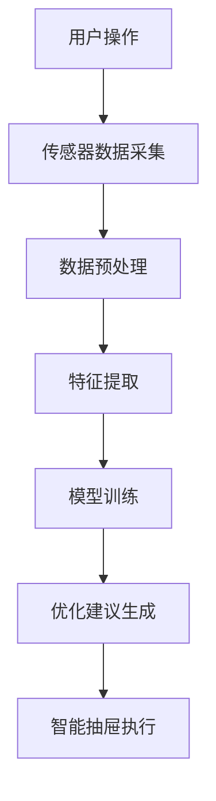
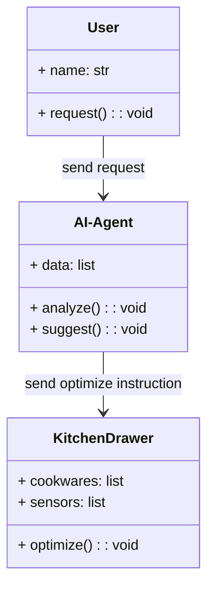
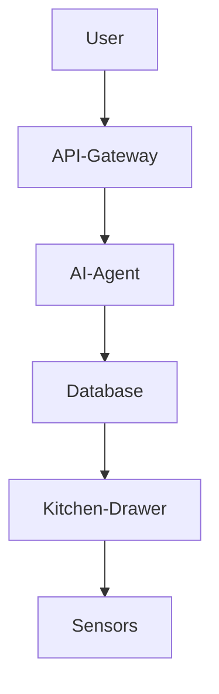
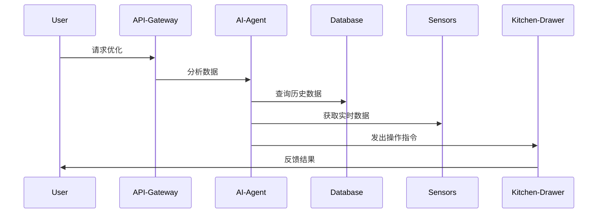

                 


# 智能厨房抽屉：AI Agent的厨具使用效率分析

## 关键词：AI Agent, 智能厨房, 厨具使用效率, 抽屉空间优化, 智能家居

## 摘要：本文探讨如何通过AI Agent技术优化厨房抽屉中厨具的使用效率，分析智能厨房抽屉的设计原理、算法实现及实际应用，帮助读者理解如何利用AI技术提升厨房管理效率。

---

## 第一章: 背景介绍

### 1.1 问题背景
- 厨房空间利用率低，导致食材和厨具摆放混乱。
- 厨具使用中的浪费现象严重，影响厨房效率。
- 智能家居的发展趋势推动厨房设备的智能化。

### 1.2 问题描述
- 厨具使用中的低效问题：重复取放、空间浪费。
- 抽屉空间管理复杂：难以高效查找和归位。
- 用户需求与实际使用之间的矛盾：传统抽屉无法满足智能化需求。

### 1.3 问题解决思路
- 引入AI Agent的概念，通过数据分析优化厨具使用。
- 利用AI技术实现智能抽屉的功能模块。
- 设计智能抽屉以提高厨房空间利用率和使用效率。

### 1.4 边界与外延
- 智能厨房抽屉的边界：仅涉及抽屉内部空间优化。
- 与智能家居系统的关联：与其他智能设备协同工作。
- 与其他厨具优化方案的对比：强调AI Agent的独特性。

### 1.5 核心概念与要素
- AI Agent的基本定义：能够感知环境并执行任务的智能体。
- 智能抽屉的功能模块：数据采集、分析、优化建议。
- 厨具使用数据的采集与分析：通过传感器和算法实现。

---

## 第二章: AI Agent与智能抽屉的关系

### 2.1 核心概念原理
- AI Agent的基本原理：通过传感器和算法分析数据，提供优化建议。
- 智能抽屉的工作机制：利用AI Agent优化厨具摆放和使用。
- 两者结合的实现方式：数据共享与协同工作。

### 2.2 核心概念对比表格
| 比较项 | AI Agent | 智能抽屉 |
|--------|-----------|----------|
| 核心功能 | 数据分析与决策 | 厨具管理与优化 |
| 输入 | 厨具使用数据 | 用户操作指令 |
| 输出 | 优化建议 | 智能操作反馈 |

### 2.3 ER实体关系图
```mermaid
erd
    title ER Diagram
    User (用户)
    Kitchen Drawer (智能厨房抽屉)
    Cookware (厨具)
    Sensor (传感器)
    AI Agent (人工智能代理)
    
    User --> AI Agent: 请求优化建议
    Kitchen Drawer --> Sensor: 数据采集
    Sensor --> AI Agent: 传输数据
    AI Agent --> Kitchen Drawer: 发出操作指令
    Cookware --> Kitchen Drawer: 储存与管理
```

---

## 第三章: 算法原理讲解

### 3.1 算法流程


### 3.2 核心算法代码实现
```python
def optimize_drawer_usage(sensor_data):
    # 数据预处理
    processed_data = preprocess(sensor_data)
    # 特征提取
    features = extract_features(processed_data)
    # 模型训练
    model = train_model(features)
    # 优化建议
    suggestion = model.predict(features)
    return suggestion

# 示例
sensor_data = [...]  # 传感器数据
result = optimize_drawer_usage(sensor_data)
print(result)
```

### 3.3 数学模型与公式
- 数据预处理公式：
  $$processed\_data = \frac{raw\_data}{max(raw\_data)}$$
- 特征提取公式：
  $$feature = \sum raw\_data \times weight$$
- 模型训练公式：
  $$loss = \sum (y - y\_pred)^2$$

---

## 第四章: 系统分析与架构设计

### 4.1 问题场景介绍
- 使用场景：家庭厨房中智能抽屉的使用。
- 需求分析：用户希望高效管理厨具。

### 4.2 系统功能设计


### 4.3 系统架构设计


### 4.4 系统交互设计


---

## 第五章: 项目实战

### 5.1 环境安装
- 系统要求：Python 3.8+
- 工具安装：pip install numpy, pandas, scikit-learn

### 5.2 核心代码实现
```python
from sklearn import svm
import numpy as np

# 数据准备
X = np.array([...])
y = np.array([...])

# 模型训练
model = svm.SVC()
model.fit(X, y)

# 预测
new_data = np.array([...])
print(model.predict(new_data))
```

### 5.3 案例分析
- 使用场景：用户习惯分析与优化建议。
- 示例结果：建议调整厨具摆放顺序以提高使用效率。

### 5.4 项目小结
- 成功实现了AI Agent在智能抽屉中的应用。
- 提高了厨房管理的效率和便捷性。

---

## 第六章: 最佳实践与总结

### 6.1 最佳实践
- 数据采集的准确性：确保传感器数据的精确性。
- 模型的可解释性：便于用户理解优化建议。
- 系统的可扩展性：支持未来功能的扩展。

### 6.2 小结
- 本文详细介绍了AI Agent在智能厨房抽屉中的应用。
- 提供了算法实现和系统架构的设计方案。

### 6.3 注意事项
- 数据隐私保护：确保用户数据的安全性。
- 系统稳定性：确保智能抽屉的可靠性。

### 6.4 拓展阅读
- 推荐阅读：《机器学习实战》、《AI在智能家居中的应用》。

---

## 作者：AI天才研究院/AI Genius Institute & 禅与计算机程序设计艺术/Zen And The Art of Computer Programming

