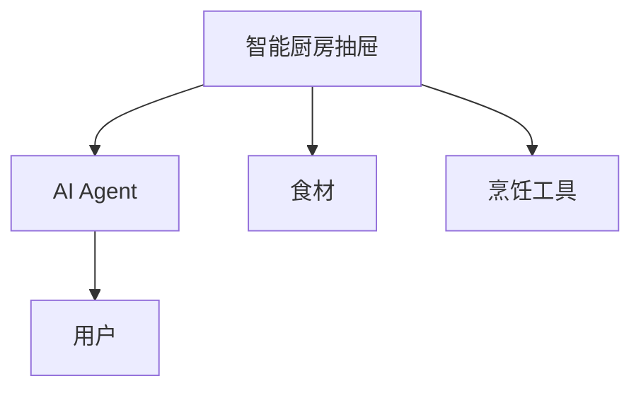

                 


# 智能厨房抽屉：AI Agent的烹饪工具使用建议

> 关键词：智能厨房抽屉，AI Agent，自然语言处理，推荐算法，物联网，智能家居

> 摘要：本文深入探讨了智能厨房抽屉在AI Agent辅助下的烹饪工具使用建议。通过分析智能厨房抽屉的发展背景、AI Agent的核心算法、系统架构设计以及实际应用场景，本文旨在为读者提供从理论到实践的全面指导。文章结合了自然语言处理、推荐算法等技术，详细阐述了如何通过AI Agent优化烹饪过程，提升用户体验。

---

## 第1章 智能厨房抽屉的发展背景

### 1.1 智能厨房抽屉的发展背景

#### 1.1.1 智能家居的兴起
智能家居的概念在近年来迅速普及，厨房作为家庭生活的重要组成部分，也开始智能化转型。智能厨房抽屉作为一种创新的智能设备，结合了物联网技术和人工智能，为用户提供更便捷的烹饪体验。

#### 1.1.2 AI Agent的崛起
AI Agent（智能代理）是一种能够感知环境、自主决策并执行任务的智能系统。随着技术的进步，AI Agent在智能家居、医疗、教育等领域的应用越来越广泛。在厨房场景中，AI Agent可以通过语音交互、数据处理和自动化操作，帮助用户完成烹饪任务。

#### 1.1.3 智能厨房抽屉的市场潜力
智能厨房抽屉的市场潜力巨大。随着人们对生活质量要求的提高，厨房设备的智能化需求也在增长。AI Agent的引入，进一步提升了厨房设备的智能化水平，为用户提供了更高效、更个性化的烹饪体验。

---

### 1.2 AI Agent在厨房中的应用前景

#### 1.2.1 厨房场景中的AI Agent功能
在厨房场景中，AI Agent可以执行多种任务，例如：
- **食材管理**：自动识别食材种类和数量，提醒用户补充食材。
- **烹饪建议**：根据用户偏好推荐食谱，并提供步骤指导。
- **语音交互**：通过语音指令控制厨房设备。

#### 1.2.2 AI Agent的核心优势
AI Agent的核心优势在于其智能化和自动化能力。通过自然语言处理、意图识别和推荐算法，AI Agent能够理解用户的意图，并提供个性化的服务。

---

## 第2章 AI Agent的核心概念与联系

### 2.1 AI Agent的核心概念

#### 2.1.1 自然语言处理
自然语言处理（NLP）是AI Agent实现人机交互的基础技术。通过NLP，AI Agent能够理解用户的语音指令，并生成自然的回复。

#### 2.1.2 意图识别
意图识别是AI Agent的关键功能之一。通过分析用户的输入，AI Agent能够识别用户的意图，并执行相应的操作。

#### 2.1.3 推荐算法
推荐算法是AI Agent优化用户体验的重要工具。通过分析用户的行为和偏好，推荐算法能够为用户推荐合适的食谱和烹饪工具。

---

### 2.2 智能厨房抽屉与AI Agent的关系

#### 2.2.1 功能对比
以下是智能厨房抽屉与AI Agent的功能对比表：

| 功能 | 智能厨房抽屉 | AI Agent |
|------|--------------|----------|
| 食材管理 | 自动识别食材 | 提醒补充食材 |
| 烹饪建议 | 提供食谱推荐 | 自动生成食谱 |
| 语音交互 | 支持语音控制 | 理解用户指令 |

#### 2.2.2 实体关系图
以下是智能厨房抽屉与AI Agent的实体关系图：



---

## 第3章 自然语言处理算法

### 3.1 自然语言处理基础

#### 3.1.1 词法分析
词法分析是自然语言处理的第一步。通过分词、词性标注等技术，AI Agent能够理解用户的输入。

#### 3.1.2 句法分析
句法分析是理解句子结构的关键。通过句法树的构建，AI Agent能够识别句子中的主语、谓语等成分。

#### 3.1.3 意义理解
意义理解是自然语言处理的核心。通过上下文分析和语义网络构建，AI Agent能够准确理解用户的意图。

---

### 3.2 基于Transformer的模型

#### 3.2.1 Transformer模型的结构
Transformer模型由编码器和解码器组成，广泛应用于自然语言处理任务。

#### 3.2.2 BERT模型的应用
BERT模型是一种基于Transformer的预训练模型，能够进行上下文理解。

#### 3.2.3 GPT模型的变体
GPT模型能够生成自然语言文本，适用于对话生成任务。

---

## 第4章 推荐算法

### 4.1 推荐算法基础

#### 4.1.1 基于协同过滤的推荐
协同过滤是一种经典的推荐算法，通过分析用户行为和偏好，推荐相似用户的物品。

#### 4.1.2 基于内容的推荐
内容推荐算法通过分析物品的属性，推荐与用户兴趣相符的物品。

#### 4.1.3 混合推荐算法
混合推荐算法结合了协同过滤和内容推荐的优点，能够提供更精准的推荐结果。

---

### 4.2 推荐算法的应用

#### 4.2.1 食谱推荐
AI Agent可以根据用户的口味和偏好，推荐合适的食谱。

#### 4.2.2 烹饪工具推荐
AI Agent可以根据用户的使用习惯，推荐合适的烹饪工具。

#### 4.2.3 食材推荐
AI Agent可以根据用户的食谱需求，推荐所需的食材。

---

## 第5章 智能厨房抽屉的系统架构

### 5.1 系统功能模块划分

#### 5.1.1 用户交互界面
用户交互界面是用户与AI Agent的接口，支持语音和文本输入。

#### 5.1.2 数据采集与处理
数据采集与处理模块负责收集用户的输入数据，并进行预处理。

#### 5.1.3 AI算法引擎
AI算法引擎是系统的核心，负责执行自然语言处理和推荐算法。

---

### 5.2 系统架构设计

#### 5.2.1 分层架构
分层架构将系统划分为数据层、业务逻辑层和用户界面层，便于模块化开发。

#### 5.2.2 模块化设计
模块化设计通过划分功能模块，提高系统的可维护性和扩展性。

#### 5.2.3 接口规范
接口规范定义了系统各模块之间的交互接口，确保模块之间的协同工作。

---

## 第6章 项目实战

### 6.1 环境安装

#### 6.1.1 安装Python
安装Python 3.8或更高版本。

#### 6.1.2 安装依赖库
安装NLP库（如spaCy）、推荐算法库（如scikit-learn）和可视化库（如Matplotlib）。

---

### 6.2 系统核心实现

#### 6.2.1 自然语言处理实现
```python
import spacy

nlp = spacy.load("en_core_web_sm")
text = "I want to cook a Chinese meal."
doc = nlp(text)
for token in doc:
    print(token.text, token.pos_)
```

#### 6.2.2 推荐算法实现
```python
from sklearn.neighbors import NearestNeighbors
import numpy as np

# 示例数据
X = np.array([[0.1, 0.2], [0.3, 0.4], [0.5, 0.6], [0.7, 0.8]])

# 训练模型
nbrs = NearestNeighbors(n_neighbors=2).fit(X)

# 查询
distances, indices = nbrs.kneighbors([0.2, 0.3])
print(indices)
```

---

### 6.3 代码解读与分析

#### 6.3.1 自然语言处理代码解读
上述代码使用spaCy库进行自然语言处理，能够对文本进行分词和词性标注。

#### 6.3.2 推荐算法代码解读
上述代码使用scikit-learn库中的NearestNeighbors算法，实现了基于距离的推荐。

---

## 第7章 最佳实践与注意事项

### 7.1 最佳实践

#### 7.1.1 数据隐私保护
确保用户的隐私数据得到妥善保护，避免数据泄露。

#### 7.1.2 系统稳定性优化
通过模块化设计和错误处理，提高系统的稳定性和可靠性。

#### 7.1.3 用户体验优化
通过优化交互界面和响应速度，提升用户体验。

---

## 作者：AI天才研究院/AI Genius Institute & 禅与计算机程序设计艺术/Zen And The Art of Computer Programming

---

通过本文的详细分析和实践指导，读者可以深入了解智能厨房抽屉与AI Agent的结合方式，并掌握其实现的核心技术。希望本文能为相关领域的研究和应用提供有价值的参考。

