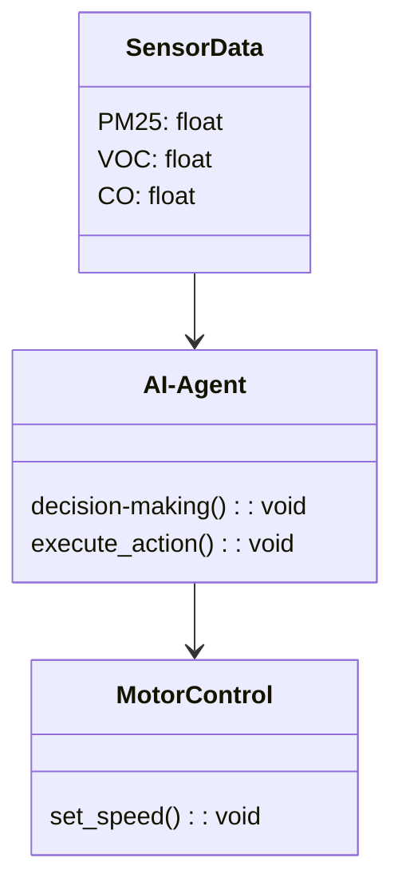
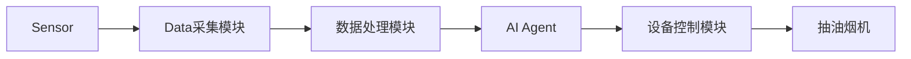
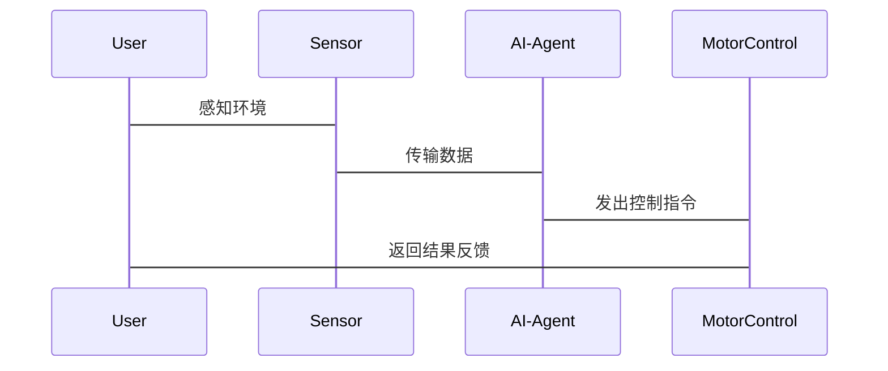

                 


# 智能厨房抽油烟机：AI Agent的空气质量控制

> 关键词：智能厨房抽油烟机、AI Agent、空气质量控制、物联网、传感器数据

> 摘要：本文探讨了智能厨房抽油烟机如何利用AI Agent实现空气质量的智能控制。通过分析空气质量监测的核心算法、系统架构设计、项目实战与最佳实践，本文深入剖析了AI技术在智能家居中的应用，为开发者和用户提供了一种全新的厨房空气质量管理解决方案。

---

# 第一部分: 智能厨房抽油烟机与AI Agent概述

# 第1章: 智能厨房抽油烟机与空气质量控制背景

## 1.1 智能厨房抽油烟机的背景与现状

### 1.1.1 厨房环境与空气质量问题
厨房环境中的油烟、异味和有害气体对家庭健康构成潜在威胁。传统抽油烟机依赖手动操作，无法实时感知和优化空气质量，存在效率低、能耗高等问题。

### 1.1.2 传统抽油烟机的局限性
- **手动控制**：用户需手动开启或调整风速，无法根据实际空气质量自动调节。
- **单一功能**：传统抽油烟机仅能排除油烟，无法监测和改善厨房整体空气质量。
- **能耗问题**：长时间运行高风速可能导致能源浪费。

### 1.1.3 智能化与AI技术的引入
通过引入AI技术，智能抽油烟机能够实时监测空气质量，自动调整运行模式，实现高效、节能的目标。

---

## 1.2 AI Agent在智能设备中的应用

### 1.2.1 AI Agent的基本概念
AI Agent（智能代理）是一种能够感知环境、自主决策并执行任务的智能实体。它可以理解用户需求、优化系统性能并与其他设备协同工作。

### 1.2.2 AI Agent在智能家居中的作用
- **智能决策**：AI Agent能够根据环境数据和用户偏好做出最优决策。
- **实时反馈**：通过传感器数据实时调整设备运行状态。
- **协同工作**：与智能家居中的其他设备（如空调、净化器）联动，共同优化室内空气质量。

### 1.2.3 智能厨房设备的智能化趋势
未来的厨房设备将更加智能化，AI Agent将成为连接各类厨房设备的核心枢纽，实现厨房环境的智能化管理。

---

## 1.3 本章小结

本章介绍了智能厨房抽油烟机的背景与现状，分析了传统抽油烟机的局限性，并提出了通过AI Agent实现智能空气质量控制的解决方案。

---

# 第二部分: AI Agent与空气质量控制的核心概念

# 第2章: AI Agent与空气质量控制的核心原理

## 2.1 AI Agent的基本原理

### 2.1.1 AI Agent的定义与分类
- **定义**：AI Agent是一种能够感知环境、自主决策并执行任务的智能实体。
- **分类**：根据智能水平可分为简单反射型、基于模型的反应型、目标驱动型和效用驱动型。

### 2.1.2 AI Agent的核心功能与特性
- **核心功能**：感知、决策、执行。
- **特性**：自主性、反应性、目标导向性。

### 2.1.3 AI Agent与智能设备的交互机制
AI Agent通过传感器获取环境数据，结合预设规则或机器学习模型做出决策，并通过执行器（如电机）调整设备运行状态。

---

## 2.2 空气质量监测与控制原理

### 2.2.1 空气质量监测的主要指标
- **PM2.5**：细颗粒物浓度。
- **VOC**：挥发性有机化合物浓度。
- **CO**：一氧化碳浓度。
- **温湿度**：环境温湿度对空气质量有重要影响。

### 2.2.2 传感器数据的采集与处理
- **数据采集**：通过多种传感器（如PM2.5传感器、VOC传感器）实时采集环境数据。
- **数据预处理**：清洗、去噪和特征提取。

### 2.2.3 空气质量的智能分析与优化
- **智能分析**：基于机器学习模型预测空气质量指数。
- **优化控制**：AI Agent根据预测结果动态调整抽油烟机运行模式。

---

## 2.3 AI Agent在空气质量控制中的应用

### 2.3.1 数据驱动的空气质量优化
AI Agent通过分析历史数据，学习用户习惯和环境特征，优化空气质量控制策略。

### 2.3.2 基于AI的智能决策机制
- **规则驱动**：基于预设规则进行简单决策。
- **学习驱动**：通过机器学习模型实现复杂决策。

### 2.3.3 系统的实时反馈与调整
AI Agent能够实时接收环境反馈，动态调整运行策略，确保空气质量始终处于最优状态。

---

## 2.4 本章小结

本章详细介绍了AI Agent的核心原理及其在空气质量控制中的应用，为后续的算法实现和系统设计奠定了理论基础。

---

# 第三部分: AI Agent空气质量控制的算法与实现

# 第3章: 空气质量监测算法原理

## 3.1 数据采集与预处理

### 3.1.1 传感器数据的采集流程
- **传感器选择**：选用高灵敏度、低延迟的传感器。
- **数据采集**：通过物联网协议（如MQTT）将传感器数据传输到云端或本地计算单元。

### 3.1.2 数据清洗与特征提取
- **数据清洗**：去除异常值和噪声数据。
- **特征提取**：提取关键特征（如PM2.5浓度、VOC浓度）用于后续分析。

### 3.1.3 数据的标准化与归一化
- **标准化**：将数据标准化到统一的范围内。
- **归一化**：消除量纲影响，确保模型输入一致。

---

## 3.2 空气质量预测模型

### 3.2.1 基于机器学习的预测模型
- **模型选择**：常用随机森林、支持向量机（SVM）或神经网络模型。
- **模型训练**：利用历史数据训练模型，得到空气质量预测函数。
- **模型优化**：通过交叉验证调整模型参数，提升预测精度。

### 3.2.2 模型训练与优化
- **训练数据**：使用标注的空气质量数据进行训练。
- **优化方法**：采用网格搜索或贝叶斯优化方法选择最优模型。

### 3.2.3 模型的评估与验证
- **评估指标**：使用均方误差（MSE）、R²系数等指标评估模型性能。
- **验证方法**：通过留出法或交叉验证评估模型泛化能力。

---

## 3.3 AI Agent的决策算法

### 3.3.1 基于规则的决策算法
- **规则定义**：根据空气质量指数设置不同的运行模式（如低速、高速）。
- **规则执行**：当空气质量指数超过阈值时，触发对应运行模式。

### 3.3.2 基于强化学习的决策算法
- **状态空间**：空气质量指数、设备运行状态等。
- **动作空间**：设备运行模式（低速、中速、高速）。
- **奖励机制**：通过奖励函数优化决策策略。

### 3.3.3 算法的实现与优化
- **实现步骤**：数据采集→状态识别→决策推理→执行动作。
- **优化方法**：通过在线学习优化决策策略，提升系统响应速度。

---

## 3.4 本章小结

本章详细讲解了空气质量监测算法的实现过程，包括数据预处理、模型训练与优化，以及AI Agent的决策算法设计。

---

# 第四部分: 系统架构与设计

# 第4章: 智能厨房抽油烟机的系统架构

## 4.1 系统功能模块划分

### 4.1.1 数据采集模块
- **功能**：采集环境数据（PM2.5、VOC、CO等）。
- **实现**：通过传感器采集数据，并通过物联网协议传输。

### 4.1.2 数据处理模块
- **功能**：对采集的数据进行预处理和特征提取。
- **实现**：使用Python编写数据清洗和特征提取代码。

### 4.1.3 AI Agent决策模块
- **功能**：根据空气质量数据做出决策。
- **实现**：基于机器学习模型实现智能决策。

### 4.1.4 设备控制模块
- **功能**：根据AI Agent决策结果控制抽油烟机运行。
- **实现**：通过PWM或继电器控制电机转速。

---

## 4.2 系统架构设计

### 4.2.1 领域模型类图


### 4.2.2 系统架构图


---

## 4.3 系统接口设计

### 4.3.1 数据接口
- **输入接口**：传感器数据接口。
- **输出接口**：决策结果输出接口。

### 4.3.2 设备接口
- **输入接口**：AI Agent决策结果。
- **输出接口**：设备运行状态反馈。

---

## 4.4 系统交互流程

### 4.4.1 交互流程图


---

## 4.5 本章小结

本章详细设计了智能厨房抽油烟机的系统架构，包括功能模块划分、系统架构图和交互流程图，为后续的系统实现奠定了基础。

---

# 第五部分: 项目实战

# 第5章: 智能厨房抽油烟机的项目实现

## 5.1 环境安装与配置

### 5.1.1 硬件设备
- **传感器**：PM2.5传感器、VOC传感器。
- **物联网模块**：ESP32或Raspberry Pi。
- **执行器**：步进电机或DC电机。

### 5.1.2 软件工具
- **开发环境**：Python、Jupyter Notebook。
- **物联网平台**：MQTT协议。

---

## 5.2 系统核心实现

### 5.2.1 数据采集代码
```python
import paho.mqtt.client as mqtt

# 传感器数据采集函数
def on_message(client, userdata, message):
    data = message.payload.decode()
    print(f"接收到数据: {data}")
    return data

client = mqtt.Client()
client.on_message = on_message
client.connect("localhost", 1883)
client.subscribe("kitchen/sensors")
client.loop_forever()
```

### 5.2.2 AI Agent决策代码
```python
import pandas as pd
from sklearn.ensemble import RandomForestRegressor

# 数据加载与预处理
data = pd.read_csv('air_quality.csv')
X = data[['PM25', 'VOC', 'CO']]
y = data['AQI']

# 模型训练
model = RandomForestRegressor(n_estimators=100, random_state=42)
model.fit(X, y)

# 决策函数
def decide_action(current_AQI):
    if current_AQI > 100:
        return 'high'
    elif current_AQI > 75:
        return 'medium'
    else:
        return 'low'
```

### 5.2.3 设备控制代码
```python
import RPi.GPIO as GPIO

# 电机控制函数
def set_motor_speed(speed):
    GPIO.output(motor_pin, speed)
    return

# 执行决策
action = decide_action(predicted_AQI)
set_motor_speed(action_to_speed[action])
```

---

## 5.3 项目总结与优化

### 5.3.1 项目总结
通过本项目，我们实现了基于AI Agent的智能厨房抽油烟机空气质量控制系统，能够实时监测环境数据并自动调整设备运行状态。

### 5.3.2 系统优化
- **优化传感器数据采集频率**：提高数据采集频率，减少环境变化的延迟。
- **优化模型性能**：使用更复杂的模型（如LSTM）提升空气质量预测精度。
- **优化决策策略**：结合实时反馈进一步优化AI Agent的决策算法。

---

## 5.4 本章小结

本章通过实际项目案例详细讲解了智能厨房抽油烟机的实现过程，包括环境配置、核心代码实现和系统优化方法。

---

# 第六部分: 最佳实践与总结

# 第6章: 最佳实践与总结

## 6.1 小结

通过本文的系统讲解，我们深入剖析了智能厨房抽油烟机的空气质量控制实现过程，包括AI Agent的核心原理、系统架构设计和项目实战。

---

## 6.2 注意事项

- **数据安全**：确保传感器数据的安全传输和存储。
- **设备兼容性**：确保系统兼容不同品牌和类型的传感器和执行器。
- **用户隐私**：保护用户隐私数据，避免数据泄露。

---

## 6.3 拓展阅读

- **AI Agent在智能家居中的应用**：进一步了解AI Agent在智能家居中的其他应用场景。
- **空气质量优化算法**：研究更高效的空气质量优化算法，如强化学习和深度学习。
- **物联网安全**：学习物联网设备的安全防护知识，确保系统安全可靠。

---

# 作者

作者：AI天才研究院/AI Genius Institute & 禅与计算机程序设计艺术/Zen And The Art of Computer Programming

---

通过本文的系统讲解，我们深入剖析了智能厨房抽油烟机的空气质量控制实现过程，为开发者和用户提供了一种全新的厨房空气质量管理解决方案。

