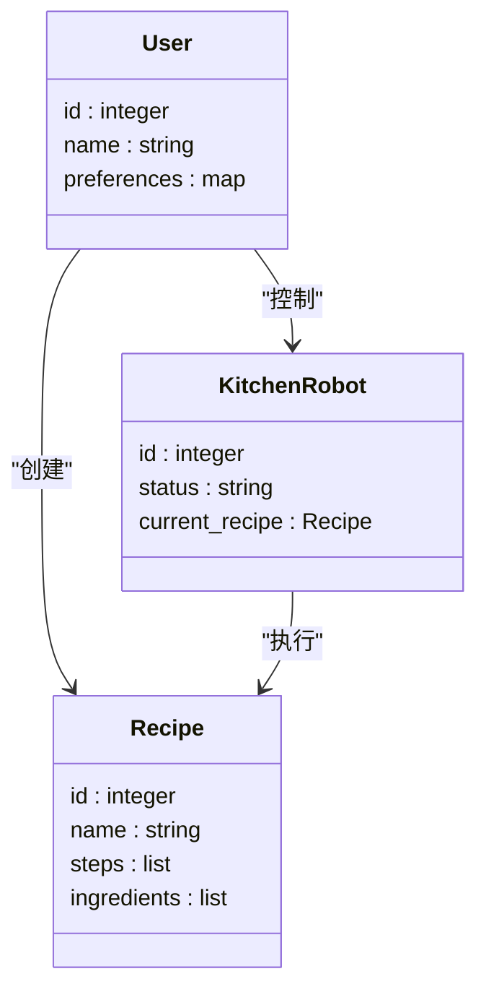

                 


```markdown
# 智能厨房机器人：AI Agent的烹饪技巧指导

> 关键词：智能厨房机器人, AI代理, 烹饪技巧, 人工智能, 物联网, 自然语言处理

> 摘要：本文章深入探讨了智能厨房机器人在现代烹饪中的应用，结合AI代理的技术原理，详细介绍了其在智能厨房中的功能实现、系统架构设计以及实际项目应用。文章从背景介绍、核心概念、技术实现、系统架构、项目实战、优化与扩展，到总结与展望，全面解析了智能厨房机器人的工作原理和实际应用，为读者提供了从理论到实践的全面指导。

---

## 第一章 智能厨房机器人的背景与概念

### 1.1 智能厨房机器人的定义与现状
#### 1.1.1 智能厨房机器人的定义
智能厨房机器人是一种结合了人工智能和自动化技术的厨房设备，能够根据用户需求自动执行烹饪任务，优化烹饪过程并提供个性化的烹饪建议。

#### 1.1.2 当前市场中的智能厨房机器人现状
目前，市场上的智能厨房机器人主要以辅助烹饪为主，具备自动加热、搅拌、切割等功能，部分产品还支持语音控制和远程操作。

#### 1.1.3 智能厨房机器人与传统烹饪方式的对比
智能厨房机器人相较于传统烹饪方式，具有高效、精准、便捷的特点，能够显著提高烹饪效率并减少人为错误。

### 1.2 AI代理在智能厨房中的应用
#### 1.2.1 AI代理的基本概念
AI代理是一种能够感知环境并采取行动以实现目标的智能实体，能够与用户交互并执行复杂任务。

#### 1.2.2 AI代理在智能厨房中的角色
AI代理在智能厨房中主要负责处理用户指令、优化烹饪步骤、推荐食谱以及监控烹饪过程。

#### 1.2.3 AI代理如何优化烹饪过程
通过自然语言处理和机器学习技术，AI代理能够理解用户的烹饪需求，优化烹饪步骤，提供个性化建议，并实时调整烹饪参数以确保最佳烹饪效果。

### 1.3 智能厨房机器人的技术背景
#### 1.3.1 人工智能技术的发展
人工智能技术的进步为智能厨房机器人的发展提供了坚实的基础，包括自然语言处理、计算机视觉和机器学习等领域的技术突破。

#### 1.3.2 物联网技术在厨房中的应用
物联网技术使得智能厨房机器人能够与家庭网络、智能家居设备以及其他厨房设备无缝连接，实现智能化管理和协同工作。

#### 1.3.3 智能厨房机器人的发展趋势
随着技术的不断进步，智能厨房机器人将朝着更加智能化、个性化和便捷化的方向发展，逐步成为家庭烹饪的重要助手。

### 1.4 本章小结
本章介绍了智能厨房机器人的定义、现状及与传统烹饪方式的对比，探讨了AI代理在智能厨房中的角色及其优化烹饪过程的作用，并总结了智能厨房机器人的技术背景和发展趋势。

---

## 第二章 智能厨房机器人中的核心概念

### 2.1 AI代理的核心原理
#### 2.1.1 AI代理的基本原理
AI代理通过感知环境、理解用户需求并采取相应行动来实现任务目标，其核心在于智能理解和决策能力。

#### 2.1.2 AI代理的类型与特点
AI代理可以分为基于规则的代理和基于学习的代理，前者通过预定义规则进行决策，后者通过机器学习模型不断优化决策能力。

#### 2.1.3 AI代理与智能厨房机器人的结合
智能厨房机器人中的AI代理通过自然语言处理和计算机视觉技术，能够理解和识别用户的指令，并根据上下文进行推理和决策。

### 2.2 智能厨房机器人的系统架构
#### 2.2.1 系统架构的组成
智能厨房机器人系统主要包括用户交互模块、烹饪执行模块、环境感知模块和系统管理模块。

#### 2.2.2 各模块的功能与交互
- 用户交互模块负责接收用户的指令并进行反馈。
- 烹饪执行模块负责执行具体的烹饪任务，如加热、搅拌等。
- 环境感知模块用于感知厨房环境和食材状态，确保烹饪过程的顺利进行。
- 系统管理模块负责系统的整体协调和资源管理。

#### 2.2.3 系统架构的优缺点
优点：模块化设计使得系统易于扩展和维护；各模块的独立性提高了系统的可靠性和可维护性。
缺点：模块之间的交互可能增加系统的复杂性，需要精细的协同设计。

### 2.3 核心概念的ER实体关系图
```mermaid
erDiagram
    user {
        id : integer
        name : string
        role : string
    }
    recipe {
        id : integer
        name : string
        steps : list
    }
    kitchen_robot {
        id : integer
        model : string
        status : string
    }
    ingredient {
        id : integer
        name : string
        quantity : integer
    }
    user -> recipe : "创建"
    user -> kitchen_robot : "控制"
    recipe -> ingredient : "使用"
    kitchen_robot -> ingredient : "处理"
```

### 2.4 本章小结
本章详细阐述了智能厨房机器人中的AI代理核心概念，分析了其系统架构的组成与功能，并通过ER实体关系图展示了各模块之间的关系，为后续的技术实现奠定了基础。

---

## 第三章 智能厨房机器人的技术实现

### 3.1 自然语言处理技术
#### 3.1.1 自然语言处理的定义与作用
自然语言处理（NLP）技术使智能厨房机器人能够理解和处理用户的自然语言指令，实现人机交互。

#### 3.1.2 基于NLP的烹饪指令解析
通过NLP技术，智能厨房机器人能够准确解析用户的烹饪需求，例如“做一份番茄炒蛋”可以解析为具体的烹饪步骤。

#### 3.1.3 NLP技术的数学模型
使用词袋模型（Bag-of-Words）或更高级的变换器模型（如BERT）进行文本表示和分类。

```latex
$$ \text{词袋模型：} \quad \text{句子} = \{ \text{单词}_1, \text{单词}_2, \ldots, \text{单词}_n \} $$
```

### 3.2 计算机视觉技术
#### 3.2.1 计算机视觉的定义与应用
计算机视觉技术使智能厨房机器人能够识别和分析厨房环境及食材的状态。

#### 3.2.2 基于视觉的食材识别
通过摄像头和图像识别算法，智能厨房机器人可以识别食材种类和数量，确保烹饪的准确性和一致性。

#### 3.2.3 视觉识别的数学模型
使用卷积神经网络（CNN）进行图像分类和目标检测。

```latex
$$ \text{CNN结构：} \quad \text{卷积层} \rightarrow \text{池化层} \rightarrow \text{全连接层} $$
```

### 3.3 推荐算法
#### 3.3.1 推荐算法的定义与作用
推荐算法用于智能厨房机器人根据用户的偏好和饮食习惯推荐合适的食谱。

#### 3.3.2 基于协同过滤的推荐
通过分析用户的烹饪历史和偏好，推荐相似用户的食谱。

#### 3.3.3 基于内容的推荐
基于食谱的标签、成分和步骤进行推荐，确保推荐结果与用户需求高度匹配。

### 3.4 本章小结
本章详细介绍了智能厨房机器人中的关键技术实现，包括自然语言处理、计算机视觉和推荐算法，并通过数学模型和算法流程图展示了其实现原理。

---

## 第四章 智能厨房机器人的系统设计

### 4.1 系统架构设计
#### 4.1.1 领域模型设计
通过领域模型（Domain Model）定义系统的核心实体及其关系。



#### 4.1.2 数据流设计
系统中的数据流包括用户指令、食谱信息、食材状态和烹饪结果等。

#### 4.1.3 系统架构图
```mermaid
archiDiagram
    component User_Interface {
        GUI
        NLP_Processor
    }
    component Recipe_Management {
        Recipe_Database
        Recommendation_System
    }
    component Cooking_Control {
        Kitchen_Robot
        Vision_Sensor
    }
    User_Interface --> Recipe_Management : "请求食谱"
    Recipe_Management --> Cooking_Control : "发送指令"
    Cooking_Control --> User_Interface : "反馈结果"
```

### 4.2 系统接口设计
#### 4.2.1 用户接口设计
用户通过图形界面或语音指令与系统交互，系统解析指令并传递给烹饪模块。

#### 4.2.2 烹饪模块接口设计
烹饪模块接收指令后，通过物联网设备执行具体的烹饪操作，并实时反馈执行状态。

#### 4.2.3 接口交互协议
采用RESTful API进行系统内部的通信，确保各模块之间的高效协同。

### 4.3 系统交互设计
#### 4.3.1 用户发起烹饪请求
用户通过界面或语音指令输入烹饪需求，系统解析指令并生成烹饪计划。

#### 4.3.2 系统执行烹饪步骤
系统根据生成的烹饪计划，通过物联网设备执行加热、搅拌等操作。

#### 4.3.3 烹饪完成后反馈结果
烹饪完成后，系统向用户反馈结果，并提示是否需要清理或保存食谱信息。

### 4.4 本章小结
本章通过领域模型和系统架构图展示了智能厨房机器人的系统设计，详细阐述了数据流设计、系统接口设计和系统交互设计，并通过协议和流程图展示了系统的实现细节。

---

## 第五章 智能厨房机器人的项目实战

### 5.1 环境搭建
#### 5.1.1 开发环境的选择
选择适合的开发环境，如Python编程语言、TensorFlow机器学习框架和ROS机器人操作系统。

#### 5.1.2 依赖库的安装
安装必要的库和工具，如自然语言处理库（spaCy）、计算机视觉库（OpenCV）和物联网通信库（MQTT）。

#### 5.1.3 硬件设备的配置
配置必要的硬件设备，如摄像头、传感器和物联网设备，确保系统能够正常运行。

### 5.2 系统核心实现
#### 5.2.1 用户指令解析
编写代码实现自然语言处理功能，解析用户的烹饪指令并生成烹饪步骤。

#### 5.2.2 食材识别与处理
使用计算机视觉技术实现食材的识别和处理，确保烹饪过程的准确性。

#### 5.2.3 烹饪过程控制
通过物联网协议控制厨房设备的运行，实现烹饪步骤的自动化执行。

### 5.3 代码实现与解读
#### 5.3.1 自然语言处理代码
```python
import spacy

nlp = spacy.load("en_core_web_sm")
doc = nlp("做一份番茄炒蛋")
for token in doc:
    print(token.text, token.pos_)
```

#### 5.3.2 计算机视觉代码
```python
import cv2

cap = cv2.VideoCapture(0)
while True:
    ret, frame = cap.read()
    cv2.imshow('Video', frame)
    if cv2.waitKey(1) == ord('q'):
        break
cap.release()
cv2.destroyAllWindows()
```

#### 5.3.3 烹饪过程控制代码
```python
import paho.mqtt.client as mqtt

client = mqtt.Client("kitchen_robot")
client.connect("localhost", 1883, 60)
client.publish("cook_step", "start")
```

### 5.4 案例分析与实际操作
#### 5.4.1 案例分析
以“制作一杯咖啡”为例，详细分析系统如何解析指令、识别食材并执行烹饪步骤。

#### 5.4.2 实际操作步骤
1. 用户输入“制作一杯咖啡”。
2. 系统解析指令并生成烹饪步骤。
3. 系统识别所需食材并检查库存。
4. 系统控制咖啡机执行制作步骤。
5. 烹饪完成后，系统反馈结果并提示用户。

### 5.5 本章小结
本章通过实际的项目实战，详细讲解了智能厨房机器人的环境搭建、系统实现和实际操作过程，帮助读者更好地理解理论知识。

---

## 第六章 智能厨房机器人的优化与扩展

### 6.1 系统性能优化
#### 6.1.1 算法优化
通过优化自然语言处理和计算机视觉算法，提高系统的响应速度和准确性。

#### 6.1.2 系统架构优化
采用分布式架构和缓存技术，提升系统的扩展性和负载能力。

#### 6.1.3 多设备协同优化
通过改进物联网通信协议和设备协同策略，实现多设备的高效协同工作。

### 6.2 功能扩展
#### 6.2.1 个性化推荐扩展
基于用户的行为数据和偏好，提供更加个性化的食谱推荐和烹饪建议。

#### 6.2.2 智能监控扩展
通过安装更多的传感器和监控设备，实现对厨房环境的实时监控和智能预警。

#### 6.2.3 智能助手扩展
集成智能助手功能，如语音交互、远程控制和自动化日程管理，提升用户体验。

### 6.3 拓展案例分析
#### 6.3.1 多设备协同案例
通过智能家居设备的协同，实现从食材采购到烹饪完成的全自动化流程。

#### 6.3.2 个性化推荐案例
基于用户的饮食习惯和健康数据，推荐适合的食谱和食材搭配。

### 6.4 本章小结
本章讨论了智能厨房机器人在性能优化和功能扩展方面的策略，并通过实际案例展示了如何实现多设备协同和个性化推荐，为系统的进一步发展提供了方向。

---

## 第七章 总结与展望

### 7.1 全书总结
本文章全面介绍了智能厨房机器人的背景、核心概念、技术实现、系统设计、项目实战、优化与扩展，为读者提供了从理论到实践的系统性指导。

### 7.2 未来展望
随着人工智能和物联网技术的不断进步，智能厨房机器人将朝着更加智能化、个性化和便捷化的方向发展，未来可能会出现更多创新的功能和应用模式。

### 7.3 致谢
感谢读者的耐心阅读，感谢所有参与本书编写和支持的团队成员。

---

## 作者信息

作者：AI天才研究院/AI Genius Institute & 禅与计算机程序设计艺术 /Zen And The Art of Computer Programming

---

**注**：由于篇幅限制，本文仅为目录大纲和部分内容展示，具体内容请参见完整书籍。
```

