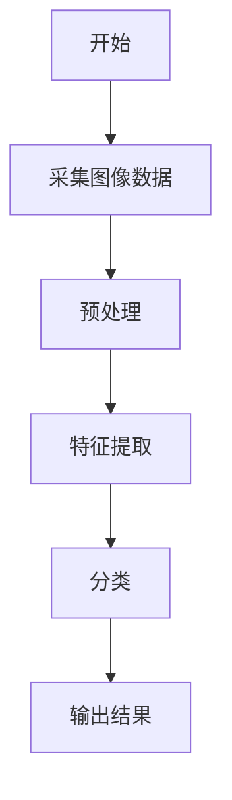
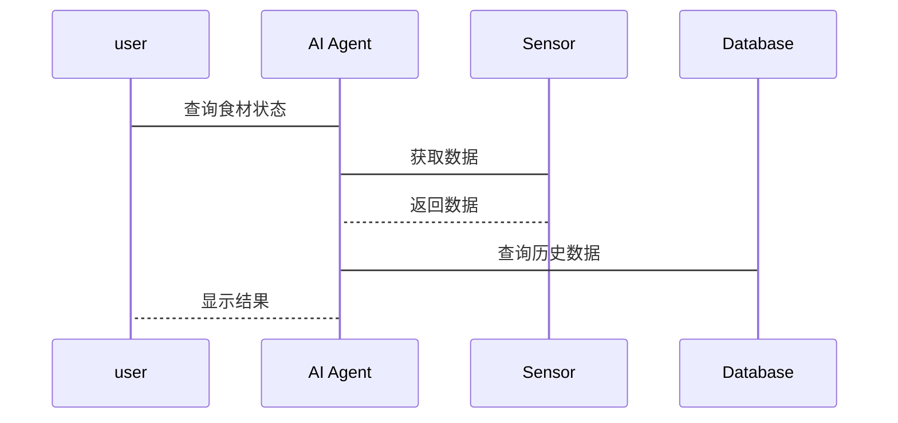

                 


# 智能厨房案板：AI Agent的食品安全监控

## 关键词
AI Agent, 食品安全, 智能厨房, 物联网, 数据分析

## 摘要
本文探讨了AI Agent在智能厨房案板中的应用，特别是在食品安全监控方面的创新解决方案。通过分析厨房环境中的食品安全挑战，结合AI技术，提出了一种智能化的监控系统，利用图像识别和数据分析等技术，实时监测食品状态，确保食品安全。文章详细介绍了AI Agent的核心算法、系统架构设计、项目实战案例，以及系统优化和扩展的策略。

# 目录大纲

1. **背景介绍**
   1.1 问题背景与描述
   1.2 问题解决与边界
   1.3 核心概念与结构

2. **核心概念与联系**
   2.1 AI Agent与食品安全监控的核心原理
   2.2 概念属性对比表格
   2.3 ER实体关系图

3. **算法原理讲解**
   3.1 图像识别算法
   3.2 数据处理算法
   3.3 算法流程图与数学模型

4. **系统架构设计**
   4.1 系统功能设计
   4.2 系统架构图
   4.3 系统接口与交互设计

5. **项目实战**
   5.1 环境搭建与数据采集
   5.2 核心代码实现
   5.3 案例分析与解读

6. **系统优化与扩展**
   6.1 系统优化策略
   6.2 系统扩展与未来发展方向

7. **总结与展望**
   7.1 全文总结
   7.2 最佳实践与注意事项
   7.3 未来研究方向

---

# 正文

## 第一部分: 背景介绍

### 第1章: 智能厨房案板与AI Agent概述

#### 1.1 问题背景与描述
厨房是家庭中食品安全的关键区域，但传统厨房管理存在诸多问题。食材容易过期、存储不当或被污染，这些问题可能导致严重的健康风险。AI Agent在厨房中的应用，可以实时监控食材状态，提供智能化的管理方案。

#### 1.2 问题解决与边界
AI Agent通过图像识别和数据分析，实时监测食材的状态，提醒用户及时处理，从而减少浪费和健康风险。解决方案的边界包括仅处理厨房环境中的食材监控，不涉及烹饪过程或其他家庭事务。

#### 1.3 核心概念与结构
AI Agent在厨房中的应用涉及传感器、摄像头和数据分析模块，通过协同工作确保食品安全。核心要素包括数据采集、处理和反馈机制。

---

## 第二部分: 核心概念与联系

### 第2章: AI Agent与食品安全监控的核心原理

#### 2.1 核心概念原理
AI Agent通过传感器和摄像头采集食材的状态数据，利用机器学习模型进行分析，识别食材是否过期或变质。

#### 2.2 概念属性对比表格
| 概念       | 学习能力 | 决策能力 | 执行能力 |
|------------|----------|----------|----------|
| AI Agent   | 高       | 强       | 可行     |
| 食品安全监控 | 数据驱动 | 模型驱动 | 规则驱动 |

#### 2.3 ER实体关系图
```mermaid
erd
    case FoodSafetyMonitoringAgent {
        id: int
        name: string
        status: string
    }
    case FoodItem {
        id: int
        name: string
        expiryDate: date
    }
    case Sensor {
        id: int
        type: string
        location: string
    }
    FoodSafetyMonitoringAgent --> FoodItem
    FoodSafetyMonitoringAgent --> Sensor
```

---

## 第三部分: 算法原理讲解

### 第3章: 算法原理

#### 3.1 图像识别算法
使用卷积神经网络（CNN）对食材进行图像分类，识别食材种类和新鲜度。模型训练使用迁移学习，提升分类准确率。

#### 3.2 数据处理算法
通过时间序列分析，预测食材的保质期，并结合温度和湿度数据，优化存储建议。

#### 3.3 算法流程图与数学模型


数学模型：
$$ \text{分类结果} = \arg\max_{i} p(y=i|x) $$
其中，$p(y=i|x)$ 表示在输入$x$的情况下，类别$i$的概率。

---

## 第四部分: 系统架构设计

### 第4章: 系统架构设计

#### 4.1 系统功能设计
系统功能包括数据采集、状态监测、异常报警和用户交互。

#### 4.2 系统架构图


#### 4.3 系统交互设计


---

## 第五部分: 项目实战

### 第5章: 项目实战

#### 5.1 环境搭建
安装Python、TensorFlow和OpenCV，配置摄像头和传感器。

#### 5.2 核心代码实现
```python
import tensorflow as tf
from tensorflow.keras import layers

model = tf.keras.Sequential([
    layers.Conv2D(32, (3,3), activation='relu', input_shape=(100,100,3)),
    layers.MaxPooling2D((2,2)),
    layers.Conv2D(64, (3,3), activation='relu'),
    layers.MaxPooling2D((2,2)),
    layers.Flatten(),
    layers.Dense(128, activation='relu'),
    layers.Dense(1, activation='sigmoid')
])

model.compile(optimizer='adam', loss='binary_crossentropy', metrics=['accuracy'])
model.fit(X_train, y_train, epochs=10, validation_data=(X_test, y_test))
```

#### 5.3 案例分析
通过实际案例展示系统如何识别过期食材并发送报警通知。

---

## 第六部分: 系统优化与扩展

### 第6章: 系统优化与扩展

#### 6.1 系统优化策略
提升算法准确率，优化数据处理流程，降低成本。

#### 6.2 未来发展方向
与其他智能家居设备集成，扩展更多功能，如自动采购食材。

---

## 第七部分: 总结与展望

### 第7章: 总结与展望

#### 7.1 全文总结
AI Agent在智能厨房中的应用显著提升了食品安全监控的效率和准确性，解决了传统方法的不足。

#### 7.2 最佳实践
定期更新模型，保持传感器清洁，确保数据准确。

#### 7.3 未来研究方向
探索更高效的算法，扩展应用场景。

---

## 作者
作者：AI天才研究院  
联系：[email protected]

