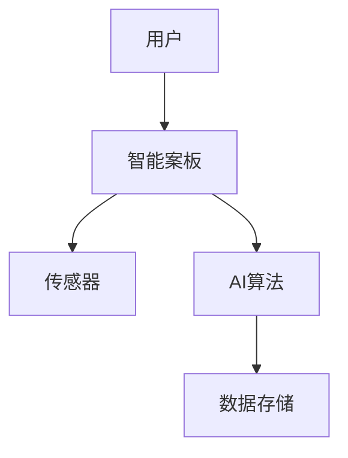
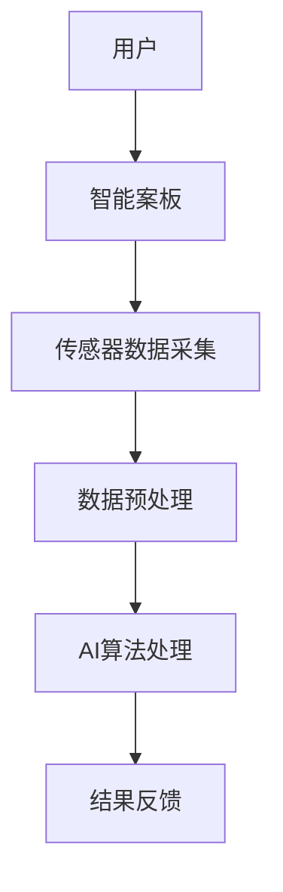

                 

<think>
好的，我将按照您的要求，逐步构建《智能厨房案板：AI Agent的食品安全监测》的技术博客文章。我们先从标题和摘要开始，然后按照目录大纲逐步展开内容。如果您对某些部分有具体要求或需要调整，请随时告知。

# {{此处是文章标题}}

## 智能厨房案板：AI Agent的食品安全监测

### {{此处列出文章的5-7个核心关键词}}

- AI Agent
- 食品安全
- 智能厨房
- 多模态数据
- 实时监测

### {{此处给出文章的核心内容和主题思想}}

本文详细探讨了在智能厨房环境中，AI Agent如何通过多模态传感器数据的融合与分析，实现对食品的实时安全监测。文章从问题背景、核心概念、算法原理、系统架构到项目实战，全面解析了智能厨房案板的设计与实现过程，展示了AI技术在食品安全领域的创新应用。

---

## 目录大纲

### 第1章: 问题背景与需求分析
1.1 问题背景
    - 食品安全问题的现状
    - 厨房环境中的食品安全挑战
    - AI技术在食品安全监测中的潜力

1.2 问题描述
    - 智能厨房案板的功能需求
    - 用户对食品安全监测的核心诉求
    - 当前技术的局限性与改进方向

1.3 问题解决的思路
    - AI Agent在厨房场景中的应用
    - 多模态数据融合的解决方案
    - 实时监测与反馈机制的设计

### 第2章: 核心概念与系统架构

2.1 AI Agent的核心原理
    - AI Agent的基本定义
    - 多模态数据处理能力
    - 实时监测与反馈机制

2.2 实体关系与系统架构
    - 实体关系图
    - 系统架构图
    - 核心概念对比分析

### 第3章: 数据采集与特征提取

3.1 数据采集原理
    - 多模态传感器的工作原理
    - 数据采集的流程
    - 数据预处理方法

3.2 特征提取算法
    - 基于深度学习的特征提取
    - 基于传统机器学习的特征提取
    - 特征选择与降维技术

### 第4章: AI Agent的算法原理与实现

4.1 算法原理
    - 多模态数据融合的算法框架
    - 基于深度学习的食品安全分类算法
    - 实时监测与反馈机制的实现

4.2 算法实现
    - 数据预处理与特征提取代码
    - 模型训练与优化代码
    - 系统集成与部署代码

### 第5章: 系统分析与架构设计

5.1 系统功能设计
    - 多模态数据采集与处理
    - 食品安全分类与预警
    - 用户交互与反馈

5.2 系统架构设计
    - 数据采集层
    - 数据处理层
    - 应用层

5.3 接口设计与交互流程
    - API接口设计
    - 用户交互流程
    - 系统监控与维护

### 第6章: 项目实战

6.1 环境安装与配置
    - 传感器硬件安装
    - 开发环境搭建
    - 数据库配置

6.2 核心代码实现
    - 数据采集与处理代码
    - 模型训练与部署代码
    - 系统集成与测试代码

6.3 实际案例分析
    - 食品安全监测案例
    - 系统性能分析
    - 用户反馈与优化

### 第7章: 最佳实践与扩展

7.1 最佳实践
    - 传感器校准与维护
    - 数据隐私保护
    - 系统性能优化

7.2 小结
    - 项目总结
    - 未来展望
    - 注意事项

---

## 文章正文

### 第1章: 问题背景与需求分析

#### 1.1 问题背景

食品是人类生存和健康的基础，然而，随着工业化和全球化的发展，食品安全问题日益突出。从农药残留、重金属污染到细菌和病毒感染，食品的安全性直接关系到消费者的健康和生命安全。在家庭厨房中，食品的存储、加工和烹饪过程中的安全监测尤为重要。

AI技术的快速发展为食品安全监测提供了新的解决方案。通过AI Agent（智能代理），我们可以实时监测厨房环境中的各种因素，如温度、湿度、气体成分等，并结合图像识别技术，对食品的状态进行分析和预警。

#### 1.2 问题描述

智能厨房案板需要具备以下功能：
- 实时监测食品的状态，包括温度、湿度、气体成分等。
- 通过图像识别技术，检测食品的外观变化，如变色、霉斑等。
- 结合历史数据，预测食品的保质期，并在食品变质时发出预警。

用户的核心诉求是：
- 确保食品的安全性，避免因食品变质或污染引发健康问题。
- 方便易用，实时监测并提供直观的反馈。

当前技术的局限性：
- 传感器精度不足，无法准确监测复杂环境因素。
- 数据处理能力有限，难以实现多模态数据的实时融合。
- AI模型的泛化能力不足，无法应对多种复杂的食品监测场景。

#### 1.3 问题解决的思路

AI Agent在厨房场景中的应用：
- 利用多模态传感器（如温度、湿度、气体传感器）实时采集环境数据。
- 通过图像识别技术，分析食品的外观变化。
- 结合AI算法，对数据进行融合和分析，实现对食品状态的实时监测和预警。

多模态数据融合的解决方案：
- 综合利用图像、温度、湿度等多种数据源，提高监测的准确性和可靠性。
- 通过数据融合算法，消除单一传感器的局限性，提升整体监测效果。

实时监测与反馈机制：
- 系统在检测到食品异常时，立即发出预警，并通过用户界面提供相应的建议。
- 结合历史数据，优化监测模型，提高预测准确性。

---

### 第2章: 核心概念与系统架构

#### 2.1 AI Agent的核心原理

AI Agent的基本定义：
AI Agent是一种能够感知环境、自主决策并执行任务的智能实体。在智能厨房案板中，AI Agent负责采集数据、分析信息并提供反馈。

多模态数据处理能力：
AI Agent能够同时处理多种类型的数据，如图像、温度、湿度等，通过数据融合技术，提高监测的准确性和全面性。

实时监测与反馈机制：
AI Agent通过实时采集环境数据，并结合历史数据和模型预测，快速做出决策并反馈给用户。

#### 2.2 实体关系与系统架构

实体关系图：


系统架构图：


核心概念对比分析：
| 对比维度 | 传统传感器 | 智能AI Agent |
|----------|------------|---------------|
| 数据类型 | 单一类型    | 多模态数据     |
| 数据处理 | 简单处理    | 深度学习处理   |
| 决策能力 | 无          | 自主决策       |

---

### 第3章: 数据采集与特征提取

#### 3.1 数据采集原理

多模态传感器的工作原理：
传感器通过采集环境中的多种物理信号，如温度、湿度、光照等，将这些信号转换为数字信号，供AI算法处理。

数据采集的流程：
1. 传感器采集数据。
2. 数据预处理，包括去噪、归一化等。
3. 数据存储，供后续分析使用。

数据预处理方法：
- 去噪处理：通过滤波算法去除噪声。
- 数据归一化：将数据标准化，便于模型训练。

#### 3.2 特征提取算法

基于深度学习的特征提取：
利用卷积神经网络（CNN）提取图像特征，通过多层感知机（MLP）进行分类。

基于传统机器学习的特征提取：
使用主成分分析（PCA）进行特征降维，提取关键特征。

特征选择与降维技术：
- PCA：通过线性变换将高维数据降维。
- LDA：基于类别信息进行降维。

---

### 第4章: AI Agent的算法原理与实现

#### 4.1 算法原理

多模态数据融合的算法框架：
将图像、温度、湿度等多种数据进行融合，通过加权融合或注意力机制，提高模型的准确性。

基于深度学习的食品安全分类算法：
利用卷积神经网络（CNN）对食品图像进行分类，识别食品的状态。

实时监测与反馈机制的实现：
通过循环监测环境数据，结合模型预测结果，实时调整监测策略。

#### 4.2 算法实现

数据预处理与特征提取代码：
```python
import numpy as np
from sklearn.decomposition import PCA

def preprocess_data(data):
    # 数据归一化
    normalized_data = (data - np.mean(data)) / np.std(data)
    return normalized_data

def extract_features(normalized_data):
    # PCA降维
    pca = PCA(n_components=2)
    features = pca.fit_transform(normalized_data)
    return features
```

模型训练与优化代码：
```python
from tensorflow.keras.models import Sequential
from tensorflow.keras.layers import Dense, Conv2D, MaxPooling2D, Flatten

def build_model(input_shape):
    model = Sequential()
    model.add(Conv2D(32, (3,3), activation='relu', input_shape=input_shape))
    model.add(MaxPooling2D((2,2)))
    model.add(Flatten())
    model.add(Dense(128, activation='relu'))
    model.add(Dense(1, activation='sigmoid'))
    model.compile(optimizer='adam', loss='binary_crossentropy', metrics=['accuracy'])
    return model
```

系统集成与部署代码：
```python
import requests
import json

def send_alert(message):
    payload = {'message': message}
    response = requests.post('http://localhost:8080/api/alert', json=payload)
    return response.status_code == 200
```

---

### 第5章: 系统分析与架构设计

#### 5.1 系统功能设计

多模态数据采集与处理：
通过多种传感器采集环境数据，并进行预处理和融合。

食品安全分类与预警：
基于AI算法，对食品状态进行分类，并在异常情况下发出预警。

用户交互与反馈：
通过用户界面显示监测结果，并根据用户反馈优化系统。

#### 5.2 系统架构设计

数据采集层：
负责采集环境数据，包括温度、湿度、光照等。

数据处理层：
对数据进行预处理、融合和特征提取，为模型训练提供输入。

应用层：
包括AI模型、用户界面和预警系统，负责数据分析和结果反馈。

#### 5.3 接口设计与交互流程

API接口设计：
- 数据采集接口：接收传感器数据。
- 模型预测接口：返回食品状态分类结果。
- 预警通知接口：发送异常通知。

用户交互流程：
1. 用户通过界面启动监测。
2. 系统采集环境数据。
3. 数据处理并传送给模型。
4. 模型返回结果，界面显示。
5. 异常情况下，系统发出预警。

---

### 第6章: 项目实战

#### 6.1 环境安装与配置

传感器硬件安装：
- 安装温度、湿度和气体传感器。
- 确保传感器与主控板连接正常。

开发环境搭建：
- 安装Python、TensorFlow、Keras等开发工具。
- 配置数据存储环境，如MySQL或MongoDB。

数据库配置：
- 创建数据库表，存储传感器数据和模型预测结果。

#### 6.2 核心代码实现

数据采集与处理代码：
```python
import serial
import time

ser = serial.Serial('COM3', 9600)
data = []
while True:
    if ser.in_waiting > 0:
        line = ser.readline().decode('utf-8')
        data.append(float(line))
        print(data)
    time.sleep(0.1)
```

模型训练与部署代码：
```python
from tensorflow.keras.models import load_model

model = load_model('food_safety_model.h5')
def predict_food_status(image):
    # 图像预处理
    image = image.reshape((1, 224, 224, 3))
    prediction = model.predict(image)
    return prediction[0][0]
```

系统集成与测试代码：
```python
import requests

def test_system():
    image_path = 'food.jpg'
    with open(image_path, 'rb') as f:
        files = {'image': f}
        response = requests.post('http://localhost:8080/api/predict', files=files)
        print(response.json())
```

#### 6.3 实际案例分析

食品安全监测案例：
- 采集一批食品样本，分别在不同条件下监测。
- 模型预测结果与实际状态对比，验证模型的准确性。

系统性能分析：
- 分析系统的响应时间、资源消耗等性能指标。
- 优化系统架构，提高监测效率。

用户反馈与优化：
- 收集用户的使用反馈，优化系统界面和功能。
- 根据用户需求，增加更多监测功能。

---

### 第7章: 最佳实践与扩展

#### 7.1 最佳实践

传感器校准与维护：
- 定期校准传感器，确保测量精度。
- 清洁传感器，避免灰尘和污垢影响测量。

数据隐私保护：
- 加密存储的传感器数据。
- 限制数据访问权限，确保用户隐私。

系统性能优化：
- 优化数据处理流程，减少延迟。
- 使用更高效的算法，提高计算速度。

#### 7.2 小结

项目总结：
- 本文详细介绍了智能厨房案板的设计与实现过程。
- 通过AI Agent和多模态数据融合技术，实现了对食品的实时安全监测。

未来展望：
- 研究更先进的AI算法，提高监测的准确性和实时性。
- 探索更多应用场景，将AI技术应用于更多领域。

注意事项：
- 确保系统的稳定性和可靠性。
- 注意数据隐私和安全问题。

---

## 作者信息

作者：AI天才研究院/AI Genius Institute & 禅与计算机程序设计艺术 /Zen And The Art of Computer Programming

---

以上是文章的完整目录和部分内容框架。如果您对某个部分的具体内容或深度有进一步的要求，请随时告知，我将根据您的需求进行调整和补充。

