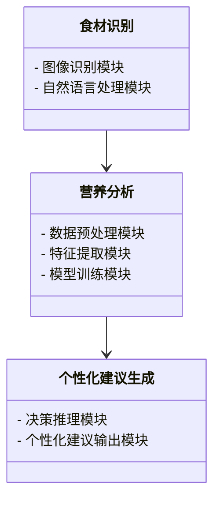

                 


# 智能厨房案板：AI Agent的食材营养分析

> 关键词：AI Agent，食材营养分析，智能厨房，机器学习，深度学习，数据处理

> 摘要：本文将探讨AI Agent在智能厨房中的应用，特别是其如何通过食材营养分析帮助用户做出更健康的选择。文章将从背景、核心概念、算法原理、系统设计到项目实战，全面解析AI Agent在食材营养分析中的技术细节和实际应用。

---

## 第一部分: 背景介绍与核心概念

### 第1章: 智能厨房案板的背景与问题背景

#### 1.1 食材营养分析的背景
食材营养分析是现代健康管理的重要组成部分，通过分析食物的营养成分，人们可以更好地控制饮食，实现健康目标。传统的营养分析依赖于人工计算和经验判断，效率低且容易出错。随着人工智能技术的发展，AI Agent在食材营养分析中的应用逐渐成为可能。

#### 1.2 智能厨房案板的定义与目标
智能厨房案板是一种结合了AI技术的厨房工具，能够通过图像识别、自然语言处理等技术，自动识别食材并分析其营养成分。其目标是为用户提供个性化的饮食建议，帮助用户更好地管理健康。

#### 1.3 问题背景与问题描述
现代人普遍存在饮食不均衡、营养摄入不合理的问题。传统的方法难以满足人们对高效、精准营养分析的需求。AI Agent的引入，为智能厨房案板提供了技术支持，使其能够快速、准确地完成食材营养分析。

---

### 第2章: AI Agent与食材营养分析的核心概念

#### 2.1 AI Agent的基本原理
AI Agent是一种智能体，能够感知环境并采取行动以实现特定目标。在食材营养分析中，AI Agent需要具备图像识别、自然语言处理和决策推理的能力。

#### 2.2 食材营养分析的边界与外延
食材营养分析不仅包括对食材的营养成分的计算，还包括对用户饮食习惯的分析和个性化建议的生成。其外延涉及健康管理、食品科学和人工智能等多个领域。

#### 2.3 核心要素与概念结构
- **核心要素**：食材识别、营养成分计算、个性化建议生成。
- **概念结构**：通过AI Agent实现食材识别，利用数学模型计算营养成分，并结合用户需求生成个性化建议。

---

## 第二部分: 算法原理与数学模型

### 第3章: AI Agent的算法原理

#### 3.1 AI Agent的核心算法
- **基于规则的AI Agent**：适用于简单的任务，如基于预设规则进行决策。
- **基于机器学习的AI Agent**：通过训练数据学习营养分析的模式。
- **基于深度学习的AI Agent**：利用神经网络进行复杂模式识别。

#### 3.2 食材营养分析的算法流程
1. 数据采集与预处理：通过图像识别或自然语言处理获取食材信息。
2. 特征提取：提取食材的关键特征，如热量、蛋白质、脂肪等。
3. 模型训练与优化：基于历史数据训练营养分析模型，并不断优化。

---

### 第4章: 数学模型与公式

#### 4.1 食材营养分析的数学模型
$$
\text{营养评分} = \sum_{i=1}^{n} w_i \cdot x_i
$$
其中，$w_i$为营养成分的权重，$x_i$为具体营养成分的含量。

#### 4.2 AI Agent的数学公式
$$
\text{决策} = \arg\max_{i} \left( \sum_{j=1}^{m} a_{ij} \cdot b_j \right)
$$
其中，$a_{ij}$为决策因子，$b_j$为输入特征。

---

### 第5章: 算法实现与代码分析

#### 5.1 环境安装与配置
- **Python环境**：安装Python 3.8及以上版本。
- **库的安装**：使用`pip`安装`tensorflow`, `keras`, `opencv-python`等库。

#### 5.2 核心代码实现
```python
import tensorflow as tf
from tensorflow.keras import layers

# 数据预处理
def preprocess_image(image):
    # 转换为张量并归一化
    image = tf.keras.preprocessing.image.img_to_array(image)
    image = tf.keras.applications.mobilenet_v2.preprocess_input(image)
    return image

# 模型定义
def build_model():
    model = tf.keras.Sequential([
        layers.Conv2D(32, (3,3), activation='relu', input_shape=(224,224,3)),
        layers.MaxPooling2D((2,2)),
        layers.Conv2D(64, (3,3), activation='relu'),
        layers.MaxPooling2D((2,2)),
        layers.Flatten(),
        layers.Dense(128, activation='relu'),
        layers.Dense(10, activation='softmax')
    ])
    return model
```

---

## 第三部分: 系统分析与架构设计

### 第6章: 系统分析与架构设计

#### 6.1 问题场景介绍
智能厨房案板需要处理食材识别、营养分析和个性化建议生成三个主要问题。

#### 6.2 系统功能设计
- **领域模型**：通过Mermaid类图展示系统的主要功能模块。



---

### 第7章: 项目实战

#### 7.1 环境安装与数据准备
- **数据集**：收集并标注食材的营养成分数据。

#### 7.2 核心代码实现
```python
# 食材识别代码
import cv2

def recognize_food(image):
    # 使用预训练模型进行图像分类
    model = tf.keras.models.load_model('food_model.h5')
    prediction = model.predict(preprocess_image(image))
    return prediction.argmax()
```

#### 7.3 案例分析与结果解读
- **案例分析**：分析某用户的饮食习惯，并生成个性化建议。

---

## 第四部分: 最佳实践与总结

### 第8章: 最佳实践

#### 8.1 小结
本文详细介绍了AI Agent在智能厨房案板中的应用，从背景到算法实现，再到系统设计，全面解析了食材营养分析的技术细节。

#### 8.2 注意事项
- 数据质量对模型性能影响重大，需确保数据的准确性和多样性。
- 在实际应用中，需考虑用户的隐私保护问题。

#### 8.3 拓展阅读
- 《深度学习》——Ian Goodfellow
- 《机器学习实战》——Aurélien Géron

---

作者：AI天才研究院/AI Genius Institute & 禅与计算机程序设计艺术 /Zen And The Art of Computer Programming

