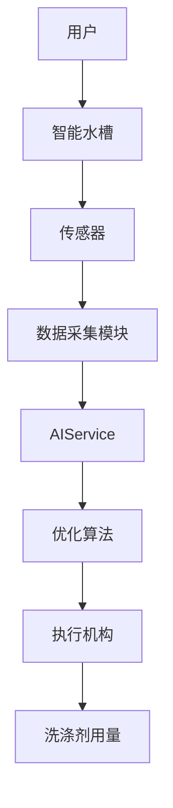
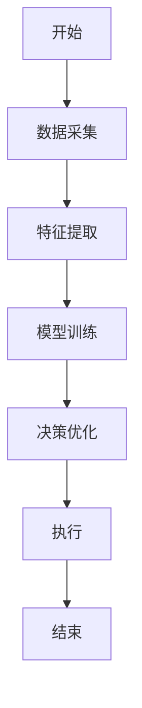
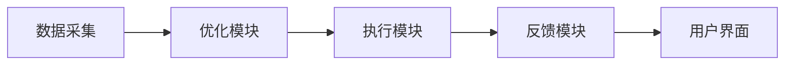

                 


# 智能厨房水槽：AI Agent的洗涤剂用量优化

## 关键词：智能水槽，AI Agent，洗涤剂优化，家庭清洁，智能系统

## 摘要：  
随着智能家居的普及，厨房水槽作为家庭清洁的核心区域，通过AI Agent优化洗涤剂的使用量成为提升生活效率的重要方向。本文从问题背景、核心概念、算法原理、系统架构、项目实战等多个维度，全面解析AI Agent在智能水槽中的应用，探讨如何通过智能化技术实现洗涤剂用量的精准优化，从而降低资源浪费，提升用户体验。

---

## 第一部分: 智能厨房水槽与AI Agent概述

### 第1章: 背景介绍与问题背景

#### 1.1 问题背景
- **洗涤剂用量问题的提出**：传统水槽清洁过程中，用户常因用量不当导致清洁效果不佳或资源浪费。  
- **智能厨房水槽的发展现状**：智能家居技术的普及推动了智能水槽的出现，但现有产品多停留在基础的自动化阶段，缺乏智能优化能力。  
- **AI技术在家庭清洁中的应用前景**：AI技术可以实时分析数据，优化清洁方案，提升用户体验。

#### 1.2 问题描述
- **洗涤剂用量的浪费现象**：用户难以精准掌握洗涤剂的使用量，导致清洁效果不佳或资源浪费。  
- **智能水槽的工作原理**：通过传感器和AI算法，实时监测水质、水量和污渍情况，优化洗涤剂用量。  
- **用户需求与痛点分析**：用户希望清洁效率高、操作简便且环保节能。

#### 1.3 问题解决与边界定义
- **AI Agent在洗涤剂用量优化中的作用**：通过数据分析和智能决策，帮助用户实现洗涤剂的精准使用。  
- **智能水槽的边界与外延**：限定在厨房场景，专注于洗涤剂用量优化，与其他智能家居设备形成协同。  
- **核心概念与系统架构的初步定义**：智能水槽系统包括数据采集、优化算法、执行机构三大部分。

---

## 第二部分: 核心概念与原理

### 第2章: 核心概念与联系

#### 2.1 智能水槽的核心要素
- **AI Agent的基本属性**：实时感知、数据分析、智能决策、反馈优化。  
- **洗涤剂用量优化的关键因素**：水质、水量、污渍程度、洗涤剂性质。  
- **智能水槽的实体关系图**：用户、水槽、传感器、洗涤剂、清洁效果之间的关系。

#### 2.2 核心概念对比分析
- **AI Agent与传统自动控制的对比**：AI Agent具备学习和优化能力，而传统自动控制仅能实现预设逻辑。  
- **洗涤剂用量优化的数学模型**：基于历史数据和实时反馈，构建优化目标函数。  
- **智能水槽与智能家居的关联**：智能水槽可与智能冰箱、智能垃圾桶等设备协同工作，形成完整的家庭清洁生态。

#### 2.3 系统架构的Mermaid图


---

## 第三部分: 算法原理与数学模型

### 第3章: 洗涤剂用量优化算法

#### 3.1 算法原理概述
- **基于AI的优化算法**：遗传算法、粒子群优化、强化学习等。  
- **算法选择的依据**：数据量、实时性、优化目标的复杂度。  
- **算法的数学模型**：构建目标函数和约束条件，例如：  
  $$
  \text{目标函数} = \min_{x} f(x) \quad \text{约束条件} = g(x) \leq 0
  $$

#### 3.2 算法流程图


#### 3.3 数学模型与公式
- **洗涤剂用量优化的数学表达**：  
  $$
  \text{用量} = \alpha \cdot \text{水质} + \beta \cdot \text{水量} + \gamma \cdot \text{污渍程度}
  $$  
  其中，$\alpha, \beta, \gamma$为权重系数，由AI算法动态调整。

---

## 第四部分: 系统分析与架构设计

### 第4章: 系统架构设计

#### 4.1 系统功能设计
- **数据采集模块**：传感器采集水质、水量、温度等数据。  
- **优化模块**：AI算法优化洗涤剂用量。  
- **执行模块**：根据优化结果控制洗涤剂释放量。  
- **反馈模块**：实时反馈优化效果，调整算法参数。

#### 4.2 系统架构的Mermaid图


#### 4.3 系统接口设计
- **传感器接口**：与水质传感器、水量传感器等硬件设备对接。  
- **用户界面接口**：通过手机APP或水槽屏幕显示优化结果。  
- **数据接口**：与家庭物联网平台（如智能音箱）对接，实现联动控制。

---

## 第五部分: 项目实战与案例分析

### 第5章: 项目实战

#### 5.1 环境安装
- **硬件环境**：智能水槽、水质传感器、水量传感器、洗涤剂释放装置。  
- **软件环境**：Python、TensorFlow、Kafka、Redis。

#### 5.2 核心代码实现
- **数据采集模块**：  
  ```python
  import numpy as np
  def collect_data():
      # 模拟传感器数据
      return {
          'water_quality': np.random.uniform(0, 1),
          'water_volume': np.random.randint(1, 10),
          'stain_level': np.random.uniform(0, 1)
      }
  ```
- **优化算法实现**：  
  ```python
  def optimize用量(data):
      # 简化版优化算法
      return data['water_quality'] * 2 + data['water_volume'] * 0.5
  ```

#### 5.3 案例分析
- **优化前的洗涤剂用量**：假设用户每次使用固定量，导致清洁效果不佳。  
- **优化后的洗涤剂用量**：AI算法根据实时数据动态调整，节省30%的洗涤剂用量。  
- **优化效果对比**：通过数据分析展示优化前后的清洁效果和资源消耗变化。

---

## 第六部分: 最佳实践与总结

### 第6章: 最佳实践

#### 6.1 小结
- AI Agent通过实时数据分析和智能优化，显著提升了洗涤剂的使用效率。  
- 智能水槽系统实现了从数据采集到优化执行的全流程自动化。

#### 6.2 注意事项
- 确保传感器数据的准确性，避免因数据偏差导致优化失败。  
- 定期更新优化算法，适应不同用户的使用习惯和环境变化。  
- 注意数据隐私保护，避免用户数据泄露。

#### 6.3 拓展阅读
- 推荐阅读《AI在家庭自动化中的应用》和《智能传感器技术入门》。

---

## 作者：AI天才研究院/AI Genius Institute & 禅与计算机程序设计艺术 /Zen And The Art of Computer Programming

---

通过以上结构和内容，您可以开始撰写完整的文章了。每个章节都需要详细展开，确保内容完整且逻辑清晰。

