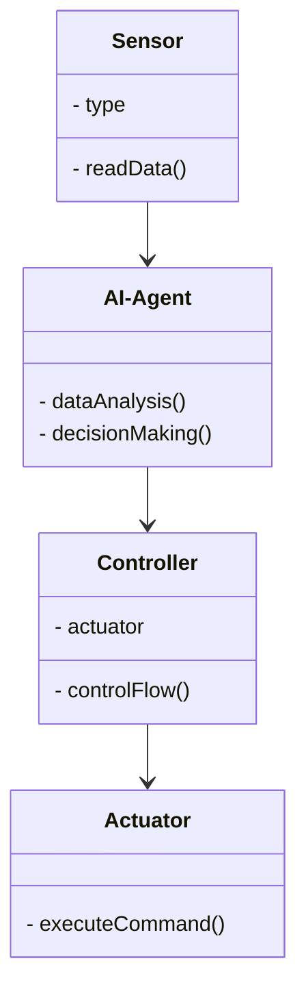
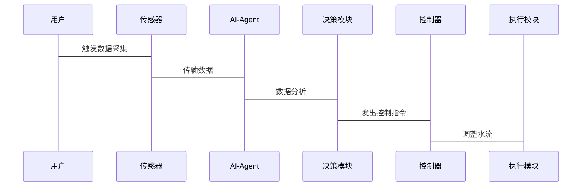

                 


# 智能厨房水槽：AI Agent的用水优化控制

> 关键词：智能厨房水槽，AI Agent，用水优化，物联网，智能控制

> 摘要：本文深入探讨了智能厨房水槽的设计与实现，重点介绍了AI Agent在用水优化控制中的应用。文章从背景、技术原理、系统架构到项目实战，全面分析了智能厨房水槽的实现过程，旨在为读者提供一个清晰的实现路径和实践指导。

---

## 第一部分：智能厨房水槽与AI Agent概述

### 第1章：智能厨房水槽的概念与背景

#### 1.1 智能厨房水槽的定义与特点

智能厨房水槽是一种结合了人工智能技术的厨房设备，通过传感器和AI Agent实现对用水量的智能监控和优化控制。与传统水槽相比，智能厨房水槽能够实时感知用水情况，并根据用户习惯和用水需求动态调整水流，从而实现节水和高效用水的目标。

**特点：**
1. **智能感知**：通过传感器实时监测水流量、温度等数据。
2. **AI驱动**：利用AI Agent进行数据处理和决策，优化用水控制。
3. **用户友好**：通过可视化界面提供用水数据和优化建议。

#### 1.2 用水优化控制的背景与意义

随着全球水资源的日益紧张，优化用水已成为全球关注的焦点。厨房用水占家庭总用水量的较大比例，因此通过智能厨房水槽实现用水优化具有重要意义。

**背景：**
- 水资源短缺问题日益严重。
- 家庭用水浪费现象普遍。
- 智能化技术在家居领域的广泛应用。

**意义：**
1. **节水**：通过AI Agent优化用水，减少浪费。
2. **节能**：降低水的加热和处理能耗。
3. **环保**：减少水资源浪费，保护环境。

#### 1.3 AI Agent在智能厨房水槽中的应用

AI Agent（智能体）是一种能够感知环境、做出决策并执行动作的智能系统。在智能厨房水槽中，AI Agent主要负责数据采集、分析和控制水流。

**AI Agent的功能：**
1. **数据采集**：通过传感器获取水流量、温度等数据。
2. **数据处理**：对采集的数据进行分析，识别异常用水情况。
3. **决策控制**：根据分析结果优化水流，减少浪费。

---

### 第2章：AI Agent的基本原理与优势

#### 2.1 AI Agent的核心概念

AI Agent的核心在于其感知、决策和执行能力。通过传感器感知环境，利用算法进行决策，并通过执行机构调整水流。

**核心组件：**
1. **感知层**：传感器负责数据采集。
2. **决策层**：算法负责数据分析和决策。
3. **执行层**：控制水流的执行机构。

#### 2.2 AI Agent的感知技术

智能厨房水槽的感知技术主要依赖传感器。常见的传感器包括流量传感器、温度传感器等。

**传感器类型与功能对比：**

| 传感器类型 | 功能描述 | 优缺点 |
|------------|----------|--------|
| 流量传感器 | 测量水流量 | 精度高，成本低 | 
| 温度传感器 | 测量水温 | 精度高，但成本较高 |
| 压力传感器 | 测量水压 | 耐用性强，但复杂度高 |

#### 2.3 AI Agent的决策算法

决策算法是AI Agent的核心。常见的决策算法包括基于规则的决策和基于机器学习的决策。

**基于规则的决策：**
- **优点**：简单易实现，适合规则明确的场景。
- **缺点**：难以应对复杂场景。

**基于机器学习的决策：**
- **优点**：能够处理复杂数据，适应性强。
- **缺点**：需要大量数据训练，实现复杂。

#### 2.4 AI Agent的优势与局限性

**优势：**
1. **高效优化**：通过实时数据分析优化用水。
2. **智能控制**：根据用户习惯动态调整水流。

**局限性：**
1. **依赖传感器精度**：传感器精度直接影响决策准确性。
2. **数据隐私**：用户数据的安全性需要保障。

---

## 第二部分：智能厨房水槽的系统设计与实现

### 第3章：系统架构与功能设计

#### 3.1 问题场景介绍

智能厨房水槽的使用场景包括家庭厨房、餐馆后厨等。系统需要实时监测用水情况，动态调整水流，减少浪费。

#### 3.2 系统功能设计

系统功能包括：
1. **实时监测**：监控水流量、温度等数据。
2. **智能控制**：根据数据优化水流。
3. **数据记录**：记录用水数据，生成报告。
4. **用户交互**：提供可视化界面供用户查看数据。

**领域模型设计（Mermaid 类图）：**



#### 3.3 系统架构设计

**系统架构图（Mermaid 架构图）：**

```mermaid
container 智能厨房水槽系统 {
    component 传感器 {
        - 流量传感器
        - 温度传感器
    }
    component AI Agent {
        - 数据处理模块
        - 决策模块
    }
    component 控制器 {
        - 执行模块
    }
}
```

#### 3.4 系统接口设计

**系统接口设计：**
1. **传感器接口**：与传感器连接，获取数据。
2. **用户界面接口**：提供可视化界面。
3. **数据接口**：与其他系统（如智能家居）对接。

#### 3.5 系统交互设计

**系统交互流程图（Mermaid 序列图）：**



---

### 第4章：项目实战与实现

#### 4.1 环境搭建

**环境要求：**
- **硬件**：Arduino 或 Raspberry Pi 控制器。
- **软件**：Python 3、NumPy、Scikit-learn。

#### 4.2 核心代码实现

**数据采集代码：**

```python
import numpy as np
from sklearn.linear_model import LinearRegression

# 传感器数据采集
def get_sensor_data():
    # 模拟传感器数据
    return np.random.rand(100, 2)  # 示例数据

# 数据预处理
data = get_sensor_data()
X = data[:, 0].reshape(-1, 1)
y = data[:, 1]

# 模型训练
model = LinearRegression()
model.fit(X, y)
```

**AI Agent 决策代码：**

```python
def optimize_flow(data):
    # 数据分析
    model.predict(X_new)
    # 决策控制
    if predicted_value > threshold:
        return "减少水流"
    else:
        return "保持当前水流"

# 执行控制
def execute_control(command):
    if command == "减少水流":
        # 调整水流控制
        pass
```

#### 4.3 测试与优化

**测试步骤：**
1. **功能测试**：验证各模块是否正常工作。
2. **性能测试**：测试系统在高负载下的表现。
3. **优化测试**：根据测试结果优化算法。

**优化方向：**
1. **算法优化**：改进决策算法，提高准确率。
2. **数据处理**：优化数据预处理流程，提升效率。

---

### 第5章：最佳实践与总结

#### 5.1 实践小结

智能厨房水槽的实现需要综合考虑传感器、算法和系统架构。通过AI Agent实现优化控制，能够有效减少用水浪费。

#### 5.2 注意事项

1. **传感器精度**：确保传感器数据的准确性。
2. **数据隐私**：保护用户数据安全。
3. **系统稳定性**：确保系统在各种场景下稳定运行。

#### 5.3 拓展阅读

1. 《基于机器学习的智能控制系统设计》
2. 《物联网技术在智能家居中的应用》
3. 《AI Agent在能源管理中的应用研究》

---

## 作者简介

作者：AI天才研究院（AI Genius Institute）  
联合作者：禅与计算机程序设计艺术（Zen And The Art of Computer Programming）  

通过本文的深入分析，我们展示了智能厨房水槽的设计与实现过程，希望为读者提供一个全面的参考。如需进一步探讨，欢迎关注我们的研究领域。

