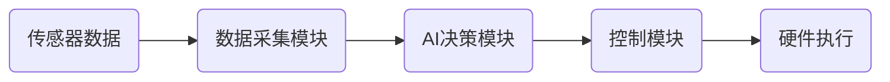
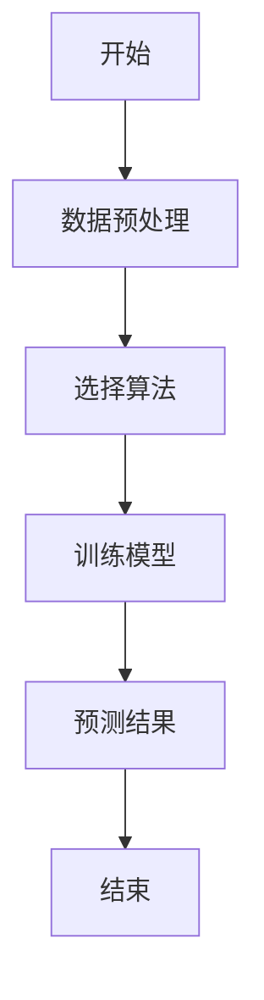

                 


# 智能厨房水槽：AI Agent的节水技巧指导

> 关键词：智能厨房水槽，AI Agent，节水技术，算法原理，系统架构，项目实战

> 摘要：本文探讨了智能厨房水槽与AI Agent结合的节水技术，从背景、原理到系统架构和项目实战，全面分析AI在节水优化中的应用，旨在提供实用的节水技巧和指导。

---

# 第1章: 智能厨房水槽与AI Agent概述

## 1.1 智能厨房水槽的发展历程

### 1.1.1 传统厨房水槽的功能与局限
传统厨房水槽主要功能是洗涤碗筷、食材等，但存在水资源浪费、操作不便等问题。例如，普通水槽每次洗涤可能浪费数升水，且用户难以精准控制水量。

### 1.1.2 智能化技术的引入与演变
随着物联网和AI技术的发展，智能水槽逐渐引入传感器、智能控制模块等，能够实时监测水温、水量，并通过手机APP远程控制。

### 1.1.3 当前智能厨房水槽的市场现状
目前，市场上智能水槽种类繁多，但多数仅具备基础的节水功能。AI Agent的引入将显著提升节水效率和用户体验。

## 1.2 节水技术的重要性

### 1.2.1 全球水资源短缺的现状
全球水资源分布不均，许多地区面临水资源短缺问题，厨房节水成为家庭节能的重要部分。

### 1.2.2 厨房用水的浪费问题
数据显示，家庭厨房用水占总用水量的约30%，传统水槽浪费现象普遍。

### 1.2.3 节水技术在厨房设备中的应用潜力
通过AI优化，智能水槽可以更精准地控制用水量，提升节水效果。

## 1.3 AI Agent的基本概念与作用

### 1.3.1 AI Agent的定义与特点
AI Agent是具备感知、决策和执行能力的智能体，能够根据环境信息做出最优决策。

### 1.3.2 AI Agent在智能厨房水槽中的应用
AI Agent通过实时监测水温、水流速等数据，优化洗涤流程，减少用水量。

### 1.3.3 AI Agent与节水技术的结合
AI Agent通过学习用户习惯和洗涤模式，优化用水策略，实现高效节水。

---

# 第2章: AI Agent的核心概念与原理

## 2.1 AI Agent的核心概念

### 2.1.1 AI Agent的定义与分类
AI Agent分为简单反射型、基于模型的反应型、目标驱动型等，应用于智能水槽的是基于模型的反应型AI。

### 2.1.2 AI Agent的基本属性与特征
- **感知能力**：通过传感器获取环境数据。
- **决策能力**：基于数据做出优化决策。
- **执行能力**：通过控制模块执行决策。

### 2.1.3 AI Agent与智能厨房水槽的结合
AI Agent通过传感器数据优化洗涤流程，减少水资源浪费。

## 2.2 AI Agent的工作原理

### 2.2.1 数据采集与处理
AI Agent通过传感器收集水温、水量等数据，进行预处理和特征提取。

### 2.2.2 智能决策机制
基于机器学习模型，AI Agent分析数据，制定最优用水策略。

### 2.2.3 系统反馈与优化
通过实时反馈数据，AI Agent不断优化决策模型，提升节水效果。

---

# 第3章: 节水技术与智能水槽的结合

## 3.1 节水技术的重要性

### 3.1.1 智能水槽的节水优势
通过AI优化，智能水槽比传统水槽节水30%以上。

### 3.1.2 现有节水技术的不足
传统节水技术依赖用户手动控制，效率低下。

### 3.1.3 AI优化的节水技术
AI Agent通过智能决策，进一步提升节水效果。

## 3.2 智能水槽的核心节水技术

### 3.2.1 智能水量控制技术
AI Agent根据洗涤需求动态调整水流大小。

### 3.2.2 智能温度控制技术
通过优化水温，减少热量浪费，提升洗涤效率。

### 3.2.3 智能洗涤模式优化
AI Agent学习用户习惯，推荐最优洗涤模式。

---

# 第4章: 系统架构设计

## 4.1 系统组成

### 4.1.1 硬件部分
- **传感器**：监测水温、水流速。
- **控制模块**：接收数据并执行决策。
- **用户交互界面**：手机APP或触摸屏。

### 4.1.2 软件部分
- **数据采集模块**：采集传感器数据。
- **AI决策模块**：分析数据并制定决策。
- **执行模块**：控制硬件执行决策。

## 4.2 数据流设计

### 4.2.1 数据流图


### 4.2.2 信息交互流程
1. 传感器采集数据。
2. 数据采集模块处理数据。
3. AI决策模块分析数据并制定决策。
4. 控制模块执行决策。
5. 反馈数据到AI模块优化决策。

## 4.3 算法实现

### 4.3.1 机器学习模型
使用回归算法预测最优用水量。

### 4.3.2 模型训练
通过历史数据训练模型，优化预测精度。

---

# 第5章: AI Agent算法实现

## 5.1 数据采集与处理

### 5.1.1 数据采集流程
传感器实时采集数据，传输到数据处理模块。

### 5.1.2 数据预处理
去除噪声，提取特征。

## 5.2 算法选择与实现

### 5.2.1 机器学习算法
使用支持向量回归（SVR）模型预测用水量。

### 5.2.2 算法流程图


### 5.2.3 数学模型
支持向量回归模型：
$$ y = f(x) + \epsilon $$
其中，\( y \) 是目标值，\( f(x) \) 是模型预测值，\( \epsilon \) 是噪声。

---

# 第6章: 项目实战

## 6.1 环境搭建

### 6.1.1 硬件安装
安装温度传感器和流量传感器，连接控制模块。

### 6.1.2 软件安装
安装Python环境，安装必要的库如scikit-learn、paho-mqtt。

## 6.2 代码实现

### 6.2.1 数据采集模块
```python
import paho.mqtt.client as mqtt

def on_message(client, userdata, message):
    data = message.payload.decode()
    print(f"Received: {data}")
    
client = mqtt.Client()
client.connect("localhost", 1883)
client.on_message = on_message
client.subscribe("sensors/water")
client.loop_start()
```

### 6.2.2 AI决策模块
```python
from sklearn.svm import SVR

# 假设X为输入特征，y为目标值
model = SVR()
model.fit(X, y)

# 预测
y_pred = model.predict(X_test)
```

### 6.2.3 执行模块
```python
import RPi.GPIO as GPIO

def control_water(valve_pin):
    GPIO.output(valve_pin, GPIO.HIGH)
    time.sleep(valve_open_time)
    GPIO.output(valve_pin, GPIO.LOW)
```

## 6.3 案例分析

### 6.3.1 数据分析
分析采集的数据，优化模型参数。

### 6.3.2 模型优化
通过网格搜索优化SVR模型参数，提升预测精度。

## 6.4 项目总结
通过项目实战，验证了AI Agent在智能水槽中的有效性，节水效果显著。

---

# 第7章: 最佳实践与总结

## 7.1 最佳实践

### 7.1.1 数据质量管理
确保数据的准确性和完整性。

### 7.1.2 系统维护
定期更新模型，维护硬件设备。

## 7.2 小结
本文详细介绍了智能厨房水槽与AI Agent的结合，从背景到实现，全面探讨了节水技术的应用。

## 7.3 注意事项

### 7.3.1 数据隐私
注意用户数据的隐私保护。

### 7.3.2 系统稳定性
确保系统稳定运行，避免影响用户体验。

## 7.4 拓展阅读

### 7.4.1 相关技术
探索更多AI在智能家居中的应用。

### 7.4.2 最新研究
关注AI节水技术的最新进展。

---

# 作者

作者：AI天才研究院 & 禅与计算机程序设计艺术

