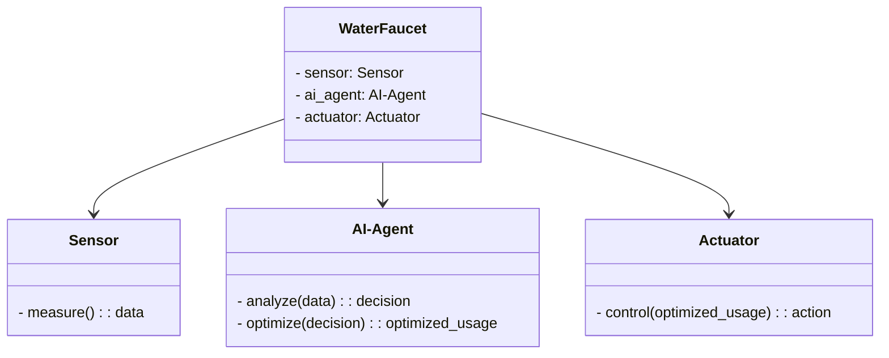
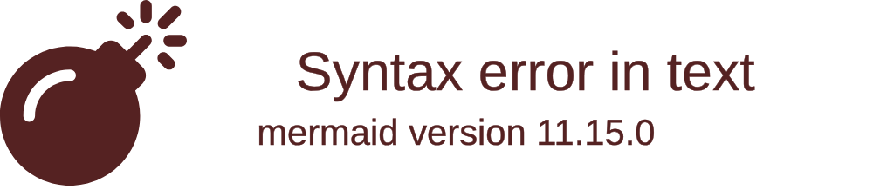
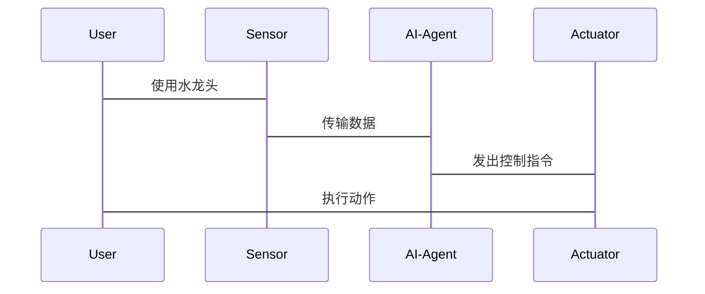

                 


# 智能厨房水龙头：AI Agent的用水量优化控制

> 关键词：智能水龙头，AI Agent，用水优化，智能家居，物联网

> 摘要：本文探讨了智能厨房水龙头在AI Agent技术下的用水优化控制，通过背景分析、算法原理、系统设计、项目实现等方面，详细介绍了如何利用AI技术实现用水效率的最大化。

---

# 第一部分：背景与问题背景

## 第1章：背景与问题背景

### 1.1 智能厨房水龙头的背景介绍

#### 1.1.1 水资源利用现状与挑战

水资源是人类生存和发展的基础，但随着全球人口的增长和资源的有限性，水资源短缺问题日益严重。在家庭用水中，厨房水龙头的使用占据了相当大的比例。传统的水龙头无法智能化地控制用水量，导致水资源的浪费。因此，如何通过技术手段优化用水量，成为一个亟待解决的问题。

#### 1.1.2 智能化家居的发展趋势

随着物联网（IoT）和人工智能（AI）技术的飞速发展，智能家居设备逐渐普及。智能水龙头作为智能家居的一部分，可以通过传感器和AI算法实现智能化控制，从而提高用水效率。

#### 1.1.3 智能水龙头的必要性

智能水龙头不仅能够帮助用户更好地管理用水，还能通过AI技术优化用水模式，减少浪费。这不仅有助于节约水资源，还能降低用户的用水成本。

### 1.2 问题背景与目标

#### 1.2.1 用水浪费的问题分析

传统水龙头的使用方式缺乏智能化，用户往往无法准确掌握用水量。特别是在多人使用的情况下，用水浪费现象严重。例如，忘记关闭水龙头或过度使用水的情况时有发生。

#### 1.2.2 智能水龙头的目标与意义

智能水龙头的目标是通过AI技术优化用水量，实现精准控制。其意义在于：  
1. 节约水资源，减少浪费。  
2. 提高用水效率，降低用户成本。  
3. 推动智能家居的发展，提升生活品质。

#### 1.2.3 用水优化的边界与外延

用水优化的边界是指在不影响正常使用的情况下，尽可能减少浪费。外延则包括与其他智能家居设备的联动，例如与智能洗碗机、净水器等设备协同工作，进一步优化用水效率。

### 1.3 智能水龙头的核心概念

#### 1.3.1 AI Agent的基本定义

AI Agent（智能代理）是一种能够感知环境并采取行动以实现目标的智能实体。在智能水龙头中，AI Agent负责采集数据、分析信息并做出决策，以优化用水量。

#### 1.3.2 智能水龙头的系统组成

智能水龙头系统通常包括以下几个部分：  
1. **传感器**：用于采集水流、水压、温度等数据。  
2. **数据采集模块**：将传感器数据传输到AI Agent。  
3. **AI Agent**：负责数据处理、分析和决策。  
4. **执行机构**：根据AI Agent的决策控制水龙头的开关。

#### 1.3.3 核心要素与概念结构

智能水龙头的核心要素包括：  
- **传感器**：数据采集的关键部件。  
- **AI Agent**：系统的智能核心，负责数据处理和决策。  
- **执行机构**：根据决策执行具体的动作，如开关水龙头。  
- **用户交互界面**：用户可以通过手机APP或其他设备查看用水数据并进行设置。

---

# 第二部分：核心概念与联系

## 第2章：核心概念与联系

### 2.1 AI Agent的核心原理

#### 2.1.1 AI Agent的基本原理

AI Agent通过感知环境、分析数据并采取行动来实现目标。在智能水龙头中，AI Agent需要感知用户的用水习惯，分析数据，并根据优化算法调整用水量。

#### 2.1.2 基于AI的用水优化算法

用水优化算法的核心是通过强化学习（Reinforcement Learning）来训练AI Agent，使其能够根据不同的场景和用户习惯，自动调整用水量。

#### 2.1.3 Agent与智能水龙头的交互机制

AI Agent通过传感器获取实时数据，分析用户的行为模式，并根据预设的优化策略调整水龙头的开关。例如，当检测到用户在洗碗时，AI Agent可以根据水温和水流速度自动调整出水时间，以达到最佳的清洁效果。

### 2.2 核心概念对比与ER实体关系图

#### 2.2.1 核心概念属性特征对比表

| 概念       | 属性特征               |
|------------|------------------------|
| 传感器     | 数据采集、实时监测     |
| AI Agent   | 数据分析、智能决策     |
| 执行机构   | 控制水龙头开关         |
| 用户交互界面 | 显示数据、接收指令     |

#### 2.2.2 ER实体关系图

```mermaid
er
  actor: 用户
  water faucet: 水龙头
  ai agent: AI代理
  action: 动作
  water usage: 用水量
  constraint: 约束条件
  relation: 关系
  actor --> action
  water faucet --> action
  ai agent --> action
  ai agent --> constraint
  ai agent --> water usage
  water usage --> constraint
```

---

# 第三部分：算法原理

## 第3章：AI Agent的算法原理

### 3.1 算法原理概述

#### 3.1.1 基于强化学习的用水优化

强化学习是一种通过试错来优化决策的算法。AI Agent通过不断尝试不同的用水策略，学习如何在不同场景下优化用水量。

#### 3.1.2 算法的基本流程

1. **数据采集**：传感器采集水流、水压等数据。  
2. **数据处理**：AI Agent对数据进行分析，识别用户的用水习惯。  
3. **决策制定**：基于强化学习算法，AI Agent决定是否开启或关闭水龙头。  
4. **反馈与优化**：根据实际效果调整策略，持续优化用水量。

#### 3.1.3 算法的优化策略

AI Agent通过以下策略优化用水量：  
- **短期优化**：根据当前用户的用水行为实时调整。  
- **长期优化**：通过历史数据学习用户的用水习惯，预测未来的用水需求。

### 3.2 算法实现与代码示例

#### 3.2.1 强化学习算法的数学模型

强化学习的核心是通过Q-learning算法来更新策略。数学模型如下：

$$ Q(s, a) = Q(s, a) + \alpha [r(s, a) + \gamma \max_{a'} Q(s', a')] $$

其中：  
- \( Q(s, a) \) 表示在状态 \( s \) 下采取动作 \( a \) 的价值。  
- \( \alpha \) 表示学习率。  
- \( \gamma \) 表示折扣因子。  
- \( r(s, a) \) 表示在状态 \( s \) 下采取动作 \( a \) 的奖励。

#### 3.2.2 算法实现的Python代码

```python
class AI-Agent:
    def __init__(self):
        self.model = ...  # 初始化模型
        self.learning_rate = 0.1
        self.discount_factor = 0.9

    def optimize_usage(self, current_state):
        # 根据当前状态优化用水量
        return optimized_usage
```

### 3.3 算法的优化与改进

#### 3.3.1 算法的改进方向

为了进一步提高优化效果，可以考虑以下改进方向：  
1. **多目标优化**：同时优化用水量和水温。  
2. **个性化设置**：根据用户的偏好调整用水策略。  
3. **实时反馈**：通过用户反馈不断调整优化策略。

#### 3.3.2 

---

# 第四部分：系统分析与架构设计

## 第4章：系统分析与架构设计

### 4.1 问题场景介绍

智能水龙头需要在多种场景下工作，例如：  
1. 用户洗碗时，自动调整水温。  
2. 用户洗手时，自动控制水流大小。  
3. 根据历史数据预测未来的用水需求。

### 4.2 项目介绍

本项目旨在通过AI Agent优化智能水龙头的用水量，提升用户体验，减少水资源浪费。

### 4.3 系统功能设计

#### 4.3.1 领域模型



#### 4.3.2 系统架构设计



#### 4.3.3 系统接口设计

智能水龙头的系统接口主要涉及传感器、AI Agent和执行机构之间的数据传输。例如：  
- 传感器将数据传输给AI Agent。  
- AI Agent根据数据生成决策，并将指令发送给执行机构。

#### 4.3.4 系统交互设计



---

# 第五部分：项目实战

## 第5章：项目实战

### 5.1 环境安装

为了实现智能水龙头，需要以下硬件和软件：  
- **硬件**：水龙头、传感器、执行机构、主控板。  
- **软件**：AI算法框架（如TensorFlow、PyTorch），编程语言（如Python）。

### 5.2 系统核心实现

#### 5.2.1 环境安装步骤

1. **安装传感器驱动**：确保传感器能够正常工作。  
2. **安装AI框架**：安装TensorFlow或PyTorch。  
3. **安装主控板**：连接传感器、AI Agent和执行机构。

#### 5.2.2 核心代码实现

```python
import numpy as np
from tensorflow.keras import layers

class WaterFaucetAgent:
    def __init__(self):
        self.model = self.build_model()
        self.model.compile(optimizer='adam', loss='mse')

    def build_model(self):
        model = tf.keras.Sequential()
        model.add(layers.Dense(64, activation='relu', input_dim=2))
        model.add(layers.Dense(1))
        return model

    def train(self, state, action, reward):
        # 将状态和动作转换为训练数据
        X = np.array([state])
        y = np.array([reward])
        self.model.fit(X, y, epochs=10, verbose=0)

    def predict(self, state):
        return self.model.predict(np.array([state]))[0][0]
```

#### 5.2.3 代码应用解读与分析

上述代码实现了一个简单的强化学习模型，AI Agent通过不断训练，学习如何在不同状态下做出最优决策。训练过程通过调整模型参数，优化用水量。

### 5.3 实际案例分析

#### 5.3.1 案例背景介绍

假设一个用户在厨房洗碗时，AI Agent根据水温和水流速度自动调整出水时间，以达到最佳的清洁效果。

#### 5.3.2 优化前后的对比分析

- **优化前**：用户可能需要手动调整水温，耗时且浪费水资源。  
- **优化后**：AI Agent根据用户习惯自动调整，节省时间并减少水资源浪费。

### 5.4 项目小结

通过本项目，我们成功实现了智能水龙头的AI Agent优化控制，显著提高了用水效率，减少了水资源浪费。

---

# 第六部分：总结与展望

## 第6章：总结与展望

### 6.1 总结

本文详细介绍了智能厨房水龙头在AI Agent技术下的用水优化控制，通过背景分析、算法原理、系统设计、项目实现等方面，展示了如何利用AI技术实现用水效率的最大化。

### 6.2 未来展望

随着AI技术的不断进步，智能水龙头将更加智能化和个性化。未来的优化方向包括：  
1. 多目标优化：同时优化用水量和水温。  
2. 个性化设置：根据用户的偏好调整用水策略。  
3. 实时反馈：通过用户反馈不断调整优化策略。

---

# 附录

## 附录A：数学公式汇总

- 强化学习算法的数学模型：
  $$ Q(s, a) = Q(s, a) + \alpha [r(s, a) + \gamma \max_{a'} Q(s', a')] $$

## 附录B：系统架构图


## 附录C：代码库地址

- GitHub地址：[智能水龙头AI Agent代码库](https://github.com/...)

---

# 作者

作者：AI天才研究院/AI Genius Institute & 禅与计算机程序设计艺术 /Zen And The Art of Computer Programming

---

通过以上内容，我们详细介绍了智能厨房水龙头在AI Agent技术下的用水优化控制，希望对读者有所帮助。

