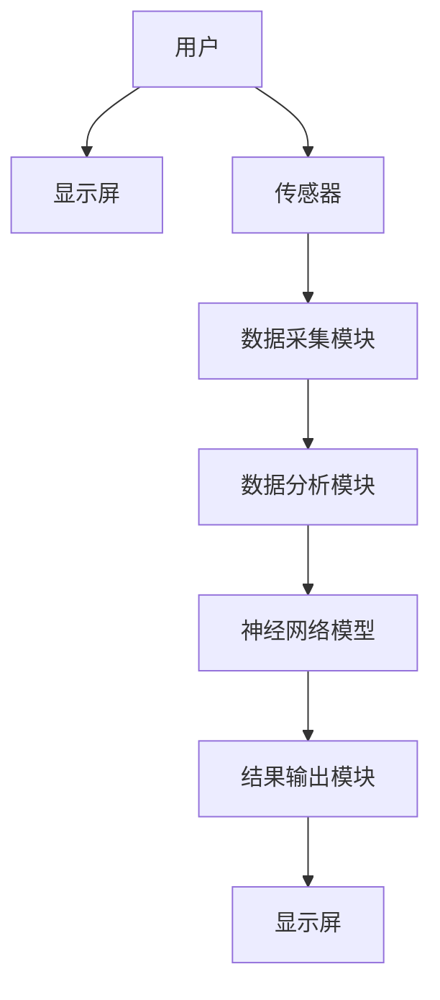

                 

# 智能厨房秤：AI Agent的营养成分分析

> 关键词：智能厨房秤，AI Agent，营养成分分析，算法原理，系统架构

> 摘要：本文详细探讨了智能厨房秤结合AI Agent技术进行营养成分分析的应用。从背景介绍到系统设计，再到项目实战，系统性地分析了该技术的核心原理、算法实现、系统架构以及实际应用。文章最后总结了AI Agent在智能厨房秤中的优势，并展望了未来的发展方向。

---

# 第一部分：背景与概述

## 第1章：智能厨房秤的发展与应用

### 1.1 智能厨房秤的背景与现状

#### 1.1.1 厨房秤的演变历程
厨房秤作为厨房中不可或缺的工具，经历了从传统机械秤到智能电子秤的演变。传统厨房秤仅能称量重量，而现代智能厨房秤则集成了多种功能，如联网、数据记录、营养成分分析等。这种演变得益于传感器技术、物联网（IoT）和人工智能（AI）技术的快速发展。

#### 1.1.2 智能化趋势的驱动因素
近年来，人们对健康管理的关注度显著提高，尤其是对饮食健康的需求。智能厨房秤通过AI技术，能够实时分析食材的营养成分，为用户提供个性化的饮食建议。这种智能化趋势主要由以下几个因素驱动：
1. **健康意识的增强**：用户希望了解摄入的营养成分，以维持或改善健康状况。
2. **科技的进步**：AI技术的发展使得智能设备能够更高效地处理复杂任务。
3. **市场需求的增长**：消费者对智能家电的需求不断增加，推动了相关技术的普及。

#### 1.1.3 当前市场与用户需求分析
当前市场上的智能厨房秤主要集中在以下几个方面：
- **数据采集**：通过传感器精准测量食材重量。
- **营养分析**：利用AI算法分析食材的热量、蛋白质、碳水化合物、脂肪、维生素等营养成分。
- **个性化建议**：基于用户的健康数据（如体重、身高、饮食习惯等），提供个性化的饮食建议。

用户的实际需求包括：
- 简单易用的界面设计。
- 准确的营养成分分析。
- 个性化建议的实用性。

### 1.2 AI Agent的基本概念与特点

#### 1.2.1 AI Agent的定义与核心功能
AI Agent（人工智能代理）是一种智能体，能够感知环境并执行任务以满足用户需求。在智能厨房秤中，AI Agent的核心功能包括：
- **数据采集**：通过传感器获取食材的重量和相关信息。
- **数据分析**：利用AI算法分析食材的营养成分。
- **结果输出**：将分析结果以用户友好的形式呈现。

#### 1.2.2 AI Agent在智能设备中的应用
AI Agent在智能厨房秤中的应用主要体现在以下几个方面：
1. **数据处理**：AI Agent能够实时处理食材的重量数据，并结合预存的营养成分数据库，快速生成营养分析结果。
2. **个性化建议**：根据用户的健康数据和饮食习惯，AI Agent可以提供个性化的饮食建议。
3. **智能推荐**：基于用户的偏好，AI Agent可以推荐适合的食谱或食材。

#### 1.2.3 营养成分分析的必要性与挑战
营养成分分析的必要性：
- **健康管理**：帮助用户了解摄入的营养成分，避免营养过剩或不足。
- **疾病预防**：通过合理的饮食搭配，预防慢性疾病。

营养成分分析的挑战：
1. **数据准确性**：食材的营养成分数据库需要准确且全面。
2. **算法复杂性**：营养成分分析涉及复杂的数学模型，需要高效的算法支持。
3. **用户体验**：如何将复杂的分析结果以简单易懂的形式呈现给用户。

### 1.3 营养成分分析的数学模型与方法

#### 1.3.1 数据采集与处理
营养成分分析的数据采集主要通过厨房秤的传感器完成。传感器将食材的重量转化为电子信号，并通过模数转换器（ADC）将模拟信号转换为数字信号。处理步骤如下：
1. **数据采集**：获取食材的重量数据。
2. **数据预处理**：去除噪声，提取有效数据。
3. **特征提取**：将重量数据与其他特征（如食材种类）结合，形成可用于分析的特征向量。

#### 1.3.2 营养成分分析的数学模型
营养成分分析的核心是通过数学模型将食材的重量与营养成分联系起来。常用的方法包括线性回归、支持向量机（SVM）和神经网络。

- **线性回归模型**：适用于简单的线性关系，但营养成分分析通常涉及多个变量，线性回归可能不够准确。
- **支持向量机（SVM）**：适合处理非线性关系，但在高维数据下计算复杂。
- **神经网络**：能够处理复杂的非线性关系，但需要大量的数据和计算资源。

#### 1.3.3 算法选择与优化
基于上述分析，神经网络模型更适合营养成分分析任务。以下是神经网络模型的优化策略：
1. **数据增强**：通过增加数据的多样性和数量，提高模型的泛化能力。
2. **模型调整**：选择合适的网络结构和超参数，避免过拟合。
3. **训练优化**：使用高效的训练算法（如Adam）和适当的学习率。

---

## 第2章：智能厨房秤与AI Agent的结合

### 2.1 AI Agent在智能厨房秤中的角色

#### 2.1.1 AI Agent的功能模块划分
AI Agent在智能厨房秤中的功能模块包括：
1. **数据采集模块**：负责采集食材的重量数据。
2. **数据分析模块**：利用AI算法分析食材的营养成分。
3. **用户交互模块**：与用户进行数据输入和结果输出。

#### 2.1.2 AI Agent与硬件设备的交互
AI Agent通过与厨房秤的硬件设备（如传感器、显示屏）交互，完成数据的采集、处理和展示。以下是交互流程：
1. **数据采集**：用户放置食材，传感器采集重量数据。
2. **数据处理**：AI Agent将数据传递给分析模块，生成营养分析结果。
3. **结果展示**：通过显示屏将结果呈现给用户。

#### 2.1.3 AI Agent的数据处理流程
数据处理流程如下：
1. **数据采集**：获取食材的重量。
2. **特征提取**：将重量数据与其他特征（如食材种类）结合。
3. **模型分析**：利用神经网络模型预测营养成分。
4. **结果输出**：将分析结果以用户友好的形式展示。

### 2.2 营养成分分析的核心算法

#### 2.2.1 线性回归模型的公式推导
线性回归模型的数学公式为：
$$ y = \beta_0 + \beta_1 x + \epsilon $$
其中，$y$ 是目标变量（营养成分），$x$ 是自变量（食材重量），$\beta_0$ 和 $\beta_1$ 是回归系数，$\epsilon$ 是误差项。

#### 2.2.2 支持向量机（SVM）的数学基础
SVM的核心思想是通过找到一个超平面，使得正负样本能够被正确分类。其优化目标为：
$$ \min_{\theta, b} \frac{1}{2} \|\theta\|^2 + C \sum_{i=1}^{n} \xi_i $$
其中，$\theta$ 是权重向量，$b$ 是偏置项，$C$ 是惩罚系数，$\xi_i$ 是松弛变量。

#### 2.2.3 神经网络模型的适用性分析
神经网络模型适用于复杂的非线性关系，其结构包括输入层、隐藏层和输出层。常用的神经网络模型有卷积神经网络（CNN）和长短期记忆网络（LSTM）。

### 2.3 系统架构与功能模块设计

#### 2.3.1 系统整体架构图

#### 2.3.2 各功能模块的详细描述
1. **数据采集模块**：负责采集食材的重量数据。
2. **数据分析模块**：利用AI算法分析食材的营养成分。
3. **结果输出模块**：将分析结果以用户友好的形式展示。

#### 2.3.3 模块之间的数据流关系
- 用户通过显示屏输入食材信息。
- 传感器采集食材的重量数据，传递给数据采集模块。
- 数据采集模块将数据传递给数据分析模块。
- 数据分析模块利用神经网络模型进行分析，生成结果。
- 结果输出模块将结果传递给显示屏，展示给用户。

---

## 第3章：AI Agent的原理与实现

### 3.1 AI Agent的核心原理

#### 3.1.1 感知层：数据采集与处理
AI Agent的感知层负责采集食材的重量数据，并进行预处理。预处理步骤包括：
1. **数据清洗**：去除噪声和异常值。
2. **特征提取**：将重量数据与其他特征（如食材种类）结合。

#### 3.1.2 决策层：算法选择与优化
决策层负责选择合适的算法，并对其进行优化。神经网络模型通常更适合复杂的营养成分分析任务。

#### 3.1.3 执行层：结果输出与反馈
执行层负责将分析结果输出给用户，并根据用户的反馈调整模型参数。

### 3.2 营养成分分析的数学模型

#### 3.2.1 线性回归模型的公式推导
线性回归模型的公式为：
$$ y = \beta_0 + \beta_1 x + \epsilon $$
其中，$y$ 是目标变量（营养成分），$x$ 是自变量（食材重量），$\beta_0$ 和 $\beta_1$ 是回归系数，$\epsilon$ 是误差项。

#### 3.2.2 支持向量机（SVM）的数学基础
SVM的核心思想是通过找到一个超平面，使得正负样本能够被正确分类。其优化目标为：
$$ \min_{\theta, b} \frac{1}{2} \|\theta\|^2 + C \sum_{i=1}^{n} \xi_i $$
其中，$\theta$ 是权重向量，$b$ 是偏置项，$C$ 是惩罚系数，$\xi_i$ 是松弛变量。

#### 3.2.3 神经网络模型的适用性分析
神经网络模型适用于复杂的非线性关系，其结构包括输入层、隐藏层和输出层。常用的神经网络模型有卷积神经网络（CNN）和长短期记忆网络（LSTM）。

### 3.3 算法实现与优化

#### 3.3.1 数据预处理的步骤与方法
数据预处理步骤包括：
1. **数据清洗**：去除噪声和异常值。
2. **特征提取**：将重量数据与其他特征（如食材种类）结合。
3. **数据归一化**：将数据标准化，便于模型训练。

#### 3.3.2 模型训练的流程与参数调整
模型训练流程包括：
1. **数据准备**：将预处理后的数据分为训练集和测试集。
2. **模型选择**：选择合适的神经网络模型。
3. **参数调整**：通过交叉验证调整模型参数（如学习率、批量大小等）。

#### 3.3.3 模型评估与优化策略
模型评估指标包括准确率、召回率和F1分数。优化策略包括：
1. **数据增强**：通过增加数据的多样性和数量，提高模型的泛化能力。
2. **模型调整**：选择合适的网络结构和超参数，避免过拟合。
3. **训练优化**：使用高效的训练算法（如Adam）和适当的

