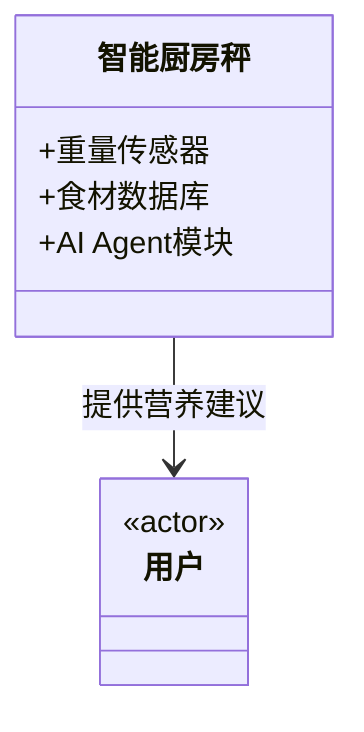
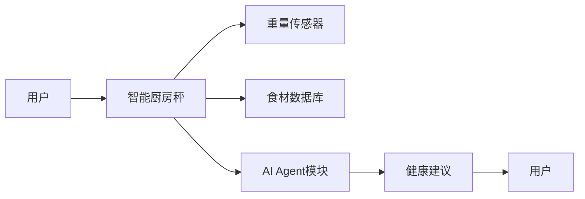
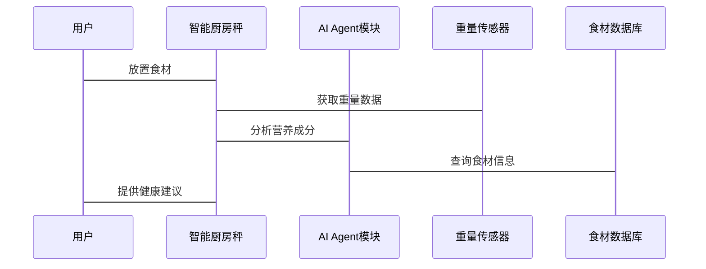

                 


# 智能厨房秤：AI Agent的营养摄入分析与建议

> 关键词：智能厨房秤，AI Agent，营养摄入分析，健康饮食，人工智能

> 摘要：本文详细探讨了智能厨房秤在AI Agent技术下的营养摄入分析与健康建议。通过分析智能厨房秤的核心功能、AI Agent的基本原理、算法模型、系统架构设计、项目实战以及优化与维护，本文为读者提供了一套完整的解决方案，帮助用户更好地管理营养摄入，实现健康饮食。

---

# 第一部分: 智能厨房秤概述与背景

## 第1章: 智能厨房秤的背景与应用场景

### 1.1 智能厨房秤的背景

#### 1.1.1 营养健康的重要性
现代社会人们对健康饮食的关注度日益增加，营养摄入的均衡性成为衡量个人健康的重要指标。智能厨房秤通过结合AI技术，能够帮助用户实时监控饮食中的营养成分，提供个性化的健康建议。

#### 1.1.2 智能厨房秤的发展历程
传统厨房秤仅用于测量食材的重量，而现代智能厨房秤通过集成传感器和AI算法，能够实现食材的精准识别、营养成分分析以及健康建议生成。

#### 1.1.3 AI Agent在厨房秤中的应用价值
AI Agent（智能体）通过实时数据处理、自主决策和个性化推荐，为智能厨房秤提供了强大的技术支持，使其能够为用户提供智能化的营养摄入管理服务。

### 1.2 营养摄入分析的核心问题

#### 1.2.1 营养摄入不平衡的现状
现代人由于饮食习惯的不规律，普遍存在营养摄入不平衡的问题，例如维生素摄入不足、脂肪摄入过多等。

#### 1.2.2 智能厨房秤如何解决营养分析问题
通过AI Agent技术，智能厨房秤能够实时采集食材数据，结合用户饮食习惯，提供精准的营养分析和健康建议。

#### 1.2.3 边界与外延
智能厨房秤的营养分析功能不仅关注食材本身的营养成分，还需要结合用户的身体状况、饮食习惯和健康目标，提供个性化的建议。

### 1.3 智能厨房秤的功能与优势

#### 1.3.1 核心功能概述
- 食材识别与重量测量
- 营养成分分析
- 健康建议生成
- 数据同步与历史记录

#### 1.3.2 与传统厨房秤的区别
传统厨房秤仅提供重量测量功能，而智能厨房秤通过AI技术实现了食材识别、营养分析和个性化建议生成。

#### 1.3.3 用户需求与痛点分析
- 用户需求：便捷的营养摄入管理工具。
- 痛点：传统厨房秤无法提供营养分析，用户难以实现均衡饮食。

### 1.4 本章小结
本章介绍了智能厨房秤的背景、核心功能及其在营养摄入管理中的应用价值，为后续章节奠定了基础。

---

# 第二部分: AI Agent与营养分析基础

## 第2章: AI Agent的基本原理

### 2.1 AI Agent的定义与特点

#### 2.1.1 AI Agent的定义
AI Agent是一种能够感知环境、自主决策并执行任务的智能实体，能够在复杂环境中实现目标。

#### 2.1.2 AI Agent的核心特点
- 感知能力：通过传感器或API获取环境数据。
- 决策能力：基于数据进行分析和决策。
- 自适应能力：根据反馈不断优化行为。

#### 2.1.3 AI Agent与传统算法的区别
AI Agent具备自主性和适应性，能够根据实时数据动态调整行为，而传统算法通常基于静态规则。

### 2.2 营养摄入分析的基本原理

#### 2.2.1 营养成分的分类与分析
食材中的营养成分包括蛋白质、碳水化合物、脂肪、维生素等，AI Agent需要对这些成分进行分类和量化分析。

#### 2.2.2 营养均衡的数学模型
通过数学模型计算用户的每日营养摄入比例，确保各类营养成分的均衡。

#### 2.2.3 AI Agent在营养分析中的作用
AI Agent通过实时数据处理和模型推理，为用户提供个性化的营养建议。

### 2.3 AI Agent与营养摄入分析的结合

#### 2.3.1 数据采集与处理
智能厨房秤通过传感器采集食材的重量和种类信息，并通过API传递给AI Agent进行处理。

#### 2.3.2 特征提取与分析
AI Agent从食材数据中提取营养成分特征，并结合用户饮食习惯进行分析。

#### 2.3.3 AI Agent的决策机制
基于营养分析结果，AI Agent生成健康建议，例如调整食材比例或推荐替代食材。

### 2.4 本章小结
本章详细介绍了AI Agent的基本原理及其在营养摄入分析中的应用，为后续章节的系统设计奠定了理论基础。

---

# 第三部分: 算法原理与数学模型

## 第3章: 数据采集与特征提取

### 3.1 数据采集的流程

#### 3.1.1 智能厨房秤的数据采集方式
智能厨房秤通过压力传感器测量食材的重量，并通过OCR技术识别食材种类。

#### 3.1.2 数据预处理方法
对采集的数据进行去噪、归一化处理，确保数据的准确性和一致性。

#### 3.1.3 数据清洗与标准化
去除异常数据，将数据标准化为统一的格式，便于后续分析。

### 3.2 特征提取的关键技术

#### 3.2.1 营养成分的特征提取
通过数据库匹配食材的营养成分表，提取蛋白质、碳水化合物、脂肪等关键特征。

#### 3.2.2 数据特征的维度分析
分析食材数据的维度，确保特征的独立性和相关性。

#### 3.2.3 特征选择与降维技术
使用主成分分析（PCA）等方法，降低特征维度，提升模型效率。

### 3.3 算法原理与流程图

#### 3.3.1 算法流程图


### 3.4 本章小结
本章详细介绍了智能厨房秤的数据采集与特征提取过程，为后续的营养分析奠定了基础。

---

## 第4章: 营养摄入分析的数学模型

### 4.1 营养均衡的数学模型

#### 4.1.1 营养均衡的定义
营养均衡是指各类营养成分的摄入比例符合人体健康需求。

#### 4.1.2 数学模型的构建
通过线性回归模型计算各类营养成分的推荐摄入量：
$$ \text{推荐摄入量} = \alpha \cdot \text{体重} + \beta $$
其中，$\alpha$ 和 $\beta$ 是模型训练得到的参数。

#### 4.1.3 模型的优化与调整
通过梯度下降算法优化模型参数，提升模型的准确性和实用性。

### 4.2 AI Agent的决策算法

#### 4.2.1 决策树算法
通过决策树模型对食材种类进行分类，生成个性化建议。

#### 4.2.2 贝叶斯网络
基于贝叶斯网络分析食材的营养成分，生成健康建议。

---

# 第四部分: 系统架构设计与实现

## 第5章: 系统架构设计

### 5.1 问题场景介绍
智能厨房秤需要实现食材识别、营养分析和健康建议生成三大功能。

### 5.2 系统功能设计

#### 5.2.1 领域模型设计


### 5.3 系统架构设计

#### 5.3.1 架构设计


### 5.4 接口设计与交互

#### 5.4.1 系统接口设计
- 用户与智能厨房秤的交互接口
- 智能厨房秤与食材数据库的接口
- AI Agent模块的接口

#### 5.4.2 交互流程


---

## 第6章: 项目实战

### 6.1 环境安装

#### 6.1.1 系统环境
- 操作系统：Windows/Mac/Linux
- 开发工具：Python 3.8+
- 依赖库：TensorFlow、scikit-learn、Mermaid

### 6.2 系统核心实现

#### 6.2.1 数据采集与处理
```python
import numpy as np
import pandas as pd

# 数据采集
weight = sensor.read_weight()
食材种类 = sensor.read_food_type()
```

#### 6.2.2 AI Agent实现
```python
class AIAgent:
    def __init__(self):
        self.model = self.load_model()

    def analyze_nutrition(self, weight, 食材种类):
        # 数据预处理
        data = preprocess_data(weight, 食材种类)
        # 模型推理
        result = self.model.predict(data)
        return result
```

---

## 第7章: 优化与维护

### 7.1 性能优化

#### 7.1.1 数据预处理优化
通过并行计算和缓存机制提升数据处理效率。

#### 7.1.2 模型优化
使用分布式训练和超参数优化提升模型性能。

### 7.2 模型维护

#### 7.2.1 模型更新
定期更新食材数据库和AI模型，确保数据的准确性和模型的先进性。

#### 7.2.2 用户反馈
收集用户反馈，不断优化模型和建议生成算法。

### 7.3 注意事项

#### 7.3.1 数据隐私
确保用户数据的安全性，避免隐私泄露。

#### 7.3.2 系统稳定性
通过冗余设计和容错机制提升系统的稳定性。

---

## 第8章: 展望与未来发展

### 8.1 未来发展方向

#### 8.1.1 更精准的营养分析
通过引入更多传感器和更复杂的AI算法，实现更精准的营养成分分析。

#### 8.1.2 更智能的健康建议
结合用户健康数据，提供个性化的健康建议。

### 8.2 总结
智能厨房秤作为AI技术在健康领域的典型应用，未来将在营养摄入管理中发挥越来越重要的作用。

---

# 作者：AI天才研究院/AI Genius Institute & 禅与计算机程序设计艺术 /Zen And The Art of Computer Programming

