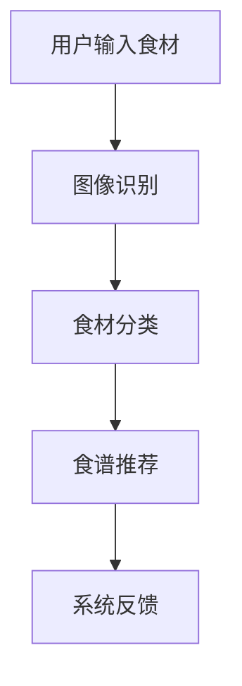
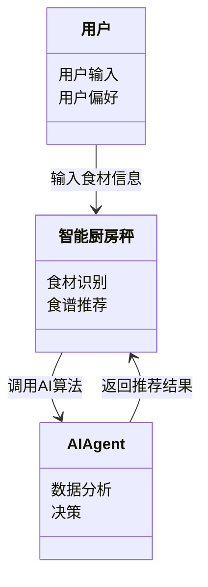
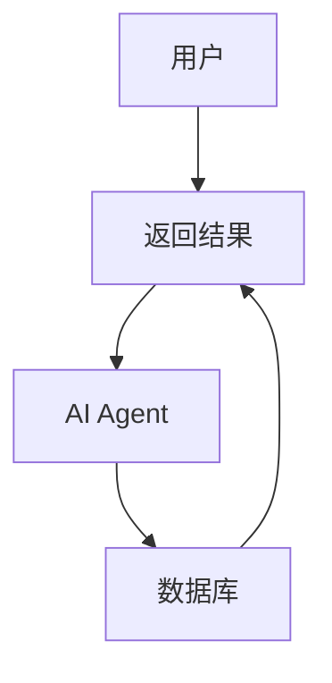
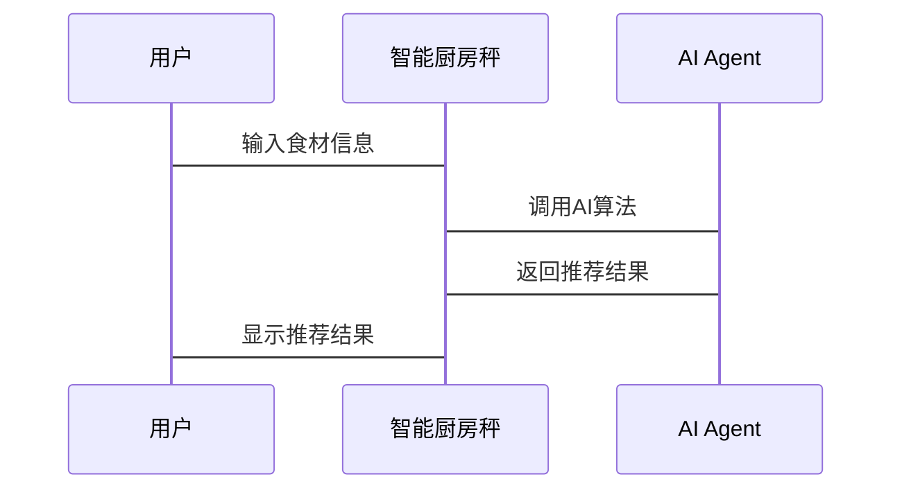

                 


# 智能厨房秤：AI Agent的食谱创新助手

## 关键词：智能厨房秤, AI Agent, 食谱创新, 食材识别, 营养分析, 系统架构

## 摘要：本文深入探讨智能厨房秤与AI Agent的结合，分析其在食谱创新中的应用价值。通过详细的技术分析，阐述AI Agent如何赋能智能厨房秤，实现食材识别、食谱推荐、营养分析等功能。本文从系统背景、核心概念、算法原理、系统架构到项目实战，全面解析智能厨房秤的设计与实现，为厨房场景的智能化创新提供参考。

---

# 第1章: 智能厨房秤与AI Agent的背景介绍

## 1.1 问题背景与挑战

### 1.1.1 厨房秤的传统功能与局限性
传统的厨房秤主要用于测量食材的重量，功能单一，无法满足现代厨房对智能化、个性化的需求。用户在使用传统厨房秤时，只能得到简单的重量数据，无法获得食谱推荐、营养分析等高阶功能。

### 1.1.2 现代厨房秤的智能化需求
随着人工智能技术的发展，用户对厨房秤的期望逐步升级。现代厨房秤需要能够识别食材种类、推荐适合的食谱、分析食材的营养成分，并提供个性化的健康建议。

### 1.1.3 食谱创新的痛点与机遇
传统食谱创新依赖人工经验，耗时且效率低下。AI Agent的引入为食谱创新提供了新的可能性，能够基于食材的重量、种类、用户偏好等信息，自动生成创新食谱。

### 1.1.4 AI Agent在厨房场景中的优势
AI Agent能够实时感知厨房环境，分析用户需求，并通过数据驱动的方式优化食谱推荐。其优势在于高效性、智能化和个性化。

## 1.2 AI Agent与智能厨房秤的核心概念

### 1.2.1 AI Agent的基本原理
AI Agent是一种能够感知环境、自主决策并执行任务的智能体。在智能厨房秤中，AI Agent负责处理食材识别、食谱推荐等任务。

### 1.2.2 AI Agent在厨房场景中的应用
AI Agent通过分析用户输入的食材重量、种类等信息，结合数据库中的食谱数据，生成个性化的食谱推荐。

### 1.2.3 智能厨房秤的创新价值
智能厨房秤结合AI Agent，能够为用户提供智能化的厨房体验，提升烹饪效率和食谱创新的效率。

## 1.3 问题描述与解决方案

### 1.3.1 厨房秤的智能化升级需求
传统厨房秤的功能单一，无法满足现代厨房的多样化需求。智能化升级能够为用户提供更丰富的功能。

### 1.3.2 AI Agent如何解决食谱创新问题
AI Agent通过分析食材数据和用户需求，优化食谱推荐算法，实现高效的食谱创新。

### 1.3.3 智能厨房秤的系统架构与实现
智能厨房秤的系统架构包括硬件部分和软件部分，硬件负责数据采集，软件负责数据处理和AI算法实现。

## 1.4 系统边界与外延

### 1.4.1 系统功能边界
智能厨房秤的功能包括食材识别、食谱推荐、营养分析等。

### 1.4.2 系统与外部环境的交互
智能厨房秤通过网络连接到云端数据库，获取最新的食谱数据和营养信息。

### 1.4.3 系统扩展性与兼容性
智能厨房秤支持多种食材识别和多种食谱推荐模式，能够根据用户需求进行扩展和优化。

## 1.5 核心概念与组成要素

### 1.5.1 智能厨房秤的功能模块
- 食材识别模块：通过AI算法识别食材种类和重量。
- 食谱推荐模块：根据食材数据推荐适合的食谱。
- 营养分析模块：分析食材的营养成分，提供健康建议。

### 1.5.2 AI Agent的核心要素
- 数据采集：通过传感器获取食材数据。
- 数据处理：对食材数据进行分析和处理。
- 决策与推荐：基于数据分析结果，生成食谱推荐。

### 1.5.3 系统的核心组成与逻辑关系
智能厨房秤由硬件部分和软件部分组成，硬件负责数据采集，软件负责数据处理和AI算法实现。两部分通过通信接口进行交互，共同完成食材识别、食谱推荐等任务。

---

# 第2章: AI Agent与智能厨房秤的核心概念

## 2.1 AI Agent的核心原理

### 2.1.1 AI Agent的基本原理
AI Agent通过感知环境、分析数据、制定决策并执行任务。在智能厨房秤中，AI Agent负责处理食材识别和食谱推荐任务。

### 2.1.2 AI Agent的感知与决策机制
AI Agent通过传感器获取食材数据，结合数据库中的食谱信息，进行分析和决策，生成食谱推荐。

### 2.1.3 AI Agent的学习与优化能力
AI Agent能够通过机器学习算法优化食谱推荐算法，提升推荐的准确性和用户满意度。

## 2.2 智能厨房秤的功能模块

### 2.2.1 食材识别模块
食材识别模块通过AI算法识别食材种类和重量，为后续的食谱推荐提供数据支持。

### 2.2.2 食谱推荐模块
食谱推荐模块基于食材数据和用户偏好，推荐适合的食谱。

### 2.2.3 营养分析模块
营养分析模块对食材的营养成分进行分析，提供健康建议。

## 2.3 AI Agent与智能厨房秤的交互机制

### 2.3.1 用户输入与系统反馈
用户通过智能厨房秤输入食材信息，系统通过AI Agent处理数据并返回食谱推荐结果。

### 2.3.2 AI Agent的决策流程
AI Agent接收食材数据，分析用户需求，生成食谱推荐。

### 2.3.3 系统的实时响应与优化
系统根据用户反馈优化食谱推荐算法，提升用户体验。

## 2.4 核心概念对比与特征分析

### 2.4.1 AI Agent与传统厨房秤的对比
| 特性          | AI Agent厨房秤 | 传统厨房秤 |
|---------------|-----------------|------------|
| 功能          | 食材识别、食谱推荐 | 称重         |
| 智能性        | 高              | 低          |
| 用户体验      | 个性化          | 单一化       |

### 2.4.2 智能厨房秤与传统厨房秤的对比
| 特性          | 智能厨房秤       | 传统厨房秤 |
|---------------|-----------------|------------|
| 功能          | 食材识别、食谱推荐 | 称重         |
| 智能性        | 高              | 低          |
| 用户体验      | 个性化          | 单一化       |

### 2.4.3 AI Agent的核心特征分析
AI Agent的核心特征包括：实时感知、自主决策、数据驱动、持续优化。

---

# 第3章: 系统算法原理与数学模型

## 3.1 算法原理概述

### 3.1.1 AI Agent的核心算法
AI Agent的核心算法包括图像识别算法、机器学习算法和自然语言处理算法。

### 3.1.2 智能厨房秤的算法实现
智能厨房秤通过图像识别算法识别食材种类，通过机器学习算法推荐食谱。

### 3.1.3 算法的优化与改进
通过不断优化算法模型，提升食材识别的准确率和食谱推荐的命中率。

## 3.2 算法流程图


## 3.3 数学模型与公式

### 3.3.1 食材识别的分类算法
食材识别的分类算法可以使用卷积神经网络（CNN）进行分类，其概率计算公式为：
$$ P(y|x) = \frac{P(x|y)P(y)}{P(x)} $$

### 3.3.2 食谱推荐的相似度计算
食谱推荐的相似度计算可以使用余弦相似度公式：
$$ sim(i,j) = \frac{\sum_{k=1}^{n} w_{ik}w_{jk}}{\sqrt{\sum_{k=1}^{n} w_{ik}^2} \sqrt{\sum_{k=1}^{n} w_{jk}^2}} $$

---

# 第4章: 系统分析与架构设计

## 4.1 项目介绍

### 4.1.1 项目目标
本项目旨在开发一款结合AI Agent的智能厨房秤，实现食材识别、食谱推荐等功能。

### 4.1.2 项目范围
项目范围包括硬件设计、软件开发、算法实现和系统测试。

## 4.2 系统功能设计

### 4.2.1 领域模型


### 4.2.2 系统架构


## 4.3 系统接口设计

### 4.3.1 系统接口
系统接口包括：
- 用户与智能厨房秤的交互接口
- 智能厨房秤与AI Agent的通信接口
- AI Agent与数据库的交互接口

### 4.3.2 接口设计
接口设计需要考虑数据格式、通信协议和安全性。

## 4.4 系统交互设计

### 4.4.1 系统交互流程
用户通过智能厨房秤输入食材信息，系统调用AI Agent进行分析，返回食谱推荐结果。

### 4.4.2 交互流程图


---

# 第5章: 项目实战

## 5.1 环境安装

### 5.1.1 系统环境
- 操作系统：Linux
- 开发工具：PyCharm
- 依赖库：TensorFlow、OpenCV、Pandas

## 5.2 核心实现

### 5.2.1 食材识别模块
```python
import tensorflow as tf
from tensorflow.keras import layers

model = tf.keras.Sequential([
    layers.Conv2D(32, (3,3), activation='relu', input_shape=(128, 128, 3)),
    layers.MaxPooling2D(2,2),
    layers.Conv2D(64, (3,3), activation='relu'),
    layers.MaxPooling2D(2,2),
    layers.Flatten(),
    layers.Dense(128, activation='relu'),
    layers.Dense(10, activation='softmax')
])
```

### 5.2.2 食谱推荐模块
```python
import pandas as pd

def推荐食谱(食材, 重量):
    数据库 = pd.read_csv('食谱数据库.csv')
    过滤后的数据库 = 数据库[数据库['食材'] == 食材]
    推荐食谱 = 过滤后的数据库[过滤后的数据库['重量'] <= 重量].sort_values('评分', ascending=False).head(5)
    return 推荐食谱
```

## 5.3 代码实现与解读

### 5.3.1 食材识别模块的实现
食材识别模块使用卷积神经网络进行图像分类，模型通过训练食材图片数据，实现对食材的自动识别。

### 5.3.2 食谱推荐模块的实现
食谱推荐模块基于食材识别结果和用户输入的重量，从数据库中筛选出适合的食谱，并进行排序和推荐。

## 5.4 实际案例分析

### 5.4.1 案例背景
用户输入鸡胸肉和200克的重量。

### 5.4.2 系统处理
系统识别食材为鸡胸肉，重量为200克。

### 5.4.3 推荐结果
系统推荐5个适合的食谱，包括鸡胸肉沙拉、鸡胸肉煎饼等。

## 5.5 项目小结

### 5.5.1 核心功能实现
项目实现了食材识别、食谱推荐等核心功能。

### 5.5.2 系统性能优化
系统通过优化算法模型和数据库查询效率，提升了处理速度和推荐准确率。

---

# 第6章: 小结与注意事项

## 6.1 核心内容总结

### 6.1.1 系统背景
智能厨房秤结合AI Agent，为厨房场景带来了智能化的解决方案。

### 6.1.2 核心概念
AI Agent通过食材识别、食谱推荐等功能，实现智能化的厨房管理。

### 6.1.3 算法原理
食材识别和食谱推荐基于机器学习和深度学习算法，实现了高效的智能化处理。

## 6.2 使用建议与注意事项

### 6.2.1 使用建议
- 确保系统的数据安全性和隐私保护。
- 定期更新数据库和算法模型，保持推荐结果的准确性。

### 6.2.2 注意事项
- 系统需要定期维护和优化，确保性能稳定。
- 用户需要正确使用系统，避免误操作。

## 6.3 拓展阅读
- 探索更多AI技术在厨房场景中的应用，如智能烹饪助手、食材保鲜管理等。

---

# 作者：AI天才研究院/AI Genius Institute & 禅与计算机程序设计艺术 /Zen And The Art of Computer Programming

---

以上为完整的技术博客文章目录和内容框架，您可以根据需要进一步补充细节或调整结构。

