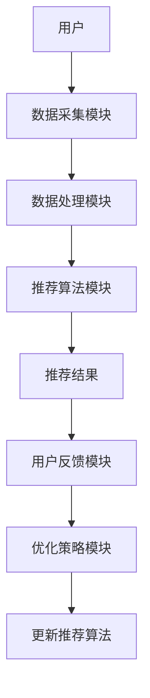
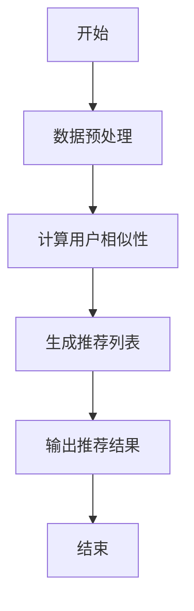

                 


# 智能厨房秤：AI Agent的食谱推荐系统

## 关键词：智能厨房秤, AI Agent, 食谱推荐系统, 物联网, 人工智能, 推荐算法

## 摘要：  
本文详细探讨了智能厨房秤与AI Agent结合的食谱推荐系统的实现与优化。通过分析用户需求，设计了基于协同过滤和聚类算法的推荐模型，并结合系统架构设计和项目实战，展示了如何利用AI技术提升厨房秤的功能。文章还讨论了系统的优化策略和实际应用案例，为读者提供了全面的技术指导。

---

# 第1章: 问题背景与需求分析

## 1.1 问题背景  
### 1.1.1 智能厨房秤的发展现状  
智能厨房秤作为一种智能家居设备，近年来逐渐普及。它不仅可以称重食材，还能够通过连接互联网提供食谱推荐、食材管理等功能，极大地提升了用户的烹饪体验。  

### 1.1.2 当前食谱推荐系统的痛点  
现有的食谱推荐系统主要依赖于用户手动输入食材或搜索关键词，推荐结果不够精准，且难以结合用户的实际需求（如口味偏好、饮食限制等）。此外，传统推荐系统缺乏动态调整能力，无法实时根据用户的使用习惯优化推荐结果。  

### 1.1.3 AI Agent在智能厨房秤中的作用  
AI Agent（智能代理）能够实时感知用户的操作行为（如称重数据、烹饪习惯等），并结合用户的历史数据和实时需求，动态生成个性化的食谱推荐。这使得智能厨房秤的功能更加智能化、个性化。  

## 1.2 问题描述  
### 1.2.1 智能厨房秤的功能需求  
智能厨房秤需要具备以下核心功能：  
1. 实时称重食材。  
2. 根据称重数据推荐食谱。  
3. 学习用户的饮食偏好，优化推荐结果。  

### 1.2.2 用户对食谱推荐的核心诉求  
用户希望食谱推荐系统能够：  
1. 根据称重数据快速生成推荐食谱。  
2. 考虑用户的口味偏好、饮食限制（如过敏、低脂饮食等）。  
3. 提供详细的烹饪步骤和食材用量。  

### 1.2.3 系统边界与外延  
系统的核心功能是基于称重数据的食谱推荐，外延功能包括食材库存管理、健康数据分析等。  

## 1.3 问题解决与核心概念  
### 1.3.1 智能厨房秤的食谱推荐系统  
食谱推荐系统通过分析用户的称重数据和历史行为，生成个性化的食谱推荐。  

### 1.3.2 AI Agent的核心要素  
AI Agent的核心要素包括：  
1. 感知模块：实时采集用户的称重数据和操作行为。  
2. 推荐算法：基于协同过滤和聚类算法生成推荐结果。  
3. 学习模块：动态优化推荐策略。  

### 1.3.3 系统的核心功能与边界  
系统的核心功能包括数据采集、推荐生成、用户反馈优化。边界包括与外部数据源（如食谱数据库）的交互。  

## 1.4 本章小结  
本章通过分析智能厨房秤的背景和发展现状，明确了食谱推荐系统的核心需求，并提出了AI Agent在系统中的关键作用。  

---

# 第2章: 核心概念与系统架构

## 2.1 AI Agent的基本原理  
### 2.1.1 AI Agent的定义与特征  
AI Agent是一种智能代理，能够感知环境、执行任务并优化决策。其主要特征包括智能性、自主性、反应性和社会性。  

### 2.1.2 AI Agent的分类与应用场景  
AI Agent可以分为简单反射Agent和复杂推理Agent。在智能厨房秤中，AI Agent主要用于数据采集、推荐生成和用户反馈优化。  

### 2.1.3 AI Agent在智能厨房秤中的具体实现  
AI Agent通过传感器采集称重数据，结合用户的历史行为数据，生成个性化的食谱推荐。  

## 2.2 智能厨房秤的食谱推荐系统  
### 2.2.1 食谱推荐系统的功能模块  
食谱推荐系统包括以下功能模块：  
1. 数据采集模块：采集用户的称重数据和操作行为。  
2. 数据处理模块：对数据进行清洗和特征提取。  
3. 推荐算法模块：基于协同过滤和聚类算法生成推荐结果。  
4. 用户反馈模块：收集用户反馈以优化推荐策略。  

### 2.2.2 推荐算法的核心原理  
推荐算法的核心原理包括：  
1. **协同过滤算法**：基于用户行为相似性进行推荐。  
2. **聚类算法**：将用户分成不同的群体，基于群体特征进行推荐。  

### 2.2.3 系统的输入输出与数据流  
系统的输入包括称重数据和用户操作行为，输出包括推荐食谱和反馈信息。数据流包括数据采集、处理、推荐生成和用户反馈。  

## 2.3 实体关系与系统架构  
### 2.3.1 实体关系图（ER图）  
```mermaid
er
    actor 用户 {
        string 用户ID
        string 用户名
        integer 年龄
        string 邮箱
    }
    entity 食谱 {
        string 食谱ID
        string 食谱名称
        string 食谱描述
        integer 难度级别
    }
    entity 用户偏好 {
        integer 用户ID
        integer 食谱ID
        integer 偏好程度
    }
    entity 厨房秤数据 {
        integer 数据ID
        integer 用户ID
        float 重量
        datetime 时间戳
    }
    
    用户 -> 用户偏好 : 偏好食谱
    用户 -> 厨房秤数据 : 产生称重数据
    用户偏好 -> 食谱 : 食谱偏好
    厨房秤数据 -> 食谱 : 根据称重数据推荐食谱
```

### 2.3.2 系统架构图  


## 2.4 本章小结  
本章详细介绍了AI Agent的基本原理和食谱推荐系统的功能模块，通过ER图和系统架构图展示了系统的整体结构。  

---

# 第3章: 算法原理与实现

## 3.1 推荐算法的原理与选择  
### 3.1.1 协同过滤算法  
协同过滤算法基于用户的相似性进行推荐，分为基于用户的协同过滤和基于物品的协同过滤。  

### 3.1.2 聚类算法  
聚类算法通过将用户分成不同的群体，基于群体特征进行推荐。  

### 3.1.3 算法选择与优化  
根据实际需求，选择协同过滤算法作为核心推荐算法，并结合聚类算法进行优化。  

## 3.2 算法实现步骤  
### 3.2.1 数据预处理  
数据预处理包括数据清洗、特征提取和数据标准化。  

### 3.2.2 推荐算法实现  
基于协同过滤算法的实现步骤如下：  
1. 计算用户相似性。  
2. 生成推荐列表。  
3. 输出推荐结果。  

### 3.2.3 算法流程图  


## 3.3 算法优化与改进  
### 3.3.1 基于用户的协同过滤算法  
协同过滤算法的核心公式为：  
$$ sim(u, v) = \frac{\sum_{i \in N(u) \cap N(v)} (r_{u,i} - \bar{r}_u)(r_{v,i} - \bar{r}_v)}{\sqrt{\sum_{i \in N(u)} (r_{u,i} - \bar{r}_u)^2} \cdot \sqrt{\sum_{i \in N(v)} (r_{v,i} - \bar{r}_v)^2}}} $$  
其中，$sim(u, v)$ 表示用户 $u$ 和 $v$ 之间的相似性，$r_{u,i}$ 表示用户 $u$ 对物品 $i$ 的评分，$\bar{r}_u$ 表示用户 $u$ 的平均评分。  

### 3.3.2 基于物品的协同过滤算法  
基于物品的协同过滤算法的核心公式为：  
$$ sim(i, j) = \frac{\sum_{u \in N(i) \cap N(j)} (r_{u,i} - \bar{r}_i)(r_{u,j} - \bar{r}_j)}{\sqrt{\sum_{u \in N(i)} (r_{u,i} - \bar{r}_i)^2} \cdot \sqrt{\sum_{u \in N(j)} (r_{u,j} - \bar{r}_j)^2}}} $$  
其中，$sim(i, j)$ 表示物品 $i$ 和 $j$ 之间的相似性，$r_{u,i}$ 表示用户 $u$ 对物品 $i$ 的评分，$\bar{r}_i$ 表示物品 $i$ 的平均评分。  

## 3.4 本章小结  
本章详细讲解了协同过滤算法的原理与实现，并通过公式和流程图展示了算法的核心步骤。  

---

# 第4章: 系统架构设计与实现

## 4.1 系统功能设计  
### 4.1.1 用户模块  
用户模块包括用户信息管理、称重数据采集和用户反馈功能。  

### 4.1.2 食谱模块  
食谱模块包括食谱数据库管理和推荐结果展示功能。  

### 4.1.3 传感器模块  
传感器模块负责采集用户的称重数据。  

## 4.2 系统架构设计  
### 4.2.1 系统架构图  


### 4.2.2 接口设计  
系统接口包括：  
1. 数据采集接口：采集用户的称重数据。  
2. 推荐接口：返回推荐的食谱列表。  
3. 反馈接口：收集用户的反馈信息。  

## 4.3 本章小结  
本章通过系统架构设计展示了智能厨房秤的整体结构，并详细描述了各模块的功能和接口设计。  

---

# 第5章: 项目实战与实现

## 5.1 环境搭建  
### 5.1.1 开发环境  
开发环境包括Python、Jupyter Notebook和相关库（如scikit-learn、pandas）。  

### 5.1.2 数据集准备  
数据集包括用户称重数据和食谱数据库。  

## 5.2 核心代码实现  
### 5.2.1 数据预处理代码  
```python
import pandas as pd
from sklearn.preprocessing import StandardScaler

# 加载数据
data = pd.read_csv('weight_data.csv')

# 数据清洗
data.dropna(inplace=True)

# 特征提取
features = data[['weight', 'timestamp']]

# 数据标准化
scaler = StandardScaler()
features_scaled = scaler.fit_transform(features)
```

### 5.2.2 协同过滤算法实现  
```python
from sklearn.metrics.pairwise import cosine_similarity

# 计算相似性矩阵
similarity_matrix = cosine_similarity(features_scaled)

# 根据相似性生成推荐列表
def get_recommendations(user_id, similarity_matrix):
    user_index = user_id
    similarity = similarity_matrix[user_index]
    recommended_indices = [i for i in range(len(similarity)) if i != user_index]
    return recommended_indices
```

## 5.3 案例分析与结果展示  
### 5.3.1 案例分析  
假设用户A称重了500克面粉，系统推荐了一个蛋糕食谱。  

### 5.3.2 结果展示  
推荐结果包括食谱名称、步骤和所需食材。  

## 5.4 本章小结  
本章通过实际项目展示了智能厨房秤的实现过程，包括环境搭建、数据预处理和算法实现。  

---

# 第6章: 系统优化与性能提升

## 6.1 系统优化策略  
### 6.1.1 数据预处理优化  
采用更高效的特征提取方法，如主成分分析（PCA）。  

### 6.1.2 算法优化  
引入基于矩阵分解的协同过滤算法（如SVD算法）以提高推荐精度。  

### 6.1.3 系统性能优化  
优化数据处理流程，减少计算开销。  

## 6.2 最佳实践与注意事项  
### 6.2.1 数据隐私保护  
确保用户数据的安全性和隐私性。  

### 6.2.2 系统可扩展性  
设计模块化架构，方便后续功能扩展。  

## 6.3 本章小结  
本章讨论了系统的优化策略，并提出了最佳实践和注意事项，帮助读者更好地优化系统性能。  

---

# 第7章: 总结与展望

## 7.1 全文总结  
本文详细探讨了智能厨房秤与AI Agent结合的食谱推荐系统的实现与优化，通过理论分析和实践案例展示了系统的功能与价值。  

## 7.2 未来展望  
未来，智能厨房秤的食谱推荐系统将进一步结合AI技术，实现更精准的推荐和更个性化的服务。  

## 7.3 结语  
智能厨房秤作为智能家居的重要组成部分，将随着AI技术的发展而不断进化，为用户带来更加便捷和智能的体验。  

---

# 作者：AI天才研究院/AI Genius Institute & 禅与计算机程序设计艺术 /Zen And The Art of Computer Programming

