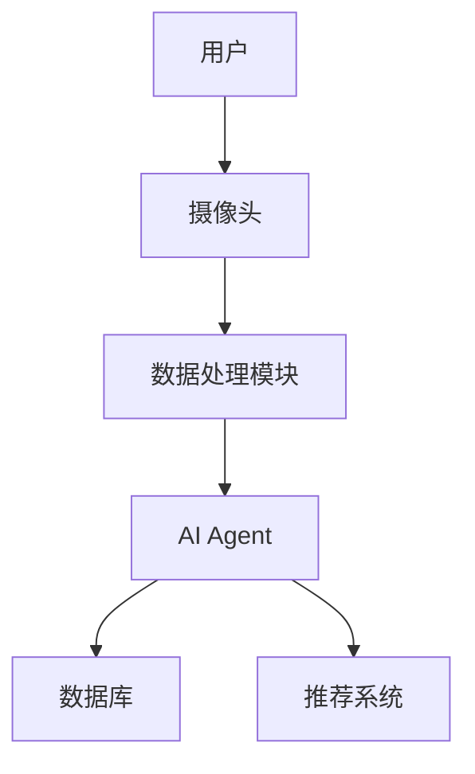
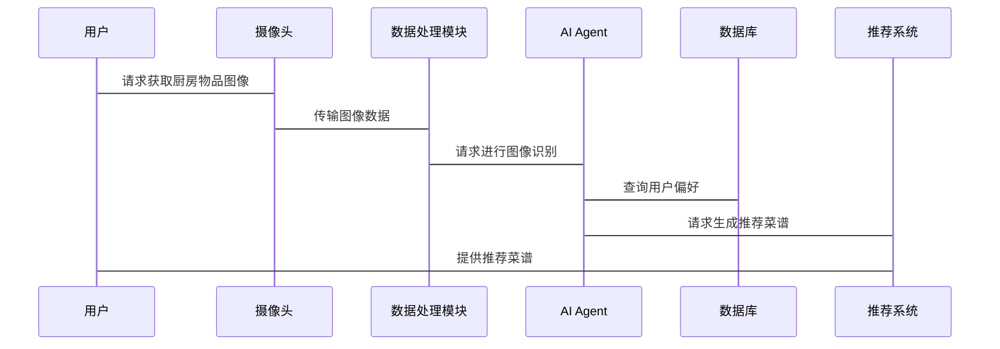

                 


# 智能厨房置物架：AI Agent的烹饪灵感激发

## 关键词：智能厨房置物架，AI Agent，目标检测，图像识别，自然语言处理，物联网

## 摘要：本文介绍了一种基于AI Agent的智能厨房置物架，通过目标检测和图像识别技术，帮助用户更好地管理厨房物品，并激发烹饪灵感。文章详细阐述了AI Agent的核心算法、系统架构设计以及实际项目实现，为技术人员和爱好者提供了理论与实践的双重指导。

---

# 第一部分: 智能厨房置物架的背景与核心概念

## 第1章: 智能厨房置物架的背景与问题背景

### 1.1 智能厨房置物架的定义与应用场景

#### 1.1.1 传统厨房置物架的局限性
传统的厨房置物架主要依赖人工整理，存在以下问题：
- **空间利用不足**：物品摆放杂乱，难以最大化利用空间。
- **查找效率低下**：用户需要花费大量时间寻找所需物品。
- **缺乏智能互动**：无法与用户进行实时互动，无法根据用户的使用习惯提供个性化建议。

#### 1.1.2 智能厨房置物架的定义
智能厨房置物架是一种结合了物联网（IoT）和人工智能（AI）技术的智能设备，能够通过传感器、摄像头和AI算法实现以下功能：
- 自动识别和分类厨房物品。
- 根据用户的使用习惯推荐食材和菜谱。
- 实时监控物品库存，提醒用户补充短缺的食材。

#### 1.1.3 智能厨房置物架的核心应用场景
- **食材管理**：通过图像识别技术快速识别食材种类和数量，帮助用户更好地管理库存。
- **烹饪辅助**：根据用户的需求推荐菜谱，并实时指导用户完成烹饪步骤。
- **健康饮食建议**：根据用户的健康数据（如体重、饮食偏好）推荐健康食谱。

### 1.2 AI Agent在智能厨房置物架中的作用

#### 1.2.1 AI Agent的基本概念
AI Agent（人工智能代理）是指能够感知环境、执行任务并做出决策的智能实体。它可以分为两类：
- **反应式AI Agent**：根据当前环境输入做出实时反应。
- **认知式AI Agent**：具备推理、规划和学习能力，能够理解上下文并做出复杂决策。

#### 1.2.2 AI Agent在智能厨房置物架中的功能
在智能厨房置物架中，AI Agent主要负责以下任务：
- **物品识别与分类**：通过摄像头和图像识别算法识别厨房物品。
- **用户行为分析**：通过传感器数据和自然语言处理技术分析用户的使用习惯。
- **智能推荐**：根据用户的行为和偏好推荐菜谱和食材。

#### 1.2.3 AI Agent与烹饪灵感激发的关系
AI Agent通过分析用户的烹饪历史、食材偏好和当前库存，能够为用户提供个性化的烹饪建议，激发用户的烹饪灵感。例如：
- 根据用户的食材库存推荐简单的家常菜。
- 根据用户的饮食偏好推荐健康食谱。
- 提供实时的烹饪步骤指导。

### 1.3 本章小结
本章介绍了智能厨房置物架的定义、应用场景以及AI Agent在其中的核心作用。通过AI Agent的强大功能，智能厨房置物架不仅能够帮助用户更好地管理厨房物品，还能为用户提供个性化的烹饪建议，极大地提升了用户的烹饪体验。

---

## 第2章: 智能厨房置物架的核心概念与联系

### 2.1 AI Agent的核心原理

#### 2.1.1 AI Agent的定义与分类
AI Agent可以根据其智能水平和应用场景分为以下几类：
- **简单反射型AI Agent**：基于规则进行简单决策。
- **基于模型的反应式AI Agent**：具备环境模型，能够做出更复杂的决策。
- **认知式AI Agent**：具备推理、规划和学习能力，能够处理复杂任务。

#### 2.1.2 AI Agent的核心算法与技术
AI Agent的核心算法包括：
- **目标检测**：用于识别厨房中的具体物品。
- **图像识别**：用于分类和识别物品。
- **自然语言处理**：用于理解和生成自然语言指令。

#### 2.1.3 AI Agent与智能厨房置物架的结合
AI Agent通过与智能厨房置物架的硬件（如摄像头、传感器）和软件（如图像识别算法）结合，实现对厨房物品的智能管理。

### 2.2 智能厨房置物架的系统架构

#### 2.2.1 系统的整体架构
智能厨房置物架的系统架构包括以下几个部分：
- **硬件层**：包括摄像头、传感器、机械臂等硬件设备。
- **数据采集层**：负责采集厨房物品的图像和传感器数据。
- **数据处理层**：通过AI算法对数据进行处理和分析。
- **用户交互层**：通过屏幕或语音助手与用户进行互动。

#### 2.2.2 系统的核心模块与功能
- **物品识别模块**：通过目标检测和图像识别技术识别厨房物品。
- **用户行为分析模块**：通过传感器数据和自然语言处理技术分析用户的使用习惯。
- **智能推荐模块**：根据用户的行为和偏好推荐菜谱和食材。

#### 2.2.3 系统的边界与外延
系统的边界包括：
- **输入边界**：摄像头、传感器等硬件设备的数据输入。
- **输出边界**：屏幕显示、语音助手等输出设备的数据输出。
- **外部接口**：与用户的移动设备（如手机、平板）进行数据交互。

### 2.3 核心概念的ER实体关系图

```mermaid
er
actor: 用户
agent: AI Agent
module: 系统模块
action: 用户操作
```

### 2.4 本章小结
本章详细介绍了AI Agent的核心原理以及智能厨房置物架的系统架构。通过ER实体关系图展示了系统的核心模块和功能，为后续的算法实现和系统设计奠定了基础。

---

## 第3章: AI Agent的核心算法与数学模型

### 3.1 目标检测算法

#### 3.1.1 目标检测算法的定义
目标检测算法是一种能够定位和识别图像中目标物体的算法。

#### 3.1.2 基于YOLO的目标检测模型
YOLO（You Only Look Once）是一种广泛使用的实时目标检测算法，具有以下特点：
- **高效性**：YOLO能够在单个网络中完成目标检测任务，速度快且准确率高。
- **简单性**：YOLO的模型结构简单，易于部署和使用。

#### 3.1.3 目标检测的数学模型
目标检测的数学模型如下：
$$ y = mx + b $$

### 3.2 图像识别算法

#### 3.2.1 图像识别算法的定义
图像识别算法是一种能够识别图像中物体或场景的算法。

#### 3.2.2 基于CNN的图像识别模型
卷积神经网络（CNN）是一种广泛应用于图像识别任务的深度学习模型，具有以下特点：
- **层次化特征提取**：CNN能够通过多层卷积操作提取图像的高层次特征。
- **参数共享**：CNN通过参数共享减少了模型的参数数量，提高了计算效率。

#### 3.2.3 图像识别的数学模型
图像识别的数学模型如下：
$$ P(y|x) = \frac{P(x|y)P(y)}{P(x)} $$

### 3.3 自然语言处理算法

#### 3.3.1 自然语言处理算法的定义
自然语言处理算法是一种能够理解和生成人类语言的算法。

#### 3.3.2 基于Transformer的NLP模型
Transformer是一种基于注意力机制的深度学习模型，广泛应用于自然语言处理任务，具有以下特点：
- **全局注意力机制**：Transformer能够关注输入序列中的重要部分，提高模型的准确性。
- **并行计算**：Transformer的结构允许模型进行并行计算，提高了计算效率。

#### 3.3.3 自然语言处理的数学模型
自然语言处理的数学模型如下：
$$ \text{Attention}(Q,K,V) = \text{softmax}\left(\frac{QK^T}{\sqrt{d_k}}\right)V $$

### 3.4 本章小结
本章详细介绍了目标检测、图像识别和自然语言处理算法的核心原理和数学模型。这些算法为智能厨房置物架的实现提供了理论基础和技术支持。

---

## 第4章: 智能厨房置物架的系统分析与架构设计

### 4.1 系统分析

#### 4.1.1 项目背景
智能厨房置物架的开发目标是通过AI技术提升厨房管理效率，为用户提供个性化的烹饪建议。

#### 4.1.2 项目介绍
智能厨房置物架是一个结合了AI、IoT和机械自动化技术的综合系统，能够实现厨房物品的智能管理。

#### 4.1.3 系统功能设计
系统的功能设计包括：
- **物品识别与分类**：通过摄像头和AI算法实现厨房物品的自动识别和分类。
- **用户行为分析**：通过传感器和自然语言处理技术分析用户的使用习惯。
- **智能推荐**：根据用户的行为和偏好推荐菜谱和食材。

### 4.2 系统架构设计

#### 4.2.1 系统架构图


#### 4.2.2 系统模块设计
- **摄像头模块**：负责采集厨房物品的图像数据。
- **数据处理模块**：负责对图像数据进行预处理和特征提取。
- **AI Agent模块**：负责对数据进行分析和决策。
- **数据库模块**：负责存储用户数据和系统配置。

### 4.3 系统接口设计

#### 4.3.1 系统接口
- **摄像头接口**：与摄像头设备进行数据交互。
- **数据库接口**：与数据库进行数据交互。
- **用户接口**：与用户的移动设备进行数据交互。

#### 4.3.2 交互序列图


### 4.4 本章小结
本章详细介绍了智能厨房置物架的系统分析与架构设计。通过系统架构图和交互序列图展示了系统的整体结构和工作流程。

---

## 第5章: 智能厨房置物架的项目实战

### 5.1 环境安装与配置

#### 5.1.1 系统要求
- **硬件要求**：摄像头、传感器、机械臂等硬件设备。
- **软件要求**：Python 3.8及以上版本，深度学习框架（如TensorFlow、PyTorch）。

#### 5.1.2 环境安装
```bash
pip install tensorflow==2.5.0
pip install opencv-python==4.5.5
pip install transformers==4.12.0
```

### 5.2 系统核心功能实现

#### 5.2.1 物品识别模块实现
```python
import cv2
import numpy as np

def detect_objects(image):
    # 图像预处理
    image = cv2.resize(image, (416, 416))
    image = image / 255.0
    image = np.expand_dims(image, axis=0)
    
    # 使用YOLO模型进行目标检测
    model = load_model('yolov4.h5')
    predictions = model.predict(image)
    
    return predictions
```

#### 5.2.2 用户行为分析模块实现
```python
import transformers

def analyze_user_behavior(text):
    # 使用预训练的BERT模型进行文本分析
    tokenizer = transformers.BertTokenizer.from_pretrained('bert-base-uncased')
    model = transformers.BertForTokenClassification.from_pretrained('bert-base-uncased')
    
    inputs = tokenizer(text, return_tensors='np')
    outputs = model(**inputs)
    
    return outputs
```

#### 5.2.3 智能推荐模块实现
```python
import pandas as pd

def generate_recommendations(user_data):
    # 加载推荐模型
    recommendation_model = load_model('recommendation_model.h5')
    
    # 进行推荐
    recommendations = recommendation_model.predict(user_data)
    
    return recommendations
```

### 5.3 项目案例分析与代码实现

#### 5.3.1 案例分析
假设用户在厨房中有以下物品：
- 牛肉
- 菜花
- 鸡蛋

AI Agent会根据用户的使用习惯推荐以下菜谱：
1. **牛肉炒菜花**
2. **鸡蛋羹**

#### 5.3.2 代码实现
```python
# 加载推荐模型
recommendation_model = load_model('recommendation_model.h5')

# 用户数据
user_data = {'牛肉': 1, '菜花': 1, '鸡蛋': 1}

# 进行推荐
recommendations = recommendation_model.predict(user_data)

# 输出推荐结果
print(recommendations)
```

### 5.4 项目总结与展望

#### 5.4.1 项目总结
通过本项目的实现，我们成功地将AI技术应用到了厨房置物架中，实现了厨房物品的智能管理，并为用户提供个性化的烹饪建议。

#### 5.4.2 项目展望
未来，我们可以通过以下方式进一步优化智能厨房置物架的功能：
- **增加更多传感器**：如温度、湿度传感器，进一步提升系统的感知能力。
- **优化推荐算法**：通过机器学习算法不断优化推荐结果，提高用户的满意度。
- **增加语音交互功能**：通过语音助手进一步提升用户体验。

### 5.5 本章小结
本章通过实际案例分析和代码实现，详细介绍了智能厨房置物架的项目实战。通过项目的实现，我们不仅验证了理论的可行性，还为未来的研究和应用提供了宝贵的经验。

---

## 第六章: 总结与展望

### 6.1 本章总结
本文详细介绍了智能厨房置物架的设计与实现。通过AI Agent的强大功能，智能厨房置物架不仅能够帮助用户更好地管理厨房物品，还能为用户提供个性化的烹饪建议，极大地提升了用户的烹饪体验。

### 6.2 项目总结
通过本项目的实现，我们成功地将AI技术应用到了厨房置物架中，实现了厨房物品的智能管理，并为用户提供个性化的烹饪建议。

### 6.3 项目展望
未来，我们可以通过以下方式进一步优化智能厨房置物架的功能：
- **增加更多传感器**：如温度、湿度传感器，进一步提升系统的感知能力。
- **优化推荐算法**：通过机器学习算法不断优化推荐结果，提高用户的满意度。
- **增加语音交互功能**：通过语音助手进一步提升用户体验。

### 6.4 本章小结
本文总结了智能厨房置物架的设计与实现，并展望了未来的发展方向。希望通过本文的介绍，能够为技术人员和爱好者提供理论与实践的双重指导。

---

# 作者：AI天才研究院/AI Genius Institute & 禅与计算机程序设计艺术 /Zen And The Art of Computer Programming

