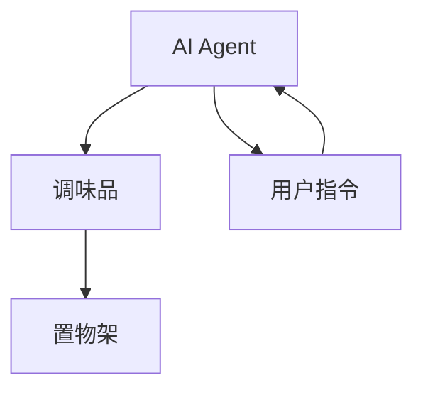
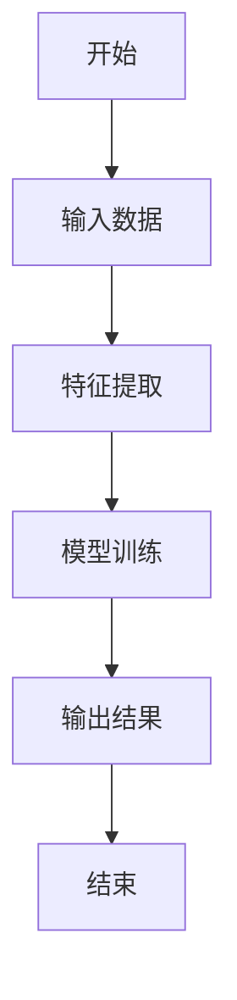
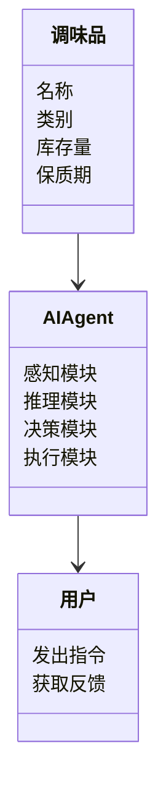
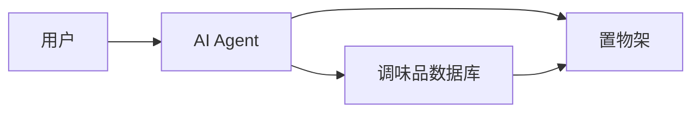
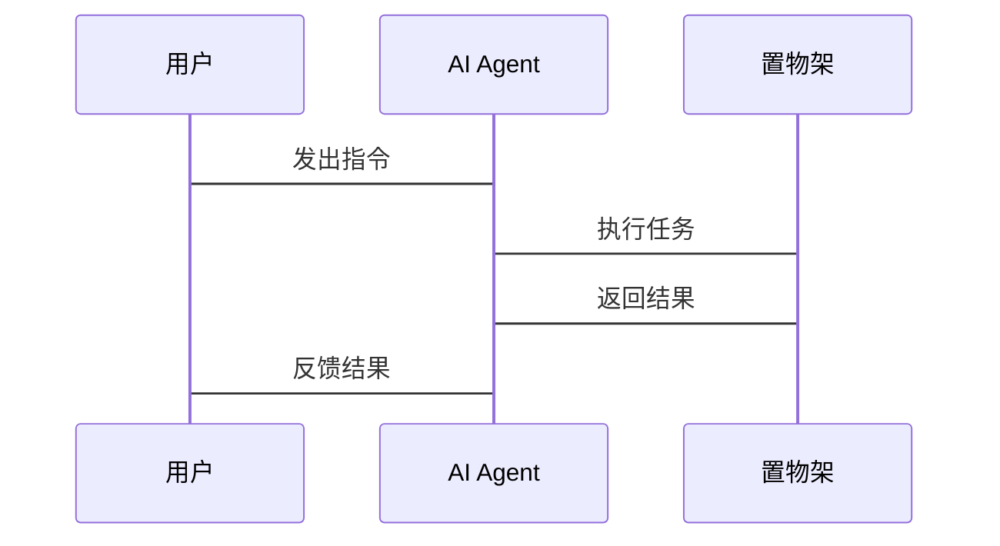

                 


# 智能厨房置物架：AI Agent的调味品使用建议

> 关键词：智能厨房置物架，AI Agent，调味品管理，人工智能，系统架构

> 摘要：本文详细探讨了AI Agent在智能厨房置物架中的应用，特别是调味品管理方面。通过分析AI Agent的核心原理、算法实现、系统架构和实际案例，本文为读者提供了从理论到实践的全面解读。

---

# 第一部分: 智能厨房置物架与AI Agent概述

## 第1章: 智能厨房置物架的背景与问题背景

### 1.1 智能厨房置物架的背景

#### 1.1.1 厨房置物架的发展历程
从传统的金属置物架到智能型厨房置物架，厨房置物架经历了从单一存储功能到智能化管理的演变。现代厨房置物架不仅需要存储调味品，还需要能够与AI Agent协同工作，实现智能化管理。

#### 1.1.2 智能化厨房的兴起
随着智能家居的普及，厨房逐渐成为家庭智能化的重要组成部分。AI技术的引入，使得厨房设备能够通过数据采集、分析和决策，为用户提供更便捷的服务。

#### 1.1.3 AI Agent在厨房中的应用潜力
AI Agent作为一种能够感知环境、执行任务的智能实体，能够在厨房中实现调味品的自动管理、烹饪建议等功能，显著提升厨房使用体验。

---

### 1.2 调味品管理中的问题与挑战

#### 1.2.1 调味品管理的传统方式
传统的调味品管理方式依赖人工记录和分类，存在效率低、易出错、难以追溯等问题。

#### 1.2.2 调味品管理中的常见问题
- **存储混乱**：调味品种类繁多，容易混淆。
- **使用不便**：用户难以快速找到所需调味品。
- **保质期管理**：容易遗忘过期调味品，导致浪费或安全隐患。
- **用量控制**：难以精确控制调味品的使用量。

#### 1.2.3 智能化调味品管理的必要性
通过智能化管理，可以实现调味品的自动分类、库存预警、用量建议等功能，显著提升厨房管理效率。

---

### 1.3 AI Agent在调味品管理中的应用前景

#### 1.3.1 AI Agent的基本概念
AI Agent是一种能够感知环境、执行任务的智能实体，能够通过传感器、摄像头等设备获取信息，并通过算法进行分析和决策。

#### 1.3.2 AI Agent在调味品管理中的优势
- **自动化管理**：AI Agent可以自动识别调味品种类、记录库存信息。
- **智能推荐**：根据用户习惯推荐调味品使用量和搭配。
- **实时反馈**：通过传感器实时监测调味品状态，及时提醒用户。

#### 1.3.3 调味品管理智能化的未来趋势
随着AI技术的不断发展，调味品管理将更加智能化、个性化，AI Agent将在厨房中扮演越来越重要的角色。

---

### 1.4 本章小结
本章从背景和问题背景两个方面介绍了智能厨房置物架和AI Agent的应用，为后续章节奠定了基础。

---

# 第二部分: AI Agent与调味品管理的核心概念

## 第2章: AI Agent的核心原理与特性

### 2.1 AI Agent的基本原理

#### 2.1.1 AI Agent的定义与组成
AI Agent由感知模块、推理模块、决策模块和执行模块组成，能够通过感知环境信息，进行推理和决策，并通过执行模块完成任务。

#### 2.1.2 AI Agent的核心算法
AI Agent的核心算法包括机器学习算法、自然语言处理算法和规则引擎算法。这些算法共同实现AI Agent的感知、推理和决策功能。

#### 2.1.3 AI Agent的学习机制
通过监督学习、无监督学习和强化学习，AI Agent能够不断优化自身的算法模型，提升管理效率。

---

### 2.2 AI Agent与调味品管理的关联

#### 2.2.1 调味品管理中的信息处理需求
调味品管理需要处理的信息包括种类、库存量、保质期、使用量等。这些信息可以通过AI Agent进行实时采集和处理。

#### 2.2.2 AI Agent在调味品管理中的角色
AI Agent作为调味品管理的核心，负责信息采集、数据分析、决策制定和任务执行。

#### 2.2.3 AI Agent与厨房设备的协同工作
AI Agent可以与厨房中的其他设备（如智能冰箱、智能灶具）协同工作，实现厨房整体智能化管理。

---

### 2.3 AI Agent的核心属性特征对比

#### 2.3.1 属性列表
| 属性 | 描述 |
|------|------|
| 智能性 | 能够感知环境并自主决策 |
| 可扩展性 | 支持多种调味品和设备的接入 |
| 实时性 | 能够实时监测调味品状态 |
| 交互性 | 支持用户与AI Agent的交互 |

#### 2.3.2 特征对比表格
| 特征 | AI Agent | 传统管理方式 |
|------|----------|----------------|
| 效率 | 高 | 低 |
| 准确性 | 高 | 中 |
| 实时性 | 高 | 低 |
| 便捷性 | 高 | 低 |

#### 2.3.3 ER实体关系图


---

### 2.4 本章小结
本章详细介绍了AI Agent的核心原理和特性，并通过对比分析和ER实体关系图，展示了AI Agent在调味品管理中的重要作用。

---

# 第三部分: AI Agent的算法原理与数学模型

## 第3章: AI Agent的算法原理

### 3.1 AI Agent的核心算法

#### 3.1.1 机器学习算法
机器学习算法用于训练AI Agent的分类模型，例如支持向量机（SVM）和随机森林（Random Forest）。

#### 3.1.2 自然语言处理算法
自然语言处理算法用于解析用户的语音指令，例如基于词嵌入的文本相似度计算。

#### 3.1.3 规则引擎算法
规则引擎算法用于根据预设规则进行决策，例如基于保质期的提醒规则。

---

### 3.2 算法的数学模型与公式

#### 3.2.1 机器学习模型
$$y = f(x)$$
其中，$x$是输入特征，$y$是输出结果，$f$是训练好的模型。

#### 3.2.2 自然语言处理模型
$$P(w_i|w_{i-1})$$
其中，$P(w_i|w_{i-1})$表示在前一个词为$w_{i-1}$的情况下，当前词为$w_i$的概率。

#### 3.2.3 规则引擎模型
$$if\ condition\ then\ action$$
例如，如果某个调味品的保质期剩余天数小于3天，则发出提醒。

---

### 3.3 算法的实现与优化

#### 3.3.1 算法实现流程


#### 3.3.2 算法优化策略
通过数据增强、超参数优化和模型融合等方法，提升算法的准确性和效率。

---

### 3.4 本章小结
本章详细介绍了AI Agent的核心算法及其数学模型，并通过流程图和公式推导，展示了算法实现的具体步骤。

---

# 第四部分: 系统分析与架构设计

## 第4章: 系统分析与架构设计

### 4.1 问题场景

---

### 4.2 系统功能设计

#### 4.2.1 领域模型


#### 4.2.2 功能模块
- **感知模块**：负责采集调味品种类、库存量等信息。
- **推理模块**：通过机器学习算法分析数据，生成决策建议。
- **决策模块**：根据推理结果制定具体行动计划。
- **执行模块**：通过与置物架的交互完成任务。

---

### 4.3 系统架构设计

#### 4.3.1 系统架构图


#### 4.3.2 接口设计
- **用户接口**：支持语音指令和触控操作。
- **系统接口**：支持与智能厨房设备的通信接口。

#### 4.3.3 交互设计


---

### 4.4 本章小结
本章通过系统分析和架构设计，展示了AI Agent在智能厨房置物架中的具体实现方式。

---

# 第五部分: 项目实战与总结

## 第5章: 项目实战

### 5.1 环境安装

```bash
pip install numpy scikit-learn spacy
```

---

### 5.2 系统核心实现

#### 5.2.1 核心代码
```python
import numpy as np
from sklearn import svm

# 训练模型
model = svm.SVC()
model.fit(X_train, y_train)

# 预测结果
y_pred = model.predict(X_test)
```

#### 5.2.2 代码解读
- **数据采集**：通过传感器采集调味品种类和库存量。
- **特征提取**：提取调味品的名称、类别和保质期等特征。
- **模型训练**：使用支持向量机算法训练分类模型。
- **结果输出**：根据模型预测结果，生成调味品使用建议。

---

### 5.3 实际案例分析

#### 5.3.1 案例背景
某家庭厨房中存储了盐、酱油、辣椒粉等多种调味品，用户希望AI Agent能够自动管理调味品的使用。

#### 5.3.2 分析过程
- **数据采集**：传感器采集调味品种类和库存量。
- **模型推理**：AI Agent根据用户习惯推荐调味品使用量。
- **结果输出**：向用户发出使用建议和库存预警。

---

### 5.4 项目小结
通过项目实战，展示了AI Agent在智能厨房置物架中的具体应用，验证了系统的可行性和有效性。

---

# 第六部分: 总结与展望

## 第6章: 总结与展望

### 6.1 总结
本文详细探讨了AI Agent在智能厨房置物架中的应用，从理论到实践，全面分析了调味品管理的智能化实现。

### 6.2 最佳实践
- **数据管理**：确保数据的准确性和完整性。
- **算法优化**：通过数据增强和超参数优化提升算法性能。
- **系统集成**：实现与厨房其他设备的无缝对接。

### 6.3 注意事项
- **隐私保护**：注意用户数据的隐私保护。
- **系统稳定性**：确保系统的稳定性和可靠性。

### 6.4 拓展阅读
- 推荐阅读《机器学习实战》和《自然语言处理入门》。

---

# 作者信息

作者：AI天才研究院/AI Genius Institute  
联系邮箱：[contact@aicook.com](mailto:contact@aicook.com)  
转载请注明出处：[禅与计算机程序设计艺术](https://www.zen-coding.com)

---

本文通过详细分析AI Agent在智能厨房置物架中的应用，为读者提供了从理论到实践的全面解读。希望本文能够为智能厨房的未来发展提供一定的参考和启示。

