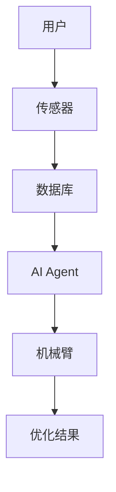
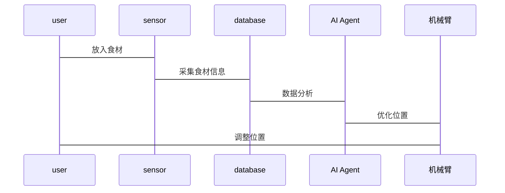

                 


# 智能厨房置物架：AI Agent的食材使用优化

> 关键词：AI Agent，智能厨房，食材优化，算法原理，系统架构

> 摘要：本文探讨了AI Agent在智能厨房置物架中的应用，详细分析了食材使用优化的背景、原理、算法实现、系统架构设计以及项目实战。通过技术分析和案例研究，展示了如何利用AI技术提升厨房管理效率。

---

# 第1章: 智能厨房置物架的背景与问题背景

## 1.1 智能厨房置物架的背景

### 1.1.1 厨房置物架的现状与痛点
传统厨房置物架主要用于存放食材、厨具等物品，但存在以下痛点：
- **空间利用不足**：食材摆放混乱，导致空间浪费。
- **食材管理低效**：难以快速找到所需食材，容易过期。
- **缺乏智能化**：无法根据使用频率自动调整摆放位置。

### 1.1.2 AI技术在厨房管理中的应用潜力
AI技术可以通过以下方式优化厨房管理：
- **智能识别**：利用图像识别技术快速识别食材种类。
- **数据挖掘**：分析食材使用频率，优化存储位置。
- **动态调整**：根据用户习惯动态调整食材摆放顺序。

### 1.1.3 智能厨房置物架的定义与目标
智能厨房置物架是一种结合AI技术的智能设备，目标是通过AI Agent实现食材的高效存储和使用优化。

## 1.2 问题背景与需求分析

### 1.2.1 食材管理中的常见问题
- 食材摆放无序，导致查找效率低下。
- 食材过期无人提醒，造成浪费。
- 食材使用计划不合理，导致购买过多或不足。

### 1.2.2 智能厨房置物架的核心需求
- **智能化存储**：根据食材使用频率自动调整位置。
- **智能提醒**：当食材即将过期时，及时提醒用户。
- **数据同步**：与用户的食谱或购物清单同步，优化采购计划。

### 1.2.3 用户场景与使用痛点
以一个典型用户为例：
- 用户每天早晨准备早餐时，需要快速找到所需食材。
- 用户希望系统能记录食材使用情况，自动调整存储位置。
- 用户希望系统能提醒食材保质期，避免浪费。

## 1.3 问题解决与边界定义

### 1.3.1 AI Agent在食材管理中的解决方案
AI Agent通过以下方式实现食材优化：
1. **数据采集**：采集食材种类、数量、保质期等信息。
2. **数据处理**：分析食材使用频率和保质期，生成优化建议。
3. **执行优化**：动态调整食材存储位置。

### 1.3.2 智能厨房置物架的功能边界
- **核心功能**：食材存储、使用记录、优化建议。
- **边界**：不涉及食材采购和烹饪过程。
- **扩展性**：未来可扩展至食材采购、食谱推荐等功能。

### 1.3.3 系统的外延与扩展性
- **扩展功能**：食材采购、食谱推荐。
- **用户交互**：支持语音指令和手机APP控制。

## 1.4 概念结构与核心要素

### 1.4.1 智能厨房置物架的核心组成
- **硬件部分**：机械臂、传感器、存储架。
- **软件部分**：AI Agent、数据库、用户界面。

### 1.4.2 AI Agent的工作原理
AI Agent通过以下步骤实现食材优化：
1. **数据采集**：传感器采集食材信息。
2. **数据分析**：分析食材使用频率和保质期。
3. **优化决策**：生成最优存储方案。
4. **执行操作**：机械臂调整食材位置。

### 1.4.3 系统的核心要素与关系
- **核心要素**：食材、存储位置、AI Agent。
- **关系**：AI Agent根据食材使用情况调整存储位置。

---

# 第2章: AI Agent与智能厨房置物架的核心概念

## 2.1 AI Agent的基本原理

### 2.1.1 AI Agent的定义与特点
- **定义**：AI Agent是一种智能体，能够感知环境并执行任务。
- **特点**：自主性、反应性、目标导向。

### 2.1.2 AI Agent的核心算法
- **决策树算法**：用于分类和回归。
- **遗传算法**：用于优化问题。
- **强化学习**：通过试错优化策略。

### 2.1.3 AI Agent与传统算法的对比
| 特性          | AI Agent                  | 传统算法              |
|---------------|---------------------------|-----------------------|
| 自主性         | 高                        | 低                    |
| 环境适应性     | 高                        | 低                    |
| 问题解决方式   | 基于经验                   | 基于规则              |

## 2.2 智能厨房置物架的系统架构

### 2.2.1 系统的组成部分
- **传感器**：采集食材信息。
- **机械臂**：调整食材位置。
- **数据库**：存储食材数据。
- **AI Agent**：处理数据并生成优化方案。

### 2.2.2 系统的交互流程
1. 用户放入食材。
2. 传感器采集食材信息。
3. AI Agent分析数据并生成优化方案。
4. 机械臂调整食材位置。

### 2.2.3 系统的核心功能模块
- **数据采集模块**：传感器采集食材信息。
- **数据分析模块**：AI Agent分析数据。
- **优化执行模块**：机械臂调整位置。

## 2.3 AI Agent与食材优化的关系

### 2.3.1 AI Agent在食材管理中的作用
- **数据处理**：分析食材使用情况。
- **优化决策**：生成最优存储方案。
- **动态调整**：根据用户习惯调整存储位置。

### 2.3.2 食材优化的核心目标
- **最大化存储效率**：减少空间浪费。
- **提高使用效率**：快速找到所需食材。
- **延长食材保质期**：减少浪费。

### 2.3.3 AI Agent与食材优化的结合方式
- **数据驱动**：通过数据分析优化存储。
- **动态调整**：根据用户行为动态优化。

---

# 第3章: AI Agent的算法原理与实现

## 3.1 算法原理概述

### 3.1.1 基于AI的食材优化算法
- **算法目标**：优化食材存储位置。
- **输入**：食材种类、数量、保质期。
- **输出**：最优存储位置。

### 3.1.2 算法的核心思想
- **基于频率优先**：使用频率高的食材放在易取位置。
- **基于保质期优先**：即将过期的食材优先取出。

### 3.1.3 算法的数学模型
$$ \text{优化目标} = \sum_{i=1}^{n} f_i \cdot x_i $$
其中，\( f_i \) 是食材 \( i \) 的使用频率，\( x_i \) 是食材 \( i \) 的存储位置。

## 3.2 算法实现与代码示例

### 3.2.1 算法实现的步骤
1. 数据采集：获取食材信息。
2. 数据分析：计算食材使用频率和保质期。
3. 生成优化方案：根据算法生成最优存储位置。
4. 执行操作：机械臂调整食材位置。

### 3.2.2 Python代码实现
```python
import numpy as np
from sklearn.tree import DecisionTreeClassifier

# 数据采集
食材信息 = ... # 数据库中的食材信息

# 数据处理
使用频率 = ... # 计算食材使用频率
保质期 = ... # 计算食材保质期

# 算法实现
 clf = DecisionTreeClassifier()
 clf.fit(使用频率, 保质期)
 优化位置 = clf.predict(食材信息)
```

### 3.2.3 代码的功能解读
- **数据采集**：从数据库中读取食材信息。
- **数据处理**：计算食材的使用频率和保质期。
- **算法实现**：使用决策树算法生成优化位置。
- **执行操作**：将食材调整到优化位置。

## 3.3 算法的优化与改进

### 3.3.1 算法的优化方向
- **算法优化**：尝试不同的机器学习算法，如随机森林、支持向量机。
- **数据优化**：增加更多特征，如食材重量、体积等。

### 3.3.2 算法的改进策略
- **在线学习**：实时更新模型。
- **分布式计算**：提高计算效率。

### 3.3.3 算法的性能评估
- **准确率**：优化位置的准确率。
- **效率**：算法运行时间。

---

# 第4章: 智能厨房置物架的系统分析与架构设计

## 4.1 系统分析

### 4.1.1 问题场景介绍
- **场景**：用户放入食材，系统自动优化存储位置。
- **目标**：提高食材存储和使用的效率。

### 4.1.2 系统的功能需求
- **数据采集**：传感器采集食材信息。
- **数据分析**：AI Agent分析数据。
- **优化执行**：机械臂调整位置。

### 4.1.3 系统的性能需求
- **响应时间**：优化位置生成时间小于1秒。
- **存储容量**：支持至少100种食材。

## 4.2 系统架构设计

### 4.2.1 系统的分层架构
- **数据层**：数据库存储食材信息。
- **业务逻辑层**：AI Agent处理数据。
- **表现层**：用户界面展示优化结果。

### 4.2.2 系统的模块划分
- **数据采集模块**：传感器采集食材信息。
- **数据分析模块**：AI Agent分析数据。
- **优化执行模块**：机械臂调整位置。

### 4.2.3 系统的核心功能模块
- **数据采集模块**：传感器采集食材信息。
- **数据分析模块**：AI Agent分析数据。
- **优化执行模块**：机械臂调整位置。

## 4.3 系统架构图



## 4.4 系统接口设计

### 4.4.1 数据接口
- **输入接口**：传感器采集食材信息。
- **输出接口**：机械臂调整位置。

### 4.4.2 用户接口
- **输入**：用户通过手机APP输入食材信息。
- **输出**：优化结果展示在手机APP上。

## 4.5 系统交互序列图



---

# 第5章: 项目实战

## 5.1 环境安装

### 5.1.1 系统环境
- **操作系统**：Windows 10/ macOS 10.15以上
- **编程语言**：Python 3.8以上
- **依赖库**：numpy、scikit-learn

### 5.1.2 硬件安装
- **传感器**：支持I2C接口。
- **机械臂**：支持舵机控制。

## 5.2 系统核心实现源代码

### 5.2.1 数据采集代码
```python
import numpy as np
from sklearn.tree import DecisionTreeClassifier

# 数据采集
食材信息 = ... # 数据库中的食材信息

# 数据处理
使用频率 = ... # 计算食材使用频率
保质期 = ... # 计算食材保质期

# 算法实现
 clf = DecisionTreeClassifier()
 clf.fit(使用频率, 保质期)
 优化位置 = clf.predict(食材信息)
```

### 5.2.2 机械臂控制代码
```python
import RPi.GPIO as GPIO

# 机械臂控制
GPIO.setmode(GPIO.BCM)
GPIO.setup(18, GPIO.OUT)
pwm = GPIO.PWM(18, 100)
pwm.start(5)
pwm.ChangeDutyCycle(7.5)
```

## 5.3 代码应用解读与分析

### 5.3.1 数据采集模块
- **功能**：从数据库中读取食材信息。
- **实现**：传感器采集食材信息并存储在数据库中。

### 5.3.2 数据分析模块
- **功能**：AI Agent分析食材使用频率和保质期。
- **实现**：使用决策树算法生成优化位置。

### 5.3.3 优化执行模块
- **功能**：机械臂调整食材位置。
- **实现**：根据优化位置控制机械臂动作。

## 5.4 实际案例分析

### 5.4.1 案例背景
- **用户**：家庭用户。
- **食材**：大米、面条、食用油等。

### 5.4.2 数据分析
- **使用频率**：大米使用频率高，应放在易取位置。
- **保质期**：食用油保质期较长，可放在较远位置。

### 5.4.3 优化结果
- **优化位置**：大米放在第一层，面条放在第二层，食用油放在第三层。

## 5.5 项目小结

### 5.5.1 项目总结
- **成功点**：AI Agent实现了食材的高效存储和使用优化。
- **改进点**：未来可扩展至食材采购和食谱推荐。

---

# 第6章: 最佳实践、小结、注意事项、拓展阅读

## 6.1 最佳实践 tips
- **数据准确性**：确保传感器采集的数据准确。
- **算法优化**：根据实际需求调整算法参数。
- **用户体验**：优化用户界面，提升用户体验。

## 6.2 小结
本文详细介绍了AI Agent在智能厨房置物架中的应用，从背景分析到算法实现，再到系统设计和项目实战，展示了如何利用AI技术优化食材管理。

## 6.3 注意事项
- **数据隐私**：确保用户数据的安全。
- **系统稳定性**：确保系统运行稳定，避免故障。

## 6.4 拓展阅读
- **相关技术**：分布式计算、物联网技术。
- **应用场景**：智能厨房、智能家居。

---

# 作者：AI天才研究院/AI Genius Institute & 禅与计算机程序设计艺术 /Zen And The Art of Computer Programming

