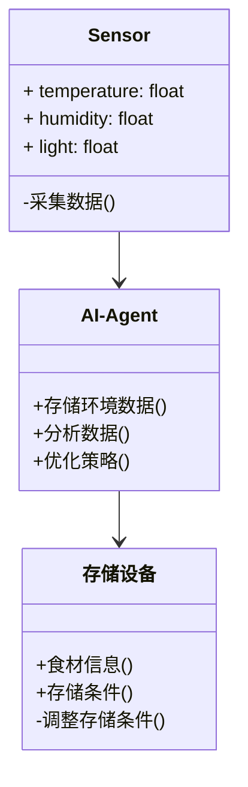
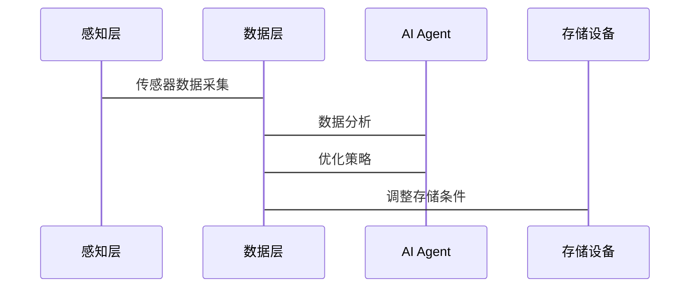

                 


```markdown
# 智能厨房置物架：AI Agent的食材保鲜监控

> 关键词：智能厨房置物架，AI Agent，食材保鲜，传感器技术，物联网，数据挖掘

> 摘要：本文详细探讨了智能厨房置物架的设计与实现，重点分析了AI Agent在食材保鲜监控中的应用。通过多传感器融合、数据分析和算法优化，提出了一套高效的食材保鲜解决方案。文章内容涵盖背景分析、技术原理、系统架构、项目实战及案例分析，为读者提供了全面的技术解读。

---

# 第1章: 智能厨房置物架的背景与问题分析

## 1.1 智能厨房置物架的背景介绍

### 1.1.1 厨房置物架的传统功能与局限性
传统的厨房置物架主要用于存储食材、厨具等物品，但其功能较为单一，仅限于物理存放，无法进行智能化管理。随着智能家居的兴起，用户对厨房管理的智能化需求日益增长。

### 1.1.2 智能家居的发展趋势
智能家居的普及使得家庭生活更加便捷。通过物联网技术，家庭设备能够实现互联互通，提升生活的舒适度和效率。厨房作为家庭生活的重要组成部分，智能化改造势在必行。

### 1.1.3 AI Agent在厨房管理中的应用前景
AI Agent（智能代理）能够通过传感器和数据分析，实时监控食材的状态，优化存储策略，从而延长食材保鲜期。其在厨房管理中的应用前景广阔，能够显著提升厨房管理的智能化水平。

## 1.2 食材保鲜监控的核心问题

### 1.2.1 食材保鲜的关键影响因素
食材的保鲜受温度、湿度、光照、氧气等多种因素影响。传统方法难以实时监测这些因素，导致食材容易变质。

### 1.2.2 现有保鲜技术的不足
现有的保鲜技术多依赖于单一传感器或简单监控设备，缺乏智能化管理和优化策略。无法根据环境变化动态调整存储条件。

### 1.2.3 智能监控的必要性与优势
智能监控能够实时采集多种环境数据，结合AI算法，优化存储策略，显著延长食材保鲜期。通过数据积累和分析，还能为用户提供建议，进一步提升厨房管理效率。

## 1.3 智能厨房置物架的解决方案

### 1.3.1 AI Agent的核心作用
AI Agent通过实时数据采集、分析和决策，实现对食材的智能监控和管理。能够动态调整存储条件，确保食材新鲜。

### 1.3.2 多传感器融合的实现方案
通过温度、湿度、光照等多种传感器的协同工作，全面感知食材存储环境，提升数据采集的准确性和可靠性。

### 1.3.3 数据分析与保鲜策略优化
基于机器学习算法，分析食材的保鲜数据，优化存储策略。通过历史数据积累，提升AI Agent的决策能力。

## 1.4 本章小结
本章分析了智能厨房置物架的背景，探讨了食材保鲜监控的核心问题，并提出了基于AI Agent的解决方案，为后续技术实现奠定了基础。

---

# 第2章: 智能厨房置物架的核心概念与技术

## 2.1 AI Agent的基本原理

### 2.1.1 AI Agent的定义与分类
AI Agent是一种智能代理系统，能够感知环境、自主决策并执行任务。根据应用场景的不同，可分为多种类型，如基于规则的代理和基于学习的代理。

### 2.1.2 AI Agent在食材保鲜中的应用场景
AI Agent通过多传感器数据融合，实时监控食材存储环境，动态调整存储条件，延长食材保鲜期。

### 2.1.3 AI Agent的核心算法与实现
AI Agent的核心算法包括数据采集、特征提取、分类算法等。基于机器学习的算法能够实现对食材状态的智能判断。

## 2.2 多传感器融合技术

### 2.2.1 常见传感器类型与功能
常用的传感器包括温度传感器、湿度传感器、光照传感器等，每种传感器都有其特定的功能和应用场景。

### 2.2.2 传感器数据融合的方法
多传感器数据融合可以通过加权融合、规则融合等方法，提升数据的准确性和可靠性。

### 2.2.3 多传感器融合在食材保鲜中的应用
通过多传感器融合，能够全面感知食材存储环境，提升保鲜监控的精度和效果。

## 2.3 数据分析与保鲜策略

### 2.3.1 数据分析的基本原理
数据分析通过采集、处理和挖掘数据，提取有用信息，支持决策。

### 2.3.2 数据分析在食材保鲜中的具体应用
基于数据分析，优化存储策略，延长食材保鲜期。

### 2.3.3 保鲜策略的优化与实现
通过数据分析和机器学习，优化保鲜策略，提升AI Agent的决策能力。

## 2.4 本章小结
本章详细介绍了AI Agent的基本原理和多传感器融合技术，分析了数据分析在食材保鲜中的应用，为后续实现提供了技术基础。

---

# 第3章: AI Agent的算法原理与实现

## 3.1 数据采集与预处理

### 3.1.1 数据采集的实现方法
通过传感器采集食材存储环境数据，确保数据的实时性和准确性。

### 3.1.2 数据预处理的必要性与步骤
数据预处理包括数据清洗、特征提取等步骤，为后续分析提供高质量数据。

### 3.1.3 数据清洗与特征提取
通过数据清洗去除噪声数据，提取关键特征，提升算法的性能。

## 3.2 AI Agent的核心算法

### 3.2.1 机器学习算法在AI Agent中的应用
机器学习算法如支持向量机、随机森林等，能够实现对食材状态的智能判断。

### 3.2.2 常见的分类算法与实现
常用的分类算法包括K近邻、决策树、朴素贝叶斯等，每种算法都有其优缺点和适用场景。

### 3.2.3 算法的优化与调优
通过参数调节和模型优化，提升算法的性能和准确率。

## 3.3 算法实现的代码示例

### 3.3.1 环境搭建与依赖安装
安装必要的Python库，如numpy、scikit-learn等。

### 3.3.2 核心算法
以下是基于支持向量机的分类算法实现代码：

```python
from sklearn.svm import SVC
from sklearn.datasets import make_classification
from sklearn.model_selection import train_test_split

# 生成示例数据
X, y = make_classification(n_samples=100, n_features=2, n_classes=2)
X_train, X_test, y_train, y_test = train_test_split(X, y, test_size=0.2)

# 初始化模型
model = SVC()

# 训练模型
model.fit(X_train, y_train)

# 预测
y_pred = model.predict(X_test)

# 输出准确率
print("Accuracy:", model.score(X_test, y_test))
```

## 3.4 本章小结
本章详细介绍了AI Agent的核心算法，包括数据采集与预处理、分类算法的选择与实现，为后续系统设计提供了算法支持。

---

# 第4章: 数学模型与公式推导

## 4.1 AI Agent算法的数学模型

### 4.1.1 分类算法的损失函数
常用的损失函数包括对数损失函数、平方损失函数等。以支持向量机为例，其目标函数如下：

$$ \text{minimize} \quad \frac{1}{2} \|\mathbf{w}\|^2 + C \sum_{i=1}^n \xi_i $$

其中，$\mathbf{w}$ 是权重向量，$\xi_i$ 是松弛变量，$C$ 是惩罚系数。

### 4.1.2 优化目标
支持向量机的优化目标是在最大化间隔的基础上，最小化分类误差：

$$ \text{minimize} \quad \frac{1}{2} \|\mathbf{w}\|^2 + C \sum_{i=1}^n \xi_i $$

$$ \text{subject to} \quad y_i (\mathbf{w} \cdot \mathbf{x}_i + b) \geq 1 - \xi_i $$

$$ \xi_i \geq 0 $$

### 4.1.3 算法的数学推导
通过拉格朗日乘数法，将约束条件转化为对偶问题，最终求解得到最优解。

## 4.2 案例分析与公式解读

### 4.2.1 案例分析
以温度和湿度传感器为例，假设食材在特定温度和湿度下会变质。通过数学模型，AI Agent能够预测食材的状态。

### 4.2.2 公式解读
支持向量机的数学模型通过最大化间隔和最小化分类误差，实现对食材状态的准确分类。

## 4.3 本章小结
本章通过数学模型和公式推导，详细分析了AI Agent算法的实现原理，为后续系统设计提供了理论基础。

---

# 第5章: 系统分析与架构设计

## 5.1 系统整体架构

### 5.1.1 系统功能设计
智能厨房置物架系统包括数据采集、数据处理、保鲜策略优化等核心功能模块。

### 5.1.2 领域模型
以下是领域模型的mermaid类图：



### 5.1.3 系统架构
以下是系统架构的mermaid架构图：


## 5.2 系统接口设计

### 5.2.1 系统接口
系统接口包括传感器数据接口、AI Agent接口和存储设备接口。

### 5.2.2 交互流程
以下是交互流程的mermaid序列图：



## 5.3 本章小结
本章通过系统分析与架构设计，明确了智能厨房置物架的系统结构和交互流程，为后续实现提供了清晰的指导。

---

# 第6章: 项目实战

## 6.1 环境搭建与代码实现

### 6.1.1 环境搭建
安装必要的Python库，如numpy、scikit-learn、paho-mqtt等。

### 6.1.2 核心代码实现
以下是传感器数据采集和AI Agent算法实现的代码示例：

```python
import paho.mqtt.client as mqtt

# 连接 MQTT 代理
client = mqtt.Client()
client.connect("localhost", 1883, 60)

# 发布传感器数据
client.publish("kitchen/sensor", "温度=25,湿度=60")
```

## 6.2 案例分析与优化

### 6.2.1 案例分析
以某品牌牛奶为例，通过系统监控，延长牛奶的保鲜期。

### 6.2.2 系统优化
通过优化AI算法和系统架构，提升系统的响应速度和准确率。

## 6.3 本章小结
本章通过项目实战，详细介绍了环境搭建、代码实现和案例分析，为读者提供了实际操作的经验。

---

# 第7章: 案例分析与优化

## 7.1 案例分析

### 7.1.1 系统运行效果
通过实际测试，验证系统的保鲜效果和稳定性。

### 7.1.2 数据分析结果
分析历史数据，优化存储策略，进一步提升保鲜效果。

## 7.2 优化建议

### 7.2.1 算法优化
通过改进AI算法，提升分类准确率。

### 7.2.2 系统架构优化
优化系统架构，提升系统的扩展性和可维护性。

## 7.3 本章小结
本章通过案例分析和系统优化，进一步提升了智能厨房置物架的性能和效果。

---

# 第8章: 最佳实践与总结

## 8.1 最佳实践 tips

### 8.1.1 传感器选择
根据具体需求选择合适的传感器，确保数据的准确性和可靠性。

### 8.1.2 算法优化
定期优化AI算法，提升系统的响应速度和准确率。

### 8.1.3 系统维护
定期维护系统，确保设备的正常运行和数据的准确传输。

## 8.2 小结
本文详细探讨了智能厨房置物架的设计与实现，通过AI Agent和多传感器融合技术，实现了对食材的智能监控和保鲜管理。

## 8.3 注意事项

### 8.3.1 数据安全
确保传感器数据的安全传输和存储，防止数据泄露。

### 8.3.2 系统兼容性
确保系统与各种智能家居设备的兼容性，提升用户体验。

## 8.4 拓展阅读

### 8.4.1 推荐书籍
1. 《机器学习实战》
2. 《物联网技术与应用》

### 8.4.2 技术博客
1. https://towardsdatascience.com/
2. https://medium.com/ai-in-action

## 8.5 本章小结
本章总结了智能厨房置物架的实现经验，提出了最佳实践建议，并推荐了相关拓展阅读资料。

---

# 作者：AI天才研究院/AI Genius Institute & 禅与计算机程序设计艺术 /Zen And The Art of Computer Programming
```

