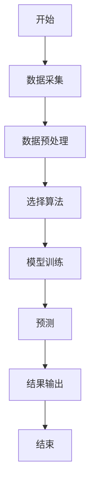
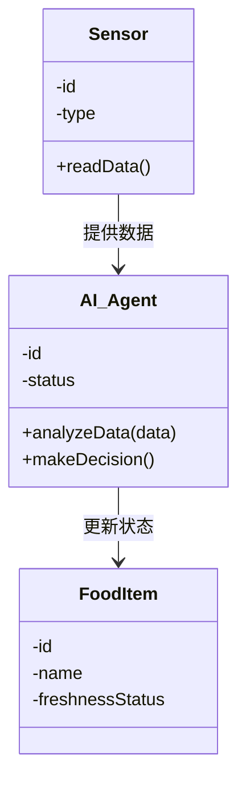

                 


# 智能厨房置物架：AI Agent的食材新鲜度监控

## 关键词：智能厨房、AI Agent、食材新鲜度、物联网、传感器、时间序列分析、机器学习

## 摘要：本文介绍了一种基于AI Agent的智能厨房置物架系统，通过物联网技术实时监控食材的新鲜度，结合时间序列分析和机器学习模型，实现智能化管理，确保食材的最佳使用状态。

---

# 第1章: 智能厨房置物架背景介绍

## 1.1 问题背景与描述

### 1.1.1 食材新鲜度管理的重要性
食材的新鲜度直接影响食品质量和健康，传统管理方式依赖人工检查，效率低且容易出错。

### 1.1.2 现有解决方案的不足
现有方案多为手动检查或简单传感器，缺乏智能化和数据分析能力。

### 1.1.3 AI Agent在食材监控中的潜力
AI Agent结合物联网，可实现智能化、自动化的食材新鲜度监控。

## 1.2 问题解决与边界

### 1.2.1 AI Agent的核心作用
AI Agent负责数据采集、分析和决策，实现食材新鲜度的智能化管理。

### 1.2.2 系统功能的边界与外延
系统专注于食材监控，与其他厨房设备和管理系统保持独立。

### 1.2.3 智能厨房置物架的使用场景
家庭、餐馆、超市等场景，适用于多种食材的监控。

## 1.3 核心概念与结构

### 1.3.1 食材新鲜度监控的定义
通过传感器和AI算法，实时评估食材的新鲜程度。

### 1.3.2 AI Agent的工作原理
AI Agent通过传感器数据，运用算法进行分析，提供实时反馈和建议。

### 1.3.3 系统核心要素与组成
传感器、AI Agent、物联网平台、用户界面。

---

# 第2章: 核心概念与联系

## 2.1 AI Agent与物联网的基础原理

### 2.1.1 AI Agent的基本概念
AI Agent是具有感知和决策能力的智能体，能够执行任务。

### 2.1.2 物联网在智能厨房中的应用
物联网技术实现设备间的数据互通和远程控制。

### 2.1.3 AI Agent与物联网的结合
AI Agent通过物联网获取数据，进行分析和决策。

## 2.2 核心概念对比与ER图

### 2.2.1 AI Agent与传统传感器的对比
| 属性         | AI Agent            | 传统传感器          |
|--------------|---------------------|--------------------|
| 功能         | 数据分析与决策      | 数据采集           |
| 智能性       | 高                  | 低                |
| 应用场景     | 多样化              | 有限              |

### 2.2.2 实体关系图（ER图）

```mermaid
erd
    entity Sensor {
        id
        type
    }
    entity FoodItem {
        id
        name
        freshnessStatus
    }
    entity AI_Agent {
        id
        status
    }
    Sensor --> FoodItem: 监控
    Sensor --> AI_Agent: 数据传输
    AI_Agent --> FoodItem: 状态评估
```

---

# 第3章: 食材新鲜度监控算法原理

## 3.1 数据采集与处理

### 3.1.1 传感器数据采集
使用温度、湿度、气体传感器，实时采集食材状态数据。

### 3.1.2 数据预处理方法
去噪处理、归一化、特征提取。

## 3.2 时间序列分析

### 3.2.1 时间序列模型的原理
分析数据的时间依赖性，预测未来状态。

### 3.2.2 食材新鲜度预测公式
$$ x_{t} = \alpha x_{t-1} + \beta n_t $$
其中，$x_t$是当前状态，$n_t$是噪声。

## 3.3 机器学习模型

### 3.3.1 基于AI Agent的分类算法
使用随机森林或支持向量机进行分类，预测食材新鲜度。

### 3.3.2 模型训练与优化
通过交叉验证优化模型参数，提升准确率。

## 3.4 算法流程图



---

# 第4章: 系统分析与架构设计

## 4.1 项目场景介绍

### 4.1.1 系统目标
实时监控食材新鲜度，提供智能管理建议。

### 4.1.2 使用场景
家庭用户和商业厨房，帮助用户合理使用食材。

## 4.2 功能设计

### 4.2.1 领域模型设计



### 4.2.2 系统架构设计


---

# 第5章: 项目实战

## 5.1 环境搭建

### 5.1.1 安装必要的库
安装传感器驱动和AI框架（如TensorFlow、PyTorch）。

## 5.2 核心代码实现

### 5.2.1 传感器数据采集

```python
import sensor_library

def collect_data(sensor_id):
    return sensor_library.read(sensor_id)
```

### 5.2.2 数据分析与预测

```python
from sklearn.ensemble import RandomForestClassifier

def predict_freshness(data):
    model = RandomForestClassifier()
    model.fit(training_data, labels)
    return model.predict(data)
```

## 5.3 代码解读与分析

### 5.3.1 传感器数据的预处理

```python
def preprocess(data):
    # 去噪和归一化处理
    processed_data = (data - data.min()) / (data.max() - data.min())
    return processed_data
```

### 5.3.2 机器学习模型的训练

```python
from sklearn.model_selection import train_test_split

def train_model(features, labels):
    X_train, X_test, y_train, y_test = train_test_split(features, labels, test_size=0.2)
    model = RandomForestClassifier(n_estimators=100)
    model.fit(X_train, y_train)
    return model
```

## 5.4 实际案例分析

### 5.4.1 数据采集与处理

假设传感器采集了温度、湿度和气体浓度数据，经过预处理后输入模型。

### 5.4.2 模型预测与结果

模型预测食材的新鲜度为“新鲜”、“一般”或“不新鲜”。

---

# 第6章: 最佳实践

## 6.1 小结

AI Agent结合物联网，实现智能厨房置物架的食材新鲜度监控，提升管理效率。

## 6.2 注意事项

- 定期校准传感器，确保数据准确性。
- 更新模型，适应不同食材特性。

## 6.3 扩展阅读

- 《物联网技术与应用》
- 《时间序列分析与预测》

---

# 附录

## 附录A: 传感器数据示例

| 时间  | 温度（°C） | 湿度（%） | 气体浓度（ppm） |
|-------|------------|-----------|-----------------|
| 00:00 | 22         | 50        | 10              |
| 00:01 | 22.5       | 51        | 12              |

## 附录B: 参考文献

1. 物联网技术手册
2. 机器学习算法与应用

---

# 作者

作者：AI天才研究院/AI Genius Institute & 禅与计算机程序设计艺术 /Zen And The Art of Computer Programming

