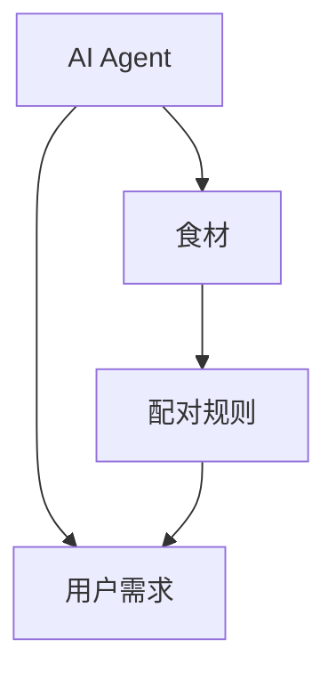
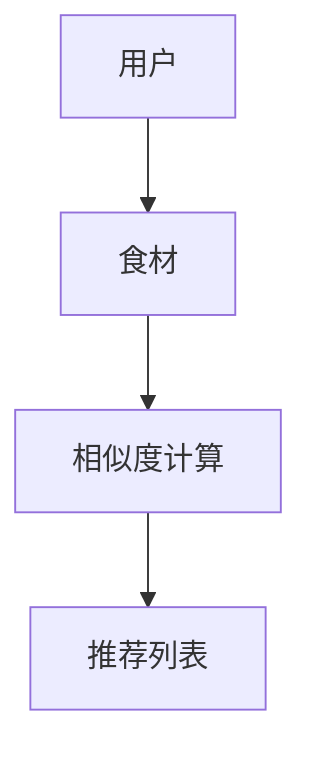
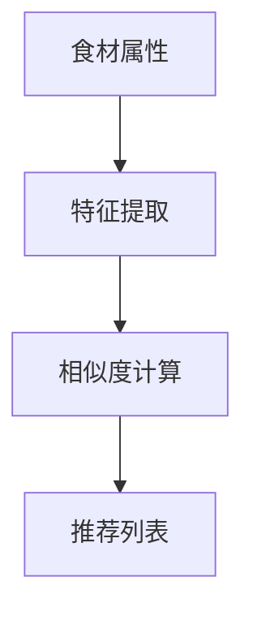
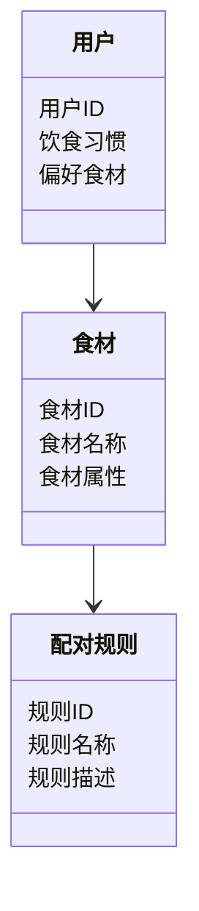
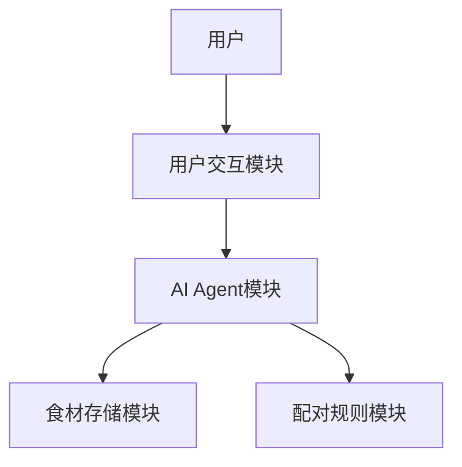
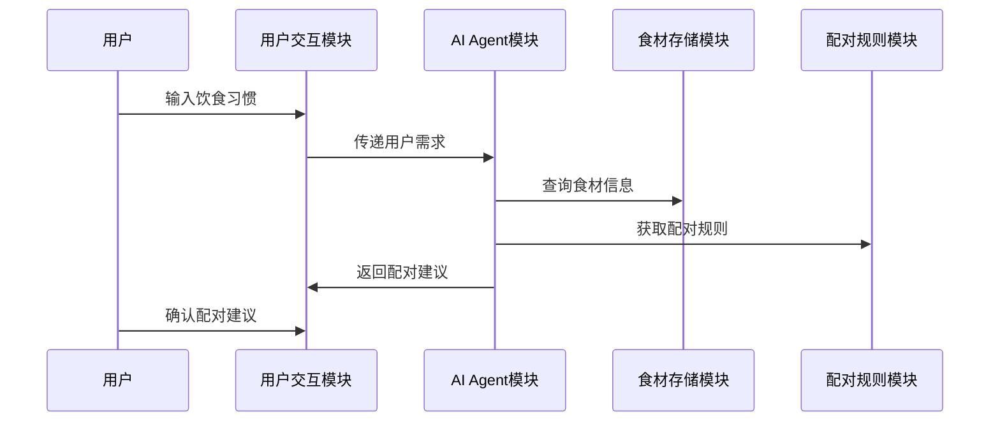

                 


# 智能厨房置物架：AI Agent的食材配对建议

> 关键词：智能厨房置物架，AI Agent，食材配对，协同过滤，推荐系统，系统架构

> 摘要：本文深入探讨了智能厨房置物架中AI Agent的食材配对建议系统。首先，分析了厨房置物架的现状及痛点，提出了引入AI Agent的必要性。接着，详细讲解了AI Agent的基本原理、食材配对的数学模型及其与AI Agent的实体关系。然后，从协同过滤算法、基于内容的推荐算法和混合推荐模型三个方面，详细阐述了推荐算法的原理和实现。随后，通过系统分析与架构设计，展示了系统的整体架构、功能模块、接口设计和交互流程。最后，通过项目实战部分，提供了系统的实现代码和实际案例分析，总结了最佳实践和注意事项，为读者提供了一个全面的解决方案。

---

# 第一部分: 智能厨房置物架的背景与概念

# 第1章: 问题背景与需求分析

## 1.1 问题背景

### 1.1.1 厨房置物架的现状与痛点

在现代厨房中，置物架是储存食材和厨具的重要工具，但传统置物架存在以下痛点：
- **空间利用不足**：食材种类繁多，但置物架的空间利用率低。
- **食材配对困难**：用户在烹饪时，常常需要在置物架上寻找合适的食材搭配，但传统置物架无法提供智能化的配对建议。
- **缺乏个性化**：不同用户的饮食习惯和偏好不同，传统置物架无法满足个性化需求。

### 1.1.2 食材配对的重要性与挑战

食材配对在烹饪中至关重要，直接影响菜品的口感和营养。然而，食材配对的复杂性主要体现在以下几个方面：
- **食材属性多样性**：每种食材都有其独特的属性（如味道、口感、营养等），需要综合考虑。
- **配对规则复杂性**：食材配对需要遵循一定的规则，如味觉搭配、营养均衡等。
- **用户需求多样性**：不同用户对食材配对的需求不同，个性化需求难以满足。

### 1.1.3 AI技术在厨房场景中的应用潜力

AI技术在厨房场景中的应用潜力巨大，特别是在食材配对方面：
- **数据驱动**：AI可以通过大数据分析，提取食材配对的规律和模式。
- **个性化推荐**：AI可以根据用户的饮食习惯和偏好，提供个性化的食材配对建议。
- **实时反馈**：AI可以实时监测食材的存储情况，动态调整配对建议。

## 1.2 问题描述

### 1.2.1 智能厨房置物架的核心目标

智能厨房置物架的核心目标是通过AI技术，实现食材的智能化管理和配对推荐，帮助用户更高效地进行烹饪。

### 1.2.2 用户需求分析

用户需求主要集中在以下几个方面：
- **食材存储管理**：用户希望置物架能够帮助管理食材的存储，避免浪费。
- **食材配对推荐**：用户希望置物架能够提供智能化的食材配对建议。
- **个性化服务**：用户希望置物架能够根据自己的饮食习惯提供个性化的推荐。

### 1.2.3 现有解决方案的局限性

现有解决方案在以下方面存在局限性：
- **缺乏智能化**：传统置物架无法提供智能化的配对建议。
- **个性化不足**：现有解决方案难以满足用户的个性化需求。
- **数据孤岛**：食材信息分散，难以形成统一的数据体系。

## 1.3 问题解决思路

### 1.3.1 引入AI Agent的必要性

AI Agent（智能体）是一种能够感知环境并采取行动以实现目标的实体。引入AI Agent可以实现以下目标：
- **智能化管理**：AI Agent可以实时监测食材的存储情况，动态调整配对建议。
- **个性化服务**：AI Agent可以根据用户的饮食习惯和偏好，提供个性化的配对建议。
- **数据整合**：AI Agent可以整合食材信息，形成统一的数据体系。

### 1.3.2 AI Agent在食材配对中的具体作用

AI Agent在食材配对中的具体作用包括：
- **数据收集与处理**：AI Agent可以收集用户的饮食习惯和食材信息，进行数据处理。
- **配对规则推理**：AI Agent可以根据食材属性和配对规则，推理出合理的配对建议。
- **个性化推荐**：AI Agent可以根据用户的偏好，提供个性化的配对建议。

### 1.3.3 解决方案的边界与外延

解决方案的边界主要限定在食材配对建议，不涉及食材的物理存储和烹饪过程。外延则包括食材信息的整合、用户偏好分析和配对规则的优化。

## 1.4 核心概念与组成

### 1.4.1 智能厨房置物架的组成要素

智能厨房置物架的主要组成要素包括：
- **食材存储模块**：负责食材的存储和管理。
- **AI Agent模块**：负责食材配对的智能化推荐。
- **用户交互模块**：负责与用户的交互和信息反馈。

### 1.4.2 AI Agent的功能模块划分

AI Agent的功能模块包括：
- **感知模块**：负责收集食材信息和用户需求。
- **推理模块**：负责推理配对规则和推荐方案。
- **决策模块**：负责根据推理结果做出决策。
- **执行模块**：负责输出配对建议和控制存储模块。

### 1.4.3 食材配对的核心要素分析

食材配对的核心要素包括：
- **食材属性**：如味道、口感、营养等。
- **配对规则**：如味觉搭配、营养均衡等。
- **用户偏好**：如饮食习惯、口味偏好等。

## 1.5 本章小结

本章分析了智能厨房置物架的背景与需求，提出了引入AI Agent的必要性，并详细阐述了AI Agent在食材配对中的具体作用。通过分析解决方案的边界与外延，明确了智能厨房置物架的核心概念与组成要素。

---

# 第2章: AI Agent的基本原理

## 2.1 AI Agent的概念与特征

### 2.1.1 AI Agent的定义

AI Agent是一种能够感知环境并采取行动以实现目标的实体。它可以通过传感器感知环境，通过执行器与环境交互。

### 2.1.2 AI Agent的核心特征对比表

| 特性       | 传统算法                | AI Agent               |
|------------|-------------------------|-------------------------|
| 感知能力   | 无                     | 强                     |
| 行为决策   | 预设规则               | 动态推理               |
| 适应性     | 无                     | 高                     |

### 2.1.3 AI Agent与传统算法的区别

AI Agent的核心区别在于其具有感知和决策能力，能够根据环境动态调整行为。

## 2.2 食材配对的数学模型

### 2.2.1 食材配对的基本概念

食材配对是基于食材属性和配对规则，推荐适合搭配的食材组合。

### 2.2.2 基于相似度的食材配对模型

食材配对的相似度可以通过以下公式计算：
$$ \text{相似度}(A, B) = \sum_{i=1}^{n} w_i \cdot s_i $$
其中，$w_i$是属性$i$的权重，$s_i$是属性$i$的相似度评分。

### 2.2.3 食材配对的约束条件

食材配对需要满足以下约束条件：
- **营养均衡**：确保搭配后的食材营养成分互补。
- **味觉协调**：确保搭配后的食材味道和谐。
- **用户偏好**：满足用户的个性化需求。

## 2.3 AI Agent与食材配对的实体关系



## 2.4 本章小结

本章详细讲解了AI Agent的基本原理，包括其定义、特征和与传统算法的区别。同时，介绍了食材配对的数学模型和约束条件，并通过Mermaid图展示了AI Agent与食材配对的实体关系。

---

# 第3章: 推荐算法原理

## 3.1 协同过滤算法

### 3.1.1 基于用户的协同过滤

基于用户的协同过滤算法通过寻找与目标用户相似的用户群体，推荐这些用户喜欢的食材。

### 3.1.2 基于物品的协同过滤

基于物品的协同过滤算法通过分析食材的相似性，推荐与目标食材搭配的食材。

### 3.1.3 混合推荐模型

混合推荐模型结合了基于用户和基于物品的协同过滤算法，通过加权融合两种方法的结果，提高推荐的准确性。

### 3.1.4 协同过滤算法实现

协同过滤算法的实现流程如下：



以下是协同过滤算法的Python实现示例：

```python
def collaborative_filtering(user_id, user_item_matrix):
    # 找出与目标用户相似的用户
    similar_users = find_similar_users(user_id, user_item_matrix)
    # 根据相似用户的评分计算推荐权重
   推荐分数 = compute_recommendation_scores(user_id, similar_users, user_item_matrix)
    # 返回推荐列表
    return sorted(recommendation_scores.items(), key=lambda x: x[1], reverse=True)
```

## 3.2 基于内容的推荐算法

### 3.2.1 基于内容的推荐原理

基于内容的推荐算法通过分析食材的属性特征，推荐与目标食材属性相似的食材。

### 3.2.2 基于内容的推荐实现

基于内容的推荐实现流程如下：



以下是基于内容的推荐算法的Python实现示例：

```python
def content_based_recommendation(item_id, item_features):
    # 提取食材的特征向量
    feature_vector = extract_feature_vector(item_id, item_features)
    # 计算与其他食材的相似度
    similarity_scores = compute_similarity(feature_vector, item_features)
    # 返回推荐列表
    return sorted(similarity_scores.items(), key=lambda x: x[1], reverse=True)
```

## 3.3 混合推荐模型

### 3.3.1 混合推荐模型的原理

混合推荐模型结合了基于用户和基于内容的推荐算法，通过加权融合两种方法的结果，提高推荐的准确性和多样性。

### 3.3.2 混合推荐模型实现

混合推荐模型的实现流程如下：

```mermaid
graph TD
    A[用户] --> B[基于用户的推荐]
    A --> C[基于内容的推荐]
    D[推荐结果] <-- (0.5 * B + 0.5 * C)
```

以下是混合推荐模型的Python实现示例：

```python
def hybrid_recommendation(user_id, item_id, user_item_matrix, item_features):
    # 基于用户的推荐
    user_based_recommendations = collaborative_filtering(user_id, user_item_matrix)
    # 基于内容的推荐
    content_based_recommendations = content_based_recommendation(item_id, item_features)
    # 混合推荐
    hybrid_recommendations = combine_recommendations(user_based_recommendations, content_based_recommendations)
    return hybrid_recommendations
```

## 3.4 本章小结

本章详细讲解了协同过滤算法和基于内容的推荐算法的原理和实现，并通过混合推荐模型展示了如何结合两种算法的优点，提高推荐的准确性和多样性。

---

# 第4章: 系统分析与架构设计方案

## 4.1 问题场景介绍

智能厨房置物架的系统需要解决食材存储管理和配对推荐两大问题。

## 4.2 系统功能设计

### 4.2.1 领域模型

以下是系统领域的类图：



### 4.2.2 系统架构设计

以下是系统架构图：



### 4.2.3 接口设计

系统主要接口包括：
- **用户输入接口**：用户输入饮食习惯和偏好。
- **数据接口**：与食材数据库交互。
- **推荐接口**：输出配对建议。

### 4.2.4 交互流程

以下是系统交互流程图：



## 4.3 本章小结

本章通过系统分析与架构设计，明确了智能厨房置物架的整体架构和功能模块，并通过类图和序列图展示了系统的交互流程。

---

# 第5章: 项目实战

## 5.1 环境安装

项目实战需要以下环境：
- **Python 3.6+**
- **NumPy**
- **Scikit-learn**
- **Mermaid**

## 5.2 核心代码实现

以下是协同过滤算法的实现代码：

```python
def collaborative_filtering(user_id, user_item_matrix):
    # 找出与目标用户相似的用户
    similar_users = find_similar_users(user_id, user_item_matrix)
    # 根据相似用户的评分计算推荐权重
    recommendation_scores = compute_recommendation_scores(user_id, similar_users, user_item_matrix)
    # 返回推荐列表
    return sorted(recommendation_scores.items(), key=lambda x: x[1], reverse=True)
```

## 5.3 代码解读与分析

协同过滤算法的核心在于计算用户相似度和推荐权重。通过分析用户的历史行为数据，可以找到与目标用户相似的用户群体，并基于这些用户的偏好推荐食材。

## 5.4 实际案例分析

以用户A为例，假设用户A偏好中餐，系统会推荐与其饮食习惯相似的用户B的食材搭配，最终生成个性化的配对建议。

## 5.5 本章小结

本章通过项目实战，提供了协同过滤算法的实现代码，并通过实际案例分析展示了系统的应用效果。

---

# 第6章: 最佳实践与注意事项

## 6.1 最佳实践

- **数据质量管理**：确保食材数据的准确性和完整性。
- **模型优化**：定期更新模型参数，提高推荐的准确率。
- **用户隐私保护**：确保用户数据的安全性。

## 6.2 小结

通过本文的分析与实践，我们可以看到智能厨房置物架在食材配对方面的巨大潜力。通过引入AI Agent和推荐算法，可以显著提升用户的烹饪体验。

## 6.3 注意事项

- **数据隐私**：用户数据的隐私保护至关重要。
- **模型维护**：需要定期维护和更新推荐模型。
- **用户体验**：推荐结果需要符合用户的实际需求。

## 6.4 拓展阅读

- **推荐系统**：深入学习推荐系统的原理和实现。
- **AI Agent**：研究AI Agent在其他领域的应用。

---

# 作者：AI天才研究院/AI Genius Institute & 禅与计算机程序设计艺术/Zen And The Art of Computer Programming

---

通过以上内容，我们可以看到智能厨房置物架在食材配对方面的巨大潜力。通过引入AI Agent和推荐算法，可以显著提升用户的烹饪体验。希望本文能够为相关领域的研究和实践提供有价值的参考。

