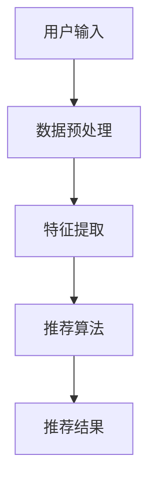
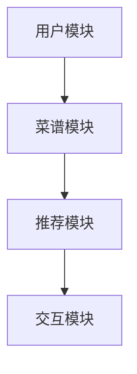
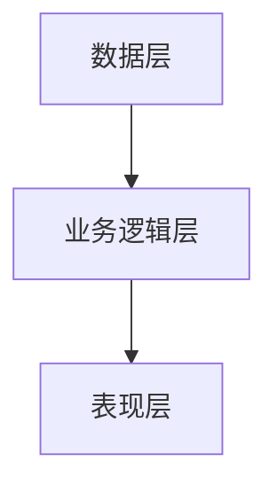
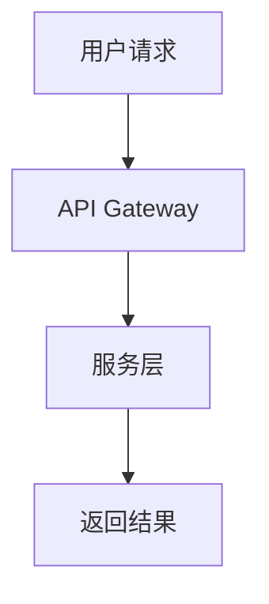

                 


# 智能厨房：AI Agent的菜谱推荐与烹饪指导

> **关键词**：智能厨房, AI Agent, 菜谱推荐, 烹饪指导, 人工智能, 机器学习

> **摘要**：本文深入探讨了AI Agent在智能厨房中的应用，重点分析了菜谱推荐与烹饪指导的核心技术。通过背景介绍、核心概念、算法原理、系统架构、项目实战和最佳实践等多个维度，全面解析了AI Agent如何在智能厨房中实现智能化服务。文章结合理论与实践，旨在为读者提供从基础概念到实际应用的详尽指导。

---

## 第1章：智能厨房与AI Agent概述

### 1.1 智能厨房的定义与背景

#### 1.1.1 智能厨房的定义
智能厨房是指通过物联网（IoT）设备、人工智能（AI）和大数据技术，将厨房中的设备、食材和用户行为数据进行整合，提供智能化的烹饪体验的厨房环境。

#### 1.1.2 智能厨房的发展背景
- 随着科技的进步，用户对厨房的需求已从单纯的烹饪工具扩展到智能化、个性化的烹饪体验。
- 智能厨房通过AI技术，能够实现食材识别、菜谱推荐、烹饪指导等功能，极大提升了用户体验。

#### 1.1.3 AI Agent在智能厨房中的作用
AI Agent（智能代理）是一种能够感知环境、自主决策并执行任务的智能系统。在智能厨房中，AI Agent通过分析用户行为、食材信息和烹饪数据，为用户提供个性化的菜谱推荐和实时的烹饪指导。

### 1.2 菜谱推荐与烹饪指导的背景

#### 1.2.1 菜谱推荐的需求与现状
- 用户在面对大量菜谱时，往往难以找到适合自己口味和食材的菜谱。
- 菜谱推荐系统通过分析用户的偏好和行为，帮助用户快速找到合适的菜谱。

#### 1.2.2 烹饪指导的必要性
- 烹饪过程中的实时指导能够帮助用户避免错误，提升烹饪成功率。
- AI Agent通过实时监控烹饪过程，提供个性化的指导建议。

#### 1.2.3 智能厨房中的菜谱推荐与烹饪指导
- 菜谱推荐和烹饪指导是智能厨房的重要组成部分，通过AI Agent的整合，能够为用户提供无缝的烹饪体验。

---

## 第2章：AI Agent的核心原理

### 2.1 AI Agent的基本概念

#### 2.1.1 AI Agent的定义
AI Agent是一种能够感知环境、自主决策并执行任务的智能系统。它能够通过传感器获取环境信息，并根据预设的目标和策略进行自主决策。

#### 2.1.2 AI Agent的核心特点
- **自主性**：AI Agent能够自主决策，无需人工干预。
- **反应性**：AI Agent能够实时感知环境变化并做出反应。
- **学习能力**：AI Agent能够通过数据学习和优化自身算法。

#### 2.1.3 AI Agent与传统算法的区别
| 特性       | AI Agent                          | 传统算法                          |
|------------|------------------------------------|------------------------------------|
| 自主性      | 高                                 | 低                                 |
| 学习能力    | 强                                 | 弱                                 |
| 适应性      | 高                                 | 低                                 |

### 2.2 菜谱推荐系统的工作原理

#### 2.2.1 菜谱推荐的定义
菜谱推荐是指通过分析用户的偏好和行为，向用户推荐符合其口味和需求的菜谱。

#### 2.2.2 菜谱推荐的核心要素
- **用户数据**：包括用户的口味偏好、饮食习惯等。
- **菜谱数据**：包括菜谱的食材、步骤、评分等。
- **推荐算法**：包括协同过滤、基于内容的推荐等。

#### 2.2.3 菜谱推荐系统的实现流程


### 2.3 AI Agent与菜谱推荐的联系

#### 2.3.1 AI Agent在菜谱推荐中的应用
- AI Agent能够通过分析用户的烹饪历史和偏好，实时调整推荐策略。

#### 2.3.2 菜谱推荐对AI Agent的依赖
- 菜谱推荐需要AI Agent提供实时的用户数据和环境感知能力。

#### 2.3.3 两者结合的优势
- **个性化推荐**：AI Agent能够根据用户的实时需求提供个性化的菜谱推荐。
- **动态调整**：AI Agent能够根据烹饪过程中的变化动态调整推荐策略。

---

## 第3章：菜谱推荐算法

### 3.1 协同过滤算法

#### 3.1.1 协同过滤的基本原理
协同过滤是一种基于用户相似性或物品相似性的推荐算法。通过分析用户的历史行为和偏好，协同过滤能够找到与目标用户相似的用户或物品，并推荐相似的物品。

#### 3.1.2 基于用户的协同过滤
- **实现步骤**：
  1. 计算用户之间的相似性。
  2. 找到与目标用户相似的用户。
  3. 推荐这些用户喜欢的物品。

#### 3.1.3 基于物品的协同过滤
- **实现步骤**：
  1. 计算物品之间的相似性。
  2. 找到与目标物品相似的物品。
  3. 推荐这些物品给目标用户。

### 3.2 基于内容的推荐算法

#### 3.2.1 基于内容的推荐定义
基于内容的推荐是一种通过分析物品的属性和特征，向用户推荐相似物品的算法。

#### 3.2.2 菜谱内容的特征提取
- **特征提取方法**：
  - TF-IDF：用于提取菜谱的关键词特征。
  - Word2Vec：用于提取菜谱的语义特征。

#### 3.2.3 基于内容的推荐实现
- **实现步骤**：
  1. 提取菜谱的特征向量。
  2. 计算目标用户与菜谱的相似性。
  3. 推荐相似度最高的菜谱。

### 3.3 混合推荐模型

#### 3.3.1 混合推荐的概念
混合推荐是一种结合协同过滤和基于内容的推荐的算法，能够充分利用两种方法的优点。

#### 3.3.2 协同过滤与内容推荐的结合
- **实现步骤**：
  1. 使用协同过滤算法计算用户相似性。
  2. 使用基于内容的推荐算法提取菜谱特征。
  3. 综合两种方法的推荐结果，生成最终的推荐列表。

#### 3.3.3 混合推荐的优势
- **准确性**：混合推荐能够结合两种方法的优势，提高推荐的准确性。
- **鲁棒性**：混合推荐对数据稀疏性问题具有较好的鲁棒性。

---

## 第4章：系统分析与架构设计

### 4.1 系统功能设计

#### 4.1.1 用户需求分析
- **目标用户**：家庭主妇、烹饪爱好者、厨房小白等。
- **核心需求**：个性化菜谱推荐、实时烹饪指导、食材管理等。

#### 4.1.2 系统功能模块划分
- **用户模块**：用户注册、登录、个人信息管理。
- **菜谱模块**：菜谱录入、分类、搜索。
- **推荐模块**：菜谱推荐、烹饪指导。
- **交互模块**：实时聊天、语音交互。

#### 4.1.3 功能模块之间的关系


### 4.2 系统架构设计

#### 4.2.1 分层架构设计
- **数据层**：负责数据的存储和管理。
- **业务逻辑层**：负责业务逻辑的实现。
- **表现层**：负责用户界面的展示和交互。

#### 4.2.2 模块化设计
- **数据预处理模块**：负责数据的清洗和转换。
- **推荐算法模块**：负责菜谱推荐的计算和生成。
- **交互模块**：负责用户与系统之间的交互。

#### 4.2.3 系统架构图


### 4.3 系统接口设计

#### 4.3.1 接口定义
- **API接口**：RESTful API，支持GET、POST、PUT、DELETE方法。
- **接口文档**：详细描述接口的功能、参数和返回值。

#### 4.3.2 接口交互流程


#### 4.3.3 接口实现方式
- **RESTful API**：使用JSON格式传递数据。
- **WebSocket**：支持实时通信。

---

## 第5章：项目实战

### 5.1 环境安装与配置

#### 5.1.1 开发环境选择
- **编程语言**：Python 3.8+
- **开发框架**：Django或Flask。
- **依赖库**：numpy、pandas、scikit-learn、tensorflow。

#### 5.1.2 依赖库安装
```bash
pip install numpy pandas scikit-learn
```

#### 5.1.3 开发工具配置
- **IDE**：PyCharm或VS Code。
- **版本控制**：Git。

### 5.2 菜谱推荐系统实现

#### 5.2.1 数据收集与预处理
- **数据来源**：公开数据集（如Kaggle）或自建数据集。
- **数据清洗**：去除重复数据、处理缺失值。

#### 5.2.2 推荐算法实现
- **协同过滤算法**：基于用户的协同过滤。
- **基于内容的推荐**：使用TF-IDF提取菜谱特征。

#### 5.2.3 系统功能实现
- **菜谱推荐**：根据用户输入推荐菜谱。
- **烹饪指导**：实时指导烹饪过程。

### 5.3 案例分析与详细讲解

#### 5.3.1 数据分析
- **用户数据分析**：分析用户的偏好和行为。
- **菜谱数据分析**：分析菜谱的特征和分类。

#### 5.3.2 算法优化
- **参数调整**：优化协同过滤和基于内容的推荐算法。
- **模型评估**：使用准确率、召回率等指标评估推荐效果。

### 5.4 项目小结

#### 5.4.1 项目成果
- 实现了一个基于AI Agent的菜谱推荐系统。
- 提供了实时的烹饪指导功能。

#### 5.4.2 经验总结
- 数据预处理是关键，数据质量直接影响推荐效果。
- 混合推荐模型在实际应用中表现优于单一算法。

---

## 第6章：最佳实践与拓展阅读

### 6.1 小结

- 本文详细介绍了AI Agent在智能厨房中的应用，重点分析了菜谱推荐和烹饪指导的核心技术。
- 通过理论与实践结合，为读者提供了从基础概念到实际应用的详尽指导。

### 6.2 注意事项

- **数据隐私**：在实际应用中，需要注意用户数据的隐私保护。
- **算法优化**：根据实际需求不断优化推荐算法，提升推荐效果。

### 6.3 拓展阅读

- **推荐系统**：深入学习协同过滤和基于内容的推荐算法。
- **机器学习**：学习更高级的机器学习算法，如深度学习模型。
- **智能厨房**：探索智能厨房的更多应用场景和技术。

---

## 附录

### 附录A：术语表

- **AI Agent**：人工智能代理，能够自主决策和执行任务的智能系统。
- **协同过滤**：一种基于用户相似性或物品相似性的推荐算法。
- **混合推荐**：结合协同过滤和基于内容的推荐的算法。

### 附录B：工具安装指南

- **Python安装**：官网下载安装包，按照提示完成安装。
- **依赖库安装**：使用pip命令安装所需的依赖库。

### 附录C：参考文献

1. 《机器学习实战》
2. 《深度学习入门：基于Python的理论与实现》
3. 《推荐系统导论》

---

**作者：AI天才研究院 & 禅与计算机程序设计艺术**

