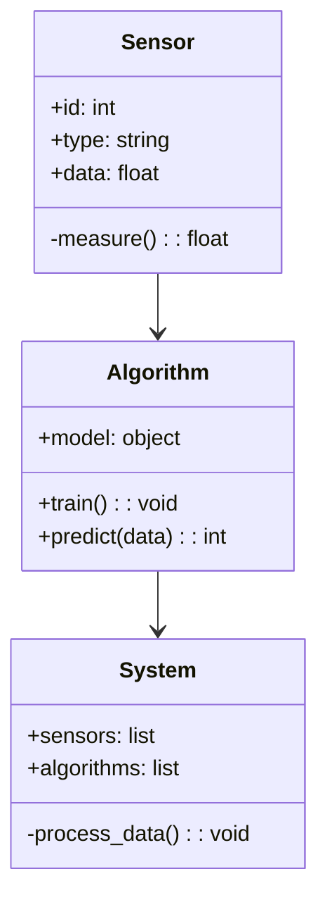
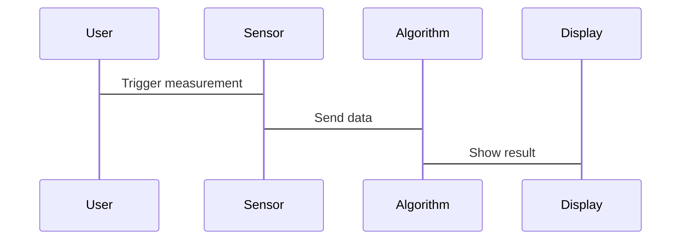

                 


# 第四章: AI Agent的传感器技术

## 4.1 传感器类型与食材检测

### 4.1.1 光电传感器

#### 工作原理
光电传感器通过测量食材表面的反射光来判断新鲜度。新鲜的食材通常具有较高的反射率，而变质的食材反射率较低。

#### 应用场景
光电传感器常用于检测食材的颜色变化。例如，新鲜的绿叶蔬菜颜色鲜绿，而变质后会逐渐变为暗绿色或黄褐色。

### 4.1.2 气体传感器

#### 工作原理
气体传感器通过检测食材释放的气体（如乙烯、硫化氢）来判断新鲜度。这些气体的浓度与食材的新鲜程度密切相关。

#### 应用场景
气体传感器广泛应用于肉类、鱼类和蔬果的新鲜度检测。例如，肉类在变质过程中会释放大量硫化氢气体。

### 4.1.3 声学传感器

#### 工作原理
声学传感器通过测量食材发出的声音来判断新鲜度。新鲜的食材声音清脆，而变质的食材声音沉闷。

#### 应用场景
声学传感器常用于检测水果的成熟度和蔬菜的新鲜度。例如，成熟的苹果敲击时声音较为沉闷。

## 4.2 传感器数据的采集与处理

### 4.2.1 数据采集方法

#### 光电传感器的数据采集
光电传感器的数据采集需要高精度的光学元件和灵敏的电路设计。为了确保数据的准确性，需要定期校准传感器。

#### 气体传感器的数据采集
气体传感器的数据采集需要精确的气体浓度测量方法。通常需要使用高灵敏度的气敏元件，并结合适当的信号放大电路。

#### 声学传感器的数据采集
声学传感器的数据采集需要高质量的麦克风和音频处理电路。为了消除环境噪声的干扰，通常需要使用数字信号处理技术。

### 4.2.2 数据预处理技术

#### 噪声处理
在数据采集过程中，传感器会受到各种噪声的干扰。为了提高数据的准确性，需要进行噪声处理。常用的方法包括低通滤波和高通滤波。

#### 数据标准化
由于不同传感器的测量范围和灵敏度不同，需要对数据进行标准化处理。常用的方法包括归一化和标准化。

#### 异常值处理
在数据采集过程中，可能会出现异常值。为了保证数据的质量，需要进行异常值处理。常用的方法包括基于统计的方法（如3σ法）和基于机器学习的方法（如Isolation Forest）。

## 4.3 传感器数据的融合技术

### 4.3.1 数据融合方法

#### 加权融合
加权融合是一种常见的数据融合方法。通过对不同传感器的数据赋予不同的权重，可以综合考虑各个传感器的贡献。

#### 基于模型的融合
基于模型的融合方法是将各个传感器的数据输入到一个统一的模型中进行融合。常用的方法包括神经网络和随机森林。

### 4.3.2 数据融合的优势

#### 提高准确性
通过融合多种传感器的数据，可以提高检测的准确性。例如，结合光电传感器和气体传感器的数据，可以更准确地判断食材的新鲜度。

#### 增强鲁棒性
数据融合可以增强系统的鲁棒性。当某一传感器出现故障时，其他传感器的数据可以弥补其不足。

## 4.4 本章小结

本章详细介绍了AI Agent在食材新鲜度检测中的传感器技术。首先，讨论了光电、气体和声学传感器的工作原理和应用场景。然后，讲解了传感器数据的采集与处理技术，包括数据采集方法、预处理技术和融合技术。最后，总结了数据融合的优势，包括提高准确性和增强鲁棒性。

---

# 第五章: AI Agent的算法原理

## 5.1 机器学习基础

### 5.1.1 监督学习

#### 分类算法
监督学习是机器学习中的一个基本方法，常用于分类问题。例如，可以使用支持向量机（SVM）或随机森林来分类食材的新鲜度。

#### 回归算法
回归算法用于预测连续值。例如，可以使用线性回归来预测食材的新鲜度指数。

### 5.1.2 无监督学习

#### 聚类算法
无监督学习常用于数据挖掘。例如，可以使用K-means算法将食材分为不同的类别，以识别异常值。

### 5.1.3 强化学习

#### 强化学习的应用
强化学习适用于动态环境。例如，AI Agent可以通过强化学习来优化食材检测的策略。

## 5.2 深度学习基础

### 5.2.1 卷积神经网络（CNN）

#### 图像分类
CNN常用于图像分类任务。例如，可以使用CNN来识别食材表面的颜色变化。

### 5.2.2 循环神经网络（RNN）

#### 时间序列分析
RNN常用于时间序列分析。例如，可以使用RNN来分析食材的气味变化时间序列。

### 5.2.3 图神经网络（GNN）

#### 多模态数据融合
GNN适用于多模态数据的融合。例如，可以使用GNN来融合图像、气味和声音数据。

## 5.3 食材新鲜度检测的算法选择

### 5.3.1 分类算法

#### 支持向量机（SVM）
SVM是一种常用的分类算法。例如，可以使用SVM来分类食材的新鲜度等级。

#### 随机森林
随机森林是一种基于树的分类算法。例如，可以使用随机森林来预测食材的新鲜度。

### 5.3.2 回归算法

#### 线性回归
线性回归用于预测连续值。例如，可以使用线性回归来预测食材的新鲜度指数。

#### 支持向量回归（SVR）
SVR是一种基于支持向量机的回归算法。例如，可以使用SVR来预测食材的新鲜度。

## 5.4 算法实现

### 5.4.1 数据预处理

#### 特征提取
特征提取是机器学习的重要步骤。例如，可以使用主成分分析（PCA）来提取食材数据的关键特征。

### 5.4.2 模型训练

#### 超参数调优
超参数调优是提高模型性能的关键。例如，可以使用网格搜索（Grid Search）来优化模型的超参数。

## 5.5 本章小结

本章详细介绍了AI Agent在食材新鲜度检测中的算法原理。首先，讨论了机器学习和深度学习的基础知识，包括监督学习、无监督学习和强化学习。然后，讲解了卷积神经网络、循环神经网络和图神经网络等深度学习算法。最后，讨论了分类算法和回归算法的选择，以及算法实现中的数据预处理和模型训练技术。

---

# 第六章: 系统架构设计

## 6.1 系统功能设计

### 6.1.1 领域模型

#### 类图设计
领域模型是系统设计的重要部分。例如，可以使用Mermaid图来描述系统的类图。



### 6.1.2 系统架构设计

#### 架构图设计
系统架构设计需要考虑模块之间的依赖关系。例如，可以使用Mermaid图来描述系统的架构图。


### 6.1.3 系统接口设计

#### 接口定义
系统接口设计需要明确各个模块之间的接口。例如，可以使用RESTful API来定义传感器和算法模块之间的接口。

### 6.1.4 系统交互设计

#### 交互流程图
系统交互设计需要考虑用户与系统之间的交互流程。例如，可以使用Mermaid图来描述系统的交互流程图。



## 6.2 系统实现

### 6.2.1 环境搭建

#### 开发工具
开发工具的选择对系统实现至关重要。例如，可以使用Python和TensorFlow来搭建AI模型。

### 6.2.2 核心代码实现

#### 传感器数据采集
传感器数据采集需要编写相应的代码。例如，可以使用以下Python代码来模拟光电传感器的数据采集：

```python
import numpy as np

def measure_optical_sensor():
    # 模拟光电传感器的数据采集
    data = np.random.normal(loc=0.5, scale=0.1, size=100)
    return data

# 示例调用
print(measure_optical_sensor())
```

#### 算法实现
算法实现需要编写模型训练和预测的代码。例如，可以使用以下Python代码来训练一个简单的机器学习模型：

```python
from sklearn.svm import SVC
from sklearn.datasets import make_classification
from sklearn.model_selection import train_test_split

# 模拟数据
X, y = make_classification(n_samples=100, n_features=2, n_classes=2)
X_train, X_test, y_train, y_test = train_test_split(X, y, test_size=0.2)

# 训练模型
model = SVC()
model.fit(X_train, y_train)

# 预测
print(model.score(X_test, y_test))
```

## 6.3 系统测试

### 6.3.1 测试用例设计

#### 功能测试
功能测试需要覆盖系统的各个功能模块。例如，可以测试传感器数据采集的准确性、算法模型的预测精度等。

### 6.3.2 性能测试

#### 响应时间
性能测试需要考虑系统的响应时间。例如，可以测试系统在高并发情况下的处理能力。

## 6.4 本章小结

本章详细介绍了AI Agent在食材新鲜度检测中的系统架构设计。首先，讨论了系统的功能设计和架构设计，包括类图和架构图的绘制。然后，讲解了系统的接口设计和交互设计，包括序列图的绘制。最后，讨论了系统的实现和测试，包括环境搭建、核心代码实现和系统测试。

---

# 第七章: 项目实战

## 7.1 环境安装

### 7.1.1 开发工具安装

#### Python和相关库
需要安装Python和相关的机器学习库，例如TensorFlow、Scikit-learn和Mermaid。

### 7.1.2 传感器硬件安装

#### 硬件连接
需要将传感器硬件连接到计算机，并安装相应的驱动程序。

## 7.2 系统核心实现

### 7.2.1 传感器数据采集

#### 光电传感器
编写代码实现光电传感器的数据采集。

### 7.2.2 数据预处理

#### 数据清洗
对采集到的数据进行清洗，去除异常值和噪声。

### 7.2.3 算法实现

#### 模型训练
训练机器学习模型，例如支持向量机（SVM）。

### 7.2.4 系统集成

#### 系统集成
将各个模块集成到一个完整的系统中。

## 7.3 代码实现与解读

### 7.3.1 光电传感器数据采集代码

```python
import numpy as np

def measure_optical_sensor():
    # 模拟光电传感器的数据采集
    data = np.random.normal(loc=0.5, scale=0.1, size=100)
    return data

# 示例调用
print(measure_optical_sensor())
```

### 7.3.2 数据预处理代码

```python
from sklearn.preprocessing import StandardScaler

# 示例数据
X = [[1, 2], [3, 4], [5, 6]]

# 标准化处理
scaler = StandardScaler()
X_scaled = scaler.fit_transform(X)

print(X_scaled)
```

### 7.3.3 模型训练代码

```python
from sklearn.svm import SVC
from sklearn.datasets import make_classification
from sklearn.model_selection import train_test_split

# 模拟数据
X, y = make_classification(n_samples=100, n_features=2, n_classes=2)
X_train, X_test, y_train, y_test = train_test_split(X, y, test_size=0.2)

# 训练模型
model = SVC()
model.fit(X_train, y_train)

# 预测
print(model.score(X_test, y_test))
```

## 7.4 实际案例分析

### 7.4.1 数据分析

#### 数据可视化
使用Matplotlib对数据进行可视化分析，例如绘制食材的新鲜度指数分布图。

### 7.4.2 模型评估

#### 模型评估指标
使用准确率、召回率和F1分数等指标来评估模型的性能。

## 7.5 项目小结

本章通过实际案例详细展示了AI Agent在食材新鲜度检测中的项目实现。首先，讨论了项目的环境安装和系统核心实现，包括传感器数据采集、数据预处理和算法实现。然后，提供了具体的代码实现和解读，帮助读者更好地理解和应用这些技术。最后，通过实际案例分析，展示了项目的实际应用和效果。

---

# 第八章: 最佳实践与小结

## 8.1 最佳实践

### 8.1.1 数据质量管理

#### 数据清洗
数据清洗是确保数据质量的关键步骤。例如，可以使用Pandas库对数据进行清洗和处理。

### 8.1.2 算法选择

#### 算法选择策略
算法选择需要考虑数据类型、任务类型和计算资源。例如，对于图像分类任务，卷积神经网络（CNN）通常是一个更好的选择。

### 8.1.3 系统优化

#### 性能优化
性能优化可以通过优化算法、减少数据量和优化硬件配置等方法实现。

## 8.2 小结

本章总结了AI Agent在食材新鲜度检测中的最佳实践和小结。首先，讨论了数据质量管理、算法选择和系统优化等关键问题。然后，提供了具体的实现建议和优化策略。最后，总结了项目的关键点和注意事项。

---

# 第九章: 总结与展望

## 9.1 总结

本章对全文进行了总结。首先，回顾了AI Agent在食材新鲜度检测中的主要技术，包括传感器技术、算法原理和系统架构设计。然后，总结了项目的实现过程和关键点。

## 9.2 展望

本章对AI Agent在食材新鲜度检测中的未来发展进行了展望。首先，讨论了技术发展的趋势，例如更先进的传感器和更高效的算法。然后，提出了未来的研究方向，例如多模态数据的深度融合和边缘计算的应用。

---

# 第十章: 附录

## 10.1 参考资料

### 10.1.1 传感器技术

#### 光电传感器
参考文献：《光电传感器原理与应用》

#### 气体传感器
参考文献：《气体传感器原理与应用》

### 10.1.2 机器学习

#### 支持向量机
参考文献：《支持向量机原理与应用》

#### 卷积神经网络
参考文献：《卷积神经网络原理与应用》

## 10.2 工具与库

### 10.2.1 Python库

#### TensorFlow
TensorFlow是Google开发的深度学习框架。

#### Scikit-learn
Scikit-learn是Python中的机器学习库。

### 10.2.2 传感器驱动

#### 光电传感器驱动
光电传感器的驱动程序。

#### 气体传感器驱动
气体传感器的驱动程序。

---

# 作者

作者：AI天才研究院/AI Genius Institute & 禅与计算机程序设计艺术 /Zen And The Art of Computer Programming

