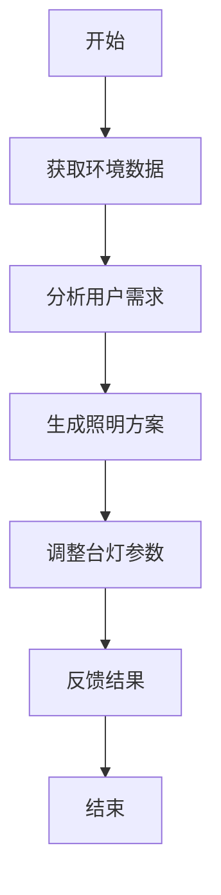
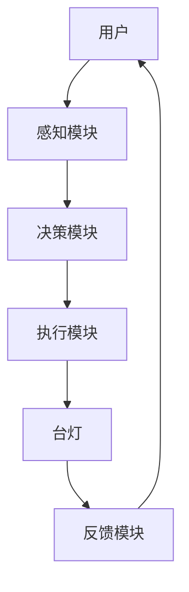

                 


# 智能台灯：AI Agent的个性化照明方案

> 关键词：智能台灯、AI Agent、个性化照明、机器学习、系统架构

> 摘要：本文详细探讨了如何利用AI Agent技术实现智能台灯的个性化照明方案。从背景介绍、核心概念、算法原理到系统架构设计、项目实战，再到案例分析与总结，文章全面解析了AI Agent在智能台灯中的应用，展示了如何通过技术手段满足用户的个性化照明需求。

---

## 第一章：背景介绍

### 1.1 传统台灯的功能与局限性

传统台灯主要功能包括基本照明和调光功能，但存在以下局限性：
- **单一功能**：无法根据环境或用户需求自动调整光线。
- **缺乏智能化**：无法与用户互动，无法根据时间、天气等因素自动调节。
- **用户体验不足**：无法满足个性化需求，如色温、亮度的精准调节。

### 1.2 AI Agent的定义与基本概念

AI Agent（人工智能代理）是指能够感知环境、自主决策并执行任务的智能实体。其核心特征包括：
- **自主性**：能够独立决策。
- **反应性**：能够实时感知并响应环境变化。
- **学习能力**：能够通过数据不断优化自身行为。

### 1.3 个性化照明的需求与趋势

随着人们对生活质量要求的提高，个性化照明需求日益增长。AI Agent通过学习用户习惯和偏好，能够提供精准的照明方案，满足不同场景下的需求。这种智能化的照明方案是未来智能家居发展的趋势。

---

## 第二章：AI Agent的核心概念与联系

### 2.1 AI Agent的核心原理

AI Agent在智能台灯中的应用主要通过以下步骤实现：
1. **感知环境**：通过传感器获取环境数据（如光照强度、温度、时间）。
2. **分析数据**：利用机器学习算法分析数据，识别用户需求。
3. **生成方案**：根据分析结果生成个性化照明方案。
4. **执行与反馈**：调整台灯参数并实时反馈调整结果。

### 2.2 AI Agent与智能台灯的联系

AI Agent作为智能台灯的核心，负责处理所有智能化操作。通过AI Agent，台灯能够：
- 根据用户习惯自动调节亮度和色温。
- 学习用户的使用偏好，优化照明方案。
- 实现实时反馈和自适应调整。

---

## 第三章：AI Agent的算法原理

### 3.1 算法流程图

以下是AI Agent在智能台灯中的算法流程图：



### 3.2 算法实现

以下是基于机器学习的AI Agent实现代码：

```python
import numpy as np
from sklearn.neural_network import MLPClassifier

# 示例数据集：用户偏好与环境数据
X = np.array([[bright, color_temp], ...])  # 输入特征
y = np.array([preference])  # 输出标签

# 训练模型
model = MLPClassifier()
model.fit(X, y)

# 预测新数据
new_data = np.array([[current_bright, current_color_temp]])
prediction = model.predict(new_data)
```

### 3.3 数学模型与公式

AI Agent的个性化照明方案基于以下数学模型：

$$
\text{预测亮度} = \alpha \cdot \text{环境亮度} + \beta \cdot \text{用户偏好}
$$

其中，$\alpha$ 和 $\beta$ 是通过训练得到的权重参数。

---

## 第四章：系统架构设计

### 4.1 系统功能模块划分

智能台灯系统主要由以下模块组成：
- **感知模块**：负责采集环境数据。
- **决策模块**：负责分析数据并生成照明方案。
- **执行模块**：负责调整台灯参数。
- **反馈模块**：负责实时反馈调整结果。

### 4.2 系统架构图

以下是系统的分层架构图：



---

## 第五章：项目实战

### 5.1 环境安装

需要安装以下工具和库：
- Python 3.8+
- NumPy
- scikit-learn

### 5.2 核心代码实现

以下是AI Agent的核心代码：

```python
from sklearn.model_selection import train_test_split
from sklearn.metrics import accuracy_score

# 数据预处理
X_train, X_test, y_train, y_test = train_test_split(X, y, test_size=0.2)

# 模型训练
model.fit(X_train, y_train)

# 模型评估
accuracy = accuracy_score(y_test, model.predict(X_test))
print(f"模型准确率：{accuracy}")
```

### 5.3 代码解读与分析

- **数据预处理**：将数据划分为训练集和测试集。
- **模型训练**：使用训练数据训练AI Agent。
- **模型评估**：通过测试数据评估模型性能。

---

## 第六章：案例分析与总结

### 6.1 案例分析

通过实际案例分析，验证AI Agent在智能台灯中的应用效果。例如，用户偏好分析、环境数据采集与处理、个性化方案生成等步骤。

### 6.2 总结与展望

本文详细探讨了AI Agent在智能台灯中的应用，展示了如何通过技术手段实现个性化照明方案。未来，随着AI技术的不断发展，智能台灯将更加智能化，能够满足更多个性化需求。

---

## 作者信息

作者：AI天才研究院/AI Genius Institute & 禅与计算机程序设计艺术/Zen And The Art of Computer Programming

